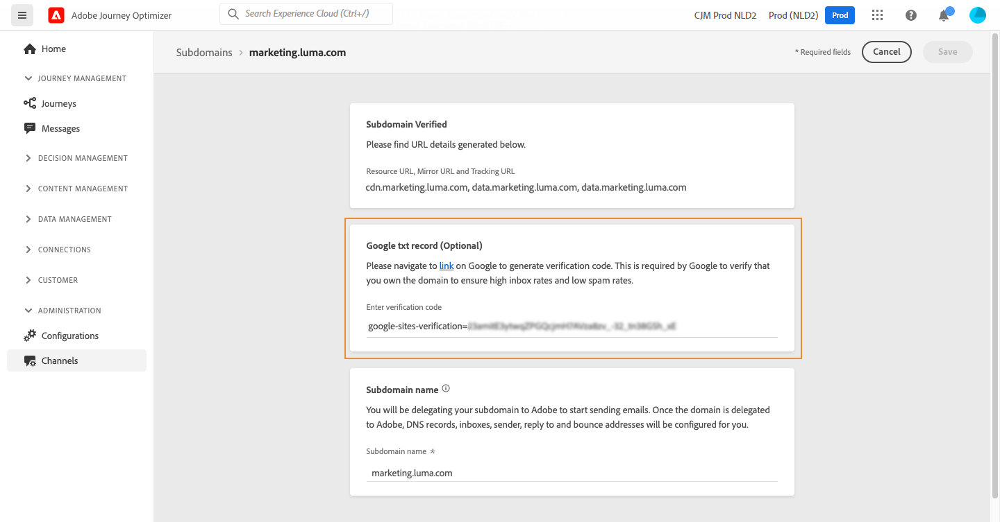

# Añadir un registro TXT de Google a un subdominio {#google-txt-record}

>[!CONTEXTUALHELP]
>id="ajo_admin_subdomain_google"
>title="Registros TXT de Google"
>abstract="Para garantizar un envío correcto de correos electrónicos a las direcciones de Gmail, puede añadir registros TXT de verificación de sitios de Google especiales a su subdominio para asegurarse de que estén verificados."

Los registros TXT son un tipo de registro DNS que se utiliza para proporcionar información de texto sobre un dominio y que pueden leer fuentes externas.

Para garantizar una entrega óptima y una entrega correcta de correos electrónicos a las direcciones de Gmail, [!DNL Journey Optimizer] le permite agregar registros TXT de verificación de sitios de Google especiales al subdominio para asegurarse de que se ha verificado.

>[!CAUTION]
>
> Esta operación solo se puede realizar una vez que un subdominio tenga el estado **[!UICONTROL Success]**. Para obtener más información sobre los estados de los subdominios, consulte [esta sección](delegate-subdomain.md#access-delegated-subdomains).

Para agregar un registro TXT de Google al subdominio, siga estos pasos:

1. Abra el subdominio desde el menú **[!UICONTROL Canales]** > **[!UICONTROL Configuración de correo electrónico]** > **[!UICONTROL Subdominios]**.

1. En la sección **[!UICONTROL registro txt de Google]**, escribe el código de verificación generado desde [Google Workspace](https://support.google.com/a/answer/183895){target="_blank"}<!--G Suite Admin tools--> y luego haz clic en **[!UICONTROL Guardar]**.

   

1. Una vez agregado el registro TXT, Google debe verificarlo. Para ello, vaya a [Google Workspace](https://support.google.com/a/answer/183895){target="_blank"}<!--G Suite Admin tools--> y luego inicie el paso de verificación.
