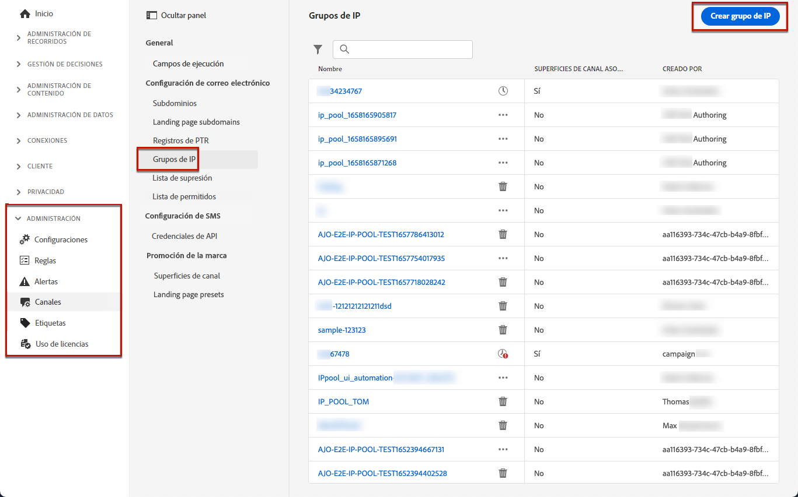

# Crear grupos de IP {#create-ip-pools}

>[!CONTEXTUALHELP]
>id="ajo_admin_ip_pool_header"
>title="Configuración de un grupo de IP"
>abstract="Los grupos de IP recopilan las direcciones IP de los subdominios para mejorar la entregabilidad del correo electrónico."

>[!CONTEXTUALHELP]
>id="ajo_admin_ip_pool"
>title="Configuración de un grupo de IP"
>abstract="Con Journey Optimizer, puede crear grupos de IP para agrupar las direcciones IP de los subdominios. Esto puede mejorar significativamente la entregabilidad del correo electrónico, ya que al hacerlo, puede evitar que la reputación de un subdominio afecte a los demás subdominios."

## Acerca de los grupos de IP {#about-ip-pools}

Con [!DNL Journey Optimizer], puede crear grupos de IP para agrupar las direcciones IP de sus subdominios.

Se recomienda crear grupos de IP para la entrega por correo electrónico. Al hacerlo, puede evitar que la reputación de un subdominio afecte a los demás subdominios.

Por ejemplo, una práctica recomendada es tener un grupo de IP para los mensajes de marketing y otro para los mensajes transaccionales. De este modo, si uno de los mensajes de marketing tiene un rendimiento incorrecto y un cliente lo declara como correo no deseado, esto no afectará a los mensajes transaccionales enviados a este mismo cliente, que seguirá recibiendo mensajes transaccionales (confirmaciones de compra, mensajes de recuperación de contraseña, etc.).

>[!CAUTION]
>
>La configuración del grupo de IP es común a todos los entornos. Por lo tanto, cualquier creación o edición de grupo de IP también afectará a las zonas protegidas de producción.

## Creación de un grupo de IP {#create-ip-pool}

Para crear un grupo de IP, siga estos pasos:

1. Acceda al menú **[!UICONTROL Administración]** > **[!UICONTROL Canales]** > **[!UICONTROL Configuración de correo electrónico]** > **[!UICONTROL Grupos de IP]** y haga clic en **[!UICONTROL Crear grupo de IP]**.

   

1. Proporcione un nombre y una descripción (opcional) para el grupo de IP.

   >[!NOTE]
   >
   >El nombre debe comenzar por una letra (A-Z) e incluir solo caracteres alfanuméricos o caracteres especiales ( _, ., - ).

1. Seleccione las direcciones IP que desea incluir en el grupo en la lista desplegable y luego haga clic en **[!UICONTROL Enviar]**.

   

   >[!NOTE]
   >
   >Todas las direcciones IP proporcionadas con la instancia están disponibles en la lista.

Al seleccionar direcciones IP, puede ver en la lista los registros PTR asociados a las direcciones IP. Esto le permite verificar la información de marca de cada IP al crear un grupo de IP y seleccionar direcciones IP con la misma información de marca, por ejemplo. [Más información sobre los registros PTR](ptr-records.md)

>[!NOTE]
>
>Si no se ha configurado ningún registro PTR para una IP, no se puede seleccionar esa IP. Póngase en contacto con su representante de Adobe para configurar el registro PTR de esa IP.<!--Now this only happens when first subdomain delegated to Adobe is with CNAME method.-->

Después de crear un grupo de IP, la información de PTR se ve al pasar el ratón por encima de las direcciones IP que se muestran debajo de la lista desplegable del grupo de IP.

El grupo de IP ahora se crea y se muestra en la lista. Puede seleccionarlo para acceder a sus propiedades y mostrar la configuración de canal asociada (es decir, el ajuste preestablecido de mensaje). Para obtener más información sobre cómo asociar una configuración de canal con un grupo de IP, consulte [esta sección](channel-surfaces.md).

## Editar un grupo de IP {#edit-ip-pool}

Para editar un grupo de IP, siga los pasos a continuación.

1. En la lista, haga clic en el nombre del grupo de IP para abrirlo.

1. Edite sus propiedades según desee. Puede modificar la descripción y agregar o quitar direcciones IP.

   >[!NOTE]
   >
   >El nombre del grupo de IP no se puede editar. Si desea modificarlo, debe eliminar el grupo de IP y crear otro con el nombre que desee.

   

   >[!CAUTION]
   >
   >Proceda con mucho cuidado cuando considere la posibilidad de eliminar una IP, ya que esto supondrá una carga adicional para las otras IP y puede tener un impacto grave en la capacidad de envío. En caso de duda, póngase en contacto con un experto en capacidad de entrega.

1. Guarde los cambios.

La actualización es efectiva de inmediato o asincrónicamente, dependiendo de si el grupo de IP está asociado o no a una [configuración de canal](channel-surfaces.md):

* Si el grupo de IP es **no** y está asociado con alguna configuración de canal, la actualización es instantánea (estado **[!UICONTROL Correcto]**).
* Si el grupo de IP **es** asociado con una configuración de canal, la actualización puede tardar hasta tres horas (estado **[!UICONTROL Procesando]**).

>[!NOTE]
>
>Al [crear una configuración de canal](channel-surfaces.md#create-channel-surface), si selecciona un grupo de IP que está en edición (estado **[!UICONTROL Procesando]**) y nunca se ha asociado con el subdominio seleccionado para esa configuración, no puede continuar con la creación de la configuración. [Más información](channel-surfaces.md#create-channel-surface)

Para comprobar el estado de actualización del grupo de IP, haga clic en el botón **[!UICONTROL Más acciones]** y seleccione **[!UICONTROL Actualizaciones recientes]**.

>[!NOTE]
>
>Una vez que un grupo de IP se haya actualizado correctamente, es posible que tenga que esperar:
>
>* unos minutos antes de que los mensajes unitarios lo consuman,
>* hasta el siguiente lote para que el grupo de IP sea efectivo en los mensajes por lotes.

También puede usar el botón **[!UICONTROL Eliminar]** para eliminar un grupo de IP. Tenga en cuenta que no puede eliminar un grupo de IP que se haya asociado a una configuración de canal.

