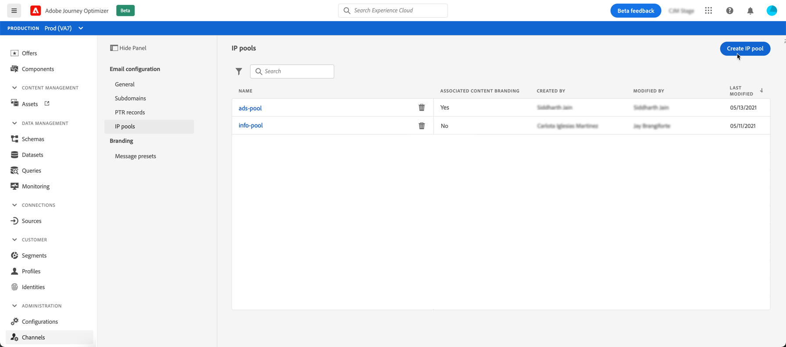
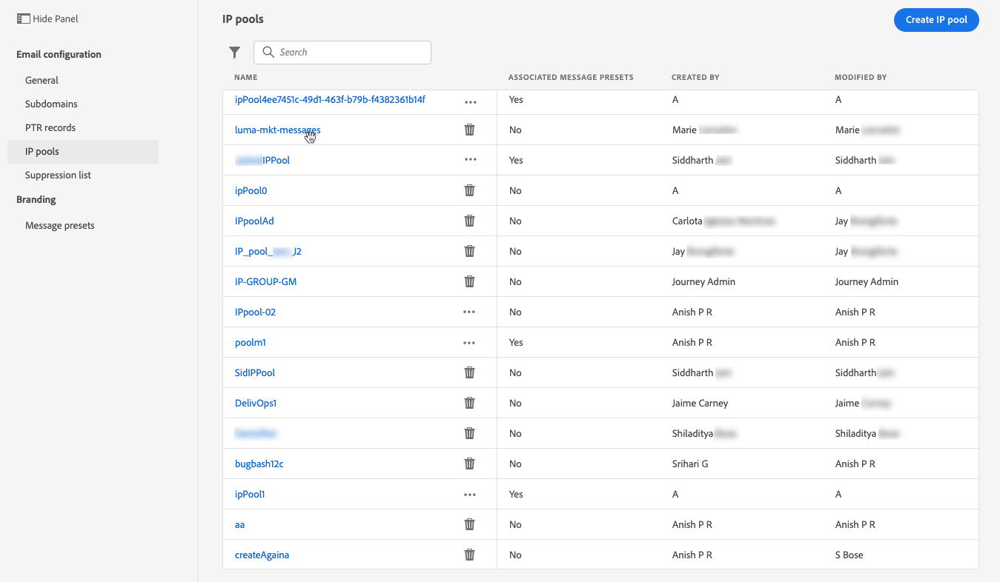

# Crear grupos de IP {#create-ip-pools}

## Acerca de los grupos de IP {#about-ip-pools}

Con Journey Optimizer, puede crear grupos de IP para agrupar las direcciones IP de los subdominios.

La creación de grupos de IP es muy recomendable para la entrega por correo electrónico. Al hacerlo, puede evitar que la reputación de un subdominio afecte a los demás subdominios.

Por ejemplo, una práctica recomendada es tener un grupo de IP para los mensajes de marketing y otro para los mensajes transaccionales. De este modo, si uno de los mensajes de marketing tiene un rendimiento incorrecto y un cliente los declara como correo no deseado, esto no afectará a los mensajes transaccionales enviados a este mismo cliente, que seguirá recibiendo mensajes transaccionales (confirmaciones de compra, mensajes de recuperación de contraseña, etc.).

## Crear un grupo de IP {#create-ip-pool}

Para crear un grupo de IP, siga estos pasos:

1. Acceda a la **[!UICONTROL Channels]** / **[!UICONTROL IP pools]** a continuación, haga clic en **[!UICONTROL Create IP Pool]**.

   

1. Proporcione un nombre y una descripción (opcional) para el grupo de IP.

   >[!NOTE]
   >
   >El nombre del subdominio debe comenzar con una letra (A-Z) e incluir solo caracteres alfanuméricos o caracteres especiales ( _, ., - ).

1. Seleccione las direcciones IP que desea incluir en el grupo en la lista desplegable y haga clic en **[!UICONTROL Submit]**.

   

   >[!NOTE]
   >
   >Todas las direcciones IP aprovisionadas con su instancia están disponibles en la lista.

El grupo de IP ahora se crea y se muestra en la lista. Puede seleccionarlo para acceder a sus propiedades y mostrar el mensaje preestablecido asociado. Para obtener más información sobre cómo asociar un ajuste preestablecido de mensaje con un grupo de IP, consulte [esta sección](message-presets.md)).

## Editar un grupo de IP {#edit-ip-pool}

Para editar un grupo de IP:

1. En la lista, haga clic en el nombre del grupo de IP para abrirlo.

   

1. Edite sus propiedades como desee. Puede modificar la descripción y añadir o eliminar direcciones IP.

   

   >[!CAUTION]
   >
   >Tenga especial cuidado al considerar la eliminación de una IP, ya que esto pondrá una carga adicional en las otras IP y puede tener un impacto grave en su capacidad de envío. En caso de duda, póngase en contacto con un experto en entregas.

1. Guarde los cambios.

>[!NOTE]
>
>El nombre del grupo de IP no se puede editar. Si desea modificarlo, debe eliminar el grupo de IP y crear otro con el nombre de su elección.

La actualización es efectiva de forma inmediata o asincrónica, según el grupo de IP asociado a un [ajuste preestablecido de mensaje](message-presets.md) o no:

* Si el grupo de IP es **not** seleccionada en un ajuste preestablecido de mensaje, la actualización es instantánea (**[!UICONTROL Success]** ).
* Si el grupo IP **es** seleccionada en un ajuste preestablecido de mensaje, la actualización puede tardar entre 7 y 10 días hábiles (**[!UICONTROL Processing]** ).

Para comprobar el estado de actualización del grupo de IP, haga clic en el botón **[!UICONTROL More actions]** y seleccione **[!UICONTROL Recent updates]**.

>[!NOTE]
>
>Una vez que un grupo de IP se actualiza correctamente, es posible que tenga que esperar:
>* unos minutos antes de que los mensajes unitarios lo consuman,
>* hasta el siguiente lote para que el grupo de IP sea efectivo en los mensajes por lotes.

También puede usar la variable **[!UICONTROL Delete]** para eliminar un grupo de IP. Tenga en cuenta que no puede eliminar un grupo de IP asociado a un ajuste preestablecido de mensaje.

