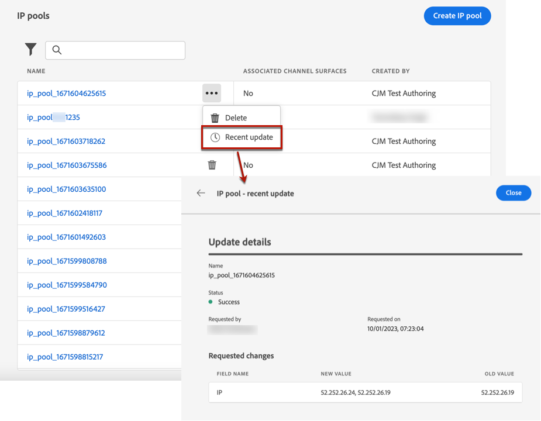

# Crear grupos de IP {#create-ip-pools}

>[!CONTEXTUALHELP]
>id="ajo_admin_ip_pool_header"
>title="Configuración de un grupo de IP"
>abstract="Puede crear grupos de IP para agrupar las direcciones IP de sus subdominios y así mejorar la capacidad de envío de correo electrónico."

>[!CONTEXTUALHELP]
>id="ajo_admin_ip_pool"
>title="Configuración de un grupo de IP"
>abstract="Con Journey Optimizer, puede crear grupos de IP para agrupar las direcciones IP de los subdominios. Esto puede mejorar significativamente la capacidad de envío del correo electrónico, ya que al hacerlo, puede evitar que la reputación de un subdominio afecte a los demás subdominios."

## Acerca de los grupos de IP {#about-ip-pools}

con [!DNL Journey Optimizer], puede crear grupos de IP para agrupar las direcciones IP de los subdominios.

La creación de grupos de IP es muy recomendable para la entrega por correo electrónico. Al hacerlo, puede evitar que la reputación de un subdominio afecte a los demás subdominios.

Por ejemplo, una práctica recomendada es tener un grupo de IP para los mensajes de marketing y otro para los mensajes transaccionales. De este modo, si uno de los mensajes de marketing tiene un rendimiento incorrecto y un cliente los declara como correo no deseado, esto no afectará a los mensajes transaccionales enviados a este mismo cliente, que seguirá recibiendo mensajes transaccionales (confirmaciones de compra, mensajes de recuperación de contraseña, etc.).

## Crear un grupo de IP {#create-ip-pool}

Para crear un grupo de IP, siga estos pasos:

1. Acceda a la **[!UICONTROL Administración]** > **[!UICONTROL Canales]** > **[!UICONTROL Grupos de IP]** a continuación, haga clic en **[!UICONTROL Crear grupo de IP]**.

   

1. Proporcione un nombre y una descripción (opcional) para el grupo de IP.

   >[!NOTE]
   >
   >El nombre debe comenzar con una letra (A-Z) e incluir únicamente caracteres alfanuméricos o caracteres especiales ( _, ., - ).

1. Seleccione las direcciones IP que desea incluir en el grupo en la lista desplegable y haga clic en **[!UICONTROL Submit]**.

   

   >[!NOTE]
   >
   >Todas las direcciones IP aprovisionadas con su instancia están disponibles en la lista.

El grupo de IP ahora se crea y se muestra en la lista. Puede seleccionarlo para acceder a sus propiedades y mostrar la superficie de canal asociada (es decir, el valor preestablecido de mensaje). Para obtener más información sobre cómo asociar una superficie de canal a un grupo de IP, consulte [esta sección](channel-surfaces.md).

## Editar un grupo de IP {#edit-ip-pool}

Para editar un grupo de IP:

1. En la lista, haga clic en el nombre del grupo de IP para abrirlo.

   

1. Edite sus propiedades como desee. Puede modificar la descripción y añadir o eliminar direcciones IP.

   >[!NOTE]
   >
   >El nombre del grupo de IP no se puede editar. Si desea modificarlo, debe eliminar el grupo de IP y crear otro con el nombre de su elección.

   

   >[!CAUTION]
   >
   >Tenga especial cuidado al considerar la eliminación de una IP, ya que esto pondrá una carga adicional en las otras IP y puede tener un impacto grave en su capacidad de envío. En caso de duda, póngase en contacto con un experto en capacidad de entrega.

1. Guarde los cambios.

La actualización es efectiva de forma inmediata o asincrónica, según el grupo de IP asociado a un [superficie del canal](channel-surfaces.md) o no:

* Si el grupo de IP es **not** asociada a cualquier superficie de canal, la actualización es instantánea (**[!UICONTROL Correcto]** ).
* Si el grupo IP **es** asociada a una superficie de canal, la actualización puede tardar hasta 3 horas (**[!UICONTROL Procesamiento]** ).

>[!NOTE]
>
>When [creación de una superficie de canal](channel-surfaces.md#create-channel-surface), si selecciona un grupo de IP que se encuentra en edición (**[!UICONTROL Procesamiento]** ) y nunca se ha asociado con el subdominio seleccionado para esa superficie, no se puede continuar con la creación de superficie. [Más información](channel-surfaces.md#subdomains-and-ip-pools)

Para comprobar el estado de actualización del grupo de IP, haga clic en el botón **[!UICONTROL Más acciones]** y seleccione **[!UICONTROL Actualizaciones recientes]**.

>[!NOTE]
>
>Una vez que un grupo de IP se actualiza correctamente, es posible que tenga que esperar:
>* unos minutos antes de que los mensajes unitarios lo consuman,
>* hasta el siguiente lote para que el grupo de IP sea efectivo en los mensajes por lotes.

También puede usar la variable **[!UICONTROL Eliminar]** para eliminar un grupo de IP. Tenga en cuenta que no puede eliminar un grupo de IP que se haya asociado a una superficie de canal.

