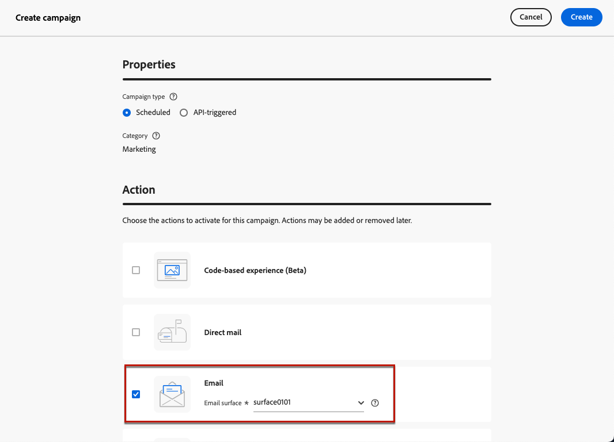

# Creación de campañas de calentamiento de IP {#create-ip-warmup-campaign}

>[!BEGINSHADEBOX]

**En esta página:** Aprenda a crear y activar campañas de correo electrónico dedicadas al calentamiento de IP para que se puedan programar y utilizar dentro de un plan de calentamiento de IP.

>[!ENDSHADEBOX]

>[!CONTEXTUALHELP]
>id="ajo_campaign_ip_warmup"
>title="Activación de la opción de plan de calentamiento de IP"
>abstract="Al seleccionar esta opción, la campaña se puede utilizar en un plan de calentamiento de IP. La programación de la campaña se regirá por el plan de calentamiento de IP con el que está asociada."

Antes de crear el plan de calentamiento de IP en [!DNL Journey Optimizer], primero debe crear una o más campañas diseñadas específicamente para usarlas en un plan de calentamiento de IP<!--through a dedicated option-->.

Para crear una campaña de calentamiento de IP, siga los pasos a continuación.

1. Cree un canal de correo electrónico [configuration](channel-surfaces.md) para el dominio y las direcciones IP que identificó para su plan de calentamiento.

   Póngase en contacto con el consultor del equipo de entrega para identificar el dominio y las direcciones IP que se utilizarán. Obtenga información sobre cómo seleccionarlos en una configuración de correo electrónico en [esta sección](../email/email-settings.md#ip-pools).

   >[!CAUTION]
   >
   >No edite la configuración del canal de correo electrónico después de que el plan de calentamiento de IP haya [comenzado](ip-warmup-execution.md).

1. Cree una [campaña](../campaigns/create-campaign.md) de marketing programado y seleccione la acción [Correo electrónico](../email/create-email.md#create-email).

   <!--Select the Marketing category. The IP warmup plan activation option is only available for  marketing-type campaigns.-->

1. Seleccione la configuración que creó para el calentamiento de IP.

   

   <!--You must use the same configuration as the one that will be used for the asociated IP warmup plan. [Learn how to create an IP warmup plan](#create-ip-warmup-plan)-->

1. Haga clic en **[!UICONTROL Crear]**.

1. En la sección **[!UICONTROL Programar]**, seleccione **[!UICONTROL Activación del plan de calentamiento IP]**.

   

   La programación [schedule](../campaigns/campaign-schedule.md) de la campaña estará dirigida por el plan de calentamiento de IP con el que estará asociada, lo que significa que la programación ya no está definida en la propia campaña.

1. Complete los pasos para crear una campaña de correo electrónico, como definir las propiedades de la campaña, [audiencia](../audience/about-audiences.md)<!--best practices for IP warmup in terms of audience?--> y [contenido](../email/get-started-email-design.md#key-steps).

   >[!IMPORTANT]
   >
   >Las audiencias permitidas en una campaña de calentamiento de IP deben estar [basadas en segmentos](../audience/creating-a-segment-definition.md) y creadas con la [política de combinación predeterminada](https://experienceleague.adobe.com/es/docs/experience-platform/profile/merge-policies/overview#default-merge-policy){target="_blank"}.
   >
   >Las audiencias de carga de CSV no son compatibles con las campañas de calentamiento de IP, por lo que se producirá un error al activar la campaña.

   Para obtener más información sobre cómo configurar una campaña, consulte [esta página](../campaigns/get-started-with-campaigns.md).

1. [Activar](../campaigns/review-activate-campaign.md) la campaña. Su estado cambia a **[!UICONTROL Activo]**.

   >[!NOTE]
   >
   >[Las reglas de negocio](../conflict-prioritization/rule-sets.md#rule-sets) no deben usarse en planes de calentamiento de IP. La aplicación de estas reglas podría dificultar el logro del número deseado de perfiles objetivo para las campañas.

   Para una campaña en vivo con el plan de calentamiento de IP activado, el botón **[!UICONTROL Eliminar]** está disponible hasta que se asocie con un plan de calentamiento de IP. Una vez utilizada en un plan, la campaña ya no se puede eliminar.

1. La campaña se muestra en la lista **[!UICONTROL Campañas]**. Para recuperar fácilmente todas las campañas de calentamiento de IP creadas en la zona protegida actual, puede filtrar por la opción de campaña **[!UICONTROL calentamiento de IP]**.

   

Una vez activa, la campaña está lista para utilizarse en un plan de calentamiento de IP. [Más información](ip-warmup-plan.md)

Una campaña de calentamiento de IP solo se puede utilizar en un plan de calentamiento de IP. Sin embargo, la misma campaña se puede utilizar en una o más fases del mismo plan de calentamiento de IP. [Más información](ip-warmup-plan.md#ip-warmup-plan-tab)

>[!NOTE]
>
>Cuando se usa una campaña en vivo en un plan de calentamiento de IP, después de que el plan esté [marcado como completado](ip-warmup-execution.md#mark-as-completed), el [estado](../campaigns/manage-campaigns.md#statuses) de esa campaña cambia a **[!UICONTROL Detenido]**.

