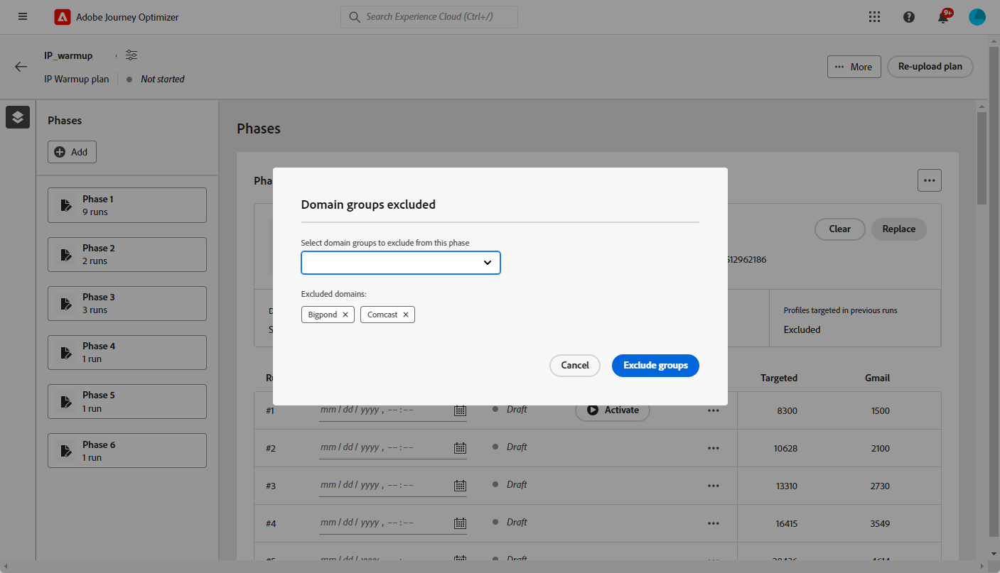
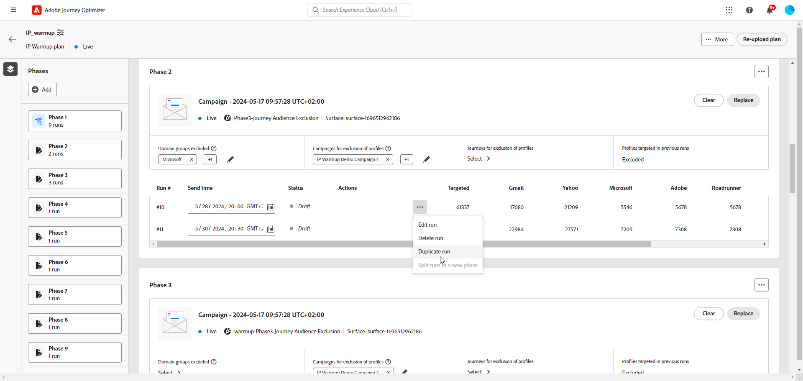

# Ejecución del plan de calentamiento de IP {#ip-warmup-running}

Una vez que haya [creado un plan de calentamiento de IP](ip-warmup-plan.md) y subido el archivo preparado con su consultor de capacidad de entrega, puede definir las fases y ejecuciones de su plan.

Cada fase está compuesta por varias ejecuciones, a las que se asigna una sola campaña.

## Definición de las fases {#define-phases}

>[!CONTEXTUALHELP]
>id="ajo_admin_ip_warmup_campaigns_excluded"
>title="Excluir públicos de campañas"
>abstract="Seleccione campañas para excluir sus públicos de la fase actual. Esto evita que es establezcan como objetivo perfiles con los que ya se ha contactado anteriormente; solo se excluirá a los que hayan recibido la comunicación a través del recorrido."

>[!CONTEXTUALHELP]
>id="ajo_admin_ip_warmup_domains_excluded"
>title="Excluir grupos de dominio"
>abstract="Seleccione los dominios que desea excluir de la fase actual. La exclusión de dominios requiere una fase no ejecutada, por lo que es posible que tenga que dividir una fase en ejecución para añadir exclusiones."
>additional-url="https://experienceleague.adobe.com/docs/journey-optimizer/using/configuration/implement-ip-warmup-plan/ip-warmup-execution.html?lang=es#split-phase" text="Dividir una fase"

>[!CONTEXTUALHELP]
>id="ajo_admin_ip_warmup_phases"
>title="Defina las fases de su plan"
>abstract="Cada fase está compuesta por varias ejecuciones, a las que se asigna una sola campaña."

<!--You need to associate the campaign and audience at phase level and turns on some settings as needed for all runs associated with a single creative/campaign

At phase level, system ensures that previously targeted + new profiles are picked up AND at iteration level, system ensures that each run is having unique profiles and the count matches what is stated in plan-->

<!---->

1. Seleccione la campaña que desee asociar con la primera fase del plan de calentamiento de IP.

   >[!NOTE]
   >
   >No puede seleccionar una campaña que ya esté en uso en otro plan de calentamiento de IP. Sin embargo, la misma campaña se puede utilizar en una o más fases del mismo plan de calentamiento de IP.

   

   >[!IMPORTANT]
   >
   >* Solo se pueden seleccionar las campañas que tienen habilitada la opción **[!UICONTROL activación del plan de calentamiento de IP]**. [Más información](#create-ip-warmup-campaign)
   >
   >* Solo se pueden seleccionar las campañas que utilicen la misma configuración que el plan de calentamiento de IP seleccionado.

1. Una vez seleccionada una campaña para la fase actual, se muestran las secciones para excluir perfiles, audiencias de campaña y grupos de dominios.

   >[!NOTE]
   >
   >Una vez que se activa una ejecución, las exclusiones ya no se pueden modificar a menos que [divida la ejecución](#split-phase) en una nueva fase.

   1. En la sección **[!UICONTROL Grupos de dominio excluidos]**, seleccione los dominios que desee excluir de esa fase.

      >[!NOTE]
      >
      >La exclusión de dominios requiere una fase sin ejecutar, por lo que es posible que necesite [dividir una fase en ejecución](#split-phase) para agregar exclusiones.

      

      Por ejemplo, después de ejecutar el calentamiento de la IP durante algunos días, se da cuenta de que la reputación de su ISP con un dominio (por ejemplo, Adobe) no es buena y desea resolverla sin detener su plan de calentamiento de IP. En tal caso, puede excluir el grupo de dominios de Adobe.

      >[!NOTE]
      >
      >Solo puede excluir un grupo de dominio personalizado que se haya agregado a la [plantilla de plan de calentamiento de IP](ip-warmup-plan.md#prepare-file). Si no es así, actualice la plantilla con el grupo de dominios personalizado que desee excluir y [vuelva a cargar el plan](#re-upload-plan).

      >[!CAUTION]
      >
      >Una vez que se esté ejecutando el plan de calentamiento de IP, si actualiza la [dirección de ejecución](../email/email-settings.md#execution-address) en el canal de correo electrónico [configuración](channel-surfaces.md) que se usa en la campaña de calentamiento de IP, la exclusión de dominio podría fallar. No edite la configuración del canal de correo electrónico después de que se haya iniciado el plan de calentamiento de IP.

   1. En la sección **[!UICONTROL Campaña para la exclusión de perfiles]**, seleccione las campañas cuyas audiencias desee excluir de la fase actual.

      

      Por ejemplo, mientras ejecutaba la fase 1, tenía que [dividirla](#split-phase) por cualquier motivo. Por lo tanto, puede excluir la campaña utilizada en la fase 1 para que los perfiles contactados anteriormente desde la fase 1 no se incluyan en la fase 2. También puede excluir campañas de otros planes de calentamiento de IP.

   1. En la sección **[!UICONTROL Recorridos para la exclusión de perfiles]**, seleccione los recorridos con las audiencias que desee excluir de la fase actual.

      +++ Para utilizar la opción Recorridos para la exclusión de perfiles, debe establecer una relación entre los esquemas Evento de comentarios de mensajes de AJO y Registro de entidad de AJO.

      1. Cree un **espacio de nombres** personalizado que servirá como tipo de identidad para los pasos siguientes.

      1. Acceda a Adobe Experience Platform, en el menú **Esquemas**, seleccione el **Esquema de registro de entidad de AJO**, establezca el campo **_id** como identidad principal y seleccione el área de nombres creada anteriormente como **Área de nombres de identidad**.

      1. En el menú **Esquemas**, seleccione el **Esquema de evento de comentarios de mensajes de AJO** y vaya al campo **_messageID**. Seleccione **Agregar relación** y elija **Esquema de registro de entidad de AJO** como **esquema de referencia** y el área de nombres creada anteriormente como **área de nombres de identidad de referencia**.
      +++

   1. En la sección **[!UICONTROL Perfiles segmentados en ejecuciones anteriores]**, puede ver que los perfiles de las ejecuciones anteriores de esa fase siempre se excluyen. Por ejemplo, si en #1 de ejecución se cubrió un perfil en las primeras 4800 personas objetivo, el sistema se asegurará automáticamente de que el mismo perfil no reciba el correo electrónico en #2 de ejecución.

      >[!NOTE]
      >
      >Esta sección no se puede editar.

1. Si es necesario, puede reemplazar la campaña usando el botón **[!UICONTROL Reemplazar]**. También puede **[!UICONTROL Borrar]** la campaña seleccionada con el botón **[!UICONTROL Borrar]**. Esta acción no solo borrará la campaña, sino también las demás propiedades de nivel de fase (grupos de dominios excluidos, Campaña, Exclusión de Recorridos, etc.). Después de borrar, puede elegir una nueva campaña inmediatamente o más tarde.

   

   >[!NOTE]
   >
   >Esta acción solo es posible antes de activar la primera ejecución de la fase. Una vez activada una ejecución, la campaña no se puede reemplazar, a menos que [divida la ejecución](#split-phase) en una nueva fase.

1. Puede agregar una fase si es necesario. Se añadirá después de la última fase.

   

1. Utilice el botón **[!UICONTROL Eliminar fase]** para eliminar cualquier fase no deseada. Esta acción solo está disponible si no se ejecuta en una fase. <!--Once a run is executed, deletion is not allowed.-->

   >[!CAUTION]
   >
   >No puede deshacer la acción **[!UICONTROL Eliminar fase]**.

   

   >[!NOTE]
   >
   >Si elimina todas las fases del plan de calentamiento de IP, se recomienda volver a cargar un plan. [Más información](#re-upload-plan)

## Definición de las ejecuciones {#define-runs}

>[!CONTEXTUALHELP]
>id="ajo_admin_ip_warmup_run"
>title="Definir cada ejecución"
>abstract="Defina y active cada ejecución para todas las fases."

>[!CONTEXTUALHELP]
>id="ajo_admin_ip_warmup_last_engagement"
>title="Filtrar por participación"
>abstract="Esta columna es un filtro que se dirige únicamente a los usuarios comprometidos con su marca en los últimos 20 días, por ejemplo. También puede cambiar esta configuración a través de la opción **Editar ejecución**."

>[!CONTEXTUALHELP]
>id="ajo_admin_ip_warmup_retry"
>title="Establecer un periodo de tiempo"
>abstract="Puede definir un periodo de tiempo durante el cual se puede ejecutar la campaña de calentamiento de IP en caso de que haya algún retraso en el trabajo de segmentación."

>[!CONTEXTUALHELP]
>id="ajo_admin_ip_warmup_pause"
>title="Cancelar ejecuciones con errores de público"
>abstract="Seleccione esta opción para cancelar una ejecución si los perfiles cualificados son inferiores a los perfiles de destino una vez que el público haya sido evaluado para esa ejecución."

>[!CONTEXTUALHELP]
>id="ajo_admin_ip_warmup_qualified"
>title="Ver los perfiles cualificados"
>abstract="Esta columna muestra el número de perfiles cualificados. Una vez que el público ha sido evaluado para una ejecución, si hay más perfiles objetivo que perfiles cualificados, la ejecución se sigue ejecutando, a menos que la opción **Cancelar ejecuciones activadas en caso de errores** esté habilitada. En este caso, la ejecución se cancela."

Después de definir las fases del plan de calentamiento de IP, debe configurar las ejecuciones individuales dentro de cada fase. Cada ejecución requiere una programación y, opcionalmente, puede configurar filtros de participación, gestión de errores y ventanas de reintentos para garantizar una ejecución óptima. Siga estos pasos:

1. Seleccione una programación para cada ejecución para asegurarse de que se ejecuta a la hora especificada.

   

1. Opcionalmente, puede definir un período de tiempo durante el cual se puede ejecutar la campaña de calentamiento de IP en caso de que haya algún retraso en la [evaluación de audiencia](https://experienceleague.adobe.com/docs/experience-platform/segmentation/home.html?lang=es#how-segmentation-works){target="_blank"}. Para ello, haga clic en el icono Propiedades en la parte superior izquierda, junto al nombre del plan, y utilice la lista desplegable **[!UICONTROL Reintentar tiempo de ejecución]** para seleccionar una duración: hasta 240 minutos (4 horas).

   >[!NOTE]
   >
   >Los reintentos se producen cada 30 minutos hasta el final de la ventana de tiempo definida.

   

   Por ejemplo, si establece una hora de envío en un día determinado a las 9 a. m. y selecciona 120 minutos como tiempo de ejecución de reintento, esto permite que se realice una ventana de oportunidad de 2 horas (de 9 a. m. a 11 a. m.) para la ejecución de cualquier retraso inesperado en la evaluación de audiencia.

   >[!NOTE]
   >
   >Si no se especifica ningún periodo de tiempo, la ejecución se intenta en el momento del envío y falla si la evaluación de la audiencia no se completa.

1. Si es necesario, seleccione **[!UICONTROL Editar ejecución]** del icono Más acciones. Se pueden actualizar los números de direcciones de cada columna. También puede actualizar el campo **[!UICONTROL Último compromiso]** para que se dirija únicamente a los usuarios relacionados con su marca en los últimos 20 días, por ejemplo.

   >[!NOTE]
   >
   >Se recomienda modificar estos números en consulta con su experto en capacidad de entrega.

   

   >[!NOTE]
   >
   >Si no desea aplicar ningún período de participación a una ejecución, escriba 0 en el campo **[!UICONTROL Último compromiso]**.

1. Seleccione la opción **[!UICONTROL Cancelar ejecuciones activadas en caso de errores]** para cancelar una ejecución si los perfiles calificados son inferiores a los perfiles de destino una vez que la audiencia se haya evaluado para esa ejecución.

   

   En caso de que el número de perfiles cualificados no coincida con el número de perfiles objetivo (por ejemplo, 1500 direcciones de Gmail están segmentadas en la ejecución, pero solo hay 700 perfiles cualificados de Gmail):

   * Si la opción está habilitada, la ejecución falla y toma el estado **[!UICONTROL Failed]**. <!--You can then either choose to target less profiles in the next run, or to [split the run](#split-phase) to a new phase and select a new campaign for the new phase to target the same profiles again.-->

   * Si la opción no está activada, se ejecuta la ejecución, pero solo se marca el número de perfiles disponible.

1. **[!UICONTROL Activar]** la ejecución. [Más información](#activate-run)

1. El estado de esta ejecución cambia a **[!UICONTROL Live]**, lo que significa que el sistema ha aceptado la solicitud para programar la ejecución.

   >[!NOTE]
   >
   >Los diferentes estados de ejecución se enumeran en [esta sección](#monitor-plan).

1. Si la ejecución de la campaña no ha comenzado, puede cancelar una ejecución activa. Esta acción cancela realmente la programación de ejecución, no detiene el envío.

   

1. Para duplicar cualquier borrador, ejecución activa o completada, seleccione **[!UICONTROL Duplicar ejecución]**. Tras la duplicación, aparece el menú Editar ejecución, que permite a los usuarios ajustar los **[!UICONTROL Perfiles de destino totales]** y el **[!UICONTROL Tiempo de envío]** según sea necesario.

   

## Activar ejecuciones {#activate-run}

Para activar una ejecución, selecciona el botón **[!UICONTROL Activar]**. A continuación, puede activar las siguientes ejecuciones diariamente.

Al ejecutar varios planes de calentamiento de IP de forma simultánea, todos dirigidos al mismo grupo de IP y dominios, es crucial anticipar las posibles consecuencias. Por ejemplo, si un ISP aplica un límite diario de 100 correos electrónicos, la ejecución de varios planes dirigidos a los mismos dominios puede superar este umbral.

Asegúrese de haber programado tiempo suficiente para permitir que se ejecute la [evaluación de audiencia](https://experienceleague.adobe.com/docs/experience-platform/segmentation/home.html?lang=es#how-segmentation-works){target="_blank"}.

>[!CAUTION]
>
>Cada ejecución debe activarse al menos 12 horas antes de la hora de envío real. De lo contrario, es posible que la evaluación de audiencias no se complete.

Al activar una ejecución, se crean varias audiencias automáticamente.

* Si activa la primera ejecución de una fase:

   * Se crea una [audiencia](https://experienceleague.adobe.com/docs/experience-platform/segmentation/ui/segment-builder.html?lang=es){target="_blank"} para las audiencias de campaña excluidas (si las hay), con la siguiente convención de nombres: `<warmupName>-Phase<phaseNo>-Audience Exclusion`.

   * Se crea una audiencia para los grupos de dominios excluidos (si los hay), con la siguiente convención de nombres: `<warmupName>-Phase<phaseNo>-Domain Exclusion`.

   * Se crea otra audiencia para las audiencias de recorrido excluidas (si las hay), con la siguiente convención de nombres: `<warmupName>-Phase<phaseNo>-Journey Audience Exclusion`.

  >[!NOTE]
  >
  >Las audiencias se limpian después de que el plan de calentamiento se marque como completado.
  >
  >El sistema no crea una audiencia nueva en caso de que no haya cambios en las audiencias de campaña excluidas, las audiencias de recorrido excluidas o los grupos de dominio para las fases posteriores.

* Al activar cualquier ejecución:

   * Se crea otra audiencia para el último filtro de participación, con la siguiente convención de nombres: `<warmupName>-Phase<phaseNo>_Run<runNo>-Engagement Filter`.

     >[!NOTE]
     >
     >La audiencia se limpia después de que el plan de calentamiento se marque como completado.
     >
     >El sistema no crea una audiencia nueva en caso de que no haya cambios en el último filtro de participación para las fases siguientes.

   * Se crea una [composición de audiencia](https://experienceleague.adobe.com/docs/experience-platform/segmentation/ui/audience-composition.html?lang=es){target="_blank"} correspondiente a la audiencia a la que se enviará la campaña, con la siguiente convención de nombres: `<warmupName>-Phase<phaseNo>-Run<runNo>`.

     >[!NOTE]
     >
     >Se crea una nueva composición de audiencia para cada ejecución. Con un límite de 10, los usuarios que ejecuten varias campañas, recorridos y planes de calentamiento de IP simultáneamente mediante composiciones de audiencia publicadas deben planificar con anticipación para mantenerse dentro de este límite para operaciones paralelas.
     >
     >La composición de la audiencia (y, por lo tanto, la audiencia de salida) se limpia cuando se activa la siguiente iteración.

   * Se crea una audiencia de salida con la siguiente convención de nombres: `IP Warmup Audience-<warmupName>-Phase<phaseNo>-Run<runNo>`.

<!--How do you know when segmentation is complete? Is there a way to prevent user from scheduling less than 12 hours before the segmentation job?-->

<!--Sart to execute on every day basis by simply clicking the play button > for each run? do you have to come back every day to activate each run? or can you schedule them one after the other?)-->

<!--Upon activation, when the segment evaluation happens, more segments will be created by the IP warmup service and will be leveraged in an audience composition and a new audience will be created for each run splitted into the different selected domains.-->

## Monitorización del plan {#monitor-plan}

Para ejecutar correctamente su plan de calentamiento de IP, debe monitorizar los informes, activar las ejecuciones y comprobar su estado diariamente.

### Utilice la sección Aspectos destacados {#highlights}

Una vez activada la primera ejecución para una fase, se muestra la sección **[!UICONTROL Características destacadas]**.

Proporciona una visión general rápida de la ejecución actual y de la próxima ejecución. Desde esta sección también puede editar y activar la siguiente ejecución.

### Comprobación de los estados de ejecución {#run-statuses}

El propio plan de calentamiento de la IP sirve como informe consolidado en un solo lugar. Puede comprobar elementos como el número de ejecuciones de **[!UICONTROL Live]** o **[!UICONTROL Completed]** para cada fase y ver cómo progresa su plan de calentamiento de IP.

>[!NOTE]
>
>Como práctica recomendada, se recomienda monitorizar diariamente su plan de calentamiento de IP.

Una ejecución puede tener los siguientes estados:

* **[!UICONTROL Borrador]** : cada vez que se crea una ejecución, ya sea al [crear un nuevo plan](ip-warmup-plan.md) o al [agregar una ejecución](#define-runs) desde la interfaz de usuario, toma el estado **[!UICONTROL Borrador]**.
* **[!UICONTROL Activo]**: cada vez que se activa una ejecución, se obtiene el estado **[!UICONTROL Activo]**. Significa que el sistema ha aceptado la solicitud para programar la ejecución, no que se haya iniciado el envío. En esta etapa puede observar el estado de la ejecución activa al hacer clic en el botón **[!UICONTROL Ver estado]** dentro de la tabla. Esto le permite hacer un seguimiento de cuántos perfiles de destino cumplen los requisitos.
* **[!UICONTROL Completada]**: la ejecución de la campaña de esta ejecución ha finalizado. Puede acceder a un informe de ejecución detallado si hace clic en el botón **[!UICONTROL Ver informe]** de la tabla. Esta opción permite rastrear el estado de envío de correo electrónico de la ejecución, incluidos los desgloses específicos de los grupos de dominios para una monitorización mejorada. Tenga en cuenta que la campaña asociada a él se establecerá como Detenida.[Más información](#reports)
* **[!UICONTROL Cancelada]**: se canceló una ejecución de **[!UICONTROL Live]** con el botón **[!UICONTROL Cancelar]**.[Más información](#define-runs)
* **[!UICONTROL Error]**: el sistema encontró un error o se detuvo la campaña utilizada para la fase actual, o habilitó la opción **[!UICONTROL Cancelar ejecuciones activadas en caso de errores]** y se produjo un error. Si una ejecución falla, puede programar otra ejecución para el día siguiente.

### Uso de informes {#reports}

De forma más general, para medir el impacto de su plan, puede comprobar el rendimiento de sus campañas de calentamiento de IP mediante los informes de campaña [!DNL Journey Optimizer]. Para ello, en cada ejecución completada, puede hacer clic en el botón **[!UICONTROL Ver informes]**. Obtenga más información sobre el correo electrónico de campaña [informe en vivo](../reports/campaign-live-report.md#email-live) y [informe de Customer Journey Analytics](../reports/campaign-global-report-cja-email.md).

También puedes acceder a los informes desde el [menú Campañas](../campaigns/manage-campaigns.md#access), ya que tu plan podría usar diferentes campañas.

## Administrar su plan {#manage-plan}

En cualquier momento, si el plan de calentamiento de la IP no funciona como se espera, puede realizar las siguientes acciones.

### Dividir una fase {#split-phase}

Si desea agregar una nueva fase que comience desde una ejecución específica, seleccione la opción **[!UICONTROL Dividir ejecuciones a una nueva fase]** del icono Más acciones.

Se crea una nueva fase para las ejecuciones restantes de la fase actual.

Por ejemplo, si selecciona esta opción para Ejecutar #4, las ejecuciones #4 a #8 se moverán a una nueva fase justo después de la fase actual.

Siga los pasos [anteriores](#define-phases) para definir la nueva fase.

* Puede usar las opciones **[!UICONTROL Reemplazar]** o **[!UICONTROL Borrar]** para esa nueva fase.

* También puede excluir la campaña anterior o un dominio que no tenga un buen rendimiento. Aprenda en [esta sección](#define-phases).

<!--
You do not have to decide the campaign upfront. You can do a split later. It's a work in progress plan: you activate one run at a time with a campaign and you always have the flexibility to modify it while working on it.

But need to explain in which case you want to modify campaigns, provide examples
-->

### Volver a cargar un plan de calentamiento de IP {#re-upload-plan}

Si el plan de calentamiento de la IP no funciona como se espera (por ejemplo, si observa que algunos ISP marcan sus mensajes como correo no deseado), puede pedirle al experto en capacidad de entrega que configure otro archivo de plan de calentamiento de IP y vuelva a cargarlo con el botón correspondiente.

Todas las ejecuciones ejecutadas anteriormente serán de solo lectura. El nuevo plan se muestra en el primer plan.

Siga los pasos [anteriores](#define-phases) para definir las fases del nuevo plan.

>[!NOTE]
>
>Los detalles del plan de calentamiento de IP cambiarán según el archivo recién cargado. Las ejecuciones ejecutadas anteriormente (independientemente de su [estado](#monitor-plan)) no se ven afectadas.

Veamos un ejemplo...

* Con el plan inicial de calentamiento de IP, la Fase 2 tuvo 9 ejecuciones.

* Se ejecutaron 4 ejecuciones (no importa si fallaron, se completaron o se cancelaron <!--as long as a run has been attempted, it is an executed run-->).

* Si vuelve a cargar un plan nuevo, la fase 2 con las primeras 4 ejecuciones ejecutadas pasará al modo de solo lectura.

* Las 5 ejecuciones restantes (que están en estado de borrador) se mueven a una nueva fase (Fase 3) que se muestra según el plan recién cargado.

### Marcar un plan como completado {#mark-as-completed}

Si sus IP se calentaron con el volumen deseado, o si su plan no está funcionando lo suficientemente bien o si desea soltarlo para crear otro, puede marcarlo como completado.

Para ello, haga clic en el botón **[!UICONTROL Más]** en la parte superior derecha del plan de calentamiento de IP y seleccione **[!UICONTROL Marcar como completado]**.

Esta opción solo está disponible si todas las ejecuciones del plan están en estado **[!UICONTROL Completado]** o **[!UICONTROL Borrador]**. Si una ejecución es **[!UICONTROL Live]**, la opción aparecerá atenuada.

Los diferentes estados de ejecución se enumeran en [esta sección](#monitor-plan).

