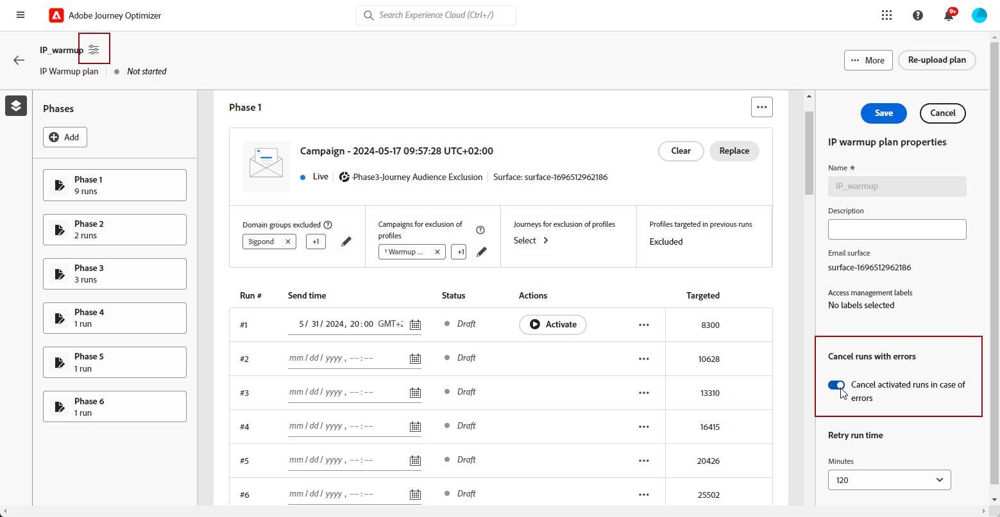
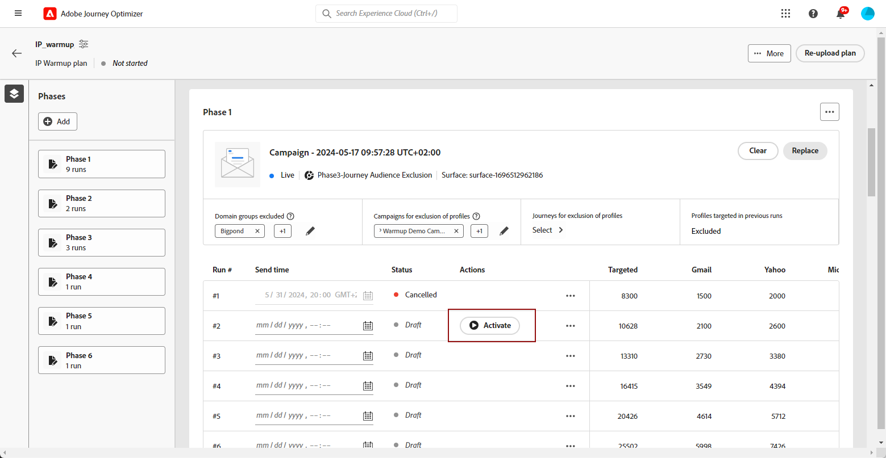

# Ejecución del plan de calentamiento de IP {#ip-warmup-running}

>[!BEGINSHADEBOX]

Lo que encontrará en esta guía de documentación:

* [Introducción al calentamiento de IP](ip-warmup-gs.md)
* [Creación de campañas de calentamiento de IP](ip-warmup-campaign.md)
* [Creación de un plan de calentamiento de IP](ip-warmup-plan.md)
* **[Ejecución del plan de calentamiento de IP](ip-warmup-execution.md)**

>[!ENDSHADEBOX]

Una vez que haya [creó un plan de calentamiento de IP](ip-warmup-plan.md) y cargó el archivo preparado con el consultor de capacidad de entrega, puede definir las fases y ejecuciones en el plan.

Cada fase está compuesta por varias ejecuciones, a las que se asigna una sola campaña.

## Definición de las fases {#define-phases}

>[!CONTEXTUALHELP]
>id="ajo_admin_ip_warmup_campaigns_excluded"
>title="Excluir audiencias de campaña"
>abstract="Seleccione los públicos de otras campañas que desee excluir de la fase actual. Esto sirve para evitar que se establezcan como objetivo perfiles con los que ya se ha contactado anteriormente desde otras fases u otros planes de calentamiento de IP."

>[!CONTEXTUALHELP]
>id="ajo_admin_ip_warmup_domains_excluded"
>title="Excluir grupos de dominio"
>abstract="Seleccione los dominios que desea excluir de la fase actual. La exclusión de dominios requiere una fase no ejecutada, por lo que es posible que tenga que dividir una fase en ejecución para añadir exclusiones."
>additional-url="https://experienceleague.corp.adobe.com/docs/journey-optimizer/using/configuration/implement-ip-warmup-plan/ip-warmup-execution.html?lang=es#split-phase" text="Dividir una fase"

>[!CONTEXTUALHELP]
>id="ajo_admin_ip_warmup_phases"
>title="Defina las fases de su plan"
>abstract="Cada fase está compuesta por varias ejecuciones, a las que se asigna una sola campaña."

<!--You need to associate the campaign and audience at phase level and turns on some settings as needed for all runs associated with a single creative/campaign

At phase level, system ensures that previously targeted + new profiles are picked up AND at iteration level, system ensures that each run is having unique profiles and the count matches what is stated in plan-->

<!---->

1. Para cada fase, seleccione la campaña que desee asociar con esta fase del plan de calentamiento de IP.

   

   Recuerde lo siguiente:

   * Solo las campañas con el **[!UICONTROL Activación del plan de calentamiento IP]** opción habilitada <!--and live?--> están disponibles para su selección. [Más información](#create-ip-warmup-campaign)

   * Debe seleccionar una campaña que utilice la misma superficie que la seleccionada para el plan de calentamiento de IP actual.

   * No puede seleccionar una campaña que ya esté en uso en otra campaña de calentamiento de IP.

1. En el **[!UICONTROL Exclusión de perfil]** , puede ver que los perfiles de las ejecuciones anteriores de esa fase siempre se excluyen. Por ejemplo, si en #1 de ejecución se cubrió un perfil en las primeras 4800 personas objetivo, el sistema se asegurará automáticamente de que el mismo perfil no reciba el correo electrónico en #2 de ejecución.

1. Desde el **[!UICONTROL Audiencias de campaña excluidas]** , seleccione las audiencias de otros <!--executed/live?-->campañas que desee excluir de la fase actual.

   

   Por ejemplo, al ejecutar la fase 1, tenía que [dividirlo](#split-phase) por cualquier razón. Por lo tanto, puede excluir la campaña utilizada en la fase 1 para que los perfiles contactados anteriormente desde la fase 1 no se incluyan en la fase 2. También puede excluir campañas de otros planes de calentamiento de IP.

1. Desde el **[!UICONTROL Grupos de dominio excluidos]** , seleccione los dominios que desea excluir de esa fase.

   >[!NOTE]
   >
   >La exclusión de dominios requiere una fase no ejecutada, por lo que es posible que tenga que [dividir una fase en ejecución](#split-phase) para añadir exclusiones.

   

   Por ejemplo, después de ejecutar el calentamiento de la IP durante algunos días, se da cuenta de que la reputación de su ISP con un dominio (por ejemplo, Adobe) no es buena y desea resolverla sin detener su plan de calentamiento de IP. En tal caso, puede excluir el grupo de dominios de Adobe.

   >[!NOTE]
   >
   >Si el dominio no es un grupo de dominios predeterminado, debe trabajar con el consultor del equipo de entrega para agregar este dominio al [Archivo de plan de calentamiento IP](ip-warmup-plan.md#prepare-file) y [vuelva a cargarlo](#re-upload-plan) para poder excluir ese dominio.

1. Puede agregar una fase si es necesario. Se agregará después de la última fase actual.

   

1. Utilice el **[!UICONTROL Eliminar fase]** para eliminar cualquier fase no deseada.

   

   >[!CAUTION]
   >
   >No se puede deshacer la acción **[!UICONTROL Eliminar]** acción.
   >
   >Si elimina todas las fases del plan de calentamiento de IP, se recomienda volver a cargar un plan. [Más información](#re-upload-plan)

## Definición de las ejecuciones {#define-runs}

>[!CONTEXTUALHELP]
>id="ajo_admin_ip_warmup_run"
>title="Definir cada ejecución"
>abstract="Defina y active cada ejecución para todas las fases."

>[!CONTEXTUALHELP]
>id="ajo_admin_ip_warmup_last_engagement"
>title="Filtrar por participación"
>abstract="Esta columna es un filtro que se dirige únicamente a los usuarios comprometidos con su marca en los últimos 20 días, por ejemplo. También puede cambiar esta configuración a través de la opción **Editar ejecución**."

>[!CONTEXTUALHELP]
>id="ajo_admin_ip_warmup_retry"
>title="Establecer un periodo de tiempo"
>abstract="Puede definir un periodo de tiempo durante el cual se puede ejecutar la campaña de calentamiento de IP en caso de que haya algún retraso en el trabajo de segmentación."

>[!CONTEXTUALHELP]
>id="ajo_admin_ip_warmup_pause"
>title="Cancelar ejecuciones con errores de público"
>abstract="Seleccione esta opción para cancelar una ejecución si los perfiles cualificados son inferiores a los perfiles de destino una vez que el público haya sido evaluado para esa ejecución."

>[!CONTEXTUALHELP]
>id="ajo_admin_ip_warmup_qualified"
>title="Ver los perfiles cualificados"
>abstract="Esta columna muestra el número de perfiles cualificados. Una vez que el público ha sido evaluado para una ejecución, si hay más perfiles objetivo que perfiles cualificados, la ejecución se sigue ejecutando, a menos que la opción **Pausa para errores** esté habilitada. En este caso, la ejecución se cancela."

1. Seleccione una programación para cada ejecución.

   

1. De forma opcional, puede definir un intervalo de tiempo durante el cual se puede ejecutar la campaña de calentamiento de IP en caso de que haya algún retraso en la [segmentación](https://experienceleague.adobe.com/docs/experience-platform/segmentation/home.html#how-segmentation-works){target="_blank"} trabajo. Para ello, haga clic en el icono Properties en la parte superior izquierda, junto al nombre del plan y utilice la variable **[!UICONTROL Reintentar tiempo de ejecución]** para seleccionar una duración: hasta 240 minutos (4 horas).

   

   Por ejemplo, si establece una hora de envío en un día determinado a las 9 a. m. y selecciona 120 minutos como tiempo de ejecución de reintento, esto permite ejecutar un intervalo de oportunidades de 2 horas (de 9 a. m. a 11 a. m.) para el trabajo de segmentación.

   >[!NOTE]
   >
   >Si no se especifica ningún intervalo de tiempo, la ejecución se intenta en el momento del envío y fallará si el trabajo de segmentación no se completa.

1. Si es necesario, seleccione **[!UICONTROL Editar ejecución]** en el icono Más acciones. Se pueden actualizar los números de direcciones de cada columna. También puede actualizar el **[!UICONTROL Último compromiso]** para dirigirse únicamente a los usuarios comprometidos con su marca durante los últimos 20 días, por ejemplo.

   

1. Seleccione el **[!UICONTROL Pausa para errores]** para cancelar una ejecución si los perfiles cualificados son inferiores a los perfiles de destino una vez que la audiencia ha sido evaluada para esa ejecución.

   

1. **[!UICONTROL Activar]** la corrida. [Más información](#activate-run)

1. El estado de esta ejecución cambia a **[!UICONTROL Activo]**. Los diferentes estados de ejecución se enumeran en [esta sección](#monitor-plan).

1. Si la ejecución de la campaña no ha comenzado, puede detener una ejecución activa.<!--why?-->

   

   >[!NOTE]
   >
   >Una vez iniciada la ejecución de la campaña, **[!UICONTROL Detener]** El botón deja de estar disponible.

1. Para añadir una ejecución, seleccione **[!UICONTROL Agregar una ejecución a continuación]** en el icono Más acciones.

   

## Activar una ejecución {#activate-run}

Para activar una ejecución, seleccione la **[!UICONTROL Activar]** botón.

Asegúrese de que ha programado tiempo suficiente para permitir el [segmentación](https://experienceleague.adobe.com/docs/experience-platform/segmentation/home.html#how-segmentation-works){target="_blank"} trabajo a ejecutar.

>[!CAUTION]
>
>Cada ejecución debe activarse al menos 12 horas antes de la hora de envío real. De lo contrario, es posible que la segmentación no se complete.

Al activar una ejecución, se crean varios segmentos automáticamente.

* Si activa la primera ejecución de una fase:

   * A [segmento](https://experienceleague.adobe.com/docs/experience-platform/segmentation/ui/segment-builder.html?lang=es){target="_blank"} se crea para las audiencias de campaña excluidas (si las hay).
   * Se crea otro segmento para los grupos de dominios excluidos (si los hay).

* Al activar cualquier ejecución:

   * Se crea otro segmento para el último filtro de participación.
   * Un [composición de audiencia](https://experienceleague.adobe.com/docs/experience-platform/segmentation/ui/audience-composition.html?lang=es){target="_blank"} se crea correspondiente a la audiencia a la que se envía la campaña.

<!--How do you know when segmentation is complete? Is there a way to prevent user from scheduling less than 12 hours before the segmentation job?-->

<!--Sart to execute on every day basis by simply clicking the play button > for each run? do you have to come back every day to activate each run? or can you schedule them one after the other?)-->

<!--Upon activation, when the segment evaluation happens, more segments will be created by the IP warmup service and will be leveraged in an audience composition and a new audience will be created for each run splitted into the different selected domains.-->

## Administrar su plan {#manage-plan}

En cualquier momento, si el plan de calentamiento de la IP no funciona como se espera, puede realizar las siguientes acciones.

### Dividir una fase {#split-phase}

Si desea añadir una nueva fase empezando desde una ejecución específica, seleccione la **[!UICONTROL Dividir en una nueva opción de fase]** en el icono Más acciones.

Se crea una nueva fase para las ejecuciones restantes de la fase actual.

Por ejemplo, si selecciona esta opción para Ejecutar #4, las ejecuciones #4 a #8 se moverán a una nueva fase justo después de la fase actual.

Siga los pasos [superior](#define-phases) para definir la nueva fase.

* Puede usar el complemento **[!UICONTROL Reemplazar campaña]** para esa nueva fase.

* También puede excluir la campaña anterior o un dominio que no tenga un buen rendimiento. Descubra cómo en [esta sección](#define-phases).

<!--
You don't have to decide the campaign upfront. You can do a split later. It's a work in progress plan: you activate one run at a time with a campaign and you always have the flexibility to modify it while working on it.

But need to explain in which case you want to modify campaigns, provide examples
-->

### Marcar un plan como completado {#mark-as-completed}

Si el plan no está funcionando lo suficientemente bien o si desea soltarlo para crear otro, puede marcarlo como completado.

Para ello, haga clic en el **[!UICONTROL Más]** en la parte superior derecha del plan de calentamiento de IP y seleccione **[!UICONTROL Marcar como completado]**.

Esta opción sólo está disponible si todas las ejecuciones del plan se encuentran en **[!UICONTROL Completado]** o **[!UICONTROL Borrador]** estado. Si una ejecución es **[!UICONTROL Activo]**, la opción aparece atenuada.

Los diferentes estados de ejecución se enumeran en [esta sección](#monitor-plan).

### Volver a cargar un plan de calentamiento de IP {#re-upload-plan}

Si el plan de calentamiento de la IP no funciona como se espera (por ejemplo, si observa que algunos ISP marcan sus mensajes como correo no deseado), puede pedirle al experto en capacidad de entrega que configure otro archivo de plan de calentamiento de IP y vuelva a cargarlo con el botón correspondiente.

Todas las ejecuciones ejecutadas anteriormente serán de solo lectura. El nuevo plan se muestra en el primer plan.

Siga los pasos [superior](#define-phases) para definir las fases del nuevo plan.

>[!NOTE]
>
>Los detalles del plan de calentamiento de IP cambiarán según el archivo recién cargado. Las ejecuciones ejecutadas anteriormente (independientemente de su [status](#monitor-plan)) no se ven afectados.

Veamos un ejemplo:

* Con el plan inicial de calentamiento de IP, la Fase 2 tuvo 9 ejecuciones.

* Se ejecutaron 4 ejecuciones (sin importar si fallaron, se completaron o se cancelaron)<!--as long as a run has been attempted, it is an executed run-->).

* Si vuelve a cargar un plan nuevo, la fase 2 con las primeras 4 ejecuciones ejecutadas pasará al modo de solo lectura.

* Las 5 ejecuciones restantes (que están en estado de borrador) se mueven a una nueva fase (Fase 3) que se muestra según el plan recién cargado.

## Monitorización del plan {#monitor-plan}

Para medir el impacto de su plan, puede comprobar el rendimiento de sus campañas de calentamiento de IP mediante el [!DNL Journey Optimizer] informes de campaña. Para ello, para cada ejecución completada, puede hacer clic en el icono **[!UICONTROL Ver informes]** botón. Obtenga más información sobre el correo electrónico de la campaña [informe en vivo](../reports/campaign-live-report.md#email-live) y [informe global](../reports/campaign-global-report.md##email-global).

El propio plan de calentamiento de la IP también sirve como informe consolidado en un solo lugar. Puede comprobar elementos como el número de **[!UICONTROL Activo]** o **[!UICONTROL Completado]** se ejecuta para cada fase y visualiza el progreso de su plan de calentamiento de IP.

Una ejecución puede tener los siguientes estados:

* **[!UICONTROL Borrador]** : cada vez que se crea una ejecución, ya sea cuando [creación de un nuevo plan](ip-warmup-plan.md) o [adición de una ejecución](#define-runs) desde la interfaz de usuario, toma el **[!UICONTROL Borrador]** estado.
* **[!UICONTROL Activo]**: cada vez que se activa una ejecución, se necesita el **[!UICONTROL Activo]** estado.
* **[!UICONTROL Completado]**: la ejecución de la campaña para esta ejecución ha finalizado. <!--i.e. campaign execution has started, no error happened and emails have reached users? to check with Sid-->
* **[!UICONTROL Cancelado]**: a **[!UICONTROL Activo]** la ejecución se ha cancelado utilizando **[!UICONTROL Detener]** o ha activado el botón **[!UICONTROL Pausa para errores]** y se produjo un error. [Más información](#define-runs)
* **[!UICONTROL Error]**: el sistema ha encontrado un error o la campaña utilizada para la fase actual se ha detenido. Si una ejecución falla, puede programar otra ejecución para el día siguiente.
