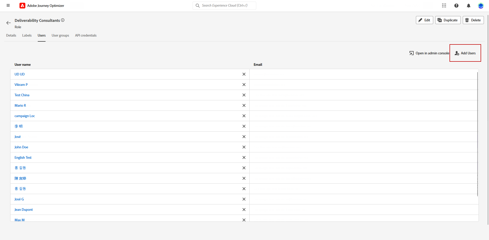
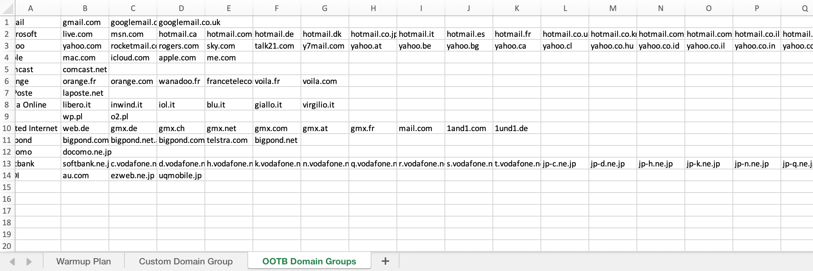
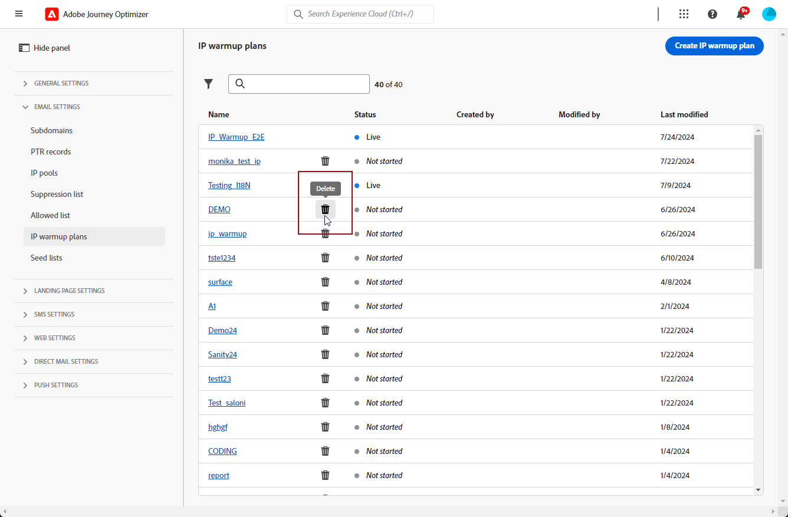

# Creación de un plan de calentamiento de IP {#ip-warmup}

Una vez que haya creado una o más [campañas de calentamiento de IP](ip-warmup-campaign.md) con una configuración dedicada y la opción correspondiente habilitada, puede empezar a crear su plan de calentamiento de IP.

Para acceder, crear, editar y eliminar los planes de calentamiento de IP, debe tener el rol **[!UICONTROL Consultor de capacidad de entrega]** o permisos relacionados con los planes de calentamiento de IP.

+++Obtenga información sobre cómo asignar la función Consultor de capacidad de entrega o los permisos relacionados con planes de calentamiento de IP

El control de acceso a nivel de objeto le permite proteger los datos y conceder acceso específico para ver y administrar sus planes. Si no se ha asignado ninguna etiqueta a su plan de calentamiento de IP, estará abierta para que la vean y editen todos los usuarios.

Al conceder el permiso **[!UICONTROL Ver planes de calentamiento de IP]**, se restringe el acceso solo a la visualización y publicación, mientras que al asignar el permiso **[!UICONTROL Administrar planes de calentamiento de IP]**, los usuarios pueden ver y editar el plan.

Para asignar el permiso correspondiente a un **[!UICONTROL Rol]** específico:

1. En el producto [!DNL Permissions], vaya al menú **[!UICONTROL Roles]** y seleccione el rol que desea actualizar con los nuevos permisos de **[!UICONTROL Configuraciones de calentamiento de IP]**.

1. En el panel **[!UICONTROL Rol]**, haga clic en **[!UICONTROL Editar]**.

   

1. Arrastre y suelte el recurso **[!UICONTROL Configuraciones de calentamiento de IP]** para asignar el permiso.

1. En el menú desplegable de recursos **[!UICONTROL Configuraciones de calentamiento de IP]**, seleccione los permisos que necesita el usuario: **[!UICONTROL Ver planes de calentamiento de IP]**, **[!UICONTROL Administrar planes de calentamiento de IP]** y/o **[!UICONTROL Ver informes de calentamiento de IP]**. Puede seleccionarlos todos a la vez si es necesario.

   

1. Haga clic en **[!UICONTROL Guardar]**.

Para asignar la función correspondiente a un **[!UICONTROL usuario]**:

1. Desde el producto [!DNL Permissions], vaya al menú **[!UICONTROL Roles]** y seleccione la función integrada de **[!UICONTROL Consultor de capacidad de envío]**.

1. En el panel **[!UICONTROL Rol]**, acceda a la ficha **[!UICONTROL Usuarios]**.

   

1. Haga clic en **[!UICONTROL Agregar usuario]** para asignar el rol integrado de **[!UICONTROL Consultor de capacidad de envío]**.

   

1. Seleccione su **[!UICONTROL usuario]** y haga clic en **[!UICONTROL Guardar]**.

   

+++

## Preparación del archivo de plan de calentamiento de IP {#prepare-file}

El calentamiento de IP es una actividad que consiste en aumentar gradualmente el volumen de correos electrónicos que salen de sus IP y dominios a los principales proveedores de servicios de Internet (ISP), con el fin de establecer su reputación como remitente legítimo.

Esta actividad se suele realizar con la ayuda de un experto en capacidad de envío que ayuda a preparar un plan bien pensado basado en los dominios del sector, casos de uso, regiones, ISP y varios otros factores.

<!--When working with the [!DNL Journey Optimizer] IP warmup feature, this plan takes the form of an Excel file that must contain a number of predefined columns.-->

Antes de poder crear un plan de calentamiento de IP en la interfaz [!DNL Journey Optimizer], debe rellenar una plantilla de Excel con todos los datos que alimentan el plan.

* Desde la interfaz de usuario, puede descargar la [plantilla de plan de calentamiento IP](assets/IPWarmupPlan-Template.xlsx) de Excel en blanco para rellenar.

* También puede descargar un [plan de calentamiento de IP de ejemplo](assets/IPWarmupPlan-Sample.xlsx) que ya contiene algunos datos que puede usar como ejemplo.

<!--
* From the user interface you can download the blank Excel IP warmup plan template to fill in.

* You can also download a sample IP warmup plan already filled in with some data you can use as an example.
-->

>[!CAUTION]
>
>Póngase en contacto con el consultor del equipo de entrega para asegurarse de que el archivo del plan de calentamiento de IP esté correctamente configurado.
>
>Asegúrese de utilizar el formato proporcionado en la plantilla.

A continuación se muestra un ejemplo de un archivo que contiene un plan de calentamiento de IP.

### Pestaña Plan de calentamiento {#ip-warmup-plan-tab}

Para crear su plan de calentamiento de IP, rellene la primera pestaña con los datos que necesita para alimentar su plan.

* En el ejemplo anterior, se ha preparado un plan que abarca más de 17 días (denominado &#39;**runs**&#39;) para alcanzar un volumen de destino de más de un millón de perfiles.

* Este evento planificado se ejecuta en seis **fases**, cada una de las cuales contiene al menos una ejecución.

* Puede tener hasta 6 columnas (4 columnas para grupos de dominio, una para la columna **Otros** y otra para la columna **Días de participación**). En este ejemplo, el plan se divide en seis columnas:

   * Tres de los cuales corresponden a **grupos de dominios predeterminados** que se usarán en su plan (Gmail, Yahoo y Microsoft). Los grupos de dominio predeterminados están todos enumerados en la ficha [Grupos de dominio OOTB](#ootb-domain-groups-tab).
   * Una columna corresponde a un grupo de dominio personalizado (que debe agregar mediante la ficha [Grupo de dominio personalizado](#custom-domain-group-tab)).
   * La quinta columna, **Otros**, contiene todas las direcciones restantes de otros dominios que no están cubiertos explícitamente en el plan. Esta columna es opcional: si se omite, los correos electrónicos solo irán a los dominios especificados.
   * La última columna, **Días de participación**, le permite especificar el número de días durante los cuales se debe realizar un seguimiento o evaluar la participación.

La idea es aumentar progresivamente el número de direcciones objetivo en cada ejecución, al mismo tiempo que se reduce el número de ejecuciones para cada fase.

### Pestaña Grupo de dominios personalizado {#custom-domain-group-tab}

También puede agregar más columnas al plan incluyendo grupos de dominio personalizados.

Use la ficha **[!UICONTROL Grupo de dominio personalizado]** para definir un nuevo grupo de dominio. Para cada dominio, puede agregar todos los subdominios que cubre.

>[!IMPORTANT]
>
>Asegúrese de que cada dominio sea único para su grupo de dominios y no se superponga con otros grupos de dominios o [grupos de dominios predeterminados](#ootb-domain-groups-tab).

Por ejemplo, si agrega el dominio personalizado Roadrunner, desea que se incluyan los siguientes subdominios, como en el ejemplo siguiente: roadrunner.com, nc.rr.com, tampabay.rr.com, rochester.rr.com, etc.

>[!NOTE]
>
>Si no necesita dominios personalizados, deje vacía la ficha **[!UICONTROL Grupo de dominios personalizados]**.

### Pestaña Grupos de dominio OOTB {#ootb-domain-groups-tab}

La ficha **Grupos de dominio OOTB** de la plantilla de plan de calentamiento de IP contiene todos los grupos de dominio principales listos para usar que puede agregar a su plan.

>[!NOTE]
>
>Si un grupo de dominios no aparece en la lista de esta pestaña, debe crear un grupo de dominios personalizado en la pestaña correspondiente. [Más información](#custom-domain-group-tab)

Los grupos de dominios principales listos para usar también se enumeran a continuación:

+++ Gmail
gmail.com;google.com;googlemail.com;googlemail.co.uk
+++

+++Microsoft
hotmail.com.tr;live.de;live.ru;live.nl;windowslive.com;live.jp;mts.net;xbox.com;hotmail.fr;hotmail.cl;hotmail.jp;live.cl;live.at;live.com.au;hotmail.co.th;live.hk;hotmail.com.au;hotmail.com;live.com.my;hotmail.co.kr;live.ie;outlook.com.br;hotmail.dk;hotmail.co.il;live.co.kr;live.co.uk;outlook.ie;live.cn;live.com.mx;hotmail.co.uk;hotmail.es;live.fr;live.no;live.dk;hotmail.it;live.com.sg;live.se;msn.com;live.be;hotmail.co.jp .in;hotmail.se;live.co.za;hotmail.ch;live.com.pt;outlook.com;hotmail.gr;live.it;live.com;hotmail.ca;live.com.ar;hotmail.com.br hotmail.com.ar;live.ca;hotmail.de
+++

+++Yahoo
aol.fi;games.com;cs.com;yahoo.com.in;y7mail.com;yahoo.co.uk;yahoo.hu;yahoo.co.hu;yahoo.cn;yahoogroups.com.sg;yahoogroups.com.au;aol.es;yahoo.com.au;yahoo.com.vn;yahoo.ca;aol.hk;aol.co.nz;yahoo.com.br;aolpoland.pl;aolnorge.no;yahoo.ne.jp;yahoo.fi;ymail.com;netscape.com;yahoo.com.pe;yahoo.hr;aol.cz;yahoo.ee;aol.be;aolcom.tr;yahoo.si;yahoo.co.id;aol.it;citlink.net;yahoo.es ahoo.dk;yahoogroups.ca;wmconnect.com;yahoo.com.jp;aol.kr;yahoo.ie;aol.jp;yahoo.com.hk;yahoo.lt;aol.com.br;aol.nl;yahoo.co.kr;yahoo.bg;yahoo.com.ar;ygm.com;aol.se;yahoo.co.nz;yahoo.de;aol.com;goowy.com;rocketmail.com;frontiernet.net;yahoo.nl;aim.com;aol.dk;yahoogroups.co.in;aol.cl;netscape.net;yahoo.no;luckymail.com;yahoo.co.jp;yahoo.cz;yahoo.com.kr;yahoo.sk;yahoo.co.za ogroups.de;yahoo.gr;verizon.net;aol.com.ve;yahoo.ro;aol.com.ar;aol.com.co;wild4music.com;yahoo.at;yahoogroups.com.cn;yahoo.com.co;wow.com;aol.fr;yahoo.in;aol.in;yahoo.com;yahoo.rs;aol.de;yahooxtra.co.nz;yahoo.com.mx;yahoo.com.ph;sky.com;aol.com.mx;yahoo.se;myaol.jp;aol.com.au;yahoo.pt;aolchina.com;yahoo.com.net;yahoogrupper.dk;yahoo.fr;yahoo.com.tw;talk21.com;aol.pl;compuserve.com;aol.ch yahoo.it;yahoo.com.sg;yahoogroups.com.tw;aolpolcka.pl;frontier.com;yahoo.co.in;yahoogruppi.it;yahoo.co.il;yahoo.cl;verizon.net.in;yahoo.com.tr;yahoogroups.com.hk;yahoogroups.co.uk;yahoo.com.biz;yahoo.be;yahoo.com.hr;aol.co.uk;aol.tw;ybb.ne.jp;yahoogroups.co.kr;yahoo.com.my;rogers.com;gte.net;yahoogroups.com;yahoo.co.th;yahoo.com.cn;aol.ru;love.com bellatlantic.net yahoo.com.ve yahoo.com.ua;yahoo.lv;aolpolska.pl;aol.at;yahoo.pl
+++

+++Apple
mac.com;icloud.com;apple.com;me.com
+++

+++Comcast
comcast.net
+++

+++Naranja
voila.com;francetelecom.com;orange.com;orange.fr;wanadoo.fr;voila.fr
+++

+++La Poste
laposte.net
+++

+++Italia Online
inwind.it;blu.it;virgilio.it;giallo.it;iol.it;libero.it
+++

+++WP
wp.pl;o2.pl
+++

+++Internet Unido
gmx.de;1and1.com;gmx.fr;mail.com;1und1.de;gmx.com;gmx.net;gmx.at;web.de;gmx.ch
+++

+++Estanque Grande
bigpond.com;bigpond.com.au;bigpond.net;telstra.com;bigpond.net.au
+++

+++Docomo
docomo.ne.jp
+++

+++Softbank
c.vodafone.ne.jp;jp-h.ne.jp;k.vodafone.ne.jp;jp-d.ne.jp;jp-c.ne.jp;t.vodafone.ne.jp;h.vodafone.ne.jp;r.vodafone.ne.jp;q.vodafone.ne.jp;jp-t.ne.jp;jp-q.ne.jp;s.vodafone.ne.jp;jp-s.ne.jp;jp-r.ne.jp;jp-k.ne.jp;n.vodafone.ne.jp;d.vodafone.ne.jp softbank.ne.jp jp-n.ne.jp
+++

+++KDDI
au.com;ezweb.ne.jp;uqmobile.jp
+++

### Ejemplo {#example}

Supongamos que desea tener dos grupos de dominios personalizados:

* Uno solo para dominios de Hotmail.
* Uno para todos los demás dominios del grupo de dominios Microsoft (excluyendo así todos los dominios de Hotmail).

Los dominios fuera de Hotmail y del grupo de dominios Microsoft se recopilarán en la columna **[!UICONTROL Otros]**.

1. En la ficha **[!UICONTROL Grupo de dominio personalizado]**, cree el grupo de dominio **Hotmail**.

1. Agregue todos los dominios de Hotmail en la misma fila.

   Puede [copiar y pegar](#copy-paste) todos los dominios de Hotmail enumerados en la sección [Grupos de dominio OOTB](#ootb-domain-groups-tab).

1. Añada otra fila.

1. Crear el grupo de dominios **Microsoft_X**.

1. Agregue todos los dominios de Microsoft que no sean Hotmail en la misma fila. Del mismo modo, puede [copiarlos y pegarlos](#copy-paste) de la lista anterior.

1. Vuelva a la ficha **[!UICONTROL Plan de calentamiento de IP]**.

1. Cree tres columnas: una para **Hotmail**, otra para **Microsoft_X** y otra para **Otros**.

1. Rellene las columnas según sus necesidades.

<!--Only the domain groups listed in the **[!UICONTROL IP Warmup Plan]** tab will be taken into account.-->

### Copiar y pegar dominios predeterminados {#copy-paste}

Si desea crear un grupo de dominio personalizado que contenga todos los dominios de Hotmail, por ejemplo, puede copiar y pegar los dominios de la ficha **Grupos de dominio OOTB** de la [plantilla de plan de calentamiento IP](assets/IPWarmupPlan-Template.xlsx), o de la lista proporcionada [arriba](#ip-warmup-plan-tab).

A continuación, utilice la herramienta de conversión de Excel para convertir texto en columnas:

1. Seleccione **[!UICONTROL Datos]** > **[!UICONTROL Texto a columnas...]**, elija **[!UICONTROL Delimitado]** y seleccione **[!UICONTROL Siguiente]**.

1. Seleccione **[!UICONTROL Punto y coma]**, haga clic en **[!UICONTROL Siguiente]** y **[!UICONTROL Finalizar]**.

Cada dominio ahora se muestra en una columna diferente en la misma fila.

## Acceso y administración de planes de calentamiento de IP {#manage-ip-warmup-plans}

1. Acceda al menú **[!UICONTROL Administración]** > **[!UICONTROL Canales]** > **[!UICONTROL Configuración de correo electrónico]** > **[!UICONTROL Planes de calentamiento de IP]**. Se muestran todos los planes de calentamiento de IP creados hasta el momento.

   

1. Puede filtrar por el estado. Los diferentes estados son:

   * **No iniciada**: aún no se ha activado ninguna ejecución. [Más información](ip-warmup-execution.md#define-runs)
   * **Activo**: el plan cambia a este estado en cuanto se activa correctamente la primera ejecución de la primera fase. [Más información](ip-warmup-execution.md#define-runs)
   * **Completado**: el plan se ha marcado como completado. <!--This option is only available if all the runs in the plan are in **[!UICONTROL Completed]** or **[!UICONTROL Draft]** status (no run can be **[!UICONTROL Live]**).--> [Más información](ip-warmup-execution.md#mark-as-completed)
     <!--* **Paused**: to check (user action)-->

1. Para eliminar un plan de calentamiento de IP, seleccione el icono **[!UICONTROL Eliminar]** junto al nombre de un plan y confirme la eliminación.

   >[!NOTE]
   >
   >Solo se pueden eliminar los planes con el estado **No iniciado**.

   

   >[!CAUTION]
   >
   >El plan de calentamiento de IP seleccionado se eliminará de forma permanente.

## Creación de un plan de calentamiento de IP {#create-ip-warmup-plan}

>[!CONTEXTUALHELP]
>id="ajo_admin_ip_warmup_upload"
>title="Especificación del plan de calentamiento de IP"
>abstract="Rellene la plantilla de Excel con todos los datos que alimentan el plan, como las fases de calentamiento de IP y el número objetivo de perfiles, y cárguela aquí."
>additional-url="https://experienceleague.adobe.com/docs/journey-optimizer/using/configuration/implement-ip-warmup-plan/ip-warmup-plan.html?lang=es#prepare-file" text="Preparación del archivo de plan de calentamiento de IP"

>[!CONTEXTUALHELP]
>id="ajo_admin_ip_warmup_surface"
>title="Selección de una configuración de marketing"
>abstract="Debe seleccionar la misma configuración que la seleccionada en la campaña que desea asociar con su plan de calentamiento de IP."
>additional-url="https://experienceleague.adobe.com/docs/journey-optimizer/using/configuration/channel-surfaces.html?lang=es" text="Creación de configuraciones de canal"
>additional-url="https://experienceleague.adobe.com/docs/journey-optimizer/using/configuration/channel-surfaces.html?lang=es" text="Creación de campañas de calentamiento de IP"

Para crear un plan de calentamiento de IP, siga los pasos a continuación.

1. Acceda al menú **[!UICONTROL Administración]** > **[!UICONTROL Canales]** > **[!UICONTROL Configuración de correo electrónico]**> **[!UICONTROL Planes de calentamiento de IP]** y haga clic en **[!UICONTROL Crear plan de calentamiento de IP]**.

   

1. Complete los detalles del plan de calentamiento de IP: asígnele un nombre y una descripción.

   

1. Seleccione la [configuración](channel-surfaces.md) que desee calentar. Solo las configuraciones de marketing están disponibles para su selección. [Más información sobre el tipo de correo electrónico](../email/email-settings.md#email-type)

   >[!NOTE]
   >
   >Las campañas que desee asociar con su plan de calentamiento de IP deben utilizar la misma configuración. [Aprenda a crear una campaña de calentamiento de IP](ip-warmup-campaign.md)

1. Cargue el archivo de Excel que contiene el plan de calentamiento de IP. [Más información](#prepare-file)

   <!--
    You can also download the Excel template from the [!DNL Journey Optimizer] user interface and upload it after filling it with the IP warmup details.-->

   

   >[!NOTE]
   >
   >En caso de que la carga falle, asegúrese de que está utilizando el formato y el formato de archivo correctos (.xls o .xlsx). Use la [plantilla](assets/IPWarmupPlan-Template.xlsx) que le proporcionó Adobe.

1. Haga clic en **[!UICONTROL Crear]**. Todas las fases, ejecuciones, columnas y su contenido definido en el archivo cargado se muestran automáticamente en la interfaz [!DNL Journey Optimizer].

   

   >[!NOTE]
   >
   >La columna **[!UICONTROL Segmentación]** muestra la suma de todos los perfiles segmentados para cada ejecución, es decir, todos los perfiles de cada grupo de dominio que definió, incluida la columna **Otros** si existe.

Ya está listo para ejecutar su plan de calentamiento de IP. [Más información](ip-warmup-execution.md)
