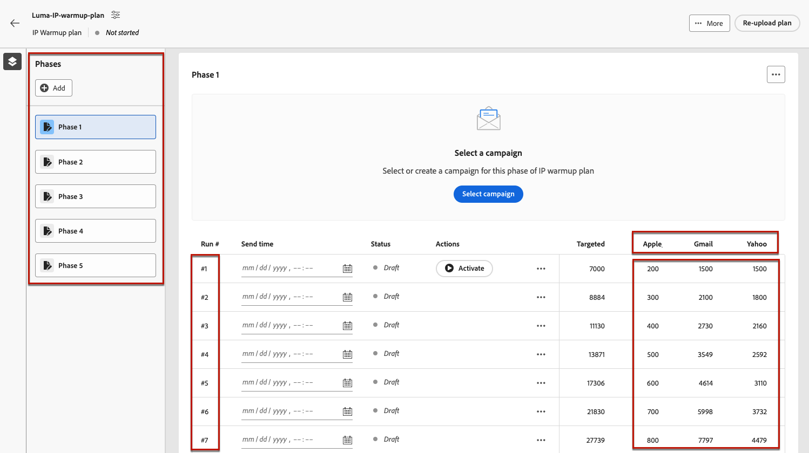

# Crear un plan de calentamiento de IP {#ip-warmup}

>[!BEGINSHADEBOX]

Lo que encontrará en esta guía de documentación:

* [Introducción al calentamiento de IP](ip-warmup-gs.md)
* [Creación de campañas de calentamiento de IP](ip-warmup-campaign.md)
* **[Crear un plan de calentamiento de IP](ip-warmup-plan.md)**
* [Ejecución del plan de calentamiento de IP](ip-warmup-execution.md)

>[!ENDSHADEBOX]

Una vez que haya creado una o más [Campañas de calentamiento de IP](ip-warmup-campaign.md) con una superficie dedicada y la opción correspondiente habilitada, puede empezar a crear su plan de calentamiento de IP.

## Preparar el archivo de plan de calentamiento de IP {#prepare-file}

El calentamiento de IP es una actividad que consiste en aumentar gradualmente el volumen de correos electrónicos que salen de sus IP y dominios a los principales proveedores de servicios de Internet (ISP), con el fin de establecer su reputación como remitente legítimo.

Esta actividad se realiza típicamente con la ayuda de un experto en capacidad de envío que ayuda a preparar un plan bien pensado basado en los dominios del sector, casos de uso, regiones, ISP y varios otros factores.

Al trabajar con [!DNL Journey Optimizer] Función de calentamiento IP, este plan adopta la forma de un archivo de Excel que debe contener una serie de columnas predefinidas. Antes de poder crear un plan de calentamiento de IP en la [!DNL Journey Optimizer] interfaz, debe rellenar esta plantilla con todos los datos que alimentan su plan.

>[!CAUTION]
>
>Póngase en contacto con el consultor del equipo de entrega para asegurarse de que el archivo del plan de calentamiento de IP esté correctamente configurado.

A continuación se muestra un ejemplo de un archivo que contiene un plan de calentamiento de IP.

### Pestaña Plan de calentamiento de IP

* En este ejemplo, se ha preparado un plan que abarca más de 17 días (denominado &quot;**ejecuciones**&quot;) para alcanzar un volumen objetivo de más de 1 millón de perfiles.

* Este planificado se ejecuta a través del 6 **fases**, cada uno de ellos con al menos una ejecución.

* Puede tener tantas columnas como desee para los dominios a los que desee enviar. En este ejemplo, el plan se divide en 6 columnas: 5 de las cuales corresponden a la variable **grupos de dominio principales** para usar en su plan (Gmail, Microsoft, Yahoo, Orange y Apple) y en la sexta columna, **Otros**, contiene todas las direcciones restantes de otros dominios.
* El **Días de participación** Esta columna muestra que solo se segmentan los perfiles comprometidos con su marca durante los últimos 30 días.

La idea es aumentar progresivamente el número de direcciones objetivo en cada ejecución, al mismo tiempo que se reduce el número de ejecuciones para cada fase.

Los grupos de dominios principales listos para usar que puede agregar a su plan se enumeran a continuación:

* Gmail
* Adobe
* WP
* Comcast
* Yahoo
* Estanque Grande
* Naranja
* Softbank
* Docomo
* Internet Unido
* Microsoft
* KDDI
* Italia Online
* La Poste
* Apple

### Pestaña Grupo de dominios personalizado

También puede agregar más columnas al plan incluyendo grupos de dominio personalizados.

Utilice el **[!UICONTROL Grupo de dominio personalizado]** para definir un nuevo grupo de dominios. Para cada dominio, puede agregar todos los subdominios que cubre.<!--TBC-->

Por ejemplo, si agrega el dominio personalizado Luma, desea que se incluyan los siguientes subdominios: luma.com, luma.co.uk, luma.it, luma.fr, luma.de, etc.

## Acceso y administración de planes de calentamiento de IP {#manage-ip-warmup-plans}

1. Acceda a la **[!UICONTROL Administration]** > **[!UICONTROL Canales]** > **[!UICONTROL planes de calentamiento de IP]** menú. Se muestran todos los planes de calentamiento de IP creados hasta el momento.

   

1. Puede filtrar por el estado. Los diferentes estados son:

   * **Sin iniciar**: aún no se ha activado ninguna ejecución. [Más información](ip-warmup-execution.md#define-runs)
   * **Activo**: el plan cambia a este estado en cuanto se activa correctamente la primera ejecución de la primera fase. [Más información](ip-warmup-execution.md#define-runs)
   * **Completado**: el plan se ha marcado como completado. Esta opción sólo está disponible si todas las ejecuciones del plan se encuentran en **[!UICONTROL Completado]** o **[!UICONTROL Borrador]** estado (no se puede ejecutar **[!UICONTROL Activo]**). [Más información](ip-warmup-execution.md#mark-as-completed)
     <!--* **Paused**: to check (user action)-->

1. Para eliminar un plan de calentamiento de IP, seleccione la **[!UICONTROL Eliminar]** junto al nombre de un plan y confirme la eliminación.

   

   >[!CAUTION]
   >
   >El plan de calentamiento de IP seleccionado se eliminará de forma permanente.

## Crear un plan de calentamiento de IP {#create-ip-warmup-plan}

>[!CONTEXTUALHELP]
>id="ajo_admin_ip_warmup_upload"
>title="Especificación del plan de calentamiento de IP"
>abstract="Descargue la plantilla CSV y rellénela con datos de las fases de calentamiento de IP y el número de destino de los perfiles."

>[!CONTEXTUALHELP]
>id="ajo_admin_ip_warmup_surface"
>title="Selección de una superficie de marketing"
>abstract="Debe seleccionar la misma superficie que la seleccionada en la campaña que desea asociar con su plan de calentamiento de IP."
>additional-url="https://experienceleague.adobe.com/docs/journey-optimizer/using/configuration/channel-surfaces.html?lang=es" text="Configuración de superficies de canal"
>additional-url="https://experienceleague.adobe.com/docs/journey-optimizer/using/configuration/channel-surfaces.html?lang=es" text="Creación de campañas de calentamiento de IP"

Cuando una o más campañas en directo con **[!UICONTROL Activación del plan de calentamiento IP]** activada, puede asociarlas a un plan de calentamiento de IP.

>[!CAUTION]
>
>Para crear, editar y eliminar los planes de calentamiento de IP, debe tener **[!UICONTROL Consultor de capacidad de entrega]** permiso. <!--Learn more on managing [!DNL Journey Optimizer] users' access rights in [this section](../administration/permissions-overview.md).-->

1. Acceda a la **[!UICONTROL Administration]** > **[!UICONTROL Canales]** > **[!UICONTROL planes de calentamiento de IP]** y haga clic en **[!UICONTROL Crear plan de calentamiento de IP]**.

   

1. Complete los detalles del plan de calentamiento de IP: asígnele un nombre y una descripción.

   

1. Seleccione una [emerger](channel-surfaces.md). Solo las superficies de marketing están disponibles para su selección. [Más información sobre el tipo de correo electrónico](../email/email-settings.md#email-type)

   >[!CAUTION]
   >
   >Debe seleccionar la misma superficie que la seleccionada en la campaña que desea asociar con su plan de calentamiento de IP. [Obtenga información sobre cómo crear una campaña de calentamiento de IP](ip-warmup-campaign.md)

1. Cargue el archivo de Excel que contiene el plan de calentamiento de IP. [Más información](#prepare-file)

   <!--
    You can also download the Excel template from the [!DNL Journey Optimizer] user interface and upload it after filling it with the IP warmup details.-->

   

1. Haga clic en **[!UICONTROL Crear]**. Todas las fases, ejecuciones, columnas y su contenido definido en el archivo cargado se muestran automáticamente en [!DNL Journey Optimizer] interfaz. [Más información](ip-warmup-execution.md)

   
