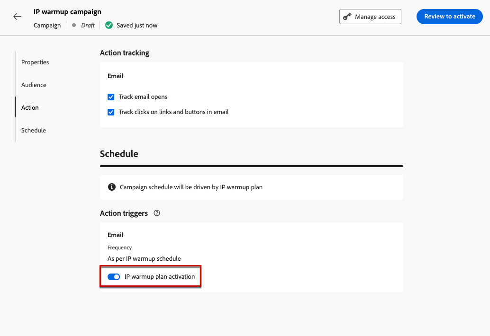

# Implementación de un plan de calentamiento de IP {#ip-warmup}

<!--
>[!CONTEXTUALHELP]
>id="ajo_admin_ip_warmup_plan"
>title="Define your IP warmup plan"
>abstract="You can perform IP warmup workflows directly from the Journey Optimizer interface in a standardized and efficient way that follows the best practices for optimal deliverability."
-->

>[!AVAILABILITY]
>
>Actualmente, la función de calentamiento de IP está disponible como una versión beta únicamente para usuarios seleccionados. Para unirse al programa beta, póngase en contacto con el Servicio de atención al cliente de Adobe.

Con [!DNL Journey Optimizer], puede realizar fácilmente flujos de trabajo de calentamiento de IP directamente desde la interfaz de usuario de una manera estandarizada y eficaz que siga las prácticas recomendadas para una entrega óptima.

>[!CAUTION]
>
>Esta función solo se aplica al canal de correo electrónico.

Cuando se envían correos electrónicos utilizando una plataforma nueva, los proveedores de servicios de Internet (ISP) sospechan de las direcciones IP desconocidas. Si se envían, de repente, grandes volúmenes de correos electrónicos, los ISP suelen marcarlos como correo no deseado.

Para evitar que se lo considere correo no deseado, puede aumentar progresivamente el volumen enviado mediante la función de plan de calentamiento de IP. Una nueva opción en el menú Administración le permite hacerlo con mayor suavidad en lugar de crear recorridos complejos. Esto debería garantizar un desarrollo uniforme de la fase de inicio y permitir reducir la velocidad total de direcciones no válidas.

>[!NOTE]
>
>Obtenga más información sobre cómo aumentar su reputación de correo electrónico con el calentamiento de IP en [Guía de prácticas recomendadas de entrega](https://experienceleague.adobe.com/docs/deliverability-learn/deliverability-best-practice-guide/additional-resources/generic-resources/increase-reputation-with-ip-warming.html).

<!--
Here are the main steps:

1. You get a deliverability plan from the deliverability consulting team.

1. Create a campaign - marketer [Learn more](#create-ip-warmup-campaign)

1. Your associated practitioner (customer's practitioner/ACS consultant/partner consultant) creates a IP warmup object in project and uploads a plan.

    The CSV manifests itself like below with numbers showing up with/without domain bifurcation. Below screen shows one phase (creative) with associated runs (The plan obviously has more such phases)

1. Practitioner associates the campaign and audience at phase level and turns on some settings as needed for all runs associated with a single creative/campaign

1. Then start to execute on every day basis by simply clicking the play button

1. Reports will continue to show up at campaign level with similar capabilities as today. NO enhancements in BETA. But the IP warmup plan also serves as a consolidated report at one single place of how many executions were done and so on

Benefits are as follows:

* No more creation of daily journeys and associated testing

* Standardization on Campaign which will be easy for practitioners too

* No more pain of creating queries, audiences and testing those as system will create the audiences. At phase level, system ensures that previously targeted + new profiles are picked up AND at iteration level, system ensures that each run is having unique profiles and the count matches what is stated in plan

* Ease of excluding domains and changing the plan with help of simple toggles to exclude OR by editing numbers inline or create new phases or reupload plan if drastic change. No more pain of editing audience definitions, journey conditions

* Single place to manage and view how IP warm is progressing.

* Consolidated report at creative/campaign level as all runs for a phase 

* There is an expectation that with this, it will ease around 30% of effort and will be much better experience for consultant/partner/practitioner - right from planning to execution to reporting
-->

Los pasos clave para implementar un plan de calentamiento de IP son los siguientes:

* [Creación de campañas de calentamiento de IP](#create-ip-warmup-campaign)
* [Definir un plan de calentamiento de IP](#define-ip-warmup-plan)

## Creación de campañas de calentamiento de IP {#create-ip-warmup-campaign}

>[!CONTEXTUALHELP]
>id="ajo_campaign_ip_warmup"
>title="Activar la opción de plan de calentamiento IP"
>abstract="Seleccione la opción de activación del plan de calentamiento IP. Una vez que la campaña está activa, puede asociarse con un plan de calentamiento de IP."

Debe crear una o más campañas con una opción específica habilitada para que se puedan usar en un plan de calentamiento de IP. Complete los siguientes pasos.

1. Crear un [emerger](channel-surfaces.md) para el dominio y las direcciones IP que ha identificado para su plan de calentamiento.

1. Crear un [campaña](../campaigns/create-campaign.md) y seleccione la [Correo electrónico](../email/create-email.md#create-email-journey-campaign) acción.

1. Seleccione la superficie que ha creado para el calentamiento de IP.

   <!--You must use the same surface as the one that will be used for the asociated IP warmup plan. [Learn how to create an IP warmup plan](#create-ip-warmup-plan)-->

1. Haga clic en **[!UICONTROL Crear]**.

1. Desde el **[!UICONTROL Programación]** , seleccione **[!UICONTROL Activación del plan de calentamiento IP]**.

   

   La campaña [programación](../campaigns/create-campaign.md#schedule) será impulsado por el plan de calentamiento de IP con el que estará asociado, lo que significa que la programación ya no está definida en la propia campaña.

1. [Activar](../campaigns/review-activate-campaign.md) la campaña. Una vez activa, está lista para utilizarse en un plan de calentamiento de IP.

>[!NOTE]
>
>Para una campaña en directo con el plan de calentamiento de IP activado, la variable **[!UICONTROL Eliminar]** está disponible hasta que se asocia con un plan de calentamiento de IP.

Para obtener más información sobre cómo configurar una campaña, consulte [esta página](../campaigns/get-started-with-campaigns.md).

## Definir un plan de calentamiento de IP {#define-ip-warmup-plan}

### Administrar planes de calentamiento de IP {#manage-ip-warmup-plans}

1. Acceda a la **[!UICONTROL Administration]** > **[!UICONTROL Canales]** > **[!UICONTROL planes de calentamiento de IP]** menú. Se muestran todos los planes de calentamiento de IP creados hasta el momento.

   

1. Puede filtrar por el estado. Los diferentes estados son:

   * **Sin iniciar**: no se ha producido ninguna ejecución
   * **En curso**: tan pronto como se ha iniciado una ejecución <!--or is done?-->
   * **En pausa**
   * **Completado**: todas las ejecuciones del plan han finalizado

1. Para eliminar un plan de calentamiento de IP, seleccione la **[!UICONTROL Eliminar]** junto a un elemento de la lista y confirme la eliminación.

   

   >[!CAUTION]
   >
   >El plan de calentamiento de IP seleccionado se eliminará de forma permanente.

### Crear un plan de calentamiento de IP {#create-ip-warmup-plan}

>[!CONTEXTUALHELP]
>id="ajo_admin_ip_warmup_upload"
>title="Especifique el plan de calentamiento de IP"
>abstract="Descargue la plantilla CSV y rellénela con datos de las fases de calentamiento de la IP y el número de destinatarios de los perfiles."

>[!CONTEXTUALHELP]
>id="ajo_admin_ip_warmup_surface"
>title="Selección de una superficie de marketing"
>abstract="Debe seleccionar la misma superficie que la seleccionada en la campaña que desea asociar con su plan de calentamiento de IP."
>additional-url="https://experienceleague.adobe.com/docs/journey-optimizer/using/configuration/channel-surfaces.html?lang=es" text="Configuración de superficies de canal"
>additional-url="https://experienceleague.adobe.com/docs/journey-optimizer/using/configuration/channel-surfaces.html?lang=es" text="Creación de campañas de calentamiento de IP"

>[!CAUTION]
>
>Para crear, editar y eliminar los planes de calentamiento de IP, debe tener **[!UICONTROL Consultor de capacidad de entrega]** permiso.
<!--Learn more on managing [!DNL Journey Optimizer] users' access rights in [this section](../administration/permissions-overview.md).-->

Cuando una o más campañas en directo con **[!UICONTROL Activación del plan de calentamiento IP]** activada, puede asociarlas a un plan de calentamiento de IP.

>[!CAUTION]
>
>Póngase en contacto con el consultor del equipo de entrega para asegurarse de que la plantilla del plan de calentamiento de IP esté correctamente configurada. <!--TBC-->

1. Acceda a la **[!UICONTROL Administration]** > **[!UICONTROL Canales]** > **[!UICONTROL planes de calentamiento de IP]** y haga clic en **[!UICONTROL Crear plan de calentamiento de IP]**.

   

1. Complete los detalles del plan de calentamiento de IP: asígnele un nombre y una descripción.

   

1. Seleccione una [emerger](channel-surfaces.md). Solo las superficies de marketing están disponibles para su selección. [Más información sobre el tipo de correo electrónico](../email/email-settings.md#email-type)

   >[!CAUTION]
   >
   >Debe seleccionar la misma superficie que la seleccionada en la campaña que desea asociar con su plan de calentamiento de IP. [Obtenga información sobre cómo crear una campaña de calentamiento de IP](#create-ip-warmup-campaign)

1. Cargue el archivo de Excel que contiene el plan de calentamiento de IP<!--which formats are allowed?-->. Puede utilizar la plantilla proporcionada por el equipo de entrega.<!--TBC?--> [Más información](#upload-plan)
   <!--
    You can also download the Excel template from the [!DNL Journey Optimizer] user interface and upload it after filling it with the IP warmup details.-->

   

1. Haga clic en **[!UICONTROL Crear]**. El número de fases definidas en el archivo que ha cargado se muestra automáticamente en todas las ejecuciones de cada fase. [Más información](#upload-plan)

   

### Volver a cargar un plan de calentamiento de IP {#re-upload-plan}

Puede volver a cargar otro plan de calentamiento de IP con el botón correspondiente.

>[!NOTE]
>
>Los detalles del plan de calentamiento de IP cambiarán según el archivo recién cargado. Las ejecuciones completas y las ejecuciones activadas no se ven afectadas.

### Cargue el archivo que contiene el plan {#upload-plan}

A continuación se muestra un ejemplo de un archivo que contiene un plan de calentamiento de IP.

Cada fase corresponde a un periodo compuesto por varias ejecuciones, a las que se asigna una sola campaña.

Para cada ejecución, tiene un determinado número de destinatarios y definirá una fecha en la que se ejecutará.

Puede tener tantas columnas como desee para los dominios a los que desee enviar. En este ejemplo, tiene tres columnas: Gmail, Adobe y Otros, lo que significa que

La idea es tener más ejecuciones en las primeras fases y aumentar progresivamente el número de direcciones objetivo al mismo tiempo que se reduce el número de ejecuciones.

### Definición de las fases {#define-phases}

>[!CONTEXTUALHELP]
>id="ajo_admin_ip_warmup_campaigns_excluded"
>title="Seleccionar audiencias de campañas que excluir"
>abstract="Seleccione las audiencias de otras campañas que desee excluir de la fase actual."

>[!CONTEXTUALHELP]
>id="ajo_admin_ip_warmup_domains_excluded"
>title="Seleccionar grupos de dominio que excluir"
>abstract="Seleccione los dominios que desea excluir de la fase actual."

1. Para cada fase, seleccione la campaña que desee asociar con esta fase del plan de calentamiento de IP.

   

   Recuerde lo siguiente:

   * Solo las campañas con el **[!UICONTROL Activación del plan de calentamiento IP]** opción habilitada <!--and live?--> están disponibles para su selección. [Más información](#create-ip-warmup-campaign)

   * Debe seleccionar una campaña que utilice la misma superficie que la seleccionada para el plan de calentamiento de IP actual.

   * No puede seleccionar una campaña que ya esté en uso en otra campaña de calentamiento de IP.

1. Para cada fase, se aplica lo siguiente:

   * **[!UICONTROL Exclusión de perfil]** - Los perfiles de las ejecuciones anteriores de esa fase siempre se excluyen. Por ejemplo, si en una carrera #1 Leo se cubrió con las primeras 6300 personas objetivo, el sistema se asegurará automáticamente de que Leo no reciba el correo en la #2 de ejecución.

   * **[!UICONTROL Audiencias de campaña excluidas]** - Seleccionar las audiencias de otros <!--executed/live?-->campañas que desee excluir de la fase actual.

     Por ejemplo, es posible que esté ejecutando una fase y tenga que dividirla por cualquier motivo. En tal caso, en la fase 2, le gustaría incluir la campaña utilizada en la fase 1 en esta sección para que en la fase 2, las personas contactadas anteriormente desde la fase 1 no estén incluidas. Esto se puede hacer no solo con las campañas utilizadas en el mismo plan de calentamiento de IP, sino también desde otro plan de calentamiento de IP.

   * **[!UICONTROL Dominios y grupos excluidos]** : seleccione los dominios que desee excluir de esa fase, por ejemplo, Gmail. <!--??-->

     Después de ejecutar el calentamiento de IP durante algunos días, se da cuenta de que la reputación del ISP con un dominio dice que hotmail no es bueno y desea resolverlo con el ISP, pero no desea detener el plan de calentamiento de IP. En tal caso, puede colocar el grupo de dominios hotmail en la categoría excluida.

     >[!NOTE]
     >
     >La exclusión de dominios requiere una fase no ejecutada, por lo que es posible que tenga que dividir una fase en ejecución para agregar exclusiones. Del mismo modo, si el grupo de dominio no es un grupo de dominio OOTB, es posible que tenga que crear un grupo de dominio en Excel, cargarlo y luego excluirlo.

   

1. Puede agregar una fase si es necesario: se agregará después de la última fase actual. Utilice el **[!UICONTROL Eliminar fase]** para eliminar cualquier fase no deseada.

   

   >[!CAUTION]
   >
   >No se puede deshacer la acción **[!UICONTROL Eliminar]** acción.
   >
   >Si elimina todas las fases del plan de calentamiento de IP, le recomendamos que vuelva a cargar un plan.

### Definición de las ejecuciones {#define-runs}

1. Seleccione una programación para cada ejecución. <!--which is actually a window of opportunity. meaning? how many hours? shall we specify that to clarify?-->

   

1. Seleccione una hora de finalización, que básicamente significa la ventana en la que podemos ejecutar la campaña de calentamiento en caso de que haya algún retraso en el trabajo de audiencia. Si no se especifica, se intentará en el momento de inicio y se producirá un error. Si se proporciona la hora de finalización, ejecutaremos la ejecución entre esa ventana.

1. Activar cada ejecución. Asegúrese de programar con suficiente antelación para permitir que se ejecute el trabajo de segmentación. <!--explain how you can evaluate a proper time-->

   >[!CAUTION]
   >
   >Cada ejecución debe activarse al menos 12 horas antes de la hora de envío real. De lo contrario, es posible que la segmentación no se complete. <!--How do you know when segmentation is complete? Is there a way to prevent user from scheduling less than 12 hours before the segmentation job?-->

1. Si la ejecución de la campaña no se ha iniciado, puede detener una ejecución.

   Una vez iniciada la ejecución de la campaña, **[!UICONTROL Detener]** El botón deja de estar disponible. <!--TBC in UI-->

   

1. Para añadir una ejecución, seleccione **[!UICONTROL Agregar una ejecución a continuación]** desde el icono de tres puntos.

   

1. En cualquier momento, si desea utilizar una campaña diferente que comience desde una ejecución específica, seleccione **[!UICONTROL Dividir en una nueva opción de fase]** desde el icono de tres puntos. Se crea una nueva fase para las ejecuciones restantes de la fase actual. Siga los pasos [superior](#define-phases) para definir la nueva fase.

   Por ejemplo, si selecciona esta opción para ejecutar #4, las ejecuciones #4 a #8 se moverán a una nueva fase.

<!--
You don't have to decide the campaign upfront. You can do a split later. It's a work in progress plan: you activate one run at a time with a campaign and you always have the flexibility to modify it while working on it.

But need to explain in which case you want to modify campaigns, provide examples
-->

Una ejecución puede tener los siguientes estados<!--TBC with Medha-->:

* **[!UICONTROL Completado]**:
* **[!UICONTROL Fallido]**:
* **[!UICONTROL Cancelado]**: ha detenido la ejecución antes de que se iniciara la ejecución de la campaña.

