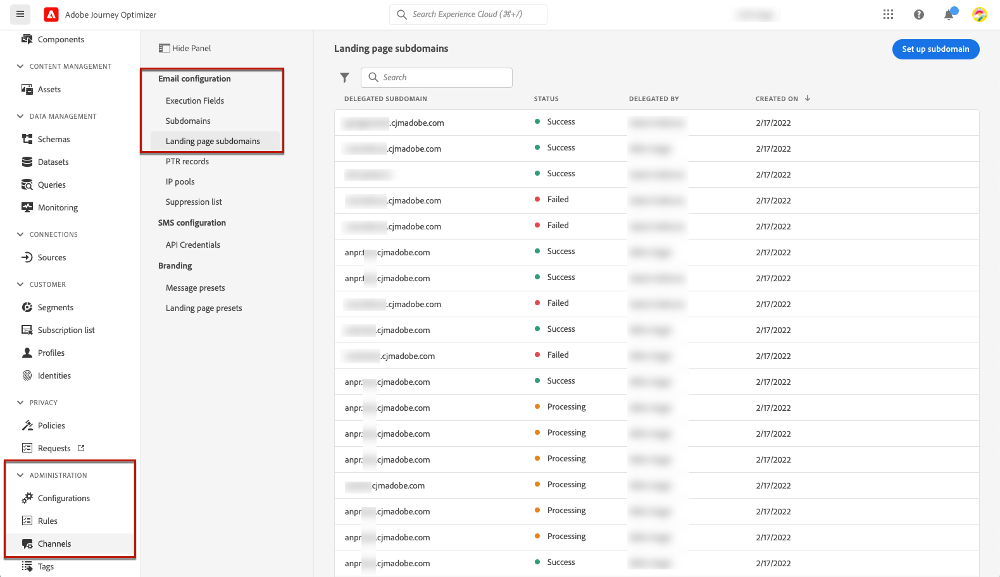
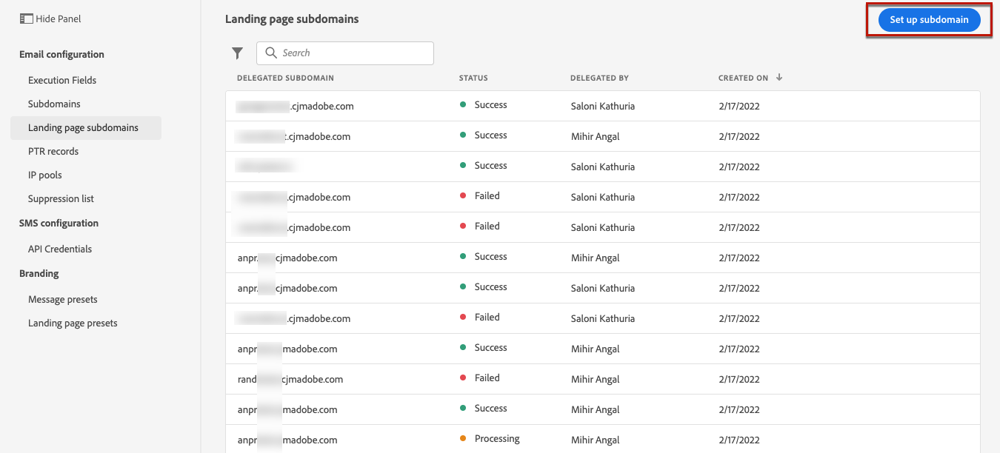
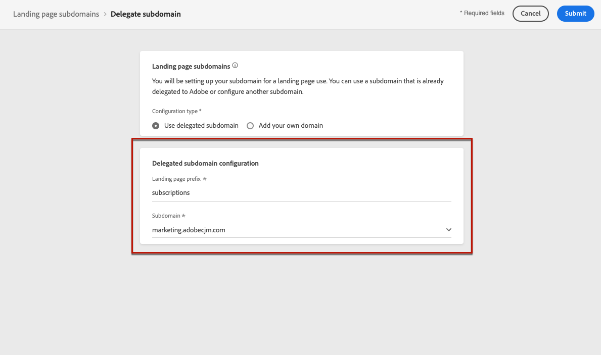

# Configuración de las páginas de destino {#lp-configuration}

## Configurar subdominios de página de aterrizaje {#lp-subdomains}

>[!CONTEXTUALHELP]
>id="ajo_admin_config_lp_subdomain"
>title="Crear un ajuste preestablecido de página de aterrizaje"
>abstract="Para poder crear un ajuste preestablecido de página de aterrizaje, asegúrese de haber configurado previamente al menos un subdominio de página de aterrizaje para elegir desde el **Nombre de subdominio** lista."

Para poder [crear ajustes preestablecidos de página de aterrizaje](#lp-create-preset), debe configurar los subdominios que desea utilizar para las páginas de aterrizaje.

Puede utilizar un subdominio que ya esté delegado en Adobe o configurar otro subdominio. Obtenga más información sobre la delegación de subdominios al Adobe en [esta sección](delegate-subdomain.md).

### Usar un subdominio existente {#lp-use-existing-subdomain}

Para utilizar un subdominio que ya está delegado en Adobe, siga los pasos a continuación.

1. Acceda a la **[!UICONTROL Administration]** > **[!UICONTROL Channels]** a continuación, seleccione **[!UICONTROL Email configuration]** > **[!UICONTROL Landing page subdomains]**.

   

1. Haga clic en **[!UICONTROL Set up subdomain]**.

   

1. Select **[!UICONTROL Use delegated domain]** de la variable **[!UICONTROL Configuration type]** para obtener más información.

   

1. Introduzca el prefijo que se mostrará en la dirección URL de la página de aterrizaje.

   >[!NOTE]
   >
   >Solo se permiten caracteres alfanuméricos y guiones.

1. Seleccione un subdominio delegado de la lista.

   >[!NOTE]
   >
   >No puede seleccionar un subdominio que ya se esté utilizando como subdominio de página de aterrizaje.

   

   >[!CAUTION]
   >
   >Si selecciona un dominio delegado a Adobe mediante la variable [método CNAME](delegate-subdomain.md#cname-subdomain-delegation), debe crear el registro DNS en la plataforma de alojamiento. Para generar el registro DNS, el proceso es el mismo que al configurar un nuevo subdominio de página de aterrizaje. Obtenga información sobre cómo [esta sección](#lp-configure-new-subdomain).

1. Haga clic en **[!UICONTROL Submit]**.

1. Una vez enviado, el subdominio se muestra en la lista con la variable **[!UICONTROL Processing]** estado. Para obtener más información sobre los estados de los subdominios, consulte [esta sección](access-subdomains.md).<!--Same statuses?-->

   

   >[!NOTE]
   >
   >Antes de poder usar ese subdominio para enviar mensajes, debe esperar hasta que el Adobe realice las comprobaciones necesarias, que pueden tardar hasta 4 horas.<!--Learn more in [this section](delegate-subdomain.md#subdomain-validation).-->

1. Una vez realizadas las comprobaciones correctamente, el subdominio recibe la variable **[!UICONTROL Success]** estado. Está listo para utilizarse para crear ajustes preestablecidos de página de aterrizaje.

### Configuración de un nuevo subdominio {#lp-configure-new-subdomain}

Para configurar un nuevo subdominio, siga los pasos a continuación.

1. Acceda a la **[!UICONTROL Administration]** > **[!UICONTROL Channels]** a continuación, seleccione **[!UICONTROL Email configuration]** > **[!UICONTROL Landing page subdomains]**.

1. Haga clic en **[!UICONTROL Set up subdomain]**.

1. Select **[!UICONTROL Add your own domain]** de la variable **[!UICONTROL Configuration type]** para obtener más información.

   

1. Especifique el subdominio que desea delegar.

   >[!CAUTION]
   >
   >No puede utilizar un subdominio de página de aterrizaje existente.

   No se permite delegar un subdominio no válido al Adobe. Asegúrese de introducir un subdominio válido que sea propiedad de su organización, como marketing.yourcompany.com.

   Los subdominios de varios niveles, como &quot;email.marketing.yourcompany.com&quot;, no son compatibles actualmente.

1. Se muestra el registro que se va a colocar en los servidores DNS. Copie este registro o descargue un archivo CSV y, a continuación, vaya a la solución de alojamiento de dominios para generar el registro DNS correspondiente.

1. Asegúrese de que el registro DNS se haya generado en la solución de alojamiento de dominios. Si todo está configurado correctamente, marque la casilla &quot;Confirmo...&quot; y luego haga clic en **[!UICONTROL Submit]**.

   

   >[!NOTE]
   >
   >Al configurar un nuevo subdominio de página de aterrizaje, siempre señalará a un registro CNAME.

1. Una vez enviada la delegación de subdominios, el subdominio se muestra en la lista con la variable **[!UICONTROL Processing]** estado. Para obtener más información sobre los estados de los subdominios, consulte [esta sección](access-subdomains.md).<!--Same statuses?-->

   >[!NOTE]
   >
   >Antes de poder usar ese subdominio para enviar mensajes, debe esperar hasta que el Adobe realice las comprobaciones necesarias, que pueden tardar hasta 4 horas.<!--Learn more in [this section](#subdomain-validation).-->

1. Una vez realizadas las comprobaciones correctamente, el subdominio recibe la variable **[!UICONTROL Success]** estado. Está listo para utilizarse para crear ajustes preestablecidos de página de aterrizaje.

   Tenga en cuenta que el subdominio se marcará como **[!UICONTROL Failed]** si no puede crear el registro de validación en la solución de alojamiento.

## Definir ajustes preestablecidos de página de aterrizaje {#lp-define-preset}

When [creación de una página de aterrizaje](../landing-pages/create-lp.md#create-a-lp), debe seleccionar un ajuste preestablecido de página de aterrizaje para poder crear la página de aterrizaje y aprovecharla mediante **[!DNL Journey Optimizer]**.

### Acceso a los ajustes preestablecidos de la página de aterrizaje {#lp-presets}

Para acceder a los ajustes preestablecidos de la página de aterrizaje, siga los pasos a continuación.

1. Acceda a la **[!UICONTROL Administration]** > **[!UICONTROL Channels]** para abrir el Navegador.

1. Seleccione **[!UICONTROL Branding]** > **[!UICONTROL Landing page presets]**.

   

1. Haga clic en cualquier etiqueta preestablecida para acceder a los detalles del ajuste preestablecido de la página de aterrizaje.

   

### Crear un ajuste preestablecido de página de aterrizaje {#lp-create-preset}

Para crear un ajuste preestablecido de página de aterrizaje, siga los pasos a continuación.

>[!NOTE]
>
>Para poder crear un ajuste preestablecido, asegúrese de haber configurado previamente al menos un subdominio de página de aterrizaje. [Descubra cómo](#lp-subdomains)

1. Acceda a la **[!UICONTROL Administration]** > **[!UICONTROL Channels]** a continuación, seleccione **[!UICONTROL Branding]** > **[!UICONTROL Landing page presets]**.

1. Seleccione **[!UICONTROL Create landing page preset]**.

   

1. Introduzca un nombre y una descripción para el ajuste preestablecido.

   >[!NOTE]
   >
   > Los nombres deben comenzar por una letra (A-Z). Solo puede contener caracteres alfanuméricos. También puede utilizar guiones bajos `_`, punto`.` Guión `-` caracteres.

1. Seleccione un subdominio de página de aterrizaje en la lista desplegable.

   

   >[!NOTE]
   >
   >Para poder seleccionar un subdominio, asegúrese de haber configurado previamente al menos un subdominio de página de aterrizaje. [Descubra cómo](#lp-subdomains)

   Se muestra la configuración correspondiente al subdominio seleccionado.

1. Si desea seleccionar el subdominio de página de aterrizaje como URL de seguimiento, marque la casilla de verificación **[!UICONTROL Same as landing page subdomain]** . [Más información sobre el seguimiento](../messages/message-tracking.md)

   

   Por ejemplo, si la dirección URL de la página de aterrizaje es &quot;pages.mail.luma.com&quot; y la dirección URL de seguimiento es &quot;data.mail.luma.com&quot;, puede elegir &quot;pages.mail.luma.com&quot; para utilizarla como subdominio de seguimiento.

1. Haga clic en **[!UICONTROL Submit]** para confirmar la creación del ajuste preestablecido de la página de aterrizaje. También puede guardar el ajuste preestablecido como borrador y reanudarlo más adelante.

   

1. Una vez creado el ajuste preestablecido de la página de aterrizaje, se muestra en la lista con la variable **[!UICONTROL Active]** estado. Está listo para utilizarse para sus páginas de aterrizaje.

   

Ahora está listo para [crear páginas de aterrizaje](../landing-pages/create-lp.md) en [!DNL Journey Optimizer].

>[!NOTE]
>
>Obtenga información sobre cómo crear ajustes preestablecidos de mensaje para notificaciones push y correos electrónicos en [esta sección](message-presets.md).

**Temas relacionados**:

* [Introducción a las páginas de destino](../landing-pages/get-started-lp.md)
* [Creación de una página de destino](../landing-pages/create-lp.md#create-a-lp)
