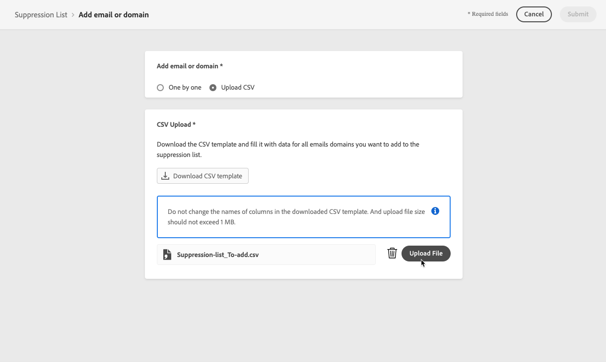

# Administrar la lista de supresión {#manage-suppression-list}

con [!DNL Journey Optimizer], puede supervisar todas las direcciones de correo electrónico que se excluyen automáticamente del envío de un recorrido, como:

* Direcciones que no son válidas (rechazos graves).
* Direcciones que devuelven mensajes de forma uniforme y que podrían afectar negativamente a la reputación del correo electrónico si continúa incluyéndolas en los envíos.
* Destinatarios que emiten una queja de correo no deseado de algún tipo contra uno de sus mensajes de correo electrónico.

Estas direcciones de correo electrónico se recopilan automáticamente en Journey Optimizer **lista de supresión**. Obtenga más información sobre el concepto de la lista de supresión y su uso en [esta sección](../messages/suppression-list.md).

## Acceso a la lista de supresión {#access-suppression-list}

Para acceder a la lista detallada de direcciones de correo electrónico excluidas, vaya a **[!UICONTROL Administration]** > **[!UICONTROL Channels]** > **[!UICONTROL Email configuration]** y seleccione **[!UICONTROL Suppression list]**.

>[!CAUTION]
>
>Los permisos para ver, exportar y administrar la lista de supresión están restringidos a [Administradores de recorrido](../administration/ootb-product-profiles.md#journey-administrator). Más información sobre la administración [!DNL Journey Optimizer] derechos de acceso de los usuarios en [esta sección](../administration/permissions-overview.md).


Los filtros están disponibles para ayudarle a navegar por la lista.


Puede filtrar por la variable **[!UICONTROL Suppression category]**, **[!UICONTROL Address type]** o **[!UICONTROL Reason]**. Seleccione las opciones que desee para cada criterio. Una vez seleccionados, puede borrar cada filtro o todos los filtros mostrados en la parte superior de la lista.


Si agrega manualmente una dirección de correo electrónico o un dominio por error, la variable **[!UICONTROL Delete]** permite eliminar esa entrada.

>[!CAUTION]
>
>No use nunca el **[!UICONTROL Delete]** para eliminar direcciones de correo electrónico o dominios suprimidos.


Al eliminar una dirección de correo electrónico o un dominio de la lista de supresión, se inicia de nuevo la entrega a esta dirección o dominio. Por lo tanto, esto puede tener un impacto grave en la capacidad de entrega y la reputación de la IP, lo que podría llegar a provocar que se bloqueara su dirección IP o dominio de envío. Obtenga más información sobre la importancia de mantener una lista de supresión en [esta sección](../messages/suppression-list.md).

>[!NOTE]
>
>Tenga especial cuidado al considerar la eliminación de cualquier dirección de correo electrónico o dominio. En caso de duda, póngase en contacto con un experto en capacidad de entrega.

En el **[!UICONTROL Suppression list]** , también puede editar las reglas de supresión. [Más información](retries.md)

Para exportar la lista de supresión como archivo CSV, seleccione la opción **[!UICONTROL Download CSV]** botón.


## Categorías y motivos de supresión {#suppression-categories-and-reasons}

Cuando un mensaje no se puede enviar a una dirección de correo electrónico, [!DNL Journey Optimizer] determina por qué se ha producido un error en la entrega y lo asocia con un **[!UICONTROL Suppression category]**.

Las categorías de supresión son las siguientes:

* **Grave**: La dirección de correo electrónico se envía inmediatamente a la lista de supresión.

   >[!NOTE]
   >
   >Cuando el error es el resultado de una queja por correo no deseado, también cae en el **Grave** categoría. La dirección de correo electrónico del destinatario que emitió la queja se envía inmediatamente a la lista de supresión.

* **Leve**: Los errores leves envían una dirección a la lista de supresión una vez que el contador de errores alcanza el umbral de límite. [Más información sobre los reintentos](retries.md)

* **Manual**: También puede añadir manualmente una dirección de correo electrónico o un dominio a la lista de supresión. [Más información](#add-addresses-and-domains)

>[!NOTE]
>
>Obtenga más información sobre los rechazos leves y los rechazos graves en la [Tipos de errores de entrega](../messages/suppression-list.md#delivery-failures) para obtener más información.

Para cada dirección de correo electrónico de la lista, también puede comprobar la variable **[!UICONTROL Type]** (correo electrónico o dominio), **[!UICONTROL Reason]** para excluirlo, quién lo agregó y la fecha y hora en que se agregó a la lista de supresión.


Los posibles motivos de un error de entrega son:

| Motivo | Descripción | Categoría de supresión |
| --- | --- | --- |
| **[!UICONTROL Invalid Recipient]** | El destinatario no es válido o no existe. | Grave |
| **[!UICONTROL Soft Bounce]** | El mensaje rebotó por un motivo distinto a los errores leves enumerados en esta tabla, como al enviar la velocidad permitida recomendada por un ISP. | Leve |
| **[!UICONTROL DNS Failure]** | El mensaje rebotó debido a un error de DNS. | Leve |
| **[!UICONTROL Mailbox Full]** | El mensaje rebotó debido a que el buzón del destinatario estaba lleno y no pudo aceptar más mensajes. | Leve |
| **[!UICONTROL Relaying Denied]** | El receptor bloqueó el mensaje porque no se permite el reenvío. | Leve |
| **[!UICONTROL Challenge-Response]** | El mensaje es una sonda de respuesta a desafíos. | Leve |
| **[!UICONTROL Spam Complaint]** | El mensaje se bloqueó porque el destinatario lo marcó como correo no deseado. | Grave |

>[!NOTE]
>
>Los usuarios cancelados de suscripción no reciben correos electrónicos de [!DNL Journey Optimizer], por lo tanto, sus direcciones de correo electrónico no se pueden enviar a la lista de supresión. Su elección se gestiona a nivel de Experience Platform. [Más información sobre la exclusión](../messages/consent.md)

## Adición manual de direcciones y dominios {#add-addresses-and-domains}

Cuando un mensaje no se puede enviar a una dirección de correo electrónico, esta dirección se agrega automáticamente a la lista de supresión en función de la regla de supresión definida o del recuento de devoluciones.

Sin embargo, también puede rellenar manualmente la variable [!DNL Journey Optimizer] lista de supresión para excluir de la entrega direcciones de correo electrónico o dominios específicos.

Puede añadir direcciones de correo electrónico o dominios [de una en una](#add-one-address-or-domain)o [en modo masivo](#upload-csv-file) mediante la carga de un archivo CSV.

Para ello, seleccione la **[!UICONTROL Add email or domain]** , siga uno de los métodos que se describen a continuación.


### Añadir una dirección o un dominio {#add-one-address-or-domain}

1. Seleccione la opción **[!UICONTROL One by one]**.

   

1. Elija el tipo de dirección: **[!UICONTROL Email address]** o **[!UICONTROL Domain address]**.

1. Introduzca la dirección de correo electrónico o el dominio que desea excluir de la entrega.

   >[!NOTE]
   >
   >Asegúrese de introducir una dirección de correo electrónico válida (como abc@company) o un dominio (como abc.company.com).

1. Especifique un motivo si es necesario.

1. Haga clic en **[!UICONTROL Submit]**.

### Cargar un archivo CSV {#upload-csv-file}

1. Seleccione la opción **[!UICONTROL Upload CSV]**.

   

1. Descargue la plantilla CSV para usar, que incluye las columnas y el formato siguiente:

   ```
   TYPE,VALUE,COMMENT
   EMAIL,abc@somedomain.com,Comment
   DOMAIN,somedomain.com,Comment
   ```
   También puede descargar esta plantilla desde el **[!UICONTROL Suppression list]** vista principal.

   >[!CAUTION]
   >
   >No cambie los nombres de las columnas en la plantilla CSV.
   >
   >El tamaño del archivo no debe superar los 1 MB.

1. Complete la plantilla CSV con las direcciones de correo electrónico o los dominios que desee agregar a la lista de supresión.

1. Una vez finalizado, arrastre y suelte el archivo CSV y, a continuación, haga clic en **[!UICONTROL Upload file]**.

   

1. Haga clic en **[!UICONTROL Submit]**.

### Comprobar el estado de las cargas recientes {#recent-uploads}

Puede comprobar la lista de los archivos CSV más recientes que ha cargado.

Para ello, en la sección **[!UICONTROL Suppression list]** haga clic en la **[!UICONTROL Recent uploads]** botón.


Se muestran las últimas cargas que ha enviado y sus estados correspondientes.

Si un informe de error está asociado con un archivo, puede descargarlo para comprobar los errores encontrados.


A continuación, se muestra un ejemplo del tipo de entradas que puede encontrar en el informe de error:

```
type,value,comments,failureReason
Email,examplemail.com,MANUAL,Invalid format for value: examplemail.com
Email,examplemail,MANUAL,Invalid format for value: examplemail
Email,example@mail,MANUAL,Invalid format for value: example@mail
Domain,example,MANUAL,Invalid format for value: example
Domain,example.!com,MANUAL,Invalid format for value: example.!com
Domain,!examplecom,MANUAL,Invalid format for value: !examplecom
```
