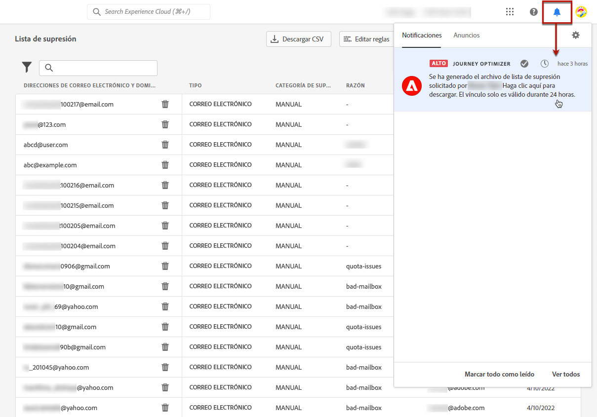

# Administrar la lista de supresión {#manage-suppression-list}

Con [!DNL Journey Optimizer], puede supervisar todas las direcciones de correo electrónico que se excluyen automáticamente del envío de un recorrido o una campaña, como rechazos graves, rechazos leves y quejas de correo no deseado.

Estas direcciones de correo electrónico se recopilan automáticamente en la **lista de supresión** de Journey Optimizer. Una lista de supresión consiste en direcciones y dominios que se excluirán de las audiencias. Recopila direcciones de correo electrónico y dominios que se suprimen en todos los correos en un solo entorno de cliente, lo que significa específico de un ID de organización asociado a un ID de zona protegida.

Obtenga más información acerca del concepto y uso de la lista de supresión en [esta sección](../reports/suppression-list.md).

>[!NOTE]
>
>Adobe mantiene una lista actualizada de direcciones incorrectas conocidas que han demostrado ser perjudiciales para la participación y la reputación de correo electrónico, y garantiza que no se les envíen correos electrónicos. Esta lista se administra en una lista de supresión global que es común para todos los clientes de Adobe. Las direcciones y los nombres de dominio contenidos en la lista de supresión global están ocultos. En los informes de envío solo se indica el número de destinatarios excluidos.

Además, puede aprovechar la API de REST de supresión **1 de Journey Optimizer para controlar los mensajes salientes mediante la supresión y las listas de permitidos.** [Obtenga información sobre cómo trabajar con la API de REST de supresión](https://developer.adobe.com/journey-optimizer-apis/references/suppression/){target="_blank"}

## Acceso a la lista de supresión {#access-suppression-list}

Para acceder a la lista detallada de dominios y direcciones de correo electrónico excluidos, vaya a **[!UICONTROL Administración]** > **[!UICONTROL Canales]** > **[!UICONTROL Configuración de correo electrónico]** y seleccione **[!UICONTROL Lista de supresión]**.


>[!CAUTION]
>
>Los permisos para ver, exportar y administrar la lista de supresión están restringidos a [Administradores de Recorrido](../administration/ootb-product-profiles.md#journey-administrator). Obtenga más información acerca de la administración de los derechos de acceso de los usuarios de [!DNL Journey Optimizer] en [esta sección](../administration/permissions-overview.md).


Hay filtros a su disposición para ayudarle a navegar por la lista.


Puede filtrar por la **[!UICONTROL categoría de supresión]**, **[!UICONTROL tipo de dirección]** o **[!UICONTROL Motivo]**. Seleccione una o varias opciones para cada criterio. Una vez seleccionados, puede borrar cada filtro o todos los filtros mostrados en la parte superior de la lista.


## Comprender las razones del error {#suppression-categories-and-reasons}

Cuando no se puede enviar un mensaje a una dirección de correo electrónico, [!DNL Journey Optimizer] determina el motivo del error de entrega y lo asocia con una **[!UICONTROL categoría de supresión]**.

Las categorías de supresión son las siguientes:

* **Grave**: Una devolución fuerte indica una dirección de correo electrónico no válida (es decir, una dirección de correo electrónico que no existe). Esto implica un mensaje de rechazo del servidor de correo electrónico receptor que indica explícitamente que la dirección no es válida. La dirección de correo electrónico se envía inmediatamente a la lista de supresión.

  Cuando el error es el resultado de una queja de correo no deseado, también cae en la categoría **Hard**. La dirección de correo electrónico del destinatario que emitió la queja se envía inmediatamente a la lista de supresión.

* **Soft**: una devolución suave es una devolución temporal de correo electrónico que se produjo para una dirección de correo electrónico válida. La dirección de correo electrónico se agrega a la lista de supresión después de varios reintentos. Los errores leves envían una dirección a la lista de supresión una vez que el contador de errores alcanza el umbral de límite. [Más información sobre los reintentos](retries.md)

* **Manual**: los errores manuales se han agregado manualmente a la lista de supresión. [Más información](#add-addresses-and-domains)

Por cada dirección de correo electrónico que aparezca en la lista, también puede comprobar el **[!UICONTROL Tipo]** (correo electrónico o dominio), **[!UICONTROL Motivo]** para excluirlo, quién lo agregó y la fecha/hora en que se agregó a la lista de supresión.

Los posibles motivos de un error de entrega son:

| Motivo | Descripción | Categoría |
| --- | --- | --- |
| **[!UICONTROL Destinatario no válido]** | El destinatario no es válido o no existe. | Grave |
| **[!UICONTROL Rebote suave]** | El mensaje rebotó suavemente por un motivo distinto a los errores leves enumerados en esta tabla, como al enviar a través de la tasa permitida recomendada por un ISP. | Leve |
| **[!UICONTROL Error de DNS]** | El mensaje se ha devuelto debido a un error de DNS. | Leve |
| **[!UICONTROL Buzón lleno]** | El mensaje se ha devuelto porque el buzón del destinatario está lleno y no puede aceptar más mensajes. | Leve |
| **[!UICONTROL Retransmisión denegada]** | El destinatario bloqueó el mensaje porque no se permite la retransmisión. | Leve |
| **[!UICONTROL Desafío-respuesta]** | El mensaje es un sondeo desafío-respuesta. | Leve |
| **[!UICONTROL Queja de spam]** | El mensaje se bloqueó porque el destinatario lo marcó como correo no deseado. | Grave |

>[!NOTE]
>
>Los usuarios que cancelaron la suscripción no reciben mensajes de correo electrónico de [!DNL Journey Optimizer], por lo que sus direcciones de correo electrónico no se pueden enviar a la lista de supresión. Su elección se gestiona en el nivel de Experience Platform. [Más información sobre la exclusión](../privacy/opt-out.md)


### Reglas de supresión  {#suppression-rules}

Desde la vista **[!UICONTROL Lista de supresión]**, también puede editar el parámetro de reintento asociado a las reglas de supresión desde el botón **[!UICONTROL Editar reglas de supresión]**. Utilice esta opción para actualizar el umbral de reintentos para la zona protegida actual. [Más información sobre los reintentos](retries.md).


## Añadir direcciones o dominios a la lista de supresión{#add-addresses-and-domains}

>[!CONTEXTUALHELP]
>id="ajo_admin_suppression_list_header"
>title="Añadir correos electrónicos o dominios a la lista de supresión"
>abstract="Puede rellenar manualmente la lista de supresión de Journey Optimizer para excluir de la entrega direcciones de correo electrónico o dominios específicos."

>[!CONTEXTUALHELP]
>id="ajo_admin_suppression_list"
>title="Añadir correos electrónicos o dominios a la lista de supresión"
>abstract="Para rellenar la lista de supresión, puede añadir manualmente direcciones de correo electrónico o dominios: uno a la vez o en modo masivo a través de una carga de archivo CSV. Estas direcciones de correo electrónico o dominios específicos se excluirán del envío."

Cuando no se puede enviar un mensaje a una dirección de correo electrónico, esta dirección se agrega automáticamente a la lista de supresión en función de la regla de supresión definida o el recuento de rechazos.

Sin embargo, también puede rellenar manualmente la lista de supresión [!DNL Journey Optimizer] para excluir direcciones de correo electrónico o dominios específicos de sus envíos.

>[!NOTE]
>
>[!DNL Journey Optimizer] puede tardar hasta 60 minutos en tener en cuenta las direcciones suprimidas de los correos electrónicos salientes.

Puede añadir direcciones de correo electrónico o dominios [de una en una](#add-one-address-or-domain) o [en modo masivo](#upload-csv-file) mediante la carga de un archivo CSV.

### Adición de una dirección o un dominio {#add-one-address-or-domain}

>[!CONTEXTUALHELP]
>id="ajo_admin_suppression_list_address"
>title="Añadir un elemento a la lista de supresión"
>abstract="Puede rellenar la lista de supresión añadiendo direcciones de correo electrónico o dominios uno a uno."

Para añadir una dirección de correo electrónico o un dominio a la lista de supresión, siga los pasos a continuación:

1. Seleccione el botón **[!UICONTROL Agregar correo electrónico o dominio]**.

   

1. Elija la opción **[!UICONTROL Uno por uno]**.

   

1. Seleccione el tipo de dirección: **[!UICONTROL Correo electrónico]** o **[!UICONTROL Dominio]**.

1. Introduzca la dirección de correo electrónico o el dominio que desea excluir del envío.

   >[!NOTE]
   >
   >Asegúrese de introducir una dirección de correo electrónico válida (como abc@compañía.com) o un dominio (como abc.compañía.com).

1. (opcional) Introduzca un motivo. Todos los caracteres imprimibles ASCII comprendidos entre 32 y 126 están permitidos en este campo.

1. Use el botón **[!UICONTROL Enviar]** para confirmar.

### Cargar un archivo CSV {#upload-csv-file}

>[!CONTEXTUALHELP]
>id="ajo_admin_suppression_list_csv"
>title="Cargar CSV para añadir elementos a la lista de supresión"
>abstract="Puede rellenar la lista de supresión cargando un archivo CSV rellenado con las direcciones de correo electrónico o los dominios que desea excluir."

Para añadir un grupo de direcciones de correo electrónico o un dominio a la lista de supresión, siga los pasos a continuación:

1. Seleccione el botón **[!UICONTROL Agregar correo electrónico o dominio]**.
1. Elija la opción **[!UICONTROL Cargar CSV]**.

   

1. Descargue la plantilla CSV que debe utilizar, que incluye las columnas y el formato que se indican a continuación:

   ```
   TYPE,VALUE,COMMENT
   EMAIL,abc@somedomain.com,Comment
   DOMAIN,somedomain.com,Comment
   ```

1. Rellene la plantilla CSV con las direcciones de correo electrónico o los dominios que desee añadir a la lista de supresión. Todos los caracteres ASCII imprimibles comprendidos entre 32 y 126 están permitidos en la columna **COMMENT**.

   >[!CAUTION]
   >
   >No cambie el nombre de las columnas en la plantilla CSV.
   >
   >El tamaño del archivo no debe superar 1 MB.
   >

1. Una vez finalizado, arrastre y suelte el archivo CSV y utilice el botón **[!UICONTROL Enviar]** para confirmar.

   

Una vez que finalice la carga, puede comprobar su estado desde el botón [Cargas recientes](#recent-uploads), como se detalla a continuación.

### Comprobar estado de cargas {#recent-uploads}

Use el botón **[!UICONTROL Cargas recientes]** para comprobar el estado de los archivos CSV cargados más recientes.


Los estados posibles son:

* **[!UICONTROL Pendiente]**: se está procesando la carga de archivo.
* **[!UICONTROL Error]**: error en el proceso de carga del archivo debido a un problema técnico o a un error de formato de archivo.
* **[!UICONTROL Completado]**: el proceso de carga de archivos se ha completado correctamente.

Durante la carga, si algunas direcciones no tienen el formato correcto, no se agregan a la lista de supresión [!DNL Journey Optimizer].

En ese caso, cuando se completa la carga, se asocia a un informe. Puede descargarlo para comprobar los errores encontrados<!-- and understand why they were not added to the suppression list-->.


A continuación se muestra un ejemplo del tipo de entradas que se pueden encontrar en el informe de errores:

```
type,value,comments,failureReason
Email,examplemail.com,MANUAL,Invalid format for value: examplemail.com
Email,examplemail,MANUAL,Invalid format for value: examplemail
Email,example@mail,MANUAL,Invalid format for value: example@mail
Domain,example,MANUAL,Invalid format for value: example
Domain,example.!com,MANUAL,Invalid format for value: example.!com
Domain,!examplecom,MANUAL,Invalid format for value: !examplecom
```

## Quitar una dirección de la lista de supresión {#remove-from-suppression-list}

Puede actualizar manualmente la lista de supresión. La eliminación de una dirección de correo electrónico de la cuarentena es una operación delicada que puede afectar a la reputación de su IP y a las tasas de envío. Asegúrese de proceder con precaución.

Al eliminar una dirección de correo electrónico o un dominio de la lista de supresión, Adobe Journey Optimizer puede empezar a realizar entregas de nuevo en esta dirección o dominio.  Obtenga más información acerca de la capacidad de entrega en [esta sección](../reports/deliverability.md).

Para quitar una dirección de la lista de supresión, usa el botón **[!UICONTROL Eliminar]**.


>[!NOTE]
>
>Proceda con mucho cuidado cuando considere la posibilidad de eliminar cualquier dirección de correo electrónico o dominio. En caso de duda, póngase en contacto con un experto en capacidad de entrega.

Por ejemplo, en el caso de una interrupción del proveedor de servicios de Internet (ISP), los correos electrónicos se marcan erróneamente como rechazos graves porque no se pueden enviar correctamente a su destinatario. Estas direcciones de correo electrónico deben eliminarse de la lista de supresión.

Para recuperar esas direcciones, ejecute una consulta específica con parámetros personalizados, según el contexto de la interrupción. [Obtenga más información en este ejemplo](../data/datasets-query-examples.md#isp-outage-query).

Una vez identificadas las direcciones de correo electrónico afectadas, filtre la lista de supresión para mostrarlas. Por ejemplo, si se produjo una interrupción del ISP del 11 de noviembre de 2022 al 13 de noviembre de 2022 en el dominio **test.com**, filtre las direcciones agregadas a la lista de supresión en ese periodo de tiempo, como se muestra a continuación:

A continuación, puede eliminar las direcciones de correo electrónico en cuarentena de la lista de supresión mediante el botón **[!UICONTROL Eliminar]**.

## Descarga de la lista de supresión {#download-suppression-list}

<!--
>[!CONTEXTUALHELP]
>id="ajo_admin_suppression_list_download"
>title="Export the list as a CSV file"
>abstract="To download the suppression list, Qou can either export the current list by generating a new file, or download the file that was previously generated."
-->

Para exportar la lista de supresión como archivo CSV, siga los pasos a continuación:

1. Seleccione el botón **[!UICONTROL Descargar CSV]**.

   

1. Espere hasta que se genere el archivo.

   >[!NOTE]
   >
   >El tiempo de descarga depende del tamaño del archivo, es decir, del número de direcciones que se encuentran en la lista de supresión.
   >
   >Se puede procesar una solicitud de descarga a la vez para una zona protegida determinada.

1. Una vez generado el archivo, recibirá una notificación. Haga clic en el icono de campana en la parte superior derecha de la pantalla para mostrarlo.

1. Haga clic en la propia notificación para descargar el archivo.

   

   >[!NOTE]
   >
   >El vínculo es válido durante 24 horas.

<!--When downloading the CSV file, you can choose to either:

* Download the file that was previously generated by another user or yourself.

* Generate a new file in order to export the current suppression list.-->

