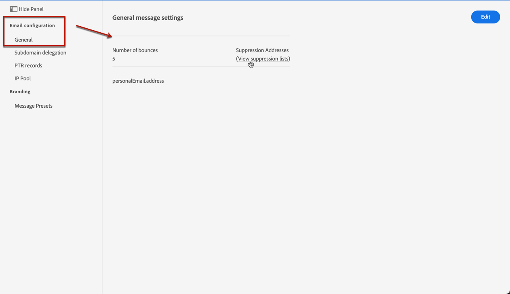

# Administrar la lista de supresión {#manage-suppression-list}

Con [!DNL Journey Optimizer], puede supervisar todas las direcciones de correo electrónico que se excluyen automáticamente del envío en un recorrido, como:

* Direcciones que no son válidas (devoluciones duras) o que se devuelven de forma flexible de forma coherente, y que podrían afectar negativamente a su reputación de correo electrónico si continúa incluyéndolas en sus entregas.
* Destinatarios que emiten una queja de correo no deseado de algún tipo contra uno de sus mensajes de correo electrónico.

<!--Profiles who unsubscribe from your sendings. Learn more on [opting-out](../consent.md). NOT TRUE as confirmed by eng.: "Subscribe and Unsubscribe are handled by the Consent/Subscription service. A user that opts out will not make it to the suppression list – we won’t send them emails."-->

Estas direcciones de correo electrónico se recopilan automáticamente en la **lista de supresión** de Journey Optimizer. Obtenga más información en [esta sección](../suppression-list.md).

## Acceso a la lista de supresión {#access-suppression-list}

Para acceder a la lista detallada de direcciones de correo electrónico excluidas, abra el menú **[!UICONTROL Channels]** > **[!UICONTROL Email configuration]** > **[!UICONTROL General]** y haga clic en el enlace **[!UICONTROL View suppression lists]**.

Los filtros están disponibles para ayudarle a navegar por la lista.

<!--suppression date,  category and reason, but on staging, only creation date filter is available-->

<!--You can also download the list as a CSV file for analysis and reporting purpose. Won't be available.-->

## Categorías y motivos de supresión {#suppression-categories-and-reasons}

Cuando un mensaje no se puede enviar a una dirección de correo electrónico, Journey Optimizer determina por qué se ha producido un error en la entrega y lo asocia a una categoría de supresión.

Las categorías de supresión son las siguientes:

* **Grave**: La dirección de correo electrónico se envía inmediatamente a la lista de supresión.

* **Leve**: Los errores leves envían una dirección a la lista de supresión una vez que el contador de errores alcanza el umbral de límite. [Más información sobre los reintentos](retries.md)

* **Ignorado**:
   * Cuando el error se produjo para una dirección de correo electrónico válida pero se sabe que es temporal, como un intento de conexión fallido o un problema técnico temporal, la dirección de correo electrónico se agrega a la lista de supresión una vez que el contador de errores alcanza el umbral límite. [Obtenga más información sobre los reintentos](retries.md).
   * Cuando el error es el resultado de una queja por correo no deseado, la dirección de correo electrónico del destinatario que emitió la queja se envía inmediatamente a la lista de supresión.

<!--**Manual**: You can also manually add an email address to the suppression list. => Manual category will be available when manually adding an address to the suppression list (via API)-->

>[!NOTE]
>
>Obtenga más información sobre los rechazos leves y los rechazos graves en la sección [Tipos de errores de envío](../suppression-list.md#delivery-failures).

Para cada dirección de correo electrónico de la lista, también puede comprobar la **[!UICONTROL Reason]** para excluirla y la fecha y hora en que se agregó a la lista de supresión.

<!--to replace with suppression-list.png when Manual category is available (through API)-->

Los posibles motivos de un error de entrega son:

| Motivo | Descripción | Categoría de supresión |
---------|----------|--------- |
| **[!UICONTROL Undetermined]** | No se pudo identificar el motivo de rechazo recibido del dominio destinatario Agente de transferencia de mensajes (MTA). | Ignorado |
| **[!UICONTROL Invalid Recipient]** | El destinatario no es válido o no existe. | Grave |
| **[!UICONTROL Soft Bounce]** | El mensaje rebotó por un motivo distinto a los errores leves enumerados en esta tabla, como al enviar la velocidad permitida recomendada por un ISP. | Leve |
| **[!UICONTROL DNS Failure]** | El mensaje rebotó debido a un error de DNS. | Leve |
| **[!UICONTROL Mailbox Full]** | El mensaje rebotó debido a que el buzón del destinatario estaba lleno y no pudo aceptar más mensajes. | Leve |
| **[!UICONTROL Too Large]** | El mensaje rebotó porque era demasiado grande para el destinatario.  Se realizarán reintentos: puede editar el tamaño del mensaje y volver a inyectarlo para su envío. | Ignorado |
| **[!UICONTROL Timeout]** | Se agotó el tiempo de espera del mensaje, lo que significa que se rebotó de forma suave y alcanzó el límite de reintentos del mensaje (3,5 días). | Ignorado |
| **[!UICONTROL Admin Failure]** | El mensaje falló según las directivas configuradas por el administrador del sistema de envío. <!--For example, if emails are blackholed at the global, domain or binding level using the "blackhole" directive, this bounce code is used.--> | Ignorado |
| **[!UICONTROL Generic Bounce: No RCPT]** | No se pudo determinar ningún destinatario para el mensaje. | Ignorado |
| **[!UICONTROL Generic Bounce]** | El mensaje falló por motivos no especificados. | Ignorado |
| **[!UICONTROL Mail Block]** | El mensaje fue bloqueado por el receptor (es decir, el MTA del destinatario). | Ignorado |
| **[!UICONTROL Spam Block]** | El destinatario bloqueó el mensaje por provenir de una fuente de correo no deseado conocida. Podría ser un bloque IP de envío, por ejemplo. | Ignorado |
| **[!UICONTROL Spam Content]** | El contenido del mensaje fue bloqueado por el receptor (MTA del destinatario) como correo no deseado. | Ignorado |
| **[!UICONTROL Prohibited Attachment]** | El destinatario bloqueó el mensaje porque contenía un archivo adjunto. | Ignorado |
| **[!UICONTROL Relaying Denied]** | El receptor bloqueó el mensaje porque no se permite el reenvío. | Leve |
| **[!UICONTROL Auto-Reply]** | El mensaje es un correo de respuesta automática/de vacaciones. | Ignorado |
| **[!UICONTROL Transient Failure]** | La transmisión del mensaje se ha retrasado temporalmente. | Ignorado |
| **[!UICONTROL Challenge-Response]** | El mensaje es una sonda de respuesta a desafíos. | Leve |

>[!NOTE]
>
>Los usuarios cancelados de suscripción no reciben correos electrónicos de [!DNL Journey Optimizer], por lo que sus direcciones de correo electrónico no se pueden enviar a la lista de supresión. Su elección se gestiona a nivel de Experience Platform. Obtenga más información sobre [exclusión](../consent.md).

<!--
Removed from the table provided by SparkPost/Momentum:
| **[!UICONTROL Subscribe]** | The message is a subscribe request. | Ignored |
| **[!UICONTROL Unsubscribe]** | The message is an unsubscribe request. | Hard |
-->

<!--Note to add eventually: If a user is subscribed and [!DNL Journey Optimizer] fails to send emails to their subscribed email address, they will get added to the suppression list. (not sure it's possible to subscribe through AJO or need to find reference to Experience Platform doc?)-->

