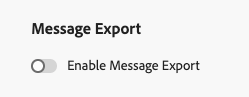

# Exportación del contenido del mensaje {#message-export}

>[!CONTEXTUALHELP]
>id="ajo_admin_msg_export"
>title="Conservar y exportar el contenido enviado"
>abstract="Al seleccionar esta opción, puede escribir el contenido de los mensajes de correo electrónico o SMS enviados mediante esta configuración en un conjunto de datos de [!DNL Experience Platform]. Los registros se conservan durante 3 días naturales, durante los cuales puede exportarlos a su propio almacenamiento."

>[!AVAILABILITY]
>
>Actualmente, esta función solo está disponible para un conjunto de organizaciones (disponibilidad limitada). Para obtener más información, contacte con su representante de Adobe.

**Message Export** le permite transferir el contenido de mensajes SMS y de correo electrónico enviados desde [!DNL Journey Optimizer] a su propio almacenamiento a través de [!DNL Adobe Experience Platform] destinos, lo que permite enviar datos de [!DNL Experience Platform] a extremos externos. [Más información](https://experienceleague.adobe.com/es/docs/experience-platform/destinations/home){target="_blank"}

Con esta función, el contenido de los mensajes de correo electrónico y SMS enviados a través de [!DNL Journey Optimizer] que se han marcado para la exportación se escribe en el [!DNL Experience Platform] **conjunto de datos de exportación de mensajes de AJO**.

Los registros se conservan en el **conjunto de datos de exportación de mensajes de AJO** durante tres días naturales, durante los cuales puede exportarlos al sistema externo que elija.
<!--
## Terminology

* **[!DNL Experience Platform] destinations** - Framework to deliver data out of Experience Platform into external endpoints. [Learn more](https://experienceleague.adobe.com/en/docs/experience-platform/destinations/home){target="_blank"}
* **AJO Message Export Dataset** - An [!DNL Experience Platform] dataset which stores the message content of email and SMS messages sent via [!DNL Journey Optimizer] which have been marked for export.
* **Retention**: Records in the AJO Message Export Dataset are retained for 3 calendar days from ingestion.-->

## Mecanismos de protección

* Esta función solo admite los canales de correo electrónico y SMS.
* Los registros del conjunto de datos de exportación de mensajes de AJO se conservan durante tres días naturales a partir de la ingesta.
* El relleno no es compatible con los mensajes enviados antes de habilitar la exportación de mensajes como se describe a continuación.

## Habilitar exportación de mensajes {#enable-message-export}

El proceso de incorporación de la función Exportación de mensajes consta de dos pasos:

1. [Configurar el flujo de datos de exportación](#set-up-export-dataflow) en [!DNL Experience Platform];
1. [Habilitar exportación de mensajes](#config-message-export) en la configuración de canal de [!DNL Journey Optimizer].

>[!WARNING]
>
>Solo aparecen los registros nuevos después de habilitar las exportaciones y enviar mensajes. No se admiten rellenos para el contenido antes de configurar el proceso de exportación y habilitar la opción Exportar mensaje.

### Configuración del flujo de datos de exportación {#set-up-export-dataflow}

Antes de poder exportar los datos, debe configurar el proceso de exportación definiendo el destino [!DNL Experience Platform] y el conjunto de datos que se utilizará. Siga los pasos a continuación.

>[!NOTE]
>
>Esta configuración debe configurarse para cada zona protegida.

1. Elija un Experience Platform [tipo de destino](https://experienceleague.adobe.com/en/docs/experience-platform/destinations/destination-types){target="_blank"}. Hay disponible una lista de plataformas de destino disponibles que están listas para recibir datos en [esta página](https://experienceleague.adobe.com/en/docs/experience-platform/destinations/catalog/overview){target="_blank"}.

1. En [!DNL Experience Platform], configure el destino definiendo credenciales, contenedor/contenedor, prefijo de ruta y opciones de seguridad. [Descubra cómo](https://experienceleague.adobe.com/en/docs/experience-platform/destinations/ui/activate/export-datasets){target="_blank"}

1. Cree un flujo de exportación de conjunto de datos con los siguientes datos:

   * Conjunto de datos Source: seleccione **Conjunto de datos de exportación de mensajes AJO**.
   * Formato del archivo: seleccione JSON o Parquet (elija uno basado en las herramientas de flujo descendente).
   * Programación: asegúrese de que se ejecuta dentro del período de retención de 3 días.

### Habilitar la exportación de mensajes en la configuración de canal {#config-message-export}

Para aplicar Message Export a sus campañas y recorridos, debe habilitar la opción específica en el nivel de configuración del canal. Siga los pasos a continuación.

1. En [!DNL Journey Optimizer], edite o cree el correo electrónico o SMS [configuración de canal](channel-surfaces.md#create-channel-surface) deseado.

1. Seleccione la opción **[!UICONTROL Habilitar exportación de mensajes]**.

   

1. Guarde los cambios y envíe la configuración de canal.

Los mensajes de correo electrónico y SMS enviados a través de campañas o recorridos usando esta configuración de canal se escriben en el **conjunto de datos de exportación de mensajes de AJO**. Los registros se exportan al destino de almacenamiento seleccionado en función del flujo de datos de exportación definido.

Al deshabilitar la opción **[!UICONTROL Habilitar exportación de mensajes]**, se detienen los nuevos registros para que esta configuración de canal no se ingrese en el conjunto de datos. Los registros existentes se conservarán hasta que caduque la retención.
