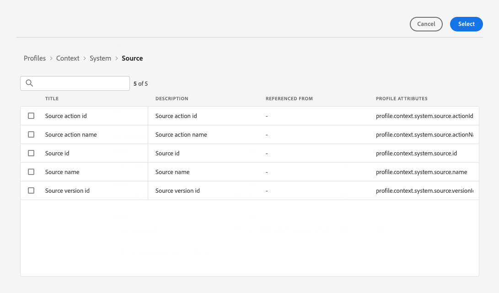

# Crear ajustes preestablecidos de mensaje {#message-presets-creation}

con [!DNL Journey Optimizer], puede configurar ajustes preestablecidos de mensajes que definan todos los parámetros técnicos necesarios para el mensaje de correo electrónico y los mensajes de notificaciones push: tipo de correo electrónico, correo electrónico y nombre del remitente, aplicaciones móviles, etc.

>[!CAUTION]
>
> * La configuración de los ajustes preestablecidos de mensaje está restringida a los administradores de Recorrido. [Más información](../administration/ootb-product-profiles.md#journey-administrator)
>
> * Debe realizar la configuración de correo electrónico y [Configuración push](../messages/push-configuration.md) pasos antes de crear ajustes preestablecidos de mensaje.

Una vez configurados los ajustes preestablecidos de mensaje, puede seleccionarlos al crear mensajes desde el **[!UICONTROL Presets]** lista.

➡️ [Aprenda a crear y utilizar ajustes preestablecidos de correo electrónico en este vídeo](#video-presets)

## Crear un ajuste preestablecido de mensaje {#create-message-preset}

Para crear un ajuste preestablecido de mensaje, siga estos pasos:

1. Acceda a la **[!UICONTROL Channels]** > **[!UICONTROL Branding]** > **[!UICONTROL Message presets]** a continuación, haga clic en **[!UICONTROL Create Message preset]**.

   

1. Introduzca un nombre y una descripción (opcional) para el ajuste preestablecido y, a continuación, seleccione los canales que desea configurar.

   

   >[!NOTE]
   >
   > Los nombres deben comenzar por una letra (A-Z). Solo puede contener caracteres alfanuméricos. También puede utilizar guiones bajos `_`, punto`.` Guión `-` caracteres.

1. Configure las variables **email** configuración. [Más información](#configure-email-settings)

1. Configure las variables **notificación push** configuración. [Más información](#configure-push-settings)

   <!--Configure SMS settings. [Learn more](#configure-sms-settings) -->

1. Una vez configurados todos los parámetros, haga clic en **[!UICONTROL Submit]** para confirmar. También puede guardar el ajuste preestablecido de mensaje como borrador y reanudar su configuración más adelante.

   

1. Una vez creado el ajuste preestablecido de mensaje, se muestra en la lista con la variable **[!UICONTROL Processing]** estado.

   Durante este paso, se realizarán varias comprobaciones para verificar que se ha configurado correctamente. El tiempo de procesamiento ronda **48 h-72 h** y puede tardar hasta **7 a 10 días hábiles**.

   Estas comprobaciones incluyen las pruebas técnicas y de configuración que realiza el equipo de Adobe:

   * Validación de SPF
   * Validación de DKIM
   * Validación de registros MX
   * Comprobación de IP inclusión en la lista de bloqueados
   * Comprobación de host de Helo
   * Verificación del grupo IP
   * Registro A/PTR, verificación del subdominio t/m/res

   >[!NOTE]
   >
   >Si las comprobaciones no son correctas, obtenga más información sobre los posibles motivos de error en [esta sección](#monitor-message-presets).

1. Una vez realizadas las comprobaciones correctamente, el ajuste preestablecido de mensaje obtiene el valor **[!UICONTROL Active]** estado. Está listo para utilizarse para enviar mensajes.

   

## Configuración de correo electrónico {#configure-email-settings}

La configuración del correo electrónico se define en una sección dedicada de la configuración del ajuste preestablecido de mensaje.

Configure los ajustes tal como se describe a continuación.

### Tipo de correo electrónico{#email-type}

En el **TIPO DE CORREO ELECTRÓNICO** , seleccione el tipo de mensaje que se enviará con el ajuste preestablecido: **Marketing** o **Transaccional**.

Choose **Marketing** para mensajes promocionales: estos mensajes requieren el consentimiento del usuario.

Choose **Transaccional** para mensajes no comerciales, como confirmación de pedido, notificaciones de restablecimiento de contraseña o información de entrega, por ejemplo.

>[!CAUTION]
>
>**Transaccional** se pueden enviar mensajes a perfiles que cancelen la suscripción a comunicaciones de marketing. Estos mensajes solo se pueden enviar en contextos específicos.

### Subdominio y grupo de IP {#subdomains-and-ip-pools}

En el **DETALLES DEL GRUPO DE IP Y SUBDOMINIOS** , debe:

1. Seleccione el subdominio que desea utilizar para enviar los correos electrónicos. [Más información](about-subdomain-delegation.md)

1. Seleccione el grupo de IP que desea asociar al ajuste preestablecido. [Más información](ip-pools.md)

### Seguimiento de URL{#url-tracking}

Para identificar dónde y por qué una persona hizo clic en el vínculo, puede agregar parámetros de UTM para el seguimiento de URL en la variable  **[!UICONTROL URL TRACKING CONFIGURATION (web analytics)]** para obtener más información.

Según los parámetros que defina, se aplicará un código UTM al final de la URL incluida en el contenido del mensaje. A continuación, podrá comparar los resultados en una herramienta de análisis web, como Adobe Analytics. <!--For example: https://yourwebsite.com/?utm_source=Adobe_CJM&utm_medium=email&utm_campaign=cart_abandonment_journey... In this example, the UTM code identifies the link as an email from an abandonment cart journey. You can either select a journey/message attribute from a predefined list, or enter your own text.-->

Hay tres parámetros de UTM disponibles de forma predeterminada. Puede agregar hasta 10 parámetros de seguimiento. Para añadir un parámetro de UTM, seleccione la opción **[!UICONTROL Add new UTM param]** botón.

Para configurar un parámetro de UTM, puede introducir directamente los valores deseados en la variable **[!UICONTROL Name]** y **[!UICONTROL Value]** o elija entre una lista de valores predefinidos navegando a los siguientes objetos:

* Atributos de recorrido: ID de origen, nombre de origen, id de versión de origen
* Atributos del mensaje: ID de acción, Nombre de acción
* Atributos de offer decisioning: ID de oferta, nombre de oferta

>[!CAUTION]
>
>No seleccione una carpeta: asegúrese de buscar la carpeta necesaria y seleccionar un atributo de perfil para utilizarlo como valor de UTM.

### Parámetros de encabezado{#email-header}

En el **[!UICONTROL HEADER PARAMETERS]** , introduzca las direcciones de correo electrónico asociadas a los mensajes enviados mediante ese ajuste preestablecido. Estas direcciones de correo electrónico deben utilizar la selección actual [subdominio delegado](about-subdomain-delegation.md).

Debe configurar las siguientes direcciones de correo electrónico

* **[!UICONTROL Sender name]**: El nombre del remitente, como el nombre de su marca.

* **[!UICONTROL Sender email]**: La dirección de correo electrónico que desea utilizar para sus comunicaciones. Por ejemplo, si el subdominio delegado es *marketing.luma.com*, puede usar *contact@marketing.luma.com*.

* **[!UICONTROL Reply to (name)]**: El nombre que se utilizará cuando el destinatario haga clic en la variable **Responder** en el software cliente de correo electrónico.

* **[!UICONTROL Reply to (email)]**: La dirección de correo electrónico que se utilizará cuando el destinatario haga clic en el **Responder** en el software cliente de correo electrónico. Debe utilizar una dirección definida en el subdominio delegado (por ejemplo, *reply@marketing.luma.com*), de lo contrario, se enviarán los correos electrónicos.

* **[!UICONTROL Error email]**: Todos los errores generados por los ISP después de unos días de envío del correo (devoluciones asincrónicas) se reciben en esta dirección.

>[!NOTE]
>
>Las direcciones deben comenzar por una letra (A-Z) y solo pueden contener caracteres alfanuméricos. También puede utilizar guiones bajos `_`, punto`.` Guión `-` caracteres.

### Parámetros de reintentos de correo electrónico{#email-retry}

Puede configurar la variable **Parámetros de reintentos de correo electrónico**.

De forma predeterminada, la variable [periodo de tiempo de reintento](retries.md#retry-duration) está configurada a 84 horas, pero puede ajustar esta configuración para adaptarla mejor a sus necesidades.

Debe introducir un valor entero (en horas o minutos) dentro del siguiente intervalo:

* En los correos electrónicos de marketing, el periodo de reintento mínimo es de 6 horas.
* Para los correos electrónicos transaccionales, el periodo mínimo de reintentos es de 10 minutos.
* Para ambos tipos de correo electrónico, el periodo de reintento máximo es de 84 horas (o 5040 minutos).

## Configuración de push {#configure-push-settings}

Los ajustes push se definen en una sección dedicada de la configuración preestablecida de mensajes.

Para definir la configuración de push asociada al ajuste preestablecido de mensaje, siga los pasos a continuación:

1. Seleccione al menos una plataforma: **iOS** y/o **Android**.

1. Seleccione las aplicaciones móviles que desea utilizar para cada plataforma.

Para obtener más información sobre cómo configurar el entorno para enviar notificaciones push, consulte [esta sección](../messages/push-gs.md).

<!--
## Configure SMS settings {#configure-sms-settings}

1. Select the **[!UICONTROL SMS Type]** that will be sent with the preset: **[!UICONTROL Transactional]** or **[!UICONTROL Marketing]**.

    
    
1. Select the **[!UICONTROL SMS configuration]** to associate with the preset.
        
    For more on how to configure your environment to send SMS messages, refer to [this section](sms-configuration.md).

1. Enter the **[!UICONTROL Sender number]** ​you want to use for your communications.
-->

## Monitorización de mensajes preestablecidos {#monitor-message-presets}

Todos los ajustes preestablecidos de mensajes se muestran en la **[!UICONTROL Channels]** > **[!UICONTROL Message presets]** para abrir el Navegador. Los filtros están disponibles para ayudarle a navegar por la lista (tipo de canal, usuario, estado).

Una vez creados, los ajustes preestablecidos de mensaje pueden tener los siguientes estados:

* **[!UICONTROL Draft]**: El ajuste preestablecido de mensaje se ha guardado como borrador y aún no se ha enviado. Ábrala para reanudar la configuración.
* **[!UICONTROL Processing]**: El ajuste preestablecido de mensaje se ha enviado y se está realizando en varios pasos de verificación.
* **[!UICONTROL Active]**: El ajuste preestablecido de mensaje se ha verificado y se puede seleccionar para crear mensajes.
* **[!UICONTROL Failed]**: Se han producido errores en una o varias comprobaciones durante la verificación del ajuste preestablecido de mensaje.
* **[!UICONTROL Deactivated]**: El ajuste preestablecido de mensaje está desactivado. No se puede usar para crear nuevos mensajes.

En caso de que falle la creación de un ajuste preestablecido de mensaje, a continuación se describen los detalles de cada posible motivo de error.

Si se produce uno de estos errores, póngase en contacto con [Servicio de atención al cliente de Adobe](https://helpx.adobe.com/es/enterprise/admin-guide.html/enterprise/using/support-for-experience-cloud.ug.html){target=&quot;_blank&quot;} para obtener ayuda.

* **Error de validación de SPF**: SPF (Marco de Política del Remitente) es un protocolo de autenticación por correo electrónico que permite especificar direcciones IP autorizadas que pueden enviar correos electrónicos desde un subdominio determinado. El error de validación de SPF significa que las direcciones IP del registro de SPF no coinciden con las direcciones IP utilizadas para enviar correos electrónicos a los proveedores de buzones de correo.

* **Error de validación de DKIM**: DKIM (DomainKeys Identified Mail) permite al servidor destinatario verificar que el mensaje recibido fue enviado por el remitente original del dominio asociado y que el contenido del mensaje original no se alteró en el camino. El error de validación de DKIM significa que los servidores de correo receptores no pueden verificar la autenticidad del contenido del mensaje y su asociación con el dominio de envío.:

* **Error en la validación del registro MX**: El error de validación del registro MX (Mail eXchange) significa que los servidores de correo responsables de aceptar correos electrónicos entrantes en nombre de un subdominio determinado no están correctamente configurados.

* **Error en las configuraciones de entrega**: El error en las configuraciones de capacidad de envío puede deberse a cualquiera de los siguientes motivos:
   * Inclusión en la lista de bloqueados de las IP asignadas
   * No válido `helo` name
   * Correos electrónicos que se envían desde direcciones IP distintas de las especificadas en el grupo IP del ajuste preestablecido correspondiente
   * No se pueden enviar correos electrónicos a las bandejas de entrada de los principales ISP, como Gmail y Yahoo

## Editar un ajuste preestablecido de mensaje {#edit-message-preset}

Para editar un ajuste preestablecido de mensaje, siga los pasos a continuación.

>[!NOTE]
>
>No se puede editar la variable **[!UICONTROL Push notification settings]**. Si un ajuste preestablecido de mensaje solo está configurado para el canal de notificaciones push, no se puede editar.

1. En la lista, haga clic en un nombre de ajuste preestablecido de mensaje para abrirlo.

   

1. Edite sus propiedades como desee.

   >[!NOTE]
   >
   >Si un ajuste preestablecido de mensaje tiene la variable **[!UICONTROL Active]** estado, la variable **[!UICONTROL Name]**, **[!UICONTROL Select channel]** y **[!UICONTROL Subdomain]** los campos aparecen atenuados y no se pueden editar.

1. Haga clic en **[!UICONTROL Submit]** para confirmar los cambios.

   

   >[!NOTE]
   >
   >También puede guardar el ajuste preestablecido de mensaje como borrador y reanudar la actualización más adelante.

Una vez enviados los cambios, el ajuste preestablecido de mensaje atravesará un ciclo de validación similar al que se haya aplicado cuando [creación de un ajuste preestablecido](#create-message-preset).

>[!NOTE]
>
>Si solo edita la variable **[!UICONTROL Description]**, **[!UICONTROL Email type]** y/o **[!UICONTROL Email retry parameters]** , la actualización es instantánea.

Para los mensajes preestablecidos que tienen la variable **[!UICONTROL Active]** , puede comprobar los detalles de la actualización. Para ello:

* Haga clic en el **[!UICONTROL Recent update]** que se muestra junto al nombre del ajuste preestablecido activo.

   

* También puede acceder a los detalles de la actualización desde un ajuste preestablecido de mensaje activo mientras la actualización está en curso.

   

En el **[!UICONTROL Recent update]** , puede ver información como el estado de actualización y la lista de cambios solicitados.

### Actualizar estados {#update-statuses}

Una actualización de ajustes preestablecidos de mensajes puede tener los siguientes estados:

* **[!UICONTROL Processing]**: Se ha enviado la actualización del ajuste preestablecido de mensajes, que está pasando por varios pasos de verificación.
* **[!UICONTROL Success]**: El ajuste preestablecido de mensaje actualizado se ha verificado y se puede seleccionar para crear mensajes.
* **[!UICONTROL Failed]**: Se han producido errores en una o varias comprobaciones durante la verificación de la actualización del ajuste preestablecido de mensajes.

Cada estado se detalla a continuación.

### Procesamiento

Se realizarán varias comprobaciones de la capacidad de envío para verificar que el ajuste preestablecido se haya actualizado correctamente.

>[!NOTE]
>
>Si solo edita la variable **[!UICONTROL Description]**, **[!UICONTROL Email type]** y/o **[!UICONTROL Email retry parameters]** , la actualización es instantánea.

El tiempo de procesamiento ronda **48 h-72 h** y puede tardar hasta **7 a 10 días hábiles**. Obtenga más información sobre las comprobaciones realizadas durante el ciclo de validación en [esta sección](#create-message-preset).

Si edita un ajuste preestablecido que ya estaba activo:

* Su estatus sigue siendo **[!UICONTROL Active]** mientras el proceso de validación esté en curso.

* La variable **[!UICONTROL Recent update]** aparece junto al nombre del ajuste preestablecido en la lista de ajustes preestablecidos de mensajes.

* Durante el proceso de validación, los mensajes configurados con este ajuste preestablecido siguen utilizando la versión anterior del ajuste preestablecido.

>[!NOTE]
>
>No se puede modificar un mensaje preestablecido mientras la actualización está en curso. Puede seguir haciendo clic en su nombre, pero todos los campos están atenuados. Los cambios no se reflejarán hasta que la actualización se realice correctamente.

### Correcto {#success}

Una vez que el proceso de validación se ha realizado correctamente, la nueva versión del ajuste preestablecido se utilizará automáticamente en todos los mensajes que utilicen este ajuste preestablecido. Sin embargo, es posible que tenga que esperar:
* unos minutos antes de que los mensajes unitarios lo consuman,
* hasta el siguiente lote para que el ajuste preestablecido sea efectivo en los mensajes por lotes.

### Fallido {#failed}

Si el proceso de validación falla, se utilizará la versión anterior del ajuste preestablecido.

Obtenga más información sobre los posibles motivos de error en [esta sección](#monitor-message-presets).

Cuando falla la actualización, el ajuste preestablecido se vuelve editable de nuevo. Puede hacer clic en su nombre y actualizar la configuración que debe corregirse.

## Desactivar un ajuste preestablecido de mensaje {#deactivate-preset}

Para hacer un **[!UICONTROL Active]** mensaje preestablecido no disponible para crear nuevos mensajes, puede desactivarlo. Sin embargo, los mensajes publicados con este ajuste preestablecido no se verán afectados y seguirán funcionando.

>[!NOTE]
>
>No se puede desactivar un ajuste preestablecido de mensaje mientras se está procesando una actualización. Debe esperar hasta que la actualización se realice correctamente o haya fallado. Más información sobre [editar ajustes preestablecidos de mensajes](#edit-message-preset) y [estados de actualización](#update-statuses).

1. Acceda a la lista de ajustes preestablecidos de mensajes.

1. Para el ajuste preestablecido activo de su elección, haga clic en el botón **[!UICONTROL More actions]** botón.

1. Seleccione **[!UICONTROL Deactivate]**.

   

>[!NOTE]
>
>Los ajustes preestablecidos de mensajes desactivados no se pueden eliminar para evitar problemas en los recorridos que utilizan estos ajustes preestablecidos para enviar mensajes.

No se puede editar directamente un ajuste preestablecido de mensaje desactivado. Sin embargo, puede duplicarla y editarla para crear una nueva versión que utilizará para crear nuevos mensajes. También puede volver a activarla y esperar a que la actualización se realice correctamente para editarla.

## Vídeo explicativo{#video-presets}

Obtenga información sobre cómo crear ajustes preestablecidos de mensaje, cómo utilizarlos y cómo delegar un subdominio y crear un grupo de IP.

>[!VIDEO](https://video.tv.adobe.com/v/334343?quality=12)
