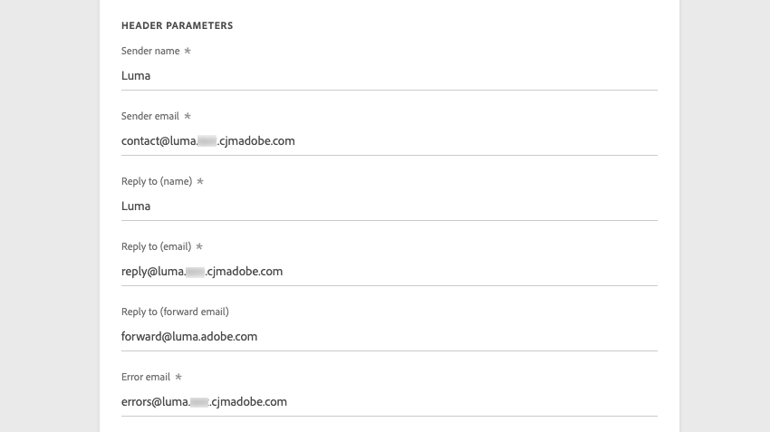

# Crear ajustes preestablecidos de mensaje

Con [!DNL Journey Optimizer], puede configurar ajustes preestablecidos de mensaje que definan todos los parámetros técnicos necesarios para el mensaje de correo electrónico y los mensajes de notificaciones push: tipo de correo electrónico, correo electrónico y nombre del remitente, aplicaciones móviles, etc.

>[!CAUTION]
>
> * La configuración de los ajustes preestablecidos de mensaje está restringida a los administradores de Recorrido. [Más información](../administration/ootb-product-profiles.md#journey-administrator)
>
> * Debe realizar pasos de configuración de correo electrónico y push antes de crear ajustes preestablecidos de mensaje.

Una vez configurados los ajustes preestablecidos de mensaje, puede seleccionarlos al crear mensajes desde la lista **[!UICONTROL Presets]**.

➡️ [Aprenda a crear y utilizar ajustes preestablecidos de correo electrónico en este vídeo](#video-presets)

## Crear un ajuste preestablecido de mensaje {#create-message-preset}

Para crear un ajuste preestablecido de mensaje, siga estos pasos:

1. Acceda al menú **[!UICONTROL Channels]** / **[!UICONTROL Message presets]** y haga clic en **[!UICONTROL Create Message preset]**.

   

1. Introduzca un nombre y una descripción (opcional) para el ajuste preestablecido y, a continuación, seleccione los canales que desea configurar.

   

   >[!NOTE]
   >
   > Los nombres deben comenzar por una letra (A-Z). Solo puede contener caracteres alfanuméricos. También puede utilizar caracteres de guion bajo `_`, punto`.` y guión `-`.

1. Configure la configuración **email**.

   

   * Seleccione el tipo de mensaje que se enviará con el ajuste preestablecido: **Transactional** o **Marketing**

      >[!CAUTION]
      >
      > **** Los mensajes de transacción se pueden enviar a perfiles que cancelan la suscripción a comunicaciones de marketing. Estos mensajes solo se pueden enviar en contextos específicos, como restablecimiento de contraseña, estado de pedido o notificación de envío, por ejemplo.

   * Seleccione el subdominio que desea utilizar para enviar los correos electrónicos. [Más información](about-subdomain-delegation.md)
   * Seleccione el grupo de IP que desea asociar al ajuste preestablecido. [Más información](ip-pools.md)
   * Introduzca los parámetros de encabezado para los correos electrónicos enviados mediante ese ajuste preestablecido.

      >[!CAUTION]
      >
      >Excepto para el campo **Responder a (enviar correo electrónico)**, el dominio de direcciones de correo electrónico debe utilizar el subdominio [delegado ](about-subdomain-delegation.md) seleccionado actualmente.

      * **[!UICONTROL Sender name]**: Nombre del remitente, como el nombre de su marca.

      * **[!UICONTROL Sender email]**: La dirección de correo electrónico que desea utilizar para sus comunicaciones. Por ejemplo, si el subdominio delegado es *marketing.luma.com*, puede utilizar *contact@marketing.luma.com*.

      * **[!UICONTROL Reply to (name)]**: El nombre que se utilizará cuando el destinatario haga clic en el botón  **** Replybutton del software cliente de correo electrónico.

      * **[!UICONTROL Reply to (email)]**: La dirección de correo electrónico que se utilizará cuando el destinatario haga clic en el botón  **** Replybutton del software cliente de correo electrónico. Los correos electrónicos enviados a esta dirección se reenvían a la dirección **[!UICONTROL Reply to (forward email)]** que se proporciona a continuación. Debe utilizar una dirección definida en el subdominio delegado (por ejemplo, *reply@marketing.luma.com*); de lo contrario, se eliminarán los correos electrónicos.

      * **[!UICONTROL Reply to (forward email)]**: Todos los correos electrónicos recibidos por  [!DNL Journey Optimizer] para el subdominio delegado se reenviarán a esta dirección de correo electrónico. Puede especificar cualquier dirección, excepto una dirección de correo electrónico definida en el subdominio delegado. Por ejemplo, si el subdominio delegado es *marketing.luma.com*, se prohíbe cualquier dirección como *abc@marketing.luma.com*.

      * **[!UICONTROL Error email]**: Todos los errores generados por los ISP después de unos días de envío del correo (devoluciones asincrónicas) se reciben en esta dirección.

      

      >[!NOTE]
      >
      >Los nombres deben comenzar por una letra (A-Z). Solo puede contener caracteres alfanuméricos. También puede utilizar caracteres de guion bajo `_`, punto`.` y guión `-`.

   * Configure los **parámetros de reintento de correo electrónico**. De forma predeterminada, el [periodo de reintento](retries.md#retry-duration) está establecido en 84 horas, pero puede ajustar esta configuración para adaptarla mejor a sus necesidades.

      

      Debe introducir un valor entero (en horas o minutos) dentro del siguiente intervalo:
      * Para el tipo de correo electrónico de marketing, el periodo mínimo de reintentos es de 6 horas.
      * Para el tipo de correo electrónico transaccional, el periodo mínimo de reintentos es de 10 minutos.
      * Para ambos tipos de correo electrónico, el periodo de reintento máximo es de 84 horas (o 5040 minutos).

1. Configure las opciones de **notificación push**.

   

   * Seleccione al menos una plataforma: **iOS** o **Android**

   * Seleccione las aplicaciones móviles que desea utilizar para cada plataforma.

      Para obtener más información sobre cómo configurar el entorno para enviar notificaciones push, consulte [esta sección](../push-gs.md).

1. Una vez configurados todos los parámetros, haga clic en **[!UICONTROL Submit]** para confirmar. También puede guardar el ajuste preestablecido de mensaje como borrador y reanudar su configuración más adelante.

   

1. Una vez creado el ajuste preestablecido de mensaje, aparece en la lista con el estado **[!UICONTROL Processing]**.

   Durante este paso, se realizarán varias comprobaciones para verificar que se ha configurado correctamente. El tiempo de procesamiento es de aproximadamente **48h-72h** y puede tardar **7-10 días**.

   Estas comprobaciones incluyen pruebas de capacidad de envío que realiza el equipo de entrega de Adobes:

   * Validación de SPF
   * Validación de DKIM
   * Validación de registros MX
   * Comprobación de IP inclusión en la lista de bloqueados
   * Comprobación de host de Helo
   * Verificación del grupo IP
   * Registro A/PTR, verificación del subdominio t/m/res

   >[!NOTE]
   >
   >Si las comprobaciones no son correctas, obtenga más información sobre los posibles motivos del error en [esta sección](#monitor-message-presets).

1. Una vez realizadas las comprobaciones correctamente, el ajuste preestablecido de mensaje obtiene el estado **[!UICONTROL Active]**. Está listo para utilizarse para enviar mensajes.

   <!-- later on, users will be notified in Pulse -->

   

## Monitorización de mensajes preestablecidos {#monitor-message-presets}

Todos los ajustes preestablecidos de mensajes se muestran en el menú **[!UICONTROL Channels]** / **[!UICONTROL Message presets]**. Los filtros están disponibles para ayudarle a navegar por la lista (tipo de canal, usuario, estado).

Los ajustes preestablecidos de mensaje pueden tener los siguientes estados:

* **[!UICONTROL Draft]**: El ajuste preestablecido de mensaje se ha guardado como borrador y aún no se ha enviado. Ábrala para reanudar la configuración.
* **[!UICONTROL Processing]**: El ajuste preestablecido de mensaje se ha enviado y se está realizando en varios pasos de verificación.
* **[!UICONTROL Active]**: El ajuste preestablecido de mensaje se ha verificado y se puede seleccionar para crear mensajes.
* **[!UICONTROL Failed]**: Se han producido errores en una o varias comprobaciones durante la verificación del ajuste preestablecido de mensaje.
* **[!UICONTROL De-activated]**: El ajuste preestablecido de mensaje se desactiva. No se puede usar para crear nuevos mensajes.

En caso de que falle la creación de un ajuste preestablecido de mensaje, a continuación se describen los detalles de cada posible motivo de error.

Si se produce uno de estos errores, póngase en contacto con el [equipo de asistencia al cliente de Adobe](https://helpx.adobe.com/es/enterprise/admin-guide.html?lang=es/enterprise/using/support-for-experience-cloud.ug.html){target=&quot;_blank&quot;} para obtener ayuda.

* **Error** de validación de SPF: SPF (Marco de Política del Remitente) es un protocolo de autenticación por correo electrónico que permite especificar direcciones IP autorizadas que pueden enviar correos electrónicos desde un subdominio determinado. El error de validación de SPF significa que las direcciones IP del registro de SPF no coinciden con las direcciones IP utilizadas para enviar correos electrónicos a los proveedores de buzones de correo.

* **Error** en la validación de DKIM: DKIM permite que el servidor destinatario verifique que el mensaje recibido lo haya enviado el remitente original del dominio asociado y que el contenido del mensaje original no se haya modificado en su camino. El error de validación de DKIM significa que los servidores de correo receptores no pueden verificar la autenticidad del contenido del mensaje y su asociación con el dominio de envío.

* **Error** en la validación del registro MX: El error de validación del registro MX significa que los servidores de correo responsables de aceptar correos electrónicos entrantes en nombre de un subdominio determinado no están correctamente configurados.

* **Error** en las configuraciones de envío: El error en las configuraciones de capacidad de envío puede deberse a cualquiera de los siguientes motivos:
   * Inclusión en la lista de bloqueados de las IP asignadas
   * Nombre `helo` no válido
   * Correos electrónicos que se envían desde direcciones IP distintas de las especificadas en el grupo IP del ajuste preestablecido correspondiente
   * No se pueden enviar correos electrónicos a las bandejas de entrada de los principales ISP, como Gmail y Yahoo

## Editar ajustes preestablecidos de mensaje

Para editar un ajuste preestablecido de mensaje, primero debe desactivarlo para que no esté disponible para crear nuevos mensajes (los mensajes publicados con este ajuste preestablecido no se verán afectados y seguirán funcionando). A continuación, debe duplicar el ajuste preestablecido de mensaje para crear una nueva versión que utilizará para crear nuevos mensajes:

1. Acceda a la lista de ajustes preestablecidos de mensaje y, a continuación, desactive el ajuste preestablecido de mensaje que desee editar.

   

1. Duplique el ajuste preestablecido de mensaje desactivado. Se añade automáticamente a la lista una copia con el estado **[!UICONTROL Draft]**.

   

1. Abra el mensaje preestablecido duplicado, modifíquelo según sus necesidades y, a continuación, envíe los cambios. El ajuste preestablecido de mensaje atravesará el mismo ciclo de validación que durante el [paso de creación](#create-message-preset).

1. Una vez validado, obtiene el estado **[!UICONTROL Active]** y está listo para utilizarse para crear nuevos mensajes.

   >[!NOTE]
   >
   >Los ajustes preestablecidos de mensajes desactivados no se pueden eliminar para evitar problemas en los recorridos que utilizan estos ajustes preestablecidos para enviar mensajes.

## Vídeo explicativo{#video-presets}

Obtenga información sobre cómo crear ajustes preestablecidos de mensaje, cómo utilizarlos y cómo delegar un subdominio y crear un grupo de IP.

>[!VIDEO](https://video.tv.adobe.com/v/334343?quality=12)
