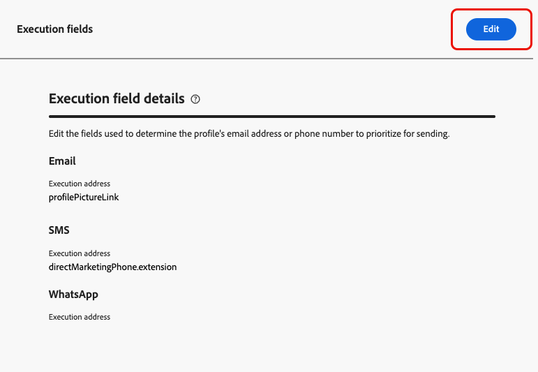

# Cambiar las direcciones de correo electrónico principales {#change-primary-email}

>[!CONTEXTUALHELP]
>id="ajo_admin_execution_address"
>title="Defina qué dirección utilizar"
>abstract="Puede elegir qué dirección de correo electrónico priorizar para el envío cuando hay varias direcciones disponibles en la base de datos (personal, profesional, etc.)."

Al segmentar un perfil, es posible que haya varias direcciones de correo electrónico disponibles en la base de datos (personal, dirección de correo electrónico profesional, etc.).

con [!DNL Journey Optimizer], puede determinar qué dirección de correo electrónico utilizar desde el servicio de perfil y priorizar cuándo hay varias direcciones disponibles. Para realizar esto, siga los pasos a continuación.

1. Acceda al menú **[!UICONTROL Channels]** > **[!UICONTROL General]** > **[!UICONTROL Executions fields]**.

   

1. El campo que se utiliza actualmente de forma predeterminada para determinar las direcciones de correo electrónico de los perfiles se muestra en esta pantalla. Haga clic en **[!UICONTROL Edit]** para cambiarlo.

   

1. Haga clic en el campo actual o en el icono de edición para seleccionar un nuevo campo.

   

1. Se muestra la lista de campos XDM de tipo correo electrónico disponibles. Seleccione el campo que desea utilizar.

   

1. Haga clic en **[!UICONTROL Save]** para confirmar su elección.

   

   El campo de ejecución se actualiza y ahora se utiliza como dirección principal.

<!--1. You can also select an additional field to use as secondary email address. This allows you to determine which field to use if the primary field is empty for a profile. -->
