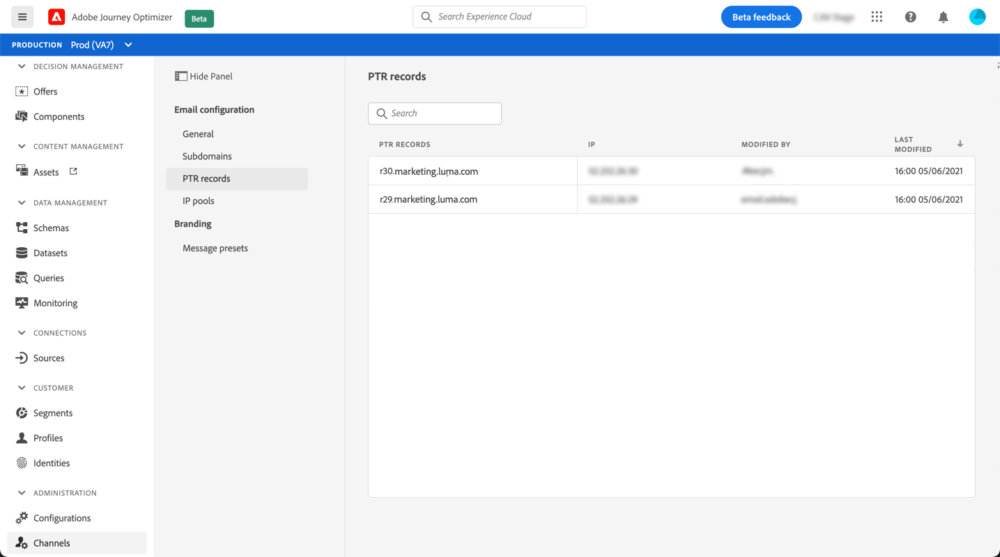
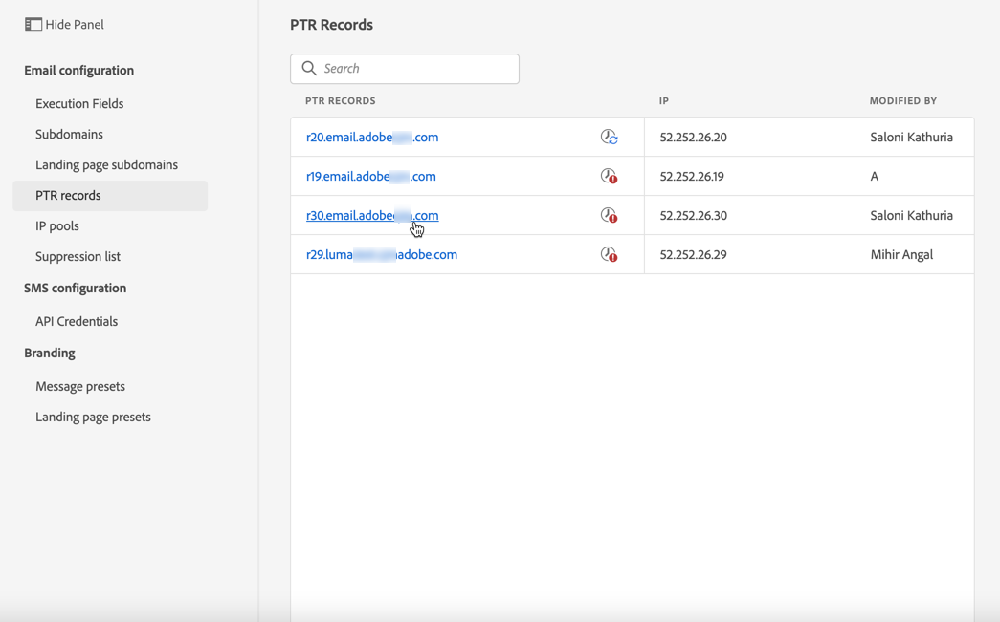
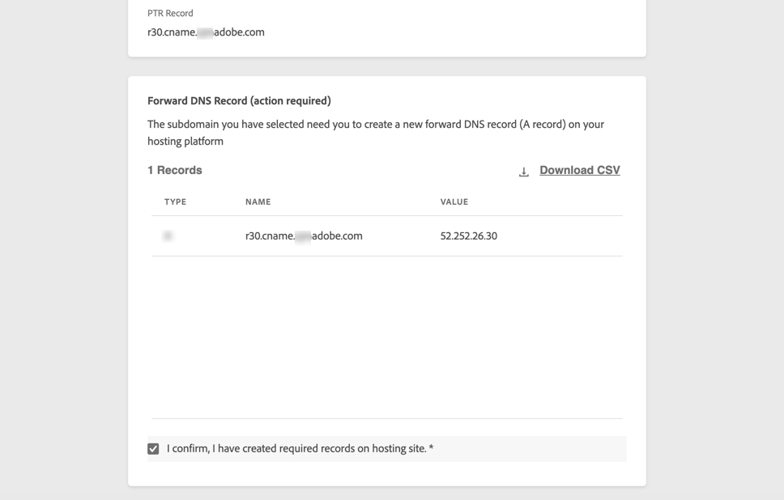

# Registros de PTR {#ptr-records}

## Acerca de los registros PTR {#about-ptr-records}

Un registro de puntero (PTR) es un tipo de registro DNS (Sistema de nombres de dominio) que proporciona el nombre de dominio vinculado a una dirección IP.

Con los registros PTR, los servidores de correo receptores pueden comprobar la autenticidad de los servidores de correo electrónico al identificar si sus direcciones IP corresponden a los nombres con los que se conectan los servidores.

## Acceda a los registros PTR de sus subdominios {#access-ptr-records}

Una vez [se delega un subdominio](delegate-subdomain.md) en Adobe Journey Optimizer, se crea automáticamente un registro PTR y se asocia a este subdominio. Puede acceder a él desde la **[!UICONTROL Channels]** > **[!UICONTROL Email configuration]** > **[!UICONTROL PTR records]** para abrir el Navegador.

La lista muestra los registros PTR generados para cada subdominio delegado, utilizando la siguiente sintaxis:

* &quot;r&quot; para registrar,
* &quot;xx&quot; para las dos últimas cifras de la dirección IP,
* nombre de subdominio.

Puede abrir un registro PTR de la lista para mostrar el nombre de subdominio y la dirección IP asociados.

## Editar un registro PTR {#edit-ptr-record}

Puede modificar un registro PTR para editar el subdominio asociado con una dirección IP.

>[!NOTE]
>
>No se puede modificar la variable **[!UICONTROL IP]** y **[!UICONTROL PTR record]** campos.

### Subdominios completamente delegados {#fully-delegated-subdomains}

Para editar un registro PTR con un subdominio que sea [completamente delegado](delegate-subdomain.md#full-subdomain-delegation) para realizar el Adobe, siga los pasos a continuación.

1. En la lista, haga clic en un nombre de registro PTR para abrirlo.

   

1. Seleccionar un subdominio [completamente delegado](delegate-subdomain.md#full-subdomain-delegation) a Adobe de la lista.

   

1. Haga clic en **[!UICONTROL Save]** para confirmar los cambios.

### Subdominios delegados mediante el método CNAME {#edit-ptr-subdomains-cname}

Para editar un registro PTR con un subdominio delegado a Adobe mediante la variable [método CNAME](delegate-subdomain.md#cname-subdomain-delegation), siga los pasos a continuación.

1. En la lista, haga clic en un nombre de registro PTR para abrirlo.

   

1. Seleccione un subdominio delegado a Adobe mediante la variable [método CNAME](delegate-subdomain.md#cname-subdomain-delegation) de la lista.

   

1. Debe crear un nuevo registro DNS de reenvío en la plataforma de alojamiento. Para ello, copie el registro generado por el Adobe. Una vez finalizado, marque la casilla &quot;Confirmo...&quot;.

   

   >[!NOTE]
   >
   >Si recibe este mensaje: &quot;Primero cree el DNS de reenvío y vuelva a intentarlo&quot;, siga los pasos a continuación:
   >   * Compruebe en el proveedor de DNS si el registro DNS de reenvío se creó correctamente.
   >   * Es posible que los registros de todo el DNS no se sincronicen inmediatamente. Espere unos minutos e inténtelo de nuevo.

1. Haga clic en **[!UICONTROL Save]** para confirmar los cambios.

## Comprobar detalles de actualización de registros PTR {#check-ptr-record-update}

A **[!UICONTROL Processing]** aparece junto al nombre del registro PTR en la lista.

Para comprobar los detalles de actualización de registros PTR, haga clic en el botón **[!UICONTROL Updating]** o **[!UICONTROL Recent updates]** icono.

Puede ver información como el estado de actualización y los cambios solicitados.

## Estados de actualización de registros PTR {#ptr-record-update-statuses}

Una actualización de registro PTR puede tener los siguientes estados:

*  **[!UICONTROL Processing]**: Se ha enviado la actualización del registro PTR, que está en proceso de verificación.
*  **[!UICONTROL Success]**: El registro PTR actualizado se ha verificado y el nuevo subdominio ahora está asociado con la dirección IP.
*  **[!UICONTROL Failed]**: Una o varias comprobaciones han fallado durante la verificación de actualización de registros PTR.

### Procesamiento {#processing}

Se realizarán varias comprobaciones de la capacidad de envío para verificar que el nuevo subdominio que se va a asociar a la dirección IP sea válido. <!--The processing time is around **48h-72h**, and can take up to **7-10 days**.-->

>[!NOTE]
>
>No puede modificar un registro PTR mientras la actualización está en curso. Puede seguir haciendo clic en su nombre, pero la variable **[!UICONTROL Subdomain]** aparece atenuado. Los cambios no se reflejarán hasta que la actualización se realice correctamente.

Durante el proceso de validación, el antiguo subdominio sigue estando asociado a la dirección IP.

### Correcto {#success}

Una vez que el proceso de validación se ha realizado correctamente, el nuevo subdominio se asocia automáticamente a la dirección IP.

### Fallido {#failes}

Si falla el proceso de validación, se muestra el registro PTR más antiguo. El subdominio válido que anteriormente estaba asociado con la dirección IP permanece sin cambios.

Los tipos de error de actualización posibles son los siguientes:
* Error al crear un nuevo DNS de reenvío para el registro PTR
* Error al actualizar el registro
* Error al volver a incorporar las afinidades

Al fallar la actualización, el registro PTR vuelve a ser editable. Puede hacer clic en su nombre y actualizar el subdominio de nuevo.
