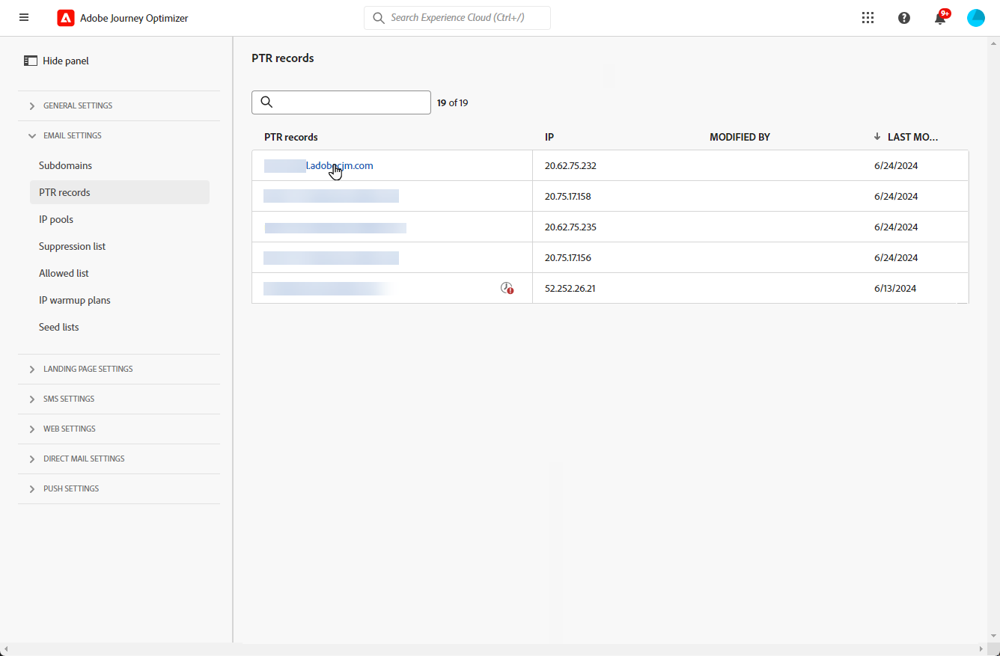

# Creación y edición de registros PTR {#ptr-records}

>[!CONTEXTUALHELP]
>id="ajo_admin_ptr_record"
>title="Registros PTR de los subdominios"
>abstract="Un registro de puntero (PTR) es un tipo de registro DNS que proporciona el nombre de dominio vinculado a una dirección IP, lo que ayuda a los servidores de correo receptores a verificar las direcciones IP de los remitentes. Solo puede editar un registro PTR después de tener en cuenta las consideraciones pertinentes y conversar con su experto en entregabilidad."

>[!CONTEXTUALHELP]
>id="ajo_admin_ptr_record_header"
>title="Registros PTR de los subdominios"
>abstract="Una vez delegado el primer subdominio a Adobe en Journey Optimizer, los registros PTR se crean automáticamente."

## Acerca de los registros PTR {#about-ptr-records}

Un registro de puntero (PTR) es un tipo de registro del Sistema de nombres de dominio (DNS) que proporciona el nombre de dominio vinculado a una dirección IP.

Con los registros PTR, los servidores de correo receptores pueden comprobar la autenticidad de los servidores de correo de envío identificando si sus direcciones IP corresponden a los nombres a los que se conectan los servidores.

## Acceso a los registros PTR de los subdominios {#access-ptr-records}

Una vez que [delegue](delegate-subdomain.md) su primer subdominio a Adobe en [!DNL Journey Optimizer], los registros PTR se crearán automáticamente para sus direcciones IP. Puede acceder a ellos desde el menú **[!UICONTROL Administración]** > **[!UICONTROL Canales]** > **[!UICONTROL Configuración de correo electrónico]** > **[!UICONTROL Registros PTR]**.

La lista muestra los registros PTR generados mediante la siguiente sintaxis:

* &quot;r&quot; para que conste,
* &quot;xx&quot; para las dos últimas cifras de la dirección IP,
* nombre de subdominio.

Puede abrir un registro PTR de la lista para mostrar el nombre de subdominio y la dirección IP asociados.

## Edición de un registro PTR {#edit-ptr-record}

En [!DNL Journey Optimizer], no puede crear manualmente registros PTR. En su lugar, una vez que [delegue](delegate-subdomain.md) su primer subdominio a Adobe, los registros PTR se crearán automáticamente para sus direcciones IP.

Cada una de las IP recibe un único registro PTR. Todos los registros PTR tienen el siguiente formato: &#39;rxx.subdomain&#39;, donde &#39;subdomain&#39; es el primer subdominio delegado en [!DNL Journey Optimizer].

Cuando se crean subdominios adicionales, es necesario modificar uno o varios registros PTR y asignarles los nuevos subdominios. Para ello, siga los pasos que aparecen a continuación.

>[!CAUTION]
>
>Los registros PTR son comunes a todos los entornos. Por lo tanto, cualquier modificación en un registro PTR también afectará a las zonas protegidas de producción.
>
>Proceda con mucho cuidado al editar registros PTR. En caso de duda, póngase en contacto con un experto en capacidad de entrega.

### Subdominios totalmente delegados {#fully-delegated-subdomains}

Para editar un registro PTR con un subdominio que esté [totalmente delegado](delegate-subdomain.md#full-subdomain-delegation) a Adobe, siga los pasos a continuación.

1. En la lista, haga clic en el nombre de un registro PTR para abrirlo.

   

1. Seleccione un subdominio [totalmente delegado](delegate-subdomain.md#full-subdomain-delegation) a Adobe de la lista.

   

1. Haz clic en **[!UICONTROL Guardar]** para confirmar los cambios.

>[!NOTE]
>
>No puede modificar los campos **[!UICONTROL IP]** y **[!UICONTROL registro PTR]**.

### Subdominios delegados mediante el método CNAME {#edit-ptr-subdomains-cname}

Para editar un registro PTR con un subdominio delegado a Adobe mediante el [método CNAME](delegate-subdomain.md#cname-subdomain-setup), siga los pasos a continuación.

1. En la lista, haga clic en el nombre de un registro PTR para abrirlo.

   

1. Seleccione un subdominio delegado a Adobe mediante el [método CNAME](delegate-subdomain.md#cname-subdomain-setup) de la lista.

   

1. Debe crear un nuevo registro DNS de reenvío en la plataforma de alojamiento. Para ello, copie el registro generado por Adobe. Una vez finalizado, marque la casilla &quot;Confirmo...&quot;.

   

   >[!NOTE]
   >
   >Si recibe este mensaje: &quot;Cree el DNS de reenvío primero y vuelva a intentarlo&quot;, siga los pasos a continuación:
   >   * Compruebe en el proveedor DNS si el registro DNS de reenvío se creó correctamente.
   >   * Es posible que los registros en el DNS no se sincronicen inmediatamente. Espere unos minutos e inténtelo de nuevo.

1. Haz clic en **[!UICONTROL Guardar]** para confirmar los cambios.

>[!NOTE]
>
>No puede modificar los campos **[!UICONTROL IP]** y **[!UICONTROL registro PTR]**.

## Comprobar detalles de actualización de registro PTR {#check-ptr-record-update}

Una vez confirmada la edición del registro PTR, se mostrará el icono **[!UICONTROL Procesando]** junto al nombre del registro PTR en la lista.

>[!NOTE]
>
>El [procesamiento de la actualización](#processing) puede tardar hasta tres horas.

Para comprobar los detalles de actualización del registro PTR, haga clic en el icono situado junto a él. Obtenga más información acerca de los estados asociados con los diferentes iconos de [esta sección](#ptr-record-update-statuses).

Puede ver información como el estado de la actualización y los cambios solicitados.

## Estados de actualización de registro PTR {#ptr-record-update-statuses}

Una actualización de registro PTR puede tener los siguientes estados:

*  **[!UICONTROL Procesando]**: la actualización del registro PTR se ha enviado y está pasando por un proceso de verificación.
*  **[!UICONTROL Éxito]**: el registro PTR actualizado se ha verificado y el nuevo subdominio ahora está asociado con la dirección IP.
*  **[!UICONTROL Error]**: una o varias comprobaciones han fallado durante la verificación de la actualización del registro PTR.

### Procesamiento {#processing}

Se realizarán varias comprobaciones de entrega para verificar que el nuevo subdominio asociado a la dirección IP es válido. Esto puede tardar hasta tres horas.

>[!NOTE]
>
>No se puede modificar un registro PTR mientras la actualización está en curso. Puede seguir haciendo clic en su nombre, pero el campo **[!UICONTROL Subdominio]** aparece atenuado. Los cambios no se reflejarán hasta que la actualización se realice correctamente.

Durante el proceso de validación, el subdominio antiguo sigue asociado a la dirección IP.

### Correcto {#success}

Una vez que el proceso de validación se realiza correctamente, el nuevo subdominio se asocia automáticamente a la dirección IP.

### Error {#failes}

Si falla el proceso de validación, se muestra el registro PTR más antiguo. El subdominio válido asociado anteriormente a la dirección IP permanece sin cambios.

Los posibles tipos de error de actualización son los siguientes:
* Error al crear un nuevo DNS de reenvío para el registro PTR
* Error al actualizar el registro
* Error al volver a incorporar las afinidades

Si la actualización falla, el registro PTR vuelve a poder editarse. Puede hacer clic en su nombre y actualizar el subdominio de nuevo.
