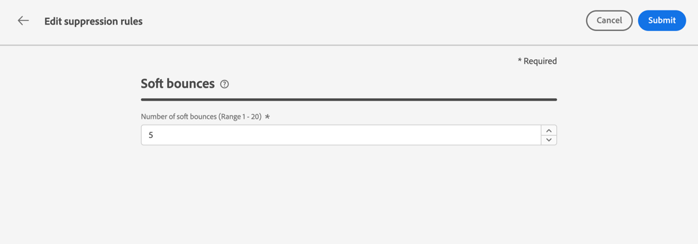

# Reintentos {#retries}

Cuando un mensaje de correo electrónico falla debido a un error temporal **Rebote suave** para una dirección determinada, se realizan varios reintentos. Cada error incrementa un contador de errores. Cuando este contador alcanza el umbral de límite, la dirección de correo electrónico se agrega a la lista de supresión.

>[!NOTE]
>
>Obtenga más información sobre los tipos de errores en la sección [Tipos de errores de entrega](../reports/suppression-list.md#delivery-failures).

En la configuración predeterminada, el umbral se establece en 5 errores.

* Para el mismo envío, en el quinto error encontrado dentro del [período de tiempo de reintento](#retry-duration), la dirección se suprime.

* Si hay diferentes envíos y se producen dos errores al menos con una diferencia de 24 horas, el contador de errores se incrementa con cada error y la dirección también se suprime en el quinto intento. Los errores son acumulativos para cada dirección.

Si una entrega se realiza correctamente después de un reintento, se reinicia el contador de errores de la dirección.

Por ejemplo:

* Envía un correo electrónico el lunes con un periodo de reintento establecido en 24 horas. No se pudo entregar la dirección `emma.jones@mail.com`. El correo electrónico se vuelve a intentar hasta tres veces y deja de intentarlo al alcanzar el periodo de reintento de 24 horas.

* Envía otro correo electrónico el miércoles. El `emma.jones@mail.com`, que ya tiene un recuento de tres errores, también está dirigido y, de nuevo, no se puede entregar: dos veces. Se contabilizan dos errores más.

Siempre que no se haya intentado realizar ninguna otra entrega entre esos dos correos electrónicos, la dirección `emma.jones@mail.com` se agrega a la lista de supresión debido al impacto acumulado de 3 + 2 errores.

## Reintentar edición de umbral {#edit-retry-threshold}

>[!CONTEXTUALHELP]
>id="ajo_admin_suppression_list_bounces"
>title="Actualizar el umbral de reintentos"
>abstract="Si el valor predeterminado no se ajusta a sus necesidades, puede modificar el número permitido de mensajes devueltos no entregados consecutivos. Cuando el recuento de reintentos alcanza el umbral de error para una dirección de correo electrónico específica, esta dirección se agrega a la lista de supresión."
<!--
>additional-url="https://experienceleague.adobe.com/docs/journey-optimizer/using/reporting/deliverability/suppression-list.html" text="Understand the suppresion list"-->

Si el valor predeterminado de 5 no se adapta a sus necesidades, puede modificar el umbral de error siguiendo los pasos a continuación.

1. Vaya a **[!UICONTROL Canales]** > **[!UICONTROL Configuración de correo electrónico]** > **[!UICONTROL Lista de supresión]**.

1. Seleccione el botón **[!UICONTROL Editar reglas de supresión]**.

   

1. Edite el número permitido de mensajes devueltos no entregados consecutivos según sus necesidades.

   

   Debe introducir un valor entero entre 1 y 20, lo que significa que el número mínimo de reintentos es 1 y el número máximo es 20.

   >[!CAUTION]
   >
   >Cualquier valor superior a 10 puede causar problemas de reputación de capacidad de entrega, así como restricciones de IP o inclusión en la lista de bloqueados por parte de los ISP. [Más información sobre la capacidad de entrega](../reports/deliverability.md)

## Período de tiempo de reintento {#retry-duration}

El **período de tiempo de reintento** es el período de tiempo en el que se reintentará cualquier mensaje de correo electrónico del envío que haya encontrado un error temporal o una devolución.

De manera predeterminada, los reintentos se realizarán durante **3,5 días** (o **84 horas**) desde el momento en que se agregó el mensaje a la cola de correo electrónico.

Sin embargo, para asegurarse de que los reintentos no se realicen más cuando ya no sean necesarios, puede cambiar esta configuración según sus necesidades al crear o editar una [configuración de canal](channel-surfaces.md) que se aplique al canal de correo electrónico.

Por ejemplo, puede establecer el periodo de reintento en 24 horas para un correo electrónico transaccional relacionado con el restablecimiento de contraseña y que contenga un vínculo válido solo para un día. Del mismo modo, para una venta a medianoche, es posible que desee definir un periodo de reintento de 6 horas.

>[!NOTE]
>
>El periodo de reintento no puede superar las 84 horas. El periodo mínimo de reintento es de 6 horas para los correos electrónicos de marketing y 10 minutos para los transaccionales.

Aprenda a ajustar los parámetros de reintento de correo electrónico al crear una configuración de canal en [esta sección](../email/email-settings.md#email-retry).

