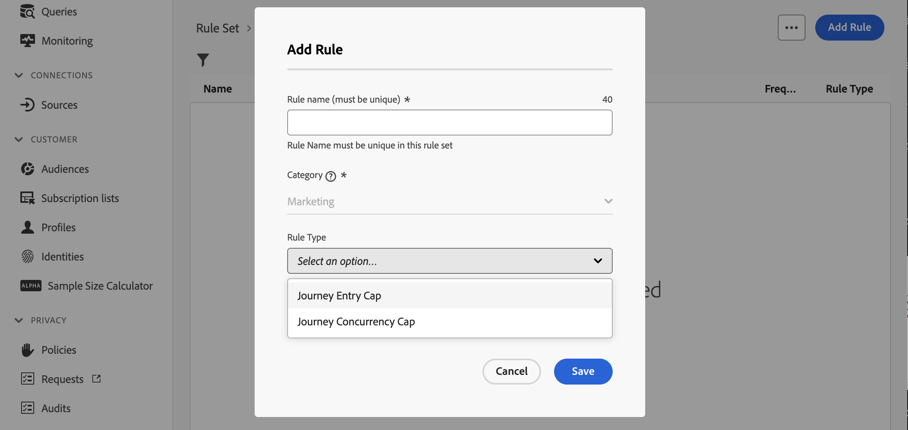
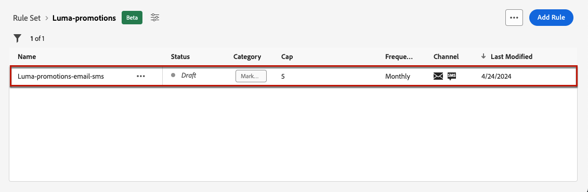
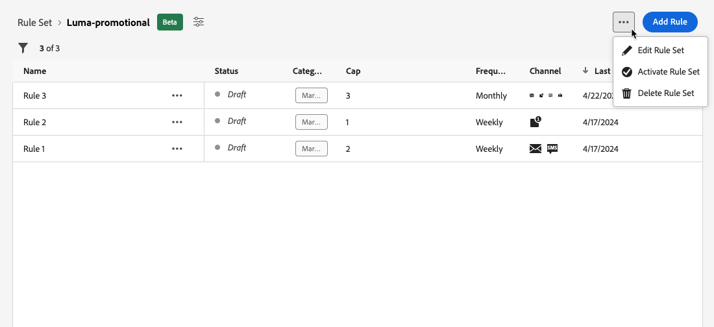

# Trabajar con conjuntos de reglas {#rule-sets}

>[!CONTEXTUALHELP]
>id="ajo_business_rules_rule_sets"
>title="Conjuntos de reglas"
>abstract="Utilice conjuntos de reglas para aplicar límites de frecuencia a diferentes tipos de comunicaciones de marketing. También puede aplicar un conjunto de reglas para excluir este recorrido para parte del público, en función de las reglas de restricción de frecuencia."

## Introducción a los conjuntos de reglas {#gs}

### ¿Qué son los conjuntos de reglas? {#what}

Además de las reglas empresariales globales que restringen el número de veces que los usuarios reciben mensajes en uno o varios canales, los conjuntos de reglas permiten **agrupar varias reglas en conjuntos de reglas** y aplicarlas a las campañas que elija. Esto proporciona una granularidad mejorada para controlar la frecuencia con la que los usuarios recibirán un mensaje según el tipo de comunicación.

Por ejemplo, puede crear un conjunto de reglas para limitar el número de **comunicaciones promocionales** enviadas a sus clientes y otro conjunto de reglas para limitar el número de **boletines** enviados a ellos. Según el tipo de campaña que esté creando, puede elegir aplicar la comunicación promocional o el conjunto de reglas de los boletines informativos.

➡️ [Descubra esta funcionalidad en vídeo](#video)

### Permisos {#permissions-frequency-rules}

Para trabajar con reglas empresariales, necesita los siguientes permisos:

* **[!UICONTROL Ver reglas de frecuencia]**: Acceda y vea reglas de negocio.
* **[!UICONTROL Administrar reglas de frecuencia]**: cree, edite o elimine reglas de negocio.

Puede obtener más información sobre permisos en [esta sección](../administration/high-low-permissions.md).

### Conjuntos de reglas globales y personalizadas {#global-custom}

Al obtener acceso a los conjuntos de reglas por primera vez desde el menú **[!UICONTROL Administración]** > **[!UICONTROL Reglas de negocio]**, ya se ha creado y activado un conjunto de reglas predeterminado: **Conjunto de reglas predeterminado global**.

Este conjunto de reglas contiene reglas globales que puede aplicar para controlar la frecuencia con la que los usuarios reciben mensajes a través de uno o varios canales, de forma similar a como funcionan las reglas empresariales actuales. Todas las reglas definidas en este conjunto de reglas se aplican a todos los canales seleccionados, independientemente de si las comunicaciones se envían desde un recorrido o desde una campaña. [Aprenda a trabajar con reglas empresariales](../conflict-prioritization/rule-sets.md)

Además de este conjunto de reglas predeterminado global, puede crear **conjuntos de reglas personalizadas** que puede aplicar a cualquier campaña para restringir el número de mensajes enviados dentro de esa campaña. [Aprenda a crear conjuntos de reglas personalizados](#create)

### Reglas de restricción de canal y recorridos {#domain}

>[!CONTEXTUALHELP]
>id="ajo_rule_set_domain"
>title="Dominio del conjunto de reglas"
>abstract="Al crear un conjunto de reglas, debe especificar si las reglas dentro del conjunto de reglas aplicarán reglas de límite específicas a los canales de comunicación o a los recorridos."

Al crear un conjunto de reglas, debe especificar si las reglas dentro del conjunto de reglas aplicarán reglas de límite específicas a los canales de comunicación o a los recorridos. Para ello, seleccione un Canal o un dominio de Recorrido para el conjunto de reglas al crearlo. [Aprenda a crear un conjunto de reglas](#create)

* Dominio **Channel**: aplique reglas de límite para los canales de comunicación. Por ejemplo, no envíe más de 1 correo electrónico o comunicación SMS al día.
* Dominio **Recorrido**: aplique reglas de límite de entrada y concurrencia a un recorrido. Por ejemplo, no introduzca perfiles en más de un recorrido simultáneamente.

## Creación de su primer conjunto de reglas personalizadas {#create-rule-set}

### Cree el conjunto de reglas y seleccione su dominio {#create}

Para crear un conjunto de reglas, siga los pasos a continuación.

>[!NOTE]
>
>Puede crear hasta 10 conjuntos de reglas locales activos para el dominio del canal y para el dominio del recorrido.

1. Acceda a la lista **[!UICONTROL Conjuntos de reglas]** y haga clic en **[!UICONTROL Crear conjunto de reglas]**.

   

1. Defina un nombre único para el conjunto de reglas y añada una descripción.

1. Seleccione el dominio del conjunto de reglas. El dominio le permite especificar si el conjunto de reglas contendrá reglas de límite específicas para los canales de comunicación o para los recorridos. [Más información acerca de las reglas de límite de recorrido y canal](#domain)

   

1. Haga clic en **[!UICONTROL Guardar]**.

1. Ahora puede [definir las reglas](#create-new-rule) que desee agregar a este conjunto de reglas.

### Añadir reglas al conjunto de reglas {#create-new-rule}

>[!CONTEXTUALHELP]
>id="ajo_rule_sets_category"
>title="Seleccione la categoría de regla de mensaje"
>abstract="Cuando está activada y se aplica a un mensaje, todas las reglas de frecuencia que coincidan con la categoría seleccionada se aplican automáticamente a este mensaje. Actualmente, solo está disponible la categoría Marketing."

<!--NOT USED?
[!CONTEXTUALHELP]
>id="ajo_rule_sets_capping"
>title="Set the capping for your rule"
>abstract="Specify the maximum number of messages sent to a customer profile within the chosen time frame. The frequency cap will be based on the selected calendar period and will be reset at the beginning of the corresponding time frame."-->

>[!CONTEXTUALHELP]
>id="ajo_rule_sets_channel"
>title="Definir los canales a los que se aplica la regla"
>abstract="Seleccione al menos un canal. El límite se aplica a todos los canales como un recuento total."

>[!CONTEXTUALHELP]
>id="ajo_rule_sets_duration"
>title="Seleccione la categoría de regla de mensaje"
>abstract="Cuando está activada y se aplica a un mensaje, todas las reglas de frecuencia que coincidan con la categoría seleccionada se aplican automáticamente a este mensaje. Actualmente, solo está disponible la categoría Marketing."

>[!CONTEXTUALHELP]
>id="ajo_rule_set_rule_capping"
>title="Límite de reglas"
>abstract="Establezca la restricción de la regla. En función del dominio del conjunto de reglas y de la selección del campo Tipo de regla, este campo puede definir el número máximo de mensajes que se pueden enviar a un perfil o el número máximo de recorridos que el perfil puede introducir o en los que puede estar inscrito simultáneamente."

Para agregar una regla a un conjunto de reglas, accede a él y haz clic en **[!UICONTROL Agregar regla]**.

Los parámetros disponibles para la regla dependen del dominio del conjunto de reglas seleccionado en su creación.

+++Configurar reglas de límite de canal (**Canal** dominio)

1. Defina un nombre único para la regla.

1. El campo **Category** especifica la categoría del mensaje a la que se aplica la regla. Por ahora, este campo es de solo lectura ya que solo está disponible la categoría **[!UICONTROL Marketing]**.

1. En la lista desplegable **[!UICONTROL Duración]**, seleccione si desea que el límite se aplique mensualmente, semanalmente o diariamente. El límite de frecuencia se basa en el periodo de calendario seleccionado. Se restablece al principio del lapso de tiempo correspondiente.

   

   La caducidad del contador para cada período es la siguiente:

   * **[!UICONTROL Mensual]**: el límite de frecuencia es válido hasta el último día del mes a las 23:59:59 UTC. Por ejemplo, la caducidad mensual para enero es del 01 al 31 23:59:59 UTC.

   * **[!UICONTROL Semanal]**: El límite de frecuencia es válido hasta el sábado 23:59:59 UTC de esa semana, ya que la semana del calendario comienza el domingo. La fecha de caducidad se aplica independientemente del momento en que se creó la regla. Por ejemplo, si la regla se crea el jueves, es válida hasta el sábado a las 23:59:59.

   * **[!UICONTROL Diario]**: El límite de frecuencia diario es válido para el día hasta el 23:59:59 UTC y se restablece en 0 al comienzo del día siguiente.

     >[!CAUTION]
     > 
     >Para garantizar la precisión de las reglas de restricción de frecuencia diaria, asegúrese de elegir el espacio de nombres de prioridad más alta durante la creación de una campaña o recorrido. Obtenga más información sobre la prioridad del espacio de nombres en la [Guía del servicio de identidad de Platform](https://experienceleague.adobe.com/es/docs/experience-platform/identity/features/identity-graph-linking-rules/namespace-priority){target="_blank"}

   Tenga en cuenta que el valor del contador de perfiles se actualiza una vez que se envía la comunicación. Tenga esto en cuenta cuando envíe grandes volúmenes de comunicaciones, ya que el rendimiento podría provocar que el destinatario reciba el correo electrónico minutos o incluso horas después del inicio de la comunicación (en el caso de que envíe millones de comunicaciones simultáneamente).

   Esto es importante en el caso de que un destinatario reciba dos comunicaciones muy juntas. Sugerimos separar las comunicaciones por lo menos dos horas cuando sea posible para dar tiempo suficiente al destinatario para recibir la comunicación y al valor del contador para actualizar en consecuencia.

1. Establezca el límite de la regla, es decir, el número máximo de mensajes que se pueden enviar a un perfil de usuario individual cada mes, semana o día, según la selección anterior.

1. Seleccione el canal que desee usar para esta regla: **[!UICONTROL Correo electrónico]**, **[!UICONTROL SMS]**, **[!UICONTROL Notificación push]** o **[!UICONTROL Correo directo]**.

   >[!NOTE]
   >
   >Debe seleccionar al menos un canal para poder crear la regla.

1. Seleccione varios canales si desea aplicar un límite a todos los canales seleccionados como recuento total.

   Por ejemplo, establezca el límite en 5 y seleccione los canales de correo electrónico y SMS. Si un perfil ya ha recibido 3 correos electrónicos de marketing y 2 SMS de marketing para el periodo seleccionado, este perfil se excluirá de la siguiente entrega de cualquier correo electrónico o SMS de marketing.

+++

+++Configurar reglas de límite de recorrido (**Recorrido** dominio)

1. Proporcione un nombre único para la regla.

1. En la lista desplegable **[!UICONTROL Tipo de regla]**, especifique el tipo de límite para la regla.

   * **[!UICONTROL Límite de entrada de Recorrido]**: Limita el número de entradas en el recorrido durante un período determinado para un perfil.
   * **[!UICONTROL Límite de concurrencia de Recorrido]**: Limita la cantidad de recorridos en los que se puede inscribir un perfil simultáneamente.

1. Encontrará información detallada sobre cómo configurar las reglas de restricción de recorrido en la sección [restricción y arbitraje de Recorrido](../conflict-prioritization/journey-capping.md).

+++

1. Haga clic en **[!UICONTROL Guardar]** para confirmar la creación de la regla. Su mensaje se agrega al conjunto de reglas, con el estado **[!UICONTROL Borrador]**.

   

1. Repita los pasos anteriores para agregar tantas reglas como sea necesario al conjunto de reglas.

Ahora debe activar cada regla para poder aplicarla a cualquier mensaje. [Más información](#activate-rule)

### Activar las reglas y el conjunto de reglas {#activate-rule}

Cuando se crea, una regla tiene el estado **[!UICONTROL Borrador]** y aún no afecta a ningún mensaje. Para habilitarlo, haga clic en el botón **[!UICONTROL Más acciones]** que está junto a la regla y seleccione **[!UICONTROL Activar]**.

También debe activar el conjunto de reglas para poder acceder a él en campañas/recorridos y aplicarlo a los mensajes.

>[!NOTE]
>
>Una regla o un conjunto de reglas puede tardar hasta 20 minutos en activarse completamente. No es necesario modificar los mensajes ni volver a publicar los recorridos para que una regla surta efecto.

<!--Currently, once a rule set is activated, no more rules can be added to that rule set.-->

Para desactivar una regla o un conjunto de reglas, haga clic en el botón **[!UICONTROL Más acciones]** situado junto al elemento deseado y seleccione **[!UICONTROL Desactivar]**.

Su estado cambiará a **[!UICONTROL Inactivo]** y la regla no se aplicará a futuras ejecuciones de mensajes. Los mensajes que se estén ejecutando actualmente no se verán afectados.

>[!NOTE]
>
>La desactivación de una regla o un conjunto de reglas no afecta ni restablece ningún recuento de perfiles individuales.

## Acceso y administración de conjuntos de reglas {#access-rule-sets}

Todos los conjuntos de reglas creados se muestran en el menú **[!UICONTROL Administración]** > **[!UICONTROL Reglas de negocio]**. Se ordenan por fecha de la última modificación.

Haga clic en el nombre de un conjunto de reglas para ver y editar su contenido. Se muestran todas las reglas incluidas en ese conjunto de reglas. El menú contextual de la parte superior derecha le permite:

* Editar el nombre y la descripción del conjunto de reglas
* Activar el conjunto de reglas: [más información](#activate-rule)
* Eliminar el conjunto de reglas

Para cada regla del conjunto de reglas, el botón **[!UICONTROL Más acciones]** le permite:

* Editar la regla
* Activar la regla [más información](#activate-rule)
* Eliminar la regla

## Aplicación de conjuntos de reglas a un mensaje o recorrido {#apply-frequency-rule}

Puede aplicar un conjunto de reglas a un mensaje o a un recorrido, según el dominio seleccionado al crear el conjunto de reglas. Expanda las secciones siguientes para obtener más información.

+++ Aplicación de un conjunto de reglas a un mensaje

1. Al crear una [campaña](../campaigns/create-campaign.md), seleccione uno de los canales que definió para el conjunto de reglas y edite el contenido del mensaje.

1. En la pantalla de edición de contenido, haga clic en el botón **[!UICONTROL Agregar regla de negocio]**.

1. Seleccione el [conjunto de reglas que creó](#create-rule-set).

   

   >[!NOTE]
   >
   >En la lista solo se muestran [conjuntos de reglas activados](#activate-rule).

   <!--Messages where the category selected is **[!UICONTROL Transactional]** will not be evaluated against business rules.-->

1. Antes de activar la campaña, asegúrese de programar su ejecución al menos 20 minutos en el futuro.

   Esto permite disponer de tiempo suficiente para rellenar los valores de contador en el perfil para la regla de negocio seleccionada. Si activa la campaña inmediatamente, los valores del contador del conjunto de reglas no se rellenan en los perfiles de los destinatarios y el mensaje no se contabiliza en sus reglas de límite de frecuencia para los conjuntos de reglas personalizadas.

   

1. Puede ver el número de perfiles excluidos del envío en el [informe de Customer Journey Analytics](../reports/report-gs-cja.md) y en el [informe en vivo](../reports/live-report.md), donde las reglas de frecuencia se enumerarán como un posible motivo para excluir a los usuarios del envío.

>[!NOTE]
>
>Se pueden aplicar varias reglas al mismo canal, pero una vez alcanzado el límite inferior, el perfil se excluye de los siguientes envíos.

<!--
## Example: combine several rules {#frequency-rule-example}

You can combine several message frequency rules, such as described in the example below.

1. [Create a rule](#create-new-rule) called *Overall Marketing Capping*:

   * Select all channels.
   * Set capping to 12 monthly.

   

1. To further restrict the number of marketing-based push notifications that a user is sent, create a second rule called *Push Marketing Cap*:

   * Select Push channel.
   * Set capping to 4 monthly.

   

1. Save and [activate](#activate-rule) the rule.

1. [Create a message](../building-journeys/journeys-message.md) for every channel you want to communicate through and select the **[!UICONTROL Marketing]** category for each message. [Learn how to apply a frequency rule](#apply-frequency-rule)

   

In this scenario, an individual profile:
* can receive up to 12 marketing messages per month;
* but will be excluded from marketing push notifications after they have received 4 push notifications.-->

Al probar las reglas de frecuencia, se recomienda usar un [perfil de prueba](../audience/creating-test-profiles.md) recién creado, ya que una vez que se alcanza el límite de frecuencia de un perfil, no hay forma de restablecer el contador hasta el siguiente período. Al desactivar una regla, los perfiles con límite pueden recibir mensajes, pero no se elimina ni elimina ningún incremento de contador.

+++

+++ Aplicación de un conjunto de reglas a un recorrido

Para aplicar una regla de límite a un recorrido, acceda al recorrido y abra sus propiedades. En el menú desplegable **[!UICONTROL Reglas de límite]**, seleccione el conjunto de reglas correspondiente.

>[!IMPORTANT]
>
>Si un recorrido se activa inmediatamente, el sistema puede tardar hasta 20 minutos en empezar a suprimir clientes. Puede programar su recorrido para que comience al menos 20 minutos en el futuro para evitar esta posibilidad.

+++

## Vídeo práctico {#video}

>[!VIDEO](https://video.tv.adobe.com/v/3444729?quality=12&captions=spa)
