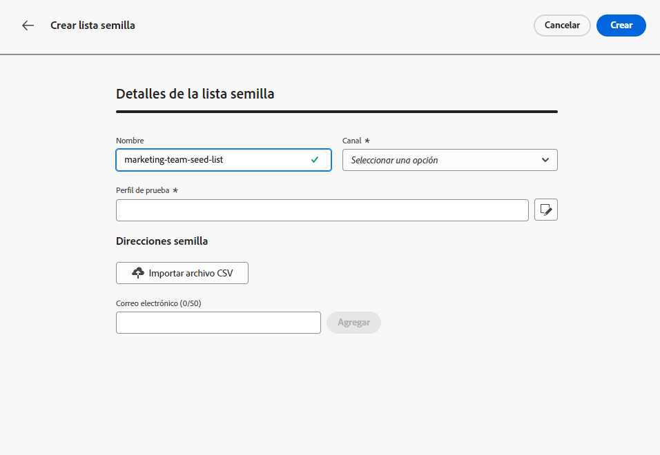
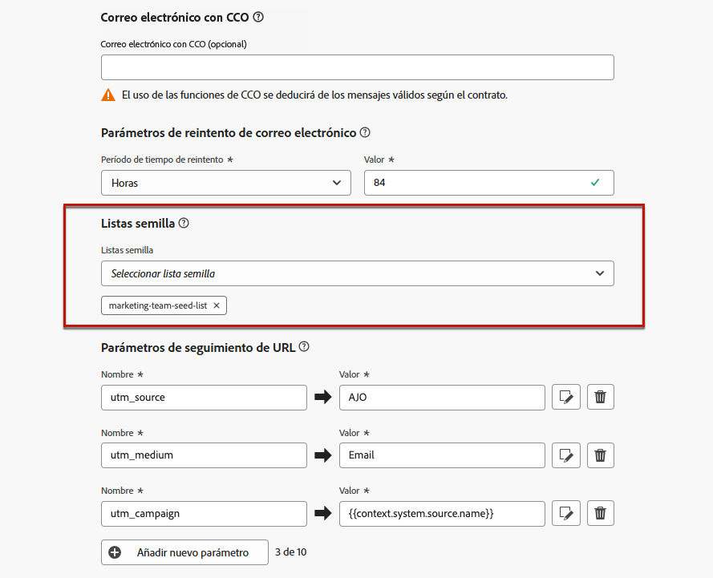

# Uso de listas semilla {#seed-lists}

Las listas semilla de [!DNL Journey Optimizer] permiten incluir automáticamente direcciones semilla específicas en los envíos.

>[!CAUTION]
>
>Actualmente, esta función solo se aplica al canal de correo electrónico.

Las direcciones semilla se utilizan para dirigirse a los destinatarios que no coinciden con los criterios de destino definidos. De este modo, los destinatarios que estén fuera del alcance de la entrega pueden recibirlo como lo haría cualquier otro destinatario.

Las direcciones semilla no son perfiles reales ni perfiles de prueba, ya que no incluyen detalles de perfil. Solo son destinatarios que pertenecen a partes interesadas internas almacenadas en el sistema. Cuando se seleccionan en una campaña o recorrido específico, se incluyen en el momento de la ejecución de la entrega, lo que significa que recibirán una copia de la entrega con fines de garantía.

* Al recibir las entregas al mismo tiempo y en las mismas condiciones que sus clientes, las listas semilla permiten monitorizar las copias de los correos electrónicos enviadas para garantizar que todos los formatos de visualización, imágenes y vínculos sean correctos, así como realizar un seguimiento de los mensajes reales enviados a sus destinatarios.

  Por ejemplo:

  +++ Si es administrador de marketing:

  Desea que todos los integrantes del equipo reciban copias de los mensajes enviados al mismo tiempo que los clientes. De este modo, su equipo puede asegurarse de que los mensajes se envíen con el diseño esperado, las direcciones URL activas, el texto correcto y las imágenes, todo ello según lo planificado antes de la ejecución.

  +++

  +++ Si es el propietario de un producto:

  Debe realizar un seguimiento de los mensajes reales enviados a los clientes. De hecho, es posible que su equipo y liderazgo estén interesados en algunas campañas y deban agregarse según sea necesario para recibir copias del mensaje en el momento de la entrega.

  +++

* Otra razón para utilizar listas semilla es la protección de la lista de correo. La inclusión de direcciones semilla en la lista de la campaña de correo le permite recibir una notificación si la está utilizando un tercero, ya que las direcciones que contiene reciben las entregas enviadas a la misma.

>[!NOTE]
>
>Se admiten variantes, incluidas las multilingües y de experimentación. Cada dirección semilla recibe una sola copia de todas las variantes del mismo mensaje; por ejemplo, versiones diferentes de un [experimento de contenido](../content-management/get-started-experiment.md). Tenga en cuenta que no se envían correos electrónicos semilla independientes para el contenido condicional.

## Acceso a las listas semilla {#access-seed-lists}

Para acceder a las listas semilla ya creadas, ve a **[!UICONTROL Administración]** > **[!UICONTROL Canales]** > **[!UICONTROL Configuración de correo electrónico]** y selecciona **[!UICONTROL Lista semilla]**.

<!--
>[!CAUTION]
>
>Permissions to view, export and manage the seed lists are restricted to [Journey Administrators](../administration/ootb-product-profiles.md#journey-administrator). Learn more about managing [!DNL Journey Optimizer] users' access rights in [this section](../administration/permissions-overview.md).-->

>[!CAUTION]
>
>Para poder ver, editar y administrar listas semilla, debe tener el permiso **[!UICONTROL Administrar lista semilla]**.

Puede buscar listas semilla por nombre o filtrar por el usuario que ha creado la lista o en la fecha de creación. Una vez seleccionado, puede borrar el filtro mostrado en la parte superior de la lista.

Use el botón **[!UICONTROL Eliminar]** para quitar una entrada de forma permanente.

>[!CAUTION]
>
>No es posible eliminar una lista semilla que se use en una [campaña](../campaigns/review-activate-campaign.md) o [recorrido](../building-journeys/publishing-the-journey.md) activos. Debe desactivar la campaña o el recorrido, o editarlo para utilizar otra configuración que no tenga seleccionada la lista semilla. [Más información acerca del uso de una lista semilla](#use-seed-list)

Puede hacer clic en el nombre de una lista semilla para editarla. <!--Use the **[!UICONTROL Edit]** button to edit a seed list.-->

## Creación de una lista semilla {#create-seed-list}

>[!CONTEXTUALHELP]
>id="ajo_seed_list_details"
>title="Definir una lista semilla"
>abstract="Utilice una lista semilla para añadir automáticamente direcciones internas específicas a su público de entrega con fines de garantía. Las listas semilla le permiten monitorizar las copias de los mensajes enviados para asegurarse de que todos los elementos de visualización son correctos y proteger su lista de campaña de correo. Actualmente, esta función solo se aplica al canal de correo electrónico."
>additional-url="https://experienceleague.adobe.com/docs/journey-optimizer/using/configuration/seed-lists.html?lang=es#use-seed-list" text="¿Qué son las listas semilla?"

>[!CONTEXTUALHELP]
>id="ajo_seed_addresses"
>title="Rellene la lista semilla"
>abstract="Seleccione las direcciones que se incluirán en el momento de la ejecución de la entrega y recibirán una copia exacta del mensaje. Puede importar un archivo CSV o introducir las direcciones de correo electrónico manualmente."

Para crear una lista semilla, siga los pasos a continuación.

1. Acceda al menú **[!UICONTROL Administración]** > **[!UICONTROL Canales]** > **[!UICONTROL Configuración de correo electrónico]** > **[!UICONTROL Lista semilla]**.

1. Seleccione el botón **[!UICONTROL Crear lista semilla]**.

   <!---->

1. Complete los detalles. Comience agregando un nombre.

   

   >[!NOTE]
   >
   >Los nombres deben comenzar por una letra (A-Z) e incluir solo caracteres alfanuméricos o caracteres especiales ( _, ., -).

1. Seleccione el canal. Actualmente solo está disponible el canal de correo electrónico.

1. Seleccione un perfil de prueba. Dado que las direcciones semilla no incluyen detalles del perfil, este perfil de prueba solo se utilizará para mostrar los datos de personalización en el mensaje enviado a las direcciones semilla.

   >[!NOTE]
   >
   >Solo se puede seleccionar un perfil de prueba a la vez.

1. Añada las direcciones semilla a las que desee enviar las entregas. Puede importar un archivo CSV o introducir las direcciones de correo electrónico manualmente.

   

   >[!NOTE]
   >
   >Puede combinar ambas opciones, pero el número total de direcciones en una lista semilla no puede superar las 300.

1. Haga clic en **[!UICONTROL Crear]** para confirmar. La lista semilla recién creada se muestra en la [pantalla Lista semilla](#access-seed-lists).

## Uso de una lista semilla en una campaña o recorrido {#use-seed-list}

Ahora que la lista de reasignación se ha creado, puede utilizarla en cualquier campaña o recorrido para incluir las direcciones semilla correspondientes en las entregas. Para ello, siga los pasos que aparecen a continuación.

>[!CAUTION]
>
>Los mensajes enviados a las direcciones semilla no se incluyen en los informes de recorrido o de campaña.

1. Cree una configuración y seleccione el canal **[!UICONTROL Correo electrónico]**. [Más información](../email/email-settings.md)

1. Seleccione la lista semilla que elija en la [sección correspondiente](../email/email-settings.md#seed-list).

   >[!NOTE]
   >
   >Solo se puede seleccionar una lista semilla a la vez.

   

1. Envíe la configuración.

1. Crear una [campaña](../campaigns/create-campaign.md) o un [recorrido](../building-journeys/journey-gs.md).

1. Seleccione la acción **[!UICONTROL Correo electrónico]** y seleccione la [configuración](channel-surfaces.md) que incluye la lista semilla que le interesa.

   

1. Activar [campaign](../campaigns/review-activate-campaign.md) o publicar [recorrido](../building-journeys/publishing-the-journey.md).

Ahora, cada vez que se envía un mensaje de correo electrónico a sus clientes a través de esa campaña o recorrido, las direcciones de correo electrónico de la lista semilla seleccionada también lo reciben en las mismas condiciones, al mismo tiempo y con el mismo contenido que los destinatarios objetivo.

>[!NOTE]
>
>[Los recorridos del modo de prueba](../building-journeys/testing-the-journey.md) no envían correos electrónicos a la lista semilla. Para comprobar el contenido del correo electrónico, usa la funcionalidad [previsualizar y probar](../content-management/preview-test.md) antes de enviar el mensaje.
>
>En el caso de los recorridos recurrentes, la entrega por correo electrónico se envía a las direcciones semilla en cada ejecución de recorrido, siempre que al menos un perfil llegue al nodo de correo electrónico.
