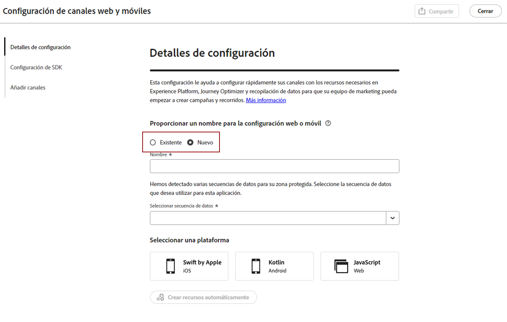
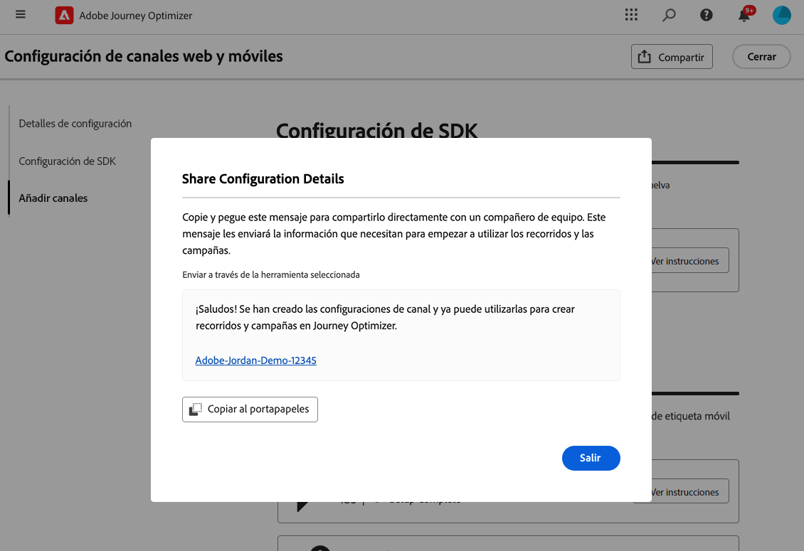

# Configuración de Android Mobile {#set-mobile-android}

>[!IMPORTANT]
>
>Para garantizar la compatibilidad y el rendimiento óptimo, asegúrese de utilizar las siguientes versiones de SDK:
>
> * Core 3.1.0 o posterior
> * Messaging 3.1.0 o posterior

Esta configuración de Android optimiza la configuración rápida de los canales de marketing, lo que garantiza que todos los recursos necesarios sean fácilmente accesibles desde las aplicaciones de Experience Platform, Journey Optimizer y de recopilación de datos. Esto permite a su equipo de marketing empezar a crear campañas y recorridos rápidamente.

## Crear una nueva configuración de Android {#new-setup-android}

>[!CONTEXTUALHELP]
>id="ajo_mobile_web_setup_android_initialization_code"
>title="Añadir código de inicialización"
>abstract="Integre el código de inicialización en el método **onCreate()** de su aplicación. Este método se ejecuta cuando se crea la aplicación por primera vez, lo que garantiza que el código se ejecute durante la fase de configuración inicial. La correcta ubicación del código aquí es crucial para garantizar que la aplicación se configure e inicialice correctamente antes de realizar cualquier operación posterior."

>[!CONTEXTUALHELP]
>id="ajo_mobile_web_setup_android_dependencies_add"
>title="Añadir dependencias"
>abstract="Debe añadir las siguientes bibliotecas al proyecto mediante el archivo Gradle de la aplicación: Core, Assurance, Edge, Edge Identity y Messaging."

>[!CONTEXTUALHELP]
>id="ajo_mobile_web_setup_android_dependencies_import"
>title="Importar dependencias"
>abstract="En la clase Application de la aplicación, importe los siguientes paquetes: Mobile Core, Assurance, Edge, Edge Identity y Messaging."
>additional-url="https://experienceleague.adobe.com/en/docs/platform-learn/implement-mobile-sdk/app-implementation/install-sdks#import-extensions" text="Consulte Documentación de recopilación de datos"

<!--
>[!CONTEXTUALHELP]
>id="ajo_mobile_web_setup_push_token_android"
>title="Retrieve the device token"
>abstract="TBC"

>[!CONTEXTUALHELP]
>id="ajo_mobile_web_setup_push_android_studio"
>title="Launch the application from Android Studio"
>abstract="TBC"
-->

1. En la página de inicio de Journey Optimizer, haga clic en **[!UICONTROL Comenzar]** en la tarjeta **[!UICONTROL Configurar canales móviles y web]**.

   

1. Crear una configuración de **[!UICONTROL New]**.

   Si ya tiene configuraciones existentes, puede elegir seleccionar una o crear una nueva configuración.

   

1. Escriba un **[!UICONTROL Nombre]** para la nueva configuración y seleccione o cree su **[!UICONTROL secuencia de datos]**. Este **[!UICONTROL Nombre]** se usará para cada recurso creado automáticamente.

1. Si su organización tiene varias secuencias de datos, seleccione una de las opciones existentes. Si no tiene una secuencia de datos, se creará una automáticamente.

1. Seleccione la plataforma de Android que desee configurar y haga clic en **[!UICONTROL Crear recursos automáticamente]**.

   

1. Para optimizar el proceso de configuración, se crean automáticamente los recursos necesarios para ayudarle a empezar. Esto incluye la creación de una nueva **[!UICONTROL propiedad de etiquetas móviles]** y la instalación de extensiones.

   A continuación se muestra una lista completa de todos los recursos que se generan automáticamente:

+++ Recursos creados

   <table>
    <thead>
    <tr>
    <th><strong>Solución</strong></th>
    <th><strong>Recursos creados automáticamente</strong></th>
    </tr>
    </thead>
    <tbody>
    <tr>
    <td>
    
Journey Optimizer

    </td>
    <td>
    <ul>
    <li>Configuración de canal</li>
    <li>Credencial push (solo mensaje push móvil)</li>
    </ul>
    </td>
    </tr>
    <tr>
    <td>
    
Etiquetas

    </td>
    <td>
    <ul>
    <li>Propiedad de etiqueta móvil</li>
    <li>Reglas</li>
    <li>Elementos de datos</li>
    <li>Biblioteca</li>
    <li>Entornos (ensayo, producción, desarrollo)</li>
    </ul>
    </td>
    </tr>
    <tr>
    <td>
    
Extensiones de etiquetas

    </td>
    <td>
    <ul>
    <li>Edge Network de Adobe Experience Platform</li>
    <li>Adobe Journey Optimizer</li>
    <li>AEP Assurance</li>
    <li>Consentimiento (con las directivas de consentimiento predeterminadas habilitadas)</li>
    <li>Identidad (con ECID predeterminado, con reglas de vinculación predeterminadas)</li>
    <li>Mobile Core</li>
    </ul>
    </td>
    </tr>
    <tr>
    <td>
    
Assurance

    </td>
    <td>
    
Sesión de Assurance

    </td>
    </tr>
    <tr>
    <td>
    
Secuencias de datos

    </td>
    <td>
    
Flujo de datos con servicios

    </td>
    </tr>
    <tr>
    <td>
    
Experience Platform

    </td>
    <td>
    <ul>
    <li>Conjunto de datos</li>
    <li>Esquema</li>
    </ul>
    </td>
    </tr>
    </tbody>
    </table>

+++

1. Una vez que finalice la generación de recursos, haga clic en **[!UICONTROL Configurar]** para comenzar a configurar el SDK.

   

1. Primero debe agregar e importar dependencias como se describe en la interfaz de usuario. [Más información](https://experienceleague.adobe.com/en/docs/platform-learn/implement-mobile-sdk/app-implementation/install-sdks).

1. Copie y pegue el siguiente código en el método onCreate() de la aplicación.

1. Para validar el SDK directamente en la aplicación móvil, simplemente abre la aplicación móvil y permite el acceso a [Adobe Assurance](https://experienceleague.adobe.com/en/docs/experience-platform/assurance/home). Assurance es una potente herramienta que le permite probar y validar exhaustivamente la implementación, asegurándose de que todo funcione correctamente.

   Una vez conectado, el dispositivo se detectará automáticamente y aparecerá en el menú desplegable **[!UICONTROL Dispositivo disponible]**, lo que le permitirá supervisar y solucionar problemas de la configuración en tiempo real.

   

1. Haga clic en **[!UICONTROL Conectar]**.

1. Ahora puede configurar sus canales [En la aplicación](#inapp-channel) o [Push](#push-channel).

1. Después de completar la configuración, comparte la **[!UICONTROL configuración del canal]** generada automáticamente con los integrantes del equipo responsables de crear Recorridos y campañas.

   Se debe hacer referencia a la **[!UICONTROL Configuración del canal]** en la interfaz de Campañas o Recorridos, lo que permite una conexión perfecta entre la configuración y la ejecución de recorridos y campañas de destino para su audiencia.

   

## Modificar una configuración existente {#reconnect}

Después de crear la configuración, puede revisarla fácilmente en cualquier momento para agregar canales adicionales o hacer más ajustes para adaptarlos a sus necesidades

1. En la página de inicio de Journey Optimizer, haga clic en **[!UICONTROL Comenzar]** en la tarjeta **[!UICONTROL Configurar canales móviles y web]**.

   

1. Seleccione **[!UICONTROL Existente]** y elija su **[!UICONTROL propiedad de etiqueta]** existente en la lista desplegable.

   

1. Al acceder a la configuración existente, debe volver a conectarse con Adobe Assurance. En el menú Configuración del SDK, haga clic en **[!UICONTROL Volver a conectar]**.

1. Seleccione su dispositivo en la lista desplegable **[!UICONTROL Dispositivos disponibles]** y haga clic en **[!UICONTROL Conectar]**.

1. Ahora puede actualizar la configuración según sea necesario.

## Configuración del canal en la aplicación {#inapp-channel}

<!--
>[!CONTEXTUALHELP]
>id="ajo_mobile_web_setup_inapp_tag_property"
>title="Choose your tag property"
>abstract="TBC"
-->

El canal en la aplicación no requiere ninguna configuración adicional. Para comprobar que la configuración es precisa, puede enviar fácilmente un mensaje de prueba mediante la función Assurance. Esto proporcionará información inmediata sobre la preparación del sistema para enviar mensajes en la aplicación de forma eficaz.

Para ello, simplemente haga clic en **[!UICONTROL Mostrar mensaje en la aplicación]**.

Para optimizar el proceso de configuración, se crean automáticamente los recursos necesarios para ayudarle a empezar. Esto incluye la creación de una Configuración de canal.

Ahora puede enviar mensajes en la aplicación usando la **[!UICONTROL Configuración del canal]** configurada anteriormente. [Aprenda a crear mensajes en la aplicación](../in-app/create-in-app.md)

## Configuración del canal push {#push-channel}

>[!CONTEXTUALHELP]
>id="ajo_mobile_web_setup_push_token"
>title="Recuperar el token del dispositivo"
>abstract="Para asegurarse de que el token push del dispositivo esté correctamente sincronizado con el perfil de Adobe Experience Platform, debe incorporar el siguiente código en la aplicación. Esta integración es esencial para mantener las capacidades de comunicación actualizadas y garantizar una experiencia de usuario perfecta."

>[!CONTEXTUALHELP]
>id="ajo_mobile_web_setup_push_xcode"
>title="Iniciar la aplicación desde Xcode"
>abstract="Para obtener el token push, primero, inicie la aplicación con Xcode. Una vez iniciada la aplicación, reiníciela para asegurarse de que se ha completado el proceso de validación. El Adobe proporcionará el token push como parte de los resultados de validación. Este token es esencial para habilitar las notificaciones push y se mostrará una vez que la configuración se haya validado correctamente."

>[!CONTEXTUALHELP]
>id="ajo_mobile_web_push_certificate_fcm"
>title="Proporcionar un certificado push"
>abstract="Arrastre y suelte el archivo de clave privada .json. Este archivo contiene la información de autenticación necesaria para la integración segura y la comunicación entre la aplicación y el servidor."

1. Una vez configurado el SDK móvil, haz clic en **[!UICONTROL Agregar]** desde la tarjeta de notificaciones push.

1. Recupere el token de dispositivo insertando el código proporcionado en la función de devolución de llamada `FireBaseMessaging.getInstance.getToken ()` en la interfaz de usuario.

1. Registre el servicio de mensajería agregando el código proporcionado en la interfaz de usuario al archivo `AndroidManifest.xml`.

1. Arrastre y suelte el archivo de clave privada .json.

1. Para comprobar que la configuración es precisa, puede enviar fácilmente un mensaje de prueba mediante la función Assurance. Esto proporcionará información inmediata sobre la preparación del sistema para enviar notificaciones push de forma eficaz.

   Para ello, simplemente haga clic en **[!UICONTROL Enviar mensaje push]**.

Para optimizar el proceso de configuración, se crean automáticamente los recursos necesarios para ayudarle a empezar. Esto incluye la creación de una **[!UICONTROL configuración de canal]** y una **[!UICONTROL credencial push]**.

Ahora puede enviar notificaciones push usando la **[!UICONTROL Configuración de canal]** configurada anteriormente. [Aprenda a crear notificaciones push](../push/create-push.md)
