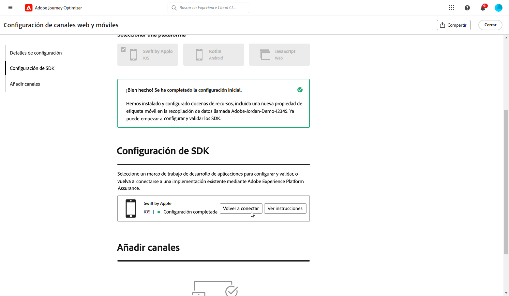
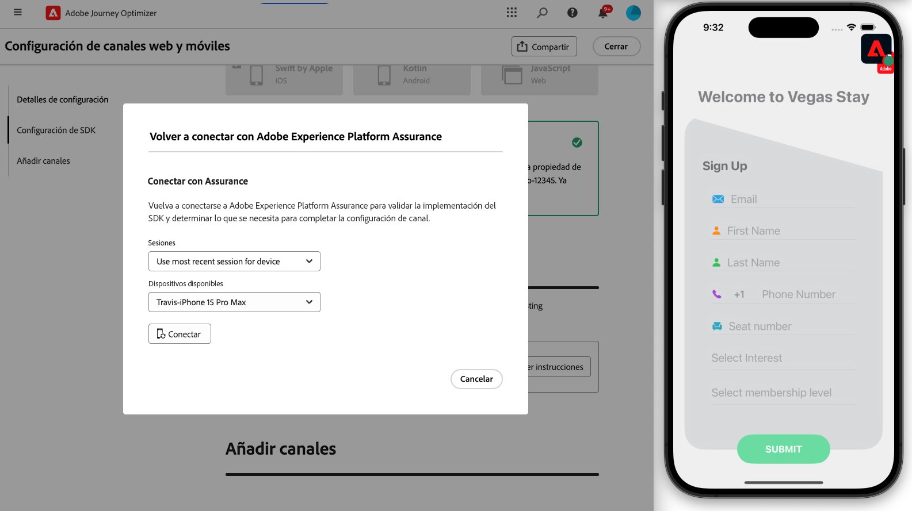

# Configuración de iOS Mobile {#set-mobile-ios}

>[!IMPORTANT]
>
>Para garantizar la compatibilidad y el rendimiento óptimo, asegúrese de utilizar las siguientes versiones de SDK:
>
> * SDK principal: 5.2.0 o posterior
> * SDK de mensajería: 5.1.1 o posterior

Esta configuración de iOS simplifica la configuración rápida de los canales de marketing, lo que facilita la disponibilidad de todos los recursos esenciales en las aplicaciones de Experience Platform, Journey Optimizer y de recopilación de datos. Esto permite a su equipo de marketing empezar a crear campañas y recorridos rápidamente.

## Crear una nueva configuración de iOS {#new-setup-ios}

1. En la página de inicio de Journey Optimizer, haga clic en **[!UICONTROL Comenzar]** en la tarjeta **[!UICONTROL Configurar canales móviles y web]**.

   

1. Crear una configuración de **[!UICONTROL New]**.

   Si ya tiene configuraciones existentes, puede elegir seleccionar una o crear una nueva configuración.

   

1. Escriba un **[!UICONTROL Nombre]** para la nueva configuración y seleccione o cree su **[!UICONTROL secuencia de datos]**. Este **[!UICONTROL Nombre]** se usará para cada recurso creado automáticamente.

1. Si su organización tiene varias secuencias de datos, seleccione una de las opciones existentes. Si no tiene una secuencia de datos, se creará una automáticamente.

1. Seleccione la plataforma iOS y haga clic en **[!UICONTROL Crear recursos automáticamente]**.

   

1. Para optimizar el proceso de configuración, se crean automáticamente los recursos necesarios para ayudarle a empezar. Esto incluye la creación de una nueva **[!UICONTROL propiedad de etiquetas móviles]** y la instalación de extensiones.

   A continuación se muestra una lista completa de todos los recursos que se generan automáticamente:

+++ Recursos creados

   <table>
    <thead>
    <tr>
    <th><strong>Solución</strong></th>
    <th><strong>Recursos creados automáticamente</strong></th>
    </tr>
    </thead>
    <tbody>
    <tr>
    <td>
    <p>Journey Optimizer</p>
    </td>
    <td>
    <ul>
    <li>Configuración de canal</li>
    <li>Credencial push (solo mensaje push móvil)</li>
    </ul>
    </td>
    </tr>
    <tr>
    <td>
    <p>Etiquetas</p>
    </td>
    <td>
    <ul>
    <li>Propiedad de etiqueta móvil</li>
    <li>Reglas</li>
    <li>Elementos de datos</li>
    <li>Biblioteca</li>
    <li>Entornos (ensayo, producción, desarrollo)</li>
    </ul>
    </td>
    </tr>
    <tr>
    <td>
    <p>Extensiones de etiquetas</p>
    </td>
    <td>
    <ul>
    <li>Edge Network de Adobe Experience Platform</li>
    <li>Adobe Journey Optimizer</li>
    <li>AEP Assurance</li>
    <li>Consentimiento (con las directivas de consentimiento predeterminadas habilitadas)</li>
    <li>Identidad (con ECID predeterminado, con reglas de vinculación predeterminadas)</li>
    <li>Mobile Core</li>
    </ul>
    </td>
    </tr>
    <tr>
    <td>
    <p>Assurance</p>
    </td>
    <td>
    <p>Sesión de Assurance</p>
    </td>
    </tr>
    <tr>
    <td>
    <p>Secuencias de datos</p>
    </td>
    <td>
    <p>Flujo de datos con servicios</p>
    </td>
    </tr>
    <tr>
    <td>
    <p>Experience Platform</p>
    </td>
    <td>
    <ul>
    <li>Conjunto de datos</li>
    <li>Esquema</li>
    </ul>
    </td>
    </tr>
    </tbody>
    </table>

+++

1. Una vez que finalice la generación de recursos, haga clic en **[!UICONTROL Configurar]** para comenzar a configurar el SDK.

   

1. Primero debe agregar e importar dependencias como se describe en la interfaz de usuario. [Más información](https://experienceleague.adobe.com/en/docs/platform-learn/implement-mobile-sdk/app-implementation/install-sdks).

1. Inserte el código de inicialización en el método `onCreate()` de la aplicación. Este código de prueba le permite conectarse a Assurance y validar la configuración de la aplicación antes de pasar a producción.

   {zoomable="yes"}

1. Para validar el SDK directamente en la aplicación móvil, simplemente abre la aplicación móvil y permite el acceso a [Adobe Assurance](https://experienceleague.adobe.com/en/docs/experience-platform/assurance/home). Assurance es una potente herramienta que le permite probar y validar exhaustivamente la implementación, asegurándose de que todo funcione correctamente.

   Una vez conectado, el dispositivo se detectará automáticamente y aparecerá en el menú desplegable **[!UICONTROL Dispositivo disponible]**, lo que le permitirá supervisar y solucionar problemas de la configuración en tiempo real.

   {zoomable="yes"}

1. Haga clic en **[!UICONTROL Conectar]**.

   {zoomable="yes"}

1. Ahora puede configurar sus canales [En la aplicación](#inapp-channel) o [Push](#push-channel).

1. Después de completar la configuración, comparte la **[!UICONTROL configuración del canal]** generada automáticamente con los integrantes del equipo responsables de crear Recorridos y campañas.

   Se debe hacer referencia a la **[!UICONTROL Configuración del canal]** en la interfaz de Campañas o Recorridos, lo que permite una conexión perfecta entre la configuración y la ejecución de recorridos y campañas de destino para su audiencia.

   {zoomable="yes"}

## Modificar una configuración existente {#reconnect}

Después de crear la configuración, puede revisarla fácilmente en cualquier momento para agregar canales adicionales o hacer más ajustes para adaptarlos a sus necesidades

1. En la página de inicio de Journey Optimizer, haga clic en **[!UICONTROL Comenzar]** en la tarjeta **[!UICONTROL Configurar canales móviles y web]**.

   

1. Seleccione **[!UICONTROL Existente]** y elija su **[!UICONTROL propiedad de etiqueta]** existente en la lista desplegable.

   

1. Al acceder a la configuración existente, debe volver a conectarse con Adobe Assurance. En el menú Configuración del SDK, haga clic en **[!UICONTROL Volver a conectar]**.

   

1. Seleccione su dispositivo en la lista desplegable **[!UICONTROL Dispositivos disponibles]** y haga clic en **[!UICONTROL Conectar]**.

   {zoomable="yes"}

1. Ahora puede actualizar la configuración según sea necesario.

## Configuración del canal en la aplicación {#inapp-channel}

El canal en la aplicación no requiere ninguna configuración adicional. Para comprobar que la configuración es precisa, puede enviar fácilmente un mensaje de prueba mediante la función Assurance. Esto proporcionará información inmediata sobre la preparación del sistema para enviar mensajes en la aplicación de forma eficaz.

Para ello, simplemente haga clic en **[!UICONTROL Mostrar mensaje en la aplicación]**.

{zoomable="yes"}

Para optimizar el proceso de configuración, se crean automáticamente los recursos necesarios para ayudarle a empezar. Esto incluye la creación de una Configuración de canal.

Ahora puede enviar mensajes en la aplicación usando la **[!UICONTROL Configuración del canal]** configurada anteriormente. [Aprenda a crear mensajes en la aplicación](../in-app/create-in-app.md)

## Configuración del canal push {#push-channel}

>[!CONTEXTUALHELP]
>id="ajo_mobile_web_setup_push_certificate"
>title="Proporcionar un certificado push"
>abstract="El archivo de clave .p8 contiene una clave privada que se utiliza para autenticar la aplicación con los servidores de Apple para notificaciones push seguras. Puede adquirir esta clave desde la página Certificados, identificadores y perfiles de su cuenta de desarrollador."

>[!CONTEXTUALHELP]
>id="ajo_mobile_web_setup_push_key_id"
>title="ID de clave"
>abstract="La Key ID, una cadena de 10 caracteres asignada durante la creación de la clave de autenticación p8, se encuentra en la ficha **Keys** de la página Certificados, identificadores y perfiles de su cuenta de desarrollador."

>[!CONTEXTUALHELP]
>id="ajo_mobile_web_setup_push_team_id"
>title="ID de equipo"
>abstract="El identificador de equipo, un valor de cadena usado para identificar a tu equipo, se encuentra en la ficha **Pertenencia** de tu cuenta de desarrollador."

1. Una vez configurado el SDK móvil, haz clic en **[!UICONTROL Agregar]** desde la tarjeta de notificaciones push.

1. Primero, dentro del método `didRegisterForRemoteNotificationsWithDeviceToken` de su `AppDelegate`, agregue el siguiente código para sincronizar el token push del dispositivo con su perfil de Adobe Experience Platform.

   ```
   MobileCore.setPushIdentifier(deviceToken)
   ```

1. Arrastre y suelte su archivo .p8 de clave de autenticación de notificaciones push de Apple. Esta clave se puede adquirir desde la página Certificados, identificadores y perfiles.

1. Proporcione la siguiente información:

   * ID de clave: una cadena de 10 caracteres asignada durante la creación de la clave de autenticación p8. Se encuentra en la pestaña Claves de la página Certificados, identificadores y perfiles.

   * ID del equipo: un valor de cadena que se puede encontrar en la pestaña Pertenencia.

   {zoomable="yes"}

1. Para comprobar que la configuración es precisa, puede enviar fácilmente un mensaje de prueba mediante la función Assurance. Esto proporcionará información inmediata sobre la preparación del sistema para enviar notificaciones push de forma eficaz.

   Para ello, simplemente haga clic en **[!UICONTROL Enviar mensaje push]**.

   {zoomable="yes"}

Para optimizar el proceso de configuración, se crean automáticamente los recursos necesarios para ayudarle a empezar. Esto incluye la creación de una **[!UICONTROL configuración de canal]** y una **[!UICONTROL credencial push]**.

Ahora puede enviar notificaciones push usando la **[!UICONTROL Configuración de canal]** configurada anteriormente. [Aprenda a crear notificaciones push](../push/create-push.md)
