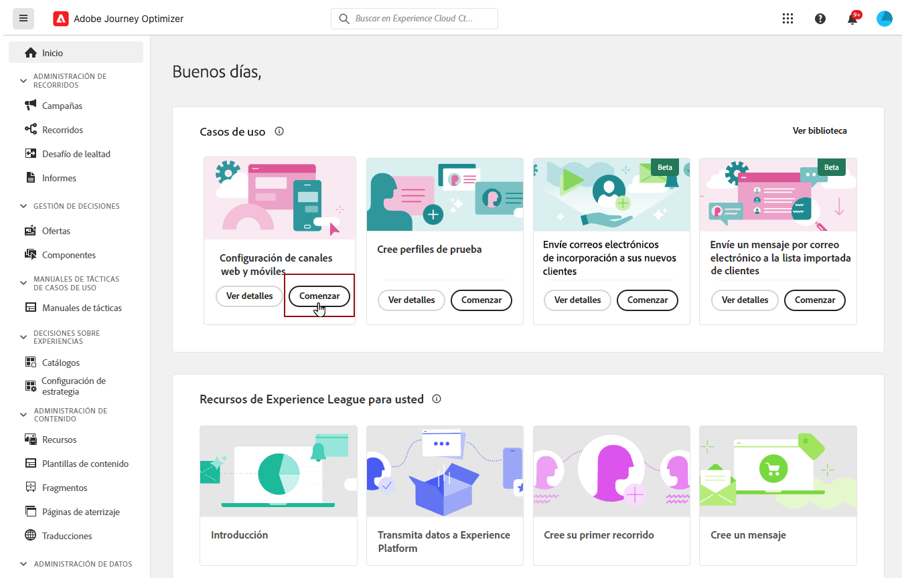

# Configuración web establecida {#set-mobile-web}

>[!CONTEXTUALHELP]
>id="ajo_mobile_web_setup_javascript_code"
>title="Código JavaScript "
>abstract="La etiqueta `<head>` contiene metadatos y recursos esenciales que se cargan antes del contenido principal de la página web. Colocar el código en esta sección garantiza que se inicialice y ejecute correctamente antes de tiempo, lo que permite que la página web se cargue y funcione de forma eficaz. Al agregar código a la sección `<head>`, ayudará a mejorar la estructura, el rendimiento y la experiencia general del usuario en el sitio."

>[!CONTEXTUALHELP]
>id="ajo_mobile_web_setup_javascript_site"
>title="Iniciar sitio y validar"
>abstract="Una vez que el código se haya implementado correctamente y esté activo en el sitio web, proporcione la URL base. Si es necesario, puede volver a esta página en una fase posterior para volver a validar y confirmar que la configuración funciona según lo esperado."

Esta configuración facilita la configuración rápida de los canales de marketing, lo que garantiza que todos los recursos necesarios estén fácilmente disponibles en Experience Platform, Journey Optimizer y la recopilación de datos. Esto permite a su equipo de marketing iniciar inmediatamente la creación de campañas y recorridos.

## Creación de una nueva configuración web {#new-setup}

1. En la página de inicio de Journey Optimizer, haga clic en **[!UICONTROL Comenzar]** en la tarjeta **[!UICONTROL Configurar canales móviles y web]**.

   

1. Crear una configuración de **[!UICONTROL New]**.

   Si ya tiene configuraciones existentes, puede elegir seleccionar una o crear una nueva configuración.

   

1. Escriba un **[!UICONTROL Nombre]** para la nueva configuración y seleccione o cree su **[!UICONTROL secuencia de datos]**. Este **[!UICONTROL Nombre]** se usará para cada recurso creado automáticamente.

1. Si su organización tiene varias secuencias de datos, seleccione una de las opciones existentes. Si no tiene una secuencia de datos, se creará una automáticamente.

1. Seleccione la plataforma web y haga clic en **[!UICONTROL Crear recursos automáticamente]**.

   

1. Para optimizar el proceso de configuración, se crean automáticamente los recursos necesarios para ayudarle a empezar.

   A continuación se muestra una lista completa de todos los recursos que se generan automáticamente:

+++ Recursos creados

   <table>
    <thead>
    <tr>
    <th><strong>Solución</strong></th>
    <th><strong>Recursos creados automáticamente</strong></th>
    </tr>
    </thead>
    <tbody>
    <tr>
    </tr>
    <tr>
    <td>
    
Etiquetas

    </td>
    <td>
    <ul>
    <li>Propiedad de etiqueta móvil</li>
    <li>Reglas</li>
    <li>Elementos de datos</li>
    <li>Biblioteca</li>
    <li>Entornos (ensayo, producción, desarrollo)</li>
    </ul>
    </td>
    </tr>
    <tr>
    <td>
    
Extensiones de etiquetas

    </td>
    <td>
    <ul>
    <li>Edge Network de Adobe Experience Platform</li>
    <li>Adobe Journey Optimizer</li>
    <li>AEP Assurance</li>
    <li>Consentimiento (con las directivas de consentimiento predeterminadas habilitadas)</li>
    <li>Identidad (con ECID predeterminado, con reglas de vinculación predeterminadas)</li>
    <li>Mobile Core</li>
    </ul>
    </td>
    </tr>
    <tr>
    <td>
    
Assurance

    </td>
    <td>
    
Sesión de Assurance

    </td>
    </tr>
    <tr>
    <td>
    
Secuencias de datos

    </td>
    <td>
    
Flujo de datos con servicios

    </td>
    </tr>
    <tr>
    <td>
    
Experience Platform

    </td>
    <td>
    <ul>
    <li>Conjunto de datos</li>
    <li>Esquema</li>
    </ul>
    </td>
    </tr>
    </tbody>
    </table>

+++

1. Una vez que finalice la generación de recursos, haga clic en **[!UICONTROL Configurar]** para comenzar a configurar el SDK.

   

1. Pegue el código mostrado en la pantalla en la etiqueta `<head>` del documento.

   {zoomable="yes"}

1. Para validar el SDK directamente en la aplicación móvil, simplemente pegue la URL base.

   {zoomable="yes"}

1. Seleccione **[!UICONTROL Iniciar sitio y validar]** para conectar su sitio.

   {zoomable="yes"}

1. Después de completar la configuración, comparte la **[!UICONTROL propiedad web móvil]** generada automáticamente con los integrantes del equipo responsables de crear Recorridos y campañas.

   Se debe hacer referencia a la **[!UICONTROL propiedad web móvil]** en la interfaz de Campañas o Recorridos, lo que permite una conexión perfecta entre la configuración y la ejecución de recorridos y campañas de destino para la audiencia.

   

Ahora puede crear páginas web utilizando la **[!UICONTROL propiedad web móvil]** configurada anteriormente. [Aprenda a crear una página web](../web/create-web.md)

## Modificar una configuración existente {#reconnect}

Después de crear la configuración, puede revisarla fácilmente en cualquier momento para agregar canales adicionales o hacer más ajustes para adaptarlos a sus necesidades

1. En la página de inicio de Journey Optimizer, haga clic en **[!UICONTROL Comenzar]** en la tarjeta **[!UICONTROL Configurar canales móviles y web]**.

   

1. Seleccione **[!UICONTROL Existente]** y elija su **[!UICONTROL propiedad de etiqueta]** existente en la lista desplegable.

   

1. Ahora puede actualizar la configuración según sea necesario.
