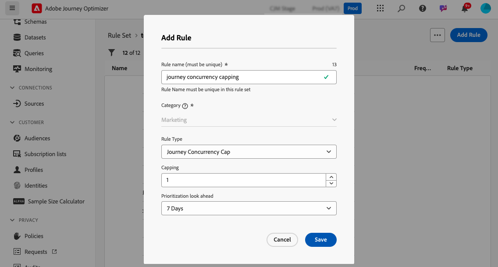

# Límite y arbitraje de recorrido {#journey-capping}

>[!AVAILABILITY]
>
>Las funciones de conflictos y priorización están disponibles en Disponibilidad limitada para un grupo selecto de clientes. Tenga en cuenta que estas funciones se implementarán gradualmente para más usuarios en el futuro. Póngase en contacto con el equipo de la cuenta si está interesado en que se le añada a la lista de espera de estas funciones.

La restricción de recorrido le ayuda a limitar el número de recorridos en los que se puede inscribir un perfil, lo que evita la sobrecarga de comunicaciones. En Journey Optimizer, puede establecer dos tipos de reglas de límite:

* **Límite de entrada** limita el número de entradas de recorrido durante un período determinado para un perfil.
* **Límite de concurrencia** limita la cantidad de recorridos en los que se puede inscribir un perfil simultáneamente.

Ambos tipos de límite de recorrido aprovechan las puntuaciones de prioridad para arbitrar entradas.

>[!AVAILABILITY]
>
>Los conjuntos de reglas de dominio **Recorrido** solo están disponibles para un conjunto limitado de usuarios (disponibilidad limitada). Para obtener acceso, póngase en contacto con su representante de Adobe.

➡️ [Descubra esta funcionalidad en vídeo](#video)

## Crear una regla de restricción de recorrido {#create-rule}

>[!CONTEXTUALHELP]
>id="ajo_rule_set_concurrency_prioritization"
>title="Priorización de cara al futuro"
>abstract=" Si se programa un recorrido de mayor prioridad dentro del período de tiempo especificado aquí, se impedirá que el cliente entre en este recorrido. Para situaciones en las que desea que los recorridos se incluyan por orden de llegada, le sugerimos que elija el periodo de actualización Diario y que garantice que la puntuación de prioridad de cualquier otro recorrido de ese día sea menor que la puntuación de prioridad del recorrido. Proporcionar una puntuación de prioridad de 100 a un recorrido también garantizaría que se inicie."

>[!CONTEXTUALHELP]
>id="ajo_rule_set_rule_type"
>title="Tipo de regla"
>abstract="Especifique el tipo de restricción para la regla. **[!UICONTROL Límite de entrada a recorridos]** limita el número de entradas en el recorrido durante un período determinado para un perfil, mientras que **[!UICONTROL Límite de simultaneidad de recorridos]** limita a cuántos recorridos puede estar inscrito un perfil simultáneamente."

Para crear una regla de límite de recorrido, siga estos pasos:

1. Vaya al menú **[!UICONTROL Reglas de negocio]** para acceder al inventario de conjuntos de reglas.

1. Seleccione el conjunto de reglas en el que desea agregar la regla de límite o cree un nuevo conjunto de reglas:

   * Para utilizar un conjunto de reglas existente, selecciónelo en la lista. Las reglas de restricción de recorrido solo se pueden agregar a conjuntos de reglas con el dominio &quot;recorrido&quot;. Puede comprobar esta información en las listas de conjuntos de reglas, en la columna **[!UICONTROL Dominio]**.

     

   * Para crear la regla de límite dentro de un nuevo conjunto de reglas, haga clic en **[!UICONTROL Crear conjunto de reglas]**, especifique un nombre único para el conjunto de reglas y seleccione &quot;Recorrido&quot; en la lista desplegable **[!UICONTROL Dominio del conjunto de reglas]**; a continuación, haga clic en **[!UICONTROL Guardar]**.

     

1. En la pantalla del conjunto de reglas, haga clic en el botón **[!UICONTROL Agregar regla]** y, a continuación, configure la regla para adaptarla a sus necesidades:

   

   * Proporcione un nombre único para la regla.

   * En la lista desplegable **[!UICONTROL Tipo de regla]**, especifique el tipo de límite para la regla.

      * **[!UICONTROL Límite de entrada de Recorrido]**: Limita el número de entradas en el recorrido durante un período determinado para un perfil.
      * **[!UICONTROL Límite de concurrencia de Recorrido]**: Limita la cantidad de recorridos en los que se puede inscribir un perfil simultáneamente.

   * Expanda las secciones siguientes para aprender a configurar cada tipo de límite:

     +++Configuración de una regla de límite de entrada de recorrido

      1. En el campo **[!UICONTROL Límite]**, establezca el número máximo de recorridos que puede ingresar un perfil.
      1. En el campo **[!UICONTROL Duración]**, defina el período de tiempo que debe tenerse en cuenta. Tenga en cuenta que la duración se basa en la zona horaria UTC. Por ejemplo, el Límite diario se restablecerá a medianoche UTC.

     >[!AVAILABILITY]
     >
     >La duración &quot;Diaria&quot; solo está disponible para un conjunto de organizaciones (Disponibilidad limitada). Para obtener acceso, póngase en contacto con su representante de Adobe.

     En este ejemplo, queremos restringir la entrada de perfiles en más de &quot;5&quot; recorridos en un mes.

     

     >[!NOTE]
     >
     >El sistema tendrá en cuenta la prioridad de los próximos recorridos programados que tengan aplicada esta misma regla.
     >
     >En este ejemplo, si el especialista en marketing ya ha introducido 4 recorridos y hay otro recorrido programado para este mes con una prioridad más alta, se impedirá que los clientes entren en el recorrido de prioridad más baja.

     +++

     +++Configuración de una regla de límite de concurrencia de recorrido

      1. En el campo **[!UICONTROL Límite]**, establezca el número máximo de recorridos en los que se puede inscribir un perfil simultáneamente.

      1. Utilice el campo **[!UICONTROL Establecimiento de prioridades para mirar hacia delante]** para arbitrar las entradas de recorridos en función de las puntuaciones de prioridad durante un período elegido (por ejemplo, 1 día, 7 días, 30 días). Esto ayuda a priorizar la entrada en recorridos de mayor valor si un perfil es apto para varios recorridos.

     En este ejemplo, queremos restringir la entrada de perfiles en la recorrido si ya están inscritos en otro recorrido que contenga el mismo conjunto de reglas. Si otro recorrido en los próximos 7 días tiene una puntuación de prioridad más alta, el perfil no entrará en este recorrido.

     {width="50%" zommable="yes"}

     +++

1. Cuando la regla de límite esté lista para aplicarse a los recorridos, actívela haciendo clic en el botón de puntos suspensivos situado junto a su nombre.

   

1. Active todo el conjunto de reglas haciendo clic en el botón de puntos suspensivos situado junto al botón Agregar regla en la esquina superior derecha de la pantalla.

   

## Aplicación de reglas de restricción a los recorridos {#apply-capping}

>[!CONTEXTUALHELP]
>id="ajo_journey_capping_rule"
>title="Aplicar conjunto de reglas a los recorridos"
>abstract="Aplique un conjunto de reglas para excluir este recorrido aparte del público según las reglas de restricción de frecuencia."

Para aplicar una regla de límite a un recorrido, acceda al recorrido y abra sus propiedades. En el menú desplegable **[!UICONTROL Reglas de límite]**, seleccione el conjunto de reglas correspondiente. Una vez activado el recorrido, las reglas de límite definidas en el conjunto de reglas surtirán efecto.

>[!IMPORTANT]
>
>Si un recorrido se activa inmediatamente, el sistema puede tardar hasta 20 minutos en empezar a suprimir clientes. Puede programar su recorrido para que comience al menos 20 minutos en el futuro para evitar esta posibilidad.

Una vez que el recorrido esté activo, puede registrar en el informe de recorrido si el conjunto de reglas ha dado lugar a alguna exclusión del recorrido, en la tabla **[!UICONTROL Exclusiones de Recorrido]**. [Aprenda a trabajar con informes de recorrido](../reports/journey-global-report-cja.md)

## Vídeo práctico {#video}

>[!VIDEO](https://video.tv.adobe.com/v/3447617?quality=12&captions=spa)
