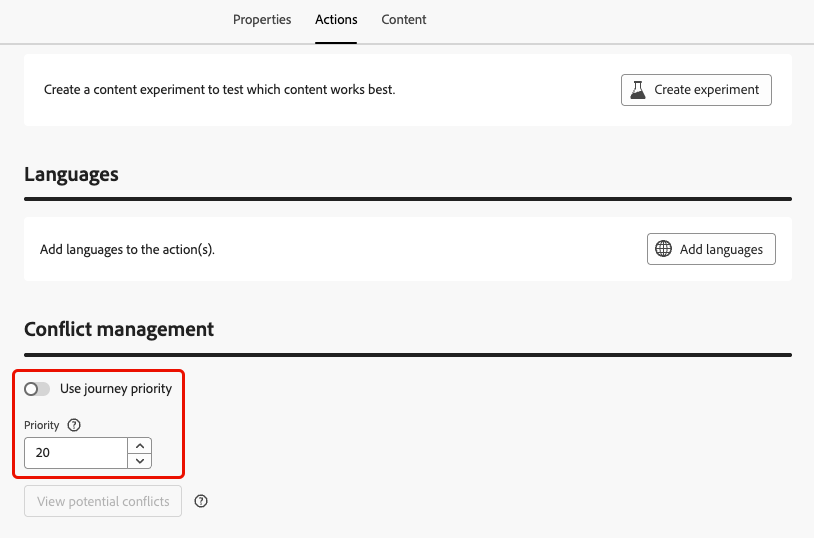

# Asignar puntuaciones de prioridad {#priority}

Journey Optimizer le permite asignar una puntuación de prioridad a un recorrido, a una campaña o a una acción de canal entrante dentro de la actividad **[!UICONTROL Acción]** de recorrido.

La prioridad es esencial para priorizar un recorrido, una campaña o una acción cuando hay una restricción impuesta (como un límite de frecuencia).

En situaciones en las que un cliente cumple los requisitos para muchos recorridos, campañas o comunicaciones y desea ser selectivo sobre qué debe introducir y recibir, debe utilizar este campo.

## Asignar puntuaciones de prioridad a recorridos y campañas {#priority-journey-campaign}

>[!CONTEXTUALHELP]
>id="ajo_campaigns_campaign_priority"
>title="Prioridad"
>abstract="Asigne una puntuación de prioridad a la campaña. La prioridad es esencial para dar prioridad a una campaña cuando hay una restricción impuesta, como un límite de frecuencia. Introduzca un valor numérico (de 0 a 100). Tenga en cuenta que, cuanto mayor sea el número, también lo será la prioridad. En situaciones en las que dos campañas tienen la misma puntuación de prioridad, se muestra la campaña que se activó primero."

>[!CONTEXTUALHELP]
>id="ajo_journey_priority"
>title="Prioridad"
>abstract="Asigne una puntuación de prioridad al recorrido. La prioridad es esencial para dar prioridad a un recorrido cuando hay una restricción impuesta, como un límite de frecuencia. Introduzca un valor numérico (de 0 a 100). Tenga en cuenta que, cuanto mayor sea el número, también lo será la prioridad. En situaciones en las que dos recorridos tienen la misma puntuación de prioridad, se muestra el recorrido que se activó primero."

➡️ [Descubra esta funcionalidad en vídeo](#video)

Asignar una puntuación de prioridad es crucial para la comunicación entrante, como web, móvil y en la aplicación. Si tiene varias campañas con la misma configuración de canal (por ejemplo, un banner en la parte superior de la página web), esto podría resultar problemático, ya que solo se puede mostrar contenido de una campaña de forma factible. La puntuación de prioridad es donde insertará su preferencia para la campaña que debe mostrarse cuando el destinatario pueda cumplir los requisitos para más de una campaña.

>[!NOTE]
>
>En las campañas, la puntuación de prioridad solo está disponible para los canales entrantes web, en la aplicación y basados en código.

Para asignar una puntuación de prioridad a un recorrido o campaña, escriba un valor numérico (de 0 a 100) en el campo **[!UICONTROL Puntuación de prioridad]** ubicado en las propiedades de recorrido o campaña. Cuanto mayor sea el número, mayor será la prioridad.

Si fuera el autor de esta campaña y quisiera asegurarse de que se muestra su contenido, le daría una puntuación de 100.

>[!IMPORTANT]
>
>Si dos recorridos o campañas tienen la misma puntuación de prioridad, el sistema no tiene un mecanismo de desempate. Asegúrese de que las puntuaciones de prioridad sean únicas para evitar conflictos.

## Asignar puntuaciones de prioridad a acciones del canal entrante {#priority-action}

>[!CONTEXTUALHELP]
>id="ajo_journey_action_priority"
>title="Prioridad"
>abstract="Asigne una puntuación de prioridad a la acción del recorrido. La prioridad es esencial para priorizar una acción entrante cuando hay varias acciones de recorrido o campañas que utilizan la misma configuración de canal. Introduzca un valor numérico (de 0 a 100). Tenga en cuenta que, cuanto mayor sea el número, también lo será la prioridad. De forma predeterminada, la puntuación de prioridad de la acción se hereda de la puntuación de prioridad general del recorrido."

Journey Optimizer también le permite asignar una puntuación de prioridad a las acciones del canal entrante dentro de la actividad **[!UICONTROL Action]**.

Esto le permite priorizar una acción entrante cuando hay varias acciones de recorrido o campañas que utilizan la misma configuración de canal.

>[!NOTE]
>
>En la actividad **[!UICONTROL Acción]**, la puntuación de prioridad solo está disponible para los canales entrantes web, en la aplicación y basados en código.

En la sección **[!UICONTROL Conflict management]**, la opción **[!UICONTROL Usar recorrido priority]** está seleccionada de forma predeterminada, lo que significa que la puntuación de prioridad de la acción se hereda de la puntuación de prioridad general del recorrido.

Para asignar una puntuación de prioridad a las acciones entrantes definidas en la actividad **[!UICONTROL Action]**, anule la selección de la opción **[!UICONTROL Use recorrido priority]** e introduzca un valor numérico (de 0 a 100) en el campo **[!UICONTROL Priority]**. Cuanto mayor sea el número, mayor será la prioridad.

{width=70%}

## Vídeo práctico {#video}

>[!VIDEO](https://video.tv.adobe.com/v/3435529?quality=12)
