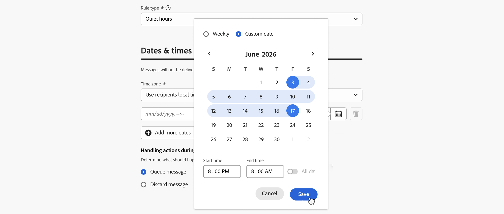
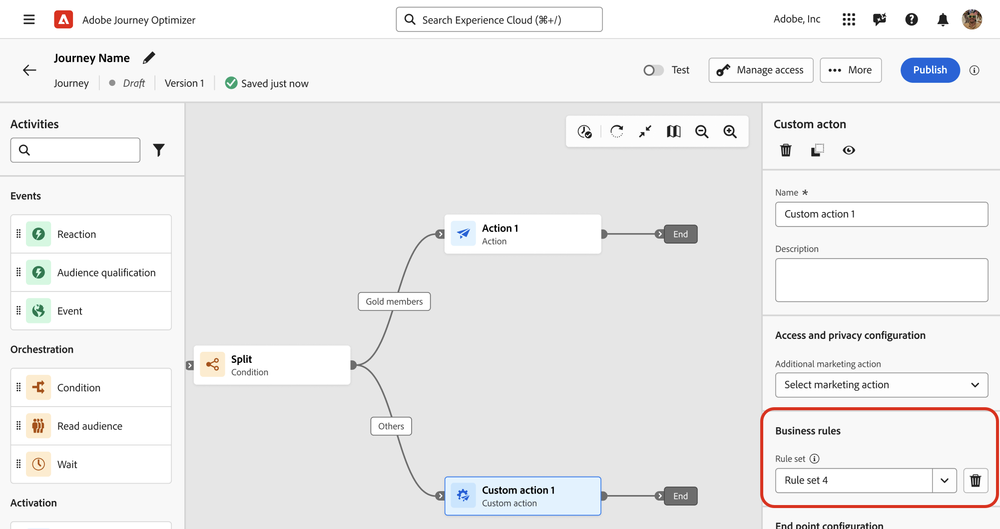

# Establecimiento de horas tranquilas {#quiet-hours}

## Qué son las horas tranquilas

Las **horas tranquilas** le permiten definir exclusiones basadas en el tiempo para los canales **Correo electrónico**, **SMS**, **Push** y **WhatsApp**. Garantizan que no se envíen mensajes durante períodos de tiempo específicos, lo que le ayuda a respetar las preferencias de los clientes y los requisitos de cumplimiento.

Puede aplicar horas tranquilas a través de **conjuntos de reglas**, que se pueden asignar a acciones individuales en campañas o recorridos para un control preciso.

Al optimizar estos procesos, puede mejorar la experiencia del cliente, ahorrar tiempo y garantizar el cumplimiento de las reglas de comunicación:

* **No despierte a su cliente** - *El cliente correcto, el canal correcto, el momento adecuado* es el mantra de muchos especialistas en marketing, por lo que tiene sentido que el tiempo sea una parte crítica del recorrido del cliente. Al establecer una regla de Horas de silencio, las marcas tienen un mejor control sobre cuándo los contactos reciben mensajes, lo que garantiza que los reciban cuando es más probable que realicen acciones en su mensaje.
* **Comodidad**: intercepte fácilmente las comunicaciones entre campañas y recorridos cuando necesite evitar que una audiencia reciba un mensaje sin necesidad de detener toda la campaña o el recorrido.
* **Ahorro de tiempo**: administre exclusiones en un solo lugar creando una **regla basada en el tiempo**, en lugar de agregar varios nodos de condición con expresiones personalizadas.\
  <!--* **Extra Safeguard** - Benefit from an extra safeguard in case audience criteria or time-window configurations were incorrectly set, ensuring individuals are still excluded when they should be.-->

>[!AVAILABILITY]
>
>Actualmente, las reglas de horario silencioso solo están disponibles para un conjunto de organizaciones (disponibilidad limitada).  Estarán disponibles de forma progresiva para todos los clientes en futuras versiones.

➡️ [Descubra esta funcionalidad en vídeo](#video)

## Mecanismos de protección y limitaciones

* **Canales compatibles**: correo electrónico, SMS, push y WhatsApp.
  <!--* **Custom actions** – For custom actions, only quiet hours rules are enforced. If a rule set also includes other rules (e.g., frequency capping), those rules are ignored.-->
* **Retraso de propagación**: las actualizaciones de una regla de horas silenciosas pueden tardar hasta 12 horas en aplicarse a las acciones de canal que ya utilizan esa regla.
  <!--* **Pre-suppression window** – The system begins suppressing communications 30 minutes before quiet hours start, ensuring that no messages are delivered once the quiet period begins.-->
* **Latencia de gran volumen**: en casos de comunicaciones de gran volumen, el sistema puede tardar más tiempo en aplicar correctamente las supresiones de horas silenciosas.

## Crear reglas de horas tranquilas

Para establecer horas de inactividad, cree una regla dentro de un conjunto de reglas personalizadas. Siga estos pasos:

1. Vaya a **[!UICONTROL Reglas de negocio]** para acceder al inventario de conjuntos de reglas.

1. Elija un conjunto de reglas personalizadas existente o cree uno nuevo:

   +++Crear una regla de horas tranquilas en un conjunto de reglas existente

   Seleccione el conjunto de reglas del inventario. Las reglas de horas tranquilas solo se pueden agregar a conjuntos de reglas con el dominio &quot;canal&quot;. Puede comprobar esta información en la columna **[!UICONTROL Dominio]**.

   

   +++

   +++Creación de una regla de horas tranquilas en un nuevo conjunto de reglas

   Haga clic en **[!UICONTROL Crear conjunto de reglas]**, escriba un nombre único y seleccione &quot;Canal&quot; en la lista desplegable **[!UICONTROL Dominio del conjunto de reglas]**.

   

   +++

   >[!NOTE]
   >
   >Las horas tranquilas solo se pueden definir en **conjuntos de reglas personalizadas**. El conjunto de reglas globales no admite la configuración de horas silenciosas.

1. En la pantalla del conjunto de reglas, haga clic en **[!UICONTROL Agregar regla]** y proporcione un nombre único para la regla.

1. El campo **Category** especifica la categoría del mensaje a la que se aplica la regla. Por ahora, este campo es de solo lectura y el valor predeterminado es **[!UICONTROL Marketing]**.

1. En la lista desplegable **[!UICONTROL Tipo de regla]**, seleccione **[!UICONTROL Horas tranquilas]**.

   

1. En la sección **[!UICONTROL Fechas y horas]**, defina cuándo aplicar horas tranquilas:

   1. Elija la **[!UICONTROL zona horaria]** que desea utilizar:

      * **[!UICONTROL UTC/GMT]**: aplique una ventana horaria GMT estándar a todos los destinatarios de la audiencia, independientemente de sus zonas horarias individuales.
      * **[!UICONTROL Usar zona horaria local de destinatarios]**: utilice el campo de zona horaria de cada perfil. [Obtenga más información sobre la administración de husos horarios en recorrido](../building-journeys/timezone-management.md#timezone-from-profiles)

        >[!IMPORTANT]
        >
        >Si un perfil no tiene ningún valor de zona horaria, no se aplican horas tranquilas a ese perfil.

   1. Especifique el período de tiempo en el que se deben aplicar las horas de silencio.

      * **[!UICONTROL Semanal]**: elige días específicos de la semana y una franja de tiempo. También puede aplicar la regla **[!UICONTROL Todo el día]** (esta opción solo está disponible por un máximo de 3 días consecutivos).

        

      * **[!UICONTROL Fecha personalizada]**: elige fechas específicas en el calendario y una franja de tiempo. También puede aplicar la regla **[!UICONTROL Todo el día]** (esta opción solo está disponible por un máximo de 3 días consecutivos).

        

   1. Haga clic en el botón **[!UICONTROL Agregar más fechas]** para agregar hasta 5 períodos separados.

      

1. En la sección **[!UICONTROL Administrar acciones durante las horas de inactividad]**, elija cómo se tratan los mensajes durante el período de tiempo seleccionado:

   

   * **[!UICONTROL Mensaje en cola]**: los mensajes se envían al finalizar el período de horas de inactividad a menos que estén en estado Paused.

     >[!NOTE]
     >
     >Esta opción solo está disponible para acciones de recorrido. Si se aplica a una acción de campaña, se comportará de la misma manera que seleccionar la opción **[!UICONTROL Descartar mensaje]**.

   * **[!UICONTROL Descartar mensaje]**: los mensajes nunca se envían. Si desea que el recorrido o la campaña que contiene el mensaje finalice con la cancelación del envío, seleccione **[!UICONTROL Descartar y salir del recorrido o la campaña]**.

## Aplicar horas tranquilas a recorridos y campañas {#apply}

Una vez guardada la regla y activado el conjunto de reglas, puede aplicarla a acciones en recorridos y campañas. Canales admitidos: **correo electrónico, SMS, push, WhatsApp**. Examine las pestañas siguientes para obtener más detalles.

>[!BEGINTABS]

>[!TAB Aplicar acciones de canal de horas de silencio en recorridos]

1. Abra el recorrido, seleccione una [acción de canal](../building-journeys/journeys-message.md) y edite el contenido del mensaje.
1. Haga clic en el botón **[!UICONTROL Agregar regla de negocio]** y seleccione el conjunto de reglas que contiene la regla Horas de inactividad.

   

   >[!NOTE]
   >
   >En la lista solo se muestran [conjuntos de reglas activados](#activate-rule).

1. Activa tu recorrido.

>[!TAB Aplicar horas tranquilas a las acciones de la campaña]

1. Edite la campaña y acceda a la pestaña **[!UICONTROL Actions]**.
1. En la sección **[!UICONTROL Reglas de negocios]**, seleccione el conjunto de reglas que contiene la regla Horas de silencio.

   

   >[!NOTE]
   >
   >En la lista solo se muestran [conjuntos de reglas activados](#activate-rule).

1. Active la campaña.

>[!ENDTABS]

## Próximos pasos

Una vez que el recorrido o las campañas se hayan activado y ejecutado, puede ver el número de perfiles excluidos de la comunicación en el [informe de Customer Journey Analytics](../reports/report-gs-cja.md) y en el [informe en vivo](../reports/live-report.md), donde las reglas de Horas de silencio se enumerarán como un posible motivo para excluir a los usuarios del envío.

<!--

>[!TAB Apply Quiet hours to custom actions]

1. Open your journey and add or select a custom action in the canvas.

1. In the **[!UICONTROL Business rules]** section, select the rule set containing the Quiet hours rule.

   

   >[!NOTE]
   >
   >Only [activated](#activate-rule) rule sets display in the list.

1. Activate your journey.

-->

## Vídeo práctico {#video}

Aprenda a utilizar la función de horario discreto en Adobe Journey Optimizer.

>[!VIDEO](https://video.tv.adobe.com/v/3475855?captions=spa&quality=12)
