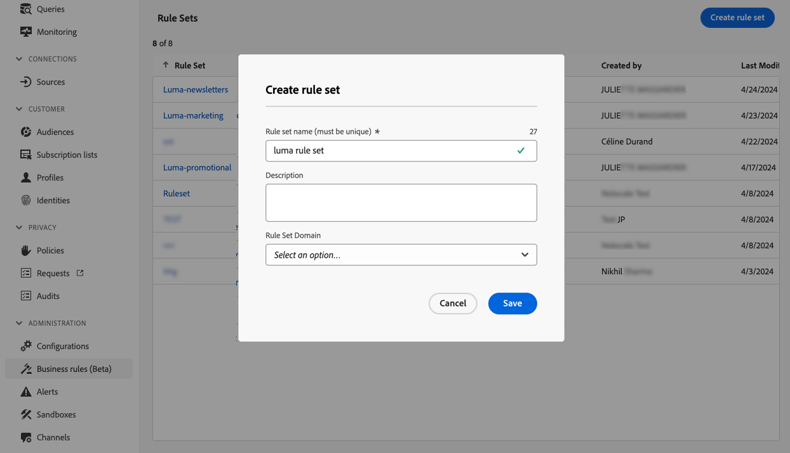
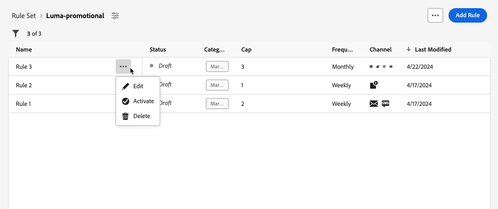
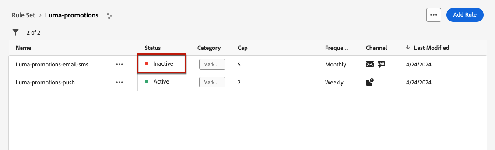

# Trabajar con conjuntos de reglas {#rule-sets}

>[!CONTEXTUALHELP]
>id="ajo_business_rules_rule_sets"
>title="Conjuntos de reglas"
>abstract="Utilice conjuntos de reglas para aplicar límites de frecuencia a diferentes tipos de comunicaciones de marketing. También puede aplicar un conjunto de reglas para excluir este recorrido para parte del público, en función de las reglas de restricción de frecuencia."

## Introducción a los conjuntos de reglas {#gs}

### ¿Qué son los conjuntos de reglas? {#what}

Los conjuntos de reglas permiten **agrupar varias reglas en conjuntos de reglas** y aplicarlas a los recorridos y campañas que elija. Esto proporciona una granularidad mejorada para limitar la frecuencia y la cantidad de recorridos que un cliente puede introducir en un lapso de tiempo determinado o controlar la frecuencia con la que los usuarios recibirán un mensaje según el tipo de comunicación.

Puede crear dos tipos de conjuntos de reglas:

* Los conjuntos de reglas del **canal** aplican reglas de límite a los canales de comunicación. Por ejemplo, no envíe más de 1 correo electrónico o comunicación SMS al día.
* Los conjuntos de reglas **Recorrido** aplican reglas de límite de entrada y concurrencia a un recorrido. Por ejemplo, no introduzca perfiles en más de un recorrido simultáneamente.

➡️ [Descubra esta funcionalidad en vídeo](#video)

### Permisos {#permissions-frequency-rules}

Para trabajar con reglas empresariales, necesita los siguientes permisos:

* **[!UICONTROL Ver reglas de frecuencia]**: Acceda y vea reglas de negocio.
* **[!UICONTROL Administrar reglas de frecuencia]**: cree, edite o elimine reglas de negocio.

Puede obtener más información sobre permisos en [esta sección](../administration/high-low-permissions.md).

### Conjuntos de reglas globales y personalizadas {#global-custom}

Al obtener acceso a los conjuntos de reglas por primera vez desde el menú **[!UICONTROL Administración]** > **[!UICONTROL Reglas de negocio]**, ya se ha creado y activado un conjunto de reglas predeterminado: **Conjunto de reglas predeterminado global**.

Este conjunto de reglas contiene reglas globales que puede aplicar para controlar la frecuencia con la que los usuarios reciben mensajes a través de uno o varios canales. Todas las reglas definidas en este conjunto de reglas se aplican a todos los canales seleccionados, independientemente de si las comunicaciones se envían desde un recorrido o desde una campaña.

Además de este conjunto de reglas &quot;Conjunto de reglas predeterminado global&quot;, puede crear **conjuntos de reglas** que puede aplicar a cualquier recorrido o campaña para aplicar reglas de límite específicas. [Aprenda a crear conjuntos de reglas personalizados](#create)

## Creación y activación de conjuntos de reglas {#Create}

>[!CONTEXTUALHELP]
>id="ajo_rule_set_domain"
>title="Dominio del conjunto de reglas"
>abstract="Al crear un conjunto de reglas, debe especificar si las reglas dentro del conjunto de reglas aplicarán reglas de límite específicas a los canales de comunicación o a los recorridos."

>[!CONTEXTUALHELP]
>id="ajo_rule_sets_category"
>title="Seleccione la categoría de regla de mensaje"
>abstract="Cuando está activada y se aplica a un mensaje, todas las reglas de frecuencia que coincidan con la categoría seleccionada se aplican automáticamente a este mensaje. Actualmente, solo está disponible la categoría Marketing."

<!--NOT USED?
[!CONTEXTUALHELP]
>id="ajo_rule_sets_capping"
>title="Set the capping for your rule"
>abstract="Specify the maximum number of messages sent to a customer profile within the chosen time frame. The frequency cap will be based on the selected calendar period and will be reset at the beginning of the corresponding time frame."-->

>[!CONTEXTUALHELP]
>id="ajo_rule_sets_duration"
>title="Seleccione la categoría de regla de mensaje"
>abstract="Cuando está activada y se aplica a un mensaje, todas las reglas de frecuencia que coincidan con la categoría seleccionada se aplican automáticamente a este mensaje. Actualmente, solo está disponible la categoría Marketing."

>[!CONTEXTUALHELP]
>id="ajo_rule_set_rule_capping"
>title="Límite de reglas"
>abstract="Establezca la restricción de la regla. En función del dominio del conjunto de reglas y de la selección en el campo Tipo de regla, este campo puede definir el número máximo de mensajes que se pueden enviar a un perfil o el número máximo de recorridos que el perfil puede introducir o en los que se puede inscribir simultáneamente."

Para crear un conjunto de reglas, siga los pasos a continuación.

>[!NOTE]
>
>Puede crear hasta 3 conjuntos de reglas locales de dominio de canal y hasta 5 conjuntos de reglas locales de dominio de recorrido.

1. Acceda a la lista **[!UICONTROL Conjuntos de reglas]** y haga clic en **[!UICONTROL Crear conjunto de reglas]**.

   

1. Defina un nombre único para el conjunto de reglas y añada una descripción.

1. Seleccione el dominio del conjunto de reglas y haga clic en **[!UICONTROL Guardar]**.

   * Dominio **Channel**: aplique reglas de límite para los canales de comunicación.
   * Dominio **Recorrido**: aplique reglas de límite de entrada y concurrencia a un recorrido.

   

1. Defina las reglas que desee agregar a este conjunto de reglas. Para ello, acceda al conjunto de reglas y haga clic en **[!UICONTROL Agregar regla]**.

1. Configure los parámetros de la regla para adaptarlos a sus necesidades. Los parámetros disponibles para la regla dependen del dominio del conjunto de reglas seleccionado en su creación.

   Encontrará información detallada sobre cómo configurar las reglas de restricción de recorrido y canal en estas secciones:

   * [Límite de Recorrido](../conflict-prioritization/journey-capping.md)
   * [Límite de frecuencia por canal y tipo de comunicación](../conflict-prioritization/channel-capping.md)

1. Haga clic en **[!UICONTROL Guardar]** para confirmar la creación de la regla. Su mensaje se agrega al conjunto de reglas, con el estado **[!UICONTROL Borrador]**.

   

1. Repita los pasos anteriores para agregar tantas reglas como sea necesario al conjunto de reglas.

1. Cuando se crea, una regla tiene el estado **[!UICONTROL Borrador]** y aún no afecta a ningún mensaje. Para habilitarlo, haga clic en el botón **[!UICONTROL Más acciones]** que está junto a la regla y seleccione **[!UICONTROL Activar]**.

   

1. Active el conjunto de reglas para poder aplicarlo a los recorridos y mensajes.

   

   >[!NOTE]
   >
   >Una regla o un conjunto de reglas puede tardar hasta 20 minutos en activarse completamente. No es necesario modificar los mensajes ni volver a publicar los recorridos para que una regla surta efecto.

<!--Currently, once a rule set is activated, no more rules can be added to that rule set.-->

1. Puede aplicar un conjunto de reglas a un mensaje o a un recorrido, según el dominio seleccionado al crear el conjunto de reglas.

   Encontrará información detallada sobre cómo aplicar un conjunto de reglas en estas secciones:

   * [Aplicación de un conjunto de reglas a un recorrido](../conflict-prioritization/journey-capping.md#apply-capping)
   * [Aplicación de reglas de límite a un mensaje](../conflict-prioritization/channel-capping.md#apply)

## Acceso y administración de conjuntos de reglas {#access-rule-sets}

Todos los conjuntos de reglas creados se muestran en el menú **[!UICONTROL Administración]** > **[!UICONTROL Reglas de negocio]**. Se ordenan por fecha de la última modificación.

Haga clic en el nombre de un conjunto de reglas para ver y editar su contenido. Se muestran todas las reglas incluidas en ese conjunto de reglas. El menú contextual de la parte superior derecha le permite editar el nombre y la descripción del conjunto de reglas, activarlo y eliminarlo.

Para cada regla del conjunto de reglas, el botón **[!UICONTROL Más acciones]** le permite editar la regla, activarla y eliminarla.

Para desactivar una regla o un conjunto de reglas, haga clic en el botón **[!UICONTROL Más acciones]** situado junto al elemento deseado y seleccione **[!UICONTROL Desactivar]**.

Su estado cambiará a **[!UICONTROL Inactivo]** y la regla no se aplicará a futuras ejecuciones de mensajes. Los mensajes que se estén ejecutando actualmente no se verán afectados.

>[!NOTE]
>
>La desactivación de una regla o un conjunto de reglas no afecta ni restablece ningún recuento de perfiles individuales.

## Vídeo práctico {#video}

>[!VIDEO](https://video.tv.adobe.com/v/3435531?quality=12)
