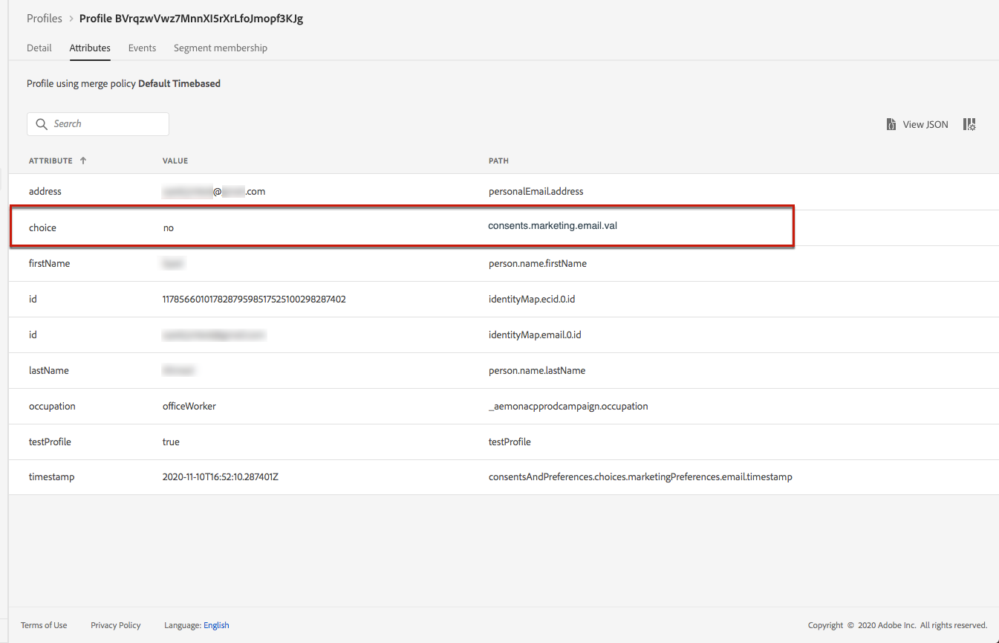

# Administrar la exclusión {#consent}


Utilice [!DNL Journey Optimizer] para hacer un seguimiento del consentimiento de los destinatarios para la comunicación y comprender cómo desean interactuar con su marca administrando sus preferencias y suscripciones. <!--Their preferences and subscriptions are handled through Consent management.-->

Las regulaciones como el RGPD establecen que debe cumplir con requisitos específicos antes de poder utilizar la información de sujetos de datos. Además, los sujetos de datos deben poder modificar su consentimiento en cualquier momento.

**¿Por qué es importante?**

* El incumplimiento de estas regulaciones conlleva riesgos legales para su marca.
* Le ayuda a evitar enviar comunicaciones no solicitadas a sus destinatarios, lo que podría hacer que marquen sus mensajes como correo no deseado y dañar su reputación.

Obtenga más información sobre la administración de la privacidad y las regulaciones aplicables en la [documentación del Experience Platform](https://experienceleague.adobe.com/docs/experience-platform/privacy/home.html?lang=es).

<!--* Recipients should be able to opt-in/opt-out from receiving electronic communication through one or more channel
* Recipients expect the brand to offer preference centre capability that controls how brand should engage with them (example: channel of communication, invasive and non-invasive tracking etc). This helps to fulfil regulatory obligations and also facilitates quality engagement with recipient. 
* The third category is the capability to offer subscription to recipients (newsletter, etc)-->

## Administración de exclusión {#opt-out-management}

Proporcionar a los destinatarios la capacidad de cancelar la suscripción para recibir comunicaciones de una marca es un requisito legal. Obtenga más información sobre la legislación aplicable en la [documentación del Experience Platform](https://experienceleague.adobe.com/docs/experience-platform/privacy/regulations/overview.html?lang=en#regulations).

Por lo tanto, siempre debe incluir un **enlace de baja** en cada correo electrónico enviado a los destinatarios:
* Al hacer clic en este vínculo, los destinatarios se dirigen a una página de aterrizaje, incluido un botón para confirmar la exclusión.
* Al hacer clic en el botón de exclusión, se realiza una llamada de Adobe I/O para actualizar los datos de perfil con esta información. [Obtenga más información sobre esto](#consent-service-api).

Para añadir un vínculo de cancelación de suscripción, siga los pasos a continuación:

1. Cree la página de aterrizaje de baja.
1. Aloje la página de aterrizaje en el sistema de terceros que elija.
1. [Cree un ](../../help/using/create-message.md) mensaje en  [!DNL Journey Optimizer].

   <!--The link to your landing page should contain a static URL and the profile ID.-->

1. Seleccione texto en el contenido e inserte un vínculo utilizando la barra de herramientas contextual.

   

1. Seleccione **[!UICONTROL Unsubscription link]** en la lista desplegable **[!UICONTROL Link type]**.

   

1. En el marco **[!UICONTROL Unsubscription page URL]** , copie el vínculo a la página de aterrizaje.

   

1. Haga clic en **[!UICONTROL Save]**.

1. Guarde el contenido y [publique el mensaje](../../help/using/publish-manage-message.md).

   >[!NOTE]
   >
   >La dirección URL de la página de aterrizaje de terceros incluirá tres parámetros que se utilizarán para actualizar las preferencias de los perfiles mediante una llamada de Adobe I/O. &#x200B; [Obtenga más información en esta sección](#consent-service-api).

1. Envíe su mensaje con el enlace a su página de aterrizaje a través de un [recorrido](building-journeys/journey.md).

1. Una vez recibido el mensaje, si el destinatario hace clic en el vínculo unsubscribe , se muestra la página de aterrizaje.

   

1. Si el destinatario hace clic en el botón de exclusión de la página de aterrizaje (en este caso, el botón **Unsubscribe**), los datos de perfil se actualizan mediante una [llamada de Adobe I/O](#opt-out-api).

   El destinatario excluido se redirige a la pantalla de mensaje de confirmación para indicar que la exclusión se ha realizado correctamente.

   

   Como resultado, este usuario no recibirá comunicación de su marca a menos que se vuelva a suscribir.

Para comprobar que se ha actualizado la opción del perfil correspondiente, vaya al Experience Platform y acceda al perfil seleccionando un área de nombres de identidad y un valor de identidad correspondiente. Obtenga más información en la [documentación del Experience Platform](https://experienceleague.adobe.com/docs/experience-platform/profile/ui/user-guide.html?lang=en#getting-started).



En la pestaña **[!UICONTROL Attributes]**, puede ver que el valor de **[!UICONTROL choice]** ha cambiado a **[!UICONTROL no]**.

<!--The opt-out URL is resolved upon each recipient receiving the message. It is then personalized with the relevant encrypted parameters (profile ID, profile name, journey ID, sandbox ID, and message execution ID).-->

## Llamada de API de exclusión {#opt-out-api}

Una vez que el destinatario ha optado por darse de baja haciendo clic en el vínculo de cancelación de suscripción, se llama a una API de Adobe I/O <!--Consent service API to capture the encrypted data and-->para actualizar la preferencia del perfil correspondiente.

Esta llamada del POST de Adobe I/O es la siguiente:

Punto final: cjm.adobe.io/imp/consent/preferences

Parámetros de consulta:
* **parámetros**: contiene la carga útil cifrada
* **registro**: signature  <!--which signature?-->
* **pid**: ID de perfil cifrado

Estos parámetros están disponibles en el vínculo de cancelación de suscripción enviado a su destinatario, es decir, la dirección URL que abrirá la página de aterrizaje de terceros para un destinatario determinado:


<!--QUESTION: How do you get the URL built for each recipient? Do you have to wait until each targeted recipient receives the unsubscribe link or can you deduce it in advance? Is it done automatically upon the API call or do you have to do something manually for each profile? In other words will the LP automatically include the 3 parameters or do you have to insert something manually? Still not completely clear-->

Requisitos de encabezado:
* x-api-key
* x-gw-ims-org-id
* x-sandbox-name
* autorización (token de usuario de su cuenta técnica) <!--How do you find this information? And other header elements?-->

Cuerpo de la solicitud:

```
{
   "marketing": [
       {
            "type": "email",           
            "choice": "no",          
            "scope": "channel"       
        }
    ],
 
}
```

<!--The Consent service /-->[!DNL Journey Optimizer] will <!--decrypt and-->use these parameters to update the corresponding profile's choice. <!--and provide an answer back to the landing page.-->

## Administración de exclusión push {#push-opt-out-management}

Los destinatarios push pueden cancelar la suscripción a través de sus propios dispositivos.

Por ejemplo, al descargar o al usar la aplicación, pueden seleccionar detener las notificaciones. Del mismo modo, pueden cambiar la configuración de notificación a través del sistema operativo móvil.
