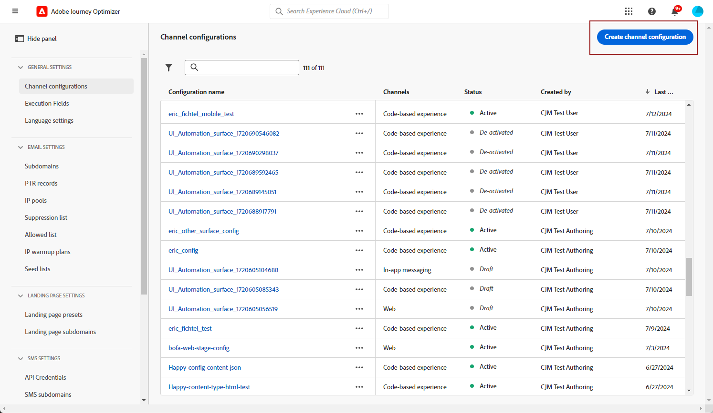
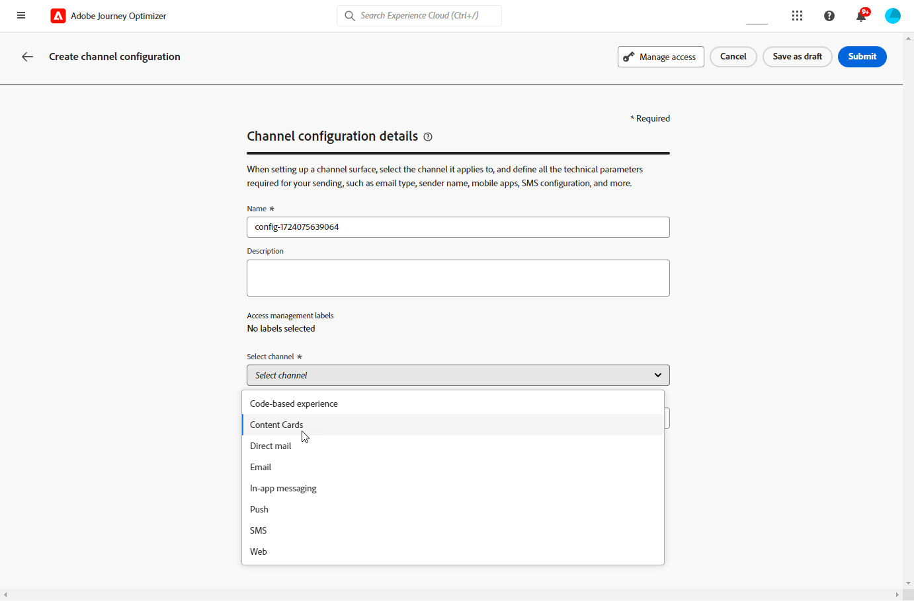

# Configuración de tarjetas de contenido {#content-card-configuration}

## ¿Qué es una configuración? {#surface-definition}

Una **configuración de experiencia de la tarjeta de contenido** es cualquier entidad diseñada para la interacción del usuario o del sistema, que se identifica de forma exclusiva mediante un **URI**.

En otras palabras, una superficie puede verse como un contenedor en cualquier nivel de jerarquía con una entidad (punto de contacto) que existe.

* Puede ser una página web, una aplicación móvil, una aplicación de escritorio, una ubicación de contenido específica dentro de una entidad más grande (por ejemplo, un `div`) o un patrón de visualización no estándar (por ejemplo, un quiosco o un banner de aplicación de escritorio).

* También se puede ampliar a fragmentos específicos de contenedores de contenido para fines de no visualización o de visualización abstracta (por ejemplo, blobs JSON entregados a servicios).

* También puede ser una superficie comodín que coincida con una variedad de definiciones de superficie de cliente (por ejemplo, una ubicación de imagen principal en cada página del sitio web podría traducirse en un URI de superficie como: web://mydomain.com/*#hero_image).

Básicamente, un URI de superficie está compuesto por varias secciones:

1. **Tipo**: web, aplicación móvil, atm, quiosco, tvcd, servicio etc.
1. **Propiedad**: URL de página o paquete de aplicaciones
1. **Contenedor**: ubicación en la actividad de la página/aplicación

En la tabla siguiente se muestran algunos ejemplos de definiciones de URI de superficie para varios dispositivos.

**Web y móvil**

| Tipo | URI | Descripción |
| --------- | ----------- | ------- | 
| Web | `web://domain.com/path/page.html#element` | Representa un elemento individual dentro de una página específica de un dominio específico, donde un elemento puede ser una etiqueta como en los ejemplos siguientes: hero_banner, top_nav, menu, footer, etc. |
| Aplicación iOS | `mobileapp://com.vendor.bundle/activity#element` | Representa un elemento específico dentro de una actividad, como un botón u otro elemento de vista. |
| Aplicación de Android | `mobileapp://com.vendor.bundle/#element` | Representa un elemento específico dentro de una aplicación nativa. |

**Otros tipos de dispositivos**

| Tipo | URI | Descripción |
| --------- | ----------- | ------- | 
| Escritorio | `desktop://com.vendor.bundle/#element` | Representa un elemento específico dentro de una aplicación, como un botón, un menú, un banner principal, etc. |
| Aplicación de TV | `tvcd://com.vendor.bundle/#element` | Representa un elemento específico en una TV inteligente o TV conectado a una aplicación de dispositivo: ID de paquete. |
| Servicio | `service://servicename/#element` | Representa un proceso del lado del servidor u otra entidad manual. |
| Quiosco | `kiosk://location/screen#element` | Ejemplo de posibles tipos de superficie adicionales que se pueden añadir fácilmente. |
| ATM | `atm://location/screen#element` | Ejemplo de posibles tipos de superficie adicionales que se pueden añadir fácilmente. |

**Superficies comodín**

| Tipo | URI | Descripción |
| --------- | ----------- | ------- | 
| Web comodín | `wildcard:web://domain.com/*#element` | Superficie comodín: representa un elemento individual en cada una de las páginas bajo un dominio específico. |
| Web comodín | `wildcard:web://*domain.com/*#element` | Superficie comodín: representa un elemento individual en cada una de las páginas bajo todos los dominios que acaba con &quot;domain.com&quot;. |

## Crear una configuración de tarjeta de contenido {#create-config}

1. Acceda al menú **[!UICONTROL Canales]** > **[!UICONTROL Marca]** > **[!UICONTROL Configuraciones de canal]** y haga clic en **[!UICONTROL Crear configuración de canal]**.

   

1. Introduzca un nombre y una descripción (opcional) para la configuración.

   >[!NOTE]
   >
   > Los nombres deben comenzar por una letra (A-Z). Solo puede contener caracteres alfanuméricos. También puede utilizar caracteres de guion bajo `_`, punto `.` y guion `-`.

1. Para asignar etiquetas de uso de datos principales o personalizadas a la configuración, puedes seleccionar **[!UICONTROL Administrar acceso]**. [Obtenga más información acerca del Control de acceso de nivel de objeto (OLAC)](../administration/object-based-access.md).

1. Seleccione el canal **[!UICONTROL Tarjeta de contenido]**.

   

1. Seleccione **[!UICONTROL Acciones de marketing]** para asociar directivas de consentimiento a los mensajes que usan esta configuración. Todas las políticas de consentimiento asociadas con la acción de marketing se aprovechan para respetar las preferencias de los clientes. [Más información](../action/consent.md#surface-marketing-actions)

1. Seleccione la plataforma para la que se aplicará la experiencia de la tarjeta de contenido.

   

1. Para la web:

   * Especifique una **[!UICONTROL URL de página]** para aplicar los cambios exclusivamente a una sola página.

   * O bien, cree una **[!UICONTROL regla de coincidencia de páginas]** para dirigirla a varias direcciones URL que coincidan con la regla especificada. Por ejemplo, esto podría utilizarse para aplicar los cambios de forma universal en un sitio web, como actualizar un banner a pantalla completa en todas las páginas o añadir una imagen principal para mostrar en cada página de producto. [Más información](../web/web-configuration.md)

1. Para iOS y Android:

   * Escriba o seleccione su **[!UICONTROL ID de aplicación]**, **[!UICONTROL ubicación o ruta de acceso dentro de la aplicación]** y **[!UICONTROL URL de vista previa]**.

1. Envíe los cambios.

Ahora puede seleccionar la configuración al crear la experiencia de la tarjeta de contenido.
