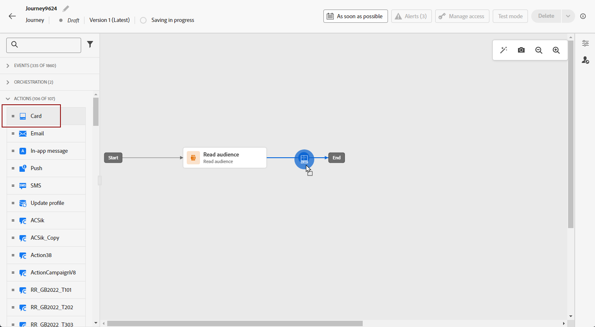
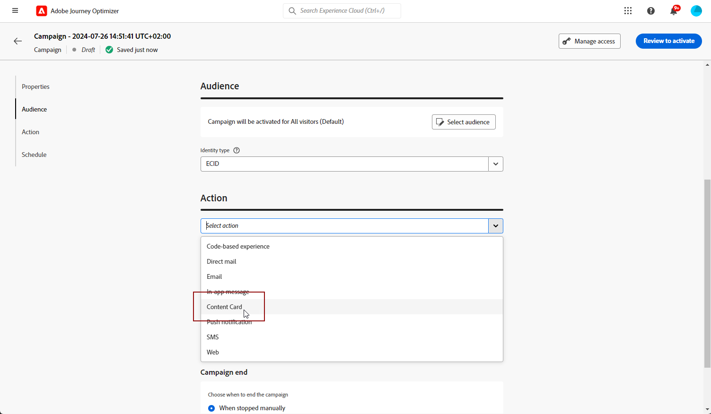
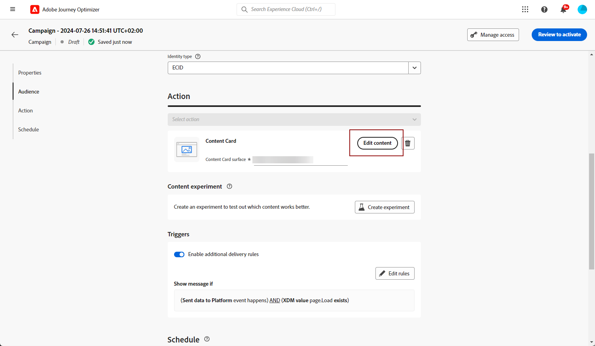

# Creación de tarjetas de contenido {#create-content-card}

>[!IMPORTANT]
>
>De forma predeterminada, el botón Cerrar oculta la tarjeta. Para añadir más funciones, puede definir manualmente reglas de despido o descalificación.

>[!BEGINTABS]

>[!TAB Agregar tarjetas de contenido a un recorrido]

Para añadir tarjetas de contenido a un recorrido, siga estos pasos:

1. Abra el recorrido y, a continuación, arrastre y suelte una actividad **[!UICONTROL Tarjeta]** desde la sección **[!UICONTROL Acciones]** de la paleta.

   

1. Escriba una **[!UICONTROL Etiqueta]** y **[!UICONTROL Descripción]** para su mensaje.

1. Elija su [configuración de la tarjeta de contenido](content-card-configuration.md) para usar.

   

1. Ahora puedes empezar a diseñar tu contenido con el botón **[!UICONTROL Editar contenido]**. [Más información](design-content-card.md)

1. Habilite la opción **[!UICONTROL Habilitar reglas de envío adicionales]** y, a continuación, seleccione **[!UICONTROL Editar reglas]** para definir cuándo se debe mostrar, rechazar o ocultar el mensaje de forma permanente.

   

   1. Haga clic en **[!UICONTROL Agregar condición]** para seleccionar el evento.

      +++Consulte Evento disponible.

      | Paquete | Déclencheur | Definición |
      |---|---|---|
      | Envío de datos a Platform | Datos enviados a Platform | Se activa cuando la aplicación móvil emite un evento de experiencia Edge para enviar datos a Adobe Experience Platform. Normalmente, la llamada de API [sendEvent](https://developer.adobe.com/client-sdks/documentation/edge-network/api-reference/#sendevent) procede de la extensión de AEP Edge. |
      | Seguimiento principal | Seguimiento de acciones | Se activa cuando se llama a la funcionalidad heredada ofrecida en la API de código móvil [trackAction](https://developer.adobe.com/client-sdks/documentation/mobile-core/api-reference/#trackaction). |
      | Seguimiento principal | Estado de seguimiento | Se activa cuando se llama a la funcionalidad heredada ofrecida en la API de código móvil [trackState](https://developer.adobe.com/client-sdks/documentation/mobile-core/api-reference/#trackstate). |
      | Seguimiento principal | Recopilar PII | Se activa cuando se llama a la funcionalidad heredada ofrecida en la API de código móvil [collectPII](https://developer.adobe.com/client-sdks/documentation/mobile-core/api-reference/#collectpii). |
      | Ciclo de aplicación | Inicio de aplicación | Se activa en cada ejecución, incluidos los bloqueos y las instalaciones. También se activa al reanudar desde segundo plano cuando se ha superado el tiempo de espera de la sesión de ciclo vital. |
      | Ciclo de aplicación | Instalación de aplicación | Se activa la primera vez que se ejecuta después de la instalación o reinstalación. |
      | Ciclo de aplicación | Actualización de aplicación | Se activa la primera vez que se ejecuta después de una actualización o cuando cambia el número de versión. |
      | Ciclo de aplicación | Cierre de aplicación | Se activa cuando se cierra la aplicación. |
      | Ciclo de aplicación | Bloqueo de aplicación | Se activa cuando la aplicación no se envía al segundo plano antes de cerrarse. El evento se envía cuando la aplicación se inicia después del bloqueo. Los informes de bloqueo de Adobe Mobile no implementan un controlador global de excepciones no detectadas. |

      +++

   1. Elija la condición **[!UICONTROL Or]** si desea agregar más **[!UICONTROL Déclencheur]** para expandir aún más la regla.

   1. Elija la condición **[!UICONTROL And]** si desea agregar **[!UICONTROL características]** y ajustar mejor la regla.

      +++Consulte Características disponibles.

      | Paquete | Rasgos | Definición |
      |---|---|---|
      | Información del dispositivo | Nombre del operador | Se activa cuando se cumple uno de los nombres de operador de la lista. |
      | Información del dispositivo | Nombre del dispositivo | Se activa cuando se cumple uno de los nombres de dispositivo. |
      | Información del dispositivo | Configuración regional | Se activa cuando se cumple uno de los idiomas de la lista. |
      | Información del dispositivo | Versión del SO | Se activa cuando se cumple una de las versiones del sistema operativo especificadas. |
      | Información del dispositivo | Versión anterior del sistema operativo | Se activa cuando se cumple una de las versiones anteriores del sistema operativo especificadas. |
      | Información del dispositivo | Modo de ejecución | Se activa si el modo de ejecución es aplicación o extensión. |
      | Ciclo de aplicación | ID de la aplicación | Se activa cuando se cumple el ID de aplicación especificado. |
      | Ciclo de aplicación | Día de la semana | Se activa cuando se cumple el día de la semana especificado. |
      | Ciclo de aplicación | Día desde el primer uso | Se activa cuando se alcanza el número de días especificado desde que se usó por primera vez. |
      | Ciclo de aplicación | Día desde el último uso | Se activa cuando se cumple el número de días especificado desde el último uso. |
      | Ciclo de aplicación | Día desde la actualización | Se activa cuando se alcanza el número de días especificado desde la última actualización. |
      | Ciclo de aplicación | Fecha de instalación | Se activa cuando se cumple la fecha de instalación especificada. |
      | Ciclo de aplicación | Lanzamientos | Se activa cuando se alcanza el número especificado de inicios. |
      | Ciclo de aplicación | Hora del día | Se activa cuando se cumple la hora del día especificada. |

      +++

   1. Haga clic en **[!UICONTROL Crear grupo]** para agrupar los déclencheur.

1. Si es necesario, complete el flujo de recorrido arrastrando y soltando acciones o eventos adicionales. [Más información](../building-journeys/about-journey-activities.md)

1. Una vez que la tarjeta de contenido esté lista, finalice la configuración y publique el recorrido para activarla.

Para obtener más información sobre cómo configurar un recorrido, consulte [esta página](../building-journeys/journey-gs.md).

>[!TAB Agregar tarjetas de contenido a una campaña]

Para empezar a crear sus tarjetas de contenido a través de una campaña, siga los pasos a continuación.

1. Cree una campaña. [Más información](../campaigns/create-campaign.md)

1. Seleccione el tipo de campaña que desea ejecutar

   * **[!UICONTROL Programado - Marketing]**: ejecute la campaña inmediatamente o en una fecha especificada. Las campañas programadas están destinadas a enviar **marketing** mensajes. Se configuran y ejecutan desde la interfaz de usuario de.

   * **[!UICONTROL Activado por API - Marketing/Transaccional]**: ejecute la campaña mediante una llamada de API. Las campañas activadas por API están destinadas a enviar **marketing** o **mensajes transaccionales**, es decir, mensajes enviados después de una acción realizada por un individuo: restablecimiento de contraseña, compra en el carro de compras, etc. [Aprenda a almacenar en déclencheur una campaña mediante API](../campaigns/api-triggered-campaigns.md)

   

1. En la sección **[!UICONTROL Propiedades]**, especifique un nombre y una descripción para la campaña.

1. En la sección **Audiencia**, haga clic en el botón **[!UICONTROL Seleccionar audiencia]** para mostrar la lista de audiencias de Adobe Experience Platform disponibles. [Más información sobre los públicos](../audience/about-audiences.md)

1. En el campo **[!UICONTROL Área de nombres de identidad]**, elija el área de nombres que desea utilizar para identificar a los individuos del segmento seleccionado. [Más información sobre áreas de nombres](../event/about-creating.md#select-the-namespace)

1. Seleccione la acción **[!UICONTROL Tarjeta de contenido]**.

   

1. Seleccione o cree una nueva [configuración de la tarjeta de contenido](content-card-configuration.md).

1. Para probar el contenido del mensaje, haga clic en **[!UICONTROL Crear experimento]**. Esto le permite probar varias variables de un envío en poblaciones de muestra para determinar qué tratamiento tiene el mayor impacto en la audiencia de destino. [Más información sobre el experimento de contenido](../content-management/content-experiment.md).

1. Habilite la opción **[!UICONTROL Habilitar reglas de envío adicionales]** y, a continuación, seleccione **[!UICONTROL Editar reglas]** para definir cuándo se debe mostrar, rechazar o ocultar el mensaje de forma permanente.

   Utilice los creadores de reglas para establecer condiciones específicas que almacenen en déclencheur estas acciones.

   1. Haga clic en **[!UICONTROL Agregar condición]** para seleccionar el evento.

      +++Consulte Evento disponible.

      | Paquete | Déclencheur | Definición |
      |---|---|---|
      | Envío de datos a Platform | Datos enviados a Platform | Se activa cuando la aplicación móvil emite un evento de experiencia Edge para enviar datos a Adobe Experience Platform. Normalmente, la llamada de API [sendEvent](https://developer.adobe.com/client-sdks/documentation/edge-network/api-reference/#sendevent) procede de la extensión de AEP Edge. |
      | Seguimiento principal | Seguimiento de acciones | Se activa cuando se llama a la funcionalidad heredada ofrecida en la API de código móvil [trackAction](https://developer.adobe.com/client-sdks/documentation/mobile-core/api-reference/#trackaction). |
      | Seguimiento principal | Estado de seguimiento | Se activa cuando se llama a la funcionalidad heredada ofrecida en la API de código móvil [trackState](https://developer.adobe.com/client-sdks/documentation/mobile-core/api-reference/#trackstate). |
      | Seguimiento principal | Recopilar PII | Se activa cuando se llama a la funcionalidad heredada ofrecida en la API de código móvil [collectPII](https://developer.adobe.com/client-sdks/documentation/mobile-core/api-reference/#collectpii). |
      | Ciclo de aplicación | Inicio de aplicación | Se activa en cada ejecución, incluidos los bloqueos y las instalaciones. También se activa al reanudar desde segundo plano cuando se ha superado el tiempo de espera de la sesión de ciclo vital. |
      | Ciclo de aplicación | Instalación de aplicación | Se activa la primera vez que se ejecuta después de la instalación o reinstalación. |
      | Ciclo de aplicación | Actualización de aplicación | Se activa la primera vez que se ejecuta después de una actualización o cuando cambia el número de versión. |
      | Ciclo de aplicación | Cierre de aplicación | Se activa cuando se cierra la aplicación. |
      | Ciclo de aplicación | Bloqueo de aplicación | Se activa cuando la aplicación no se envía al segundo plano antes de cerrarse. El evento se envía cuando la aplicación se inicia después del bloqueo. Los informes de bloqueo de Adobe Mobile no implementan un controlador global de excepciones no detectadas. |

      +++

   1. Elija la condición **[!UICONTROL Or]** si desea agregar más **[!UICONTROL Déclencheur]** para expandir aún más la regla.

   1. Elija la condición **[!UICONTROL And]** si desea agregar **[!UICONTROL características]** y ajustar mejor la regla.

      +++Consulte Características disponibles.

      | Paquete | Rasgos | Definición |
      |---|---|---|
      | Información del dispositivo | Nombre del operador | Se activa cuando se cumple uno de los nombres de operador de la lista. |
      | Información del dispositivo | Nombre del dispositivo | Se activa cuando se cumple uno de los nombres de dispositivo. |
      | Información del dispositivo | Configuración regional | Se activa cuando se cumple uno de los idiomas de la lista. |
      | Información del dispositivo | Versión del SO | Se activa cuando se cumple una de las versiones del sistema operativo especificadas. |
      | Información del dispositivo | Versión anterior del sistema operativo | Se activa cuando se cumple una de las versiones anteriores del sistema operativo especificadas. |
      | Información del dispositivo | Modo de ejecución | Se activa si el modo de ejecución es aplicación o extensión. |
      | Ciclo de aplicación | ID de la aplicación | Se activa cuando se cumple el ID de aplicación especificado. |
      | Ciclo de aplicación | Día de la semana | Se activa cuando se cumple el día de la semana especificado. |
      | Ciclo de aplicación | Día desde el primer uso | Se activa cuando se alcanza el número de días especificado desde que se usó por primera vez. |
      | Ciclo de aplicación | Día desde el último uso | Se activa cuando se cumple el número de días especificado desde el último uso. |
      | Ciclo de aplicación | Día desde la actualización | Se activa cuando se alcanza el número de días especificado desde la última actualización. |
      | Ciclo de aplicación | Fecha de instalación | Se activa cuando se cumple la fecha de instalación especificada. |
      | Ciclo de aplicación | Lanzamientos | Se activa cuando se alcanza el número especificado de inicios. |
      | Ciclo de aplicación | Hora del día | Se activa cuando se cumple la hora del día especificada. |

      +++

   1. Haga clic en **[!UICONTROL Crear grupo]** para agrupar los déclencheur.

   

1. Puede programar la campaña para una fecha específica o configurarla para que se repita a intervalos regulares. [Más información](../campaigns/create-campaign.md#schedule)

1. Ahora puedes empezar a diseñar tu contenido con **[!UICONTROL Editar contenido]**. [Más información](design-content-card.md)

   

>[!ENDTABS]
