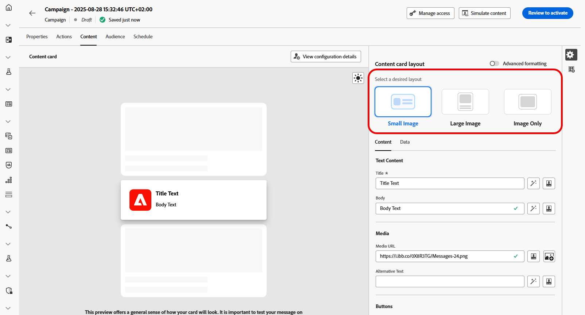
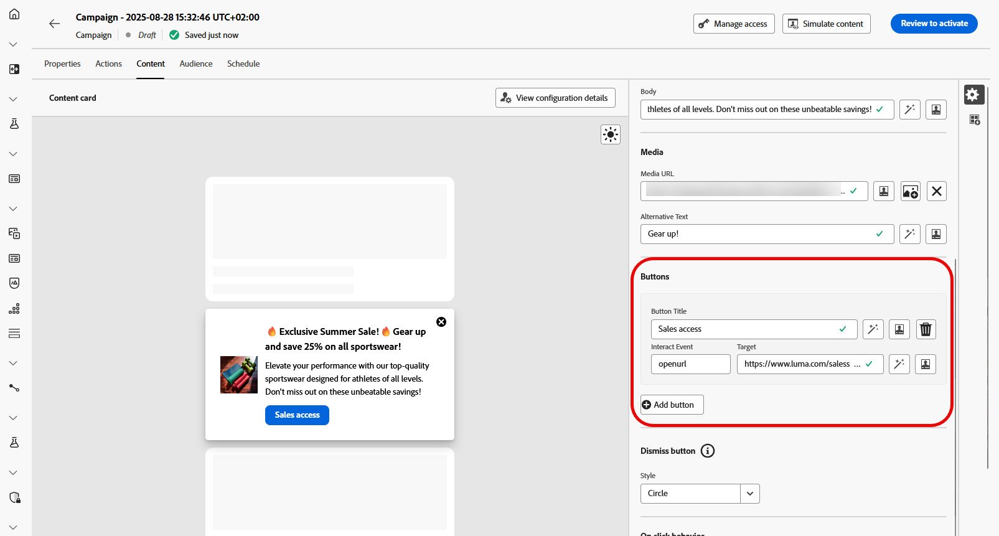

# Diseño de contenido de tarjetas de contenido {#design-content-card}

La construcción de creación para tarjetas proporciona una experiencia de creación basada en formularios que proporciona a los especialistas en marketing entradas básicas que el desarrollador puede utilizar para representar.

Una vez definido y personalizado el contenido, puede revisarlo y activarlo. Su campaña se enviará de acuerdo con la programación establecida. [Más información en esta página](../campaigns/review-activate-campaign.md).

## Diseño de la tarjeta de contenido

En la sección **[!UICONTROL Diseño de la tarjeta de contenido]**, elija una de las tres opciones de diseño de imagen según sus requisitos de mensajería.

* **[!UICONTROL Imagen pequeña]**: muestra una imagen compacta junto al texto, ideal para mensajes en los que el contenido tiene prioridad sobre los elementos visuales.

  Consulte la documentación de Adobe Developer [para iOS](https://developer.adobe.com/client-sdks/edge/adobe-journey-optimizer/content-card-ui/iOS/templates/smallimage-template/) y [para Android](https://developer.adobe.com/client-sdks/edge/adobe-journey-optimizer/content-card-ui/Android/public-classes/state/smallimagecarduistate/) para obtener más información.

* **[!UICONTROL Imagen grande]**: muestra una imagen destacada encima o al lado del texto, lo que hace que las imágenes sean el enfoque principal del mensaje.

  Consulte la documentación de Adobe Developer [para iOS](https://developer.adobe.com/client-sdks/edge/adobe-journey-optimizer/content-card-ui/iOS/templates/largeimage-template/) y [para Android](https://developer.adobe.com/client-sdks/edge/adobe-journey-optimizer/content-card-ui/Android/public-classes/state/largeimagecarduistate/) para obtener más información.

* **[!UICONTROL Solo imagen]**: muestra la imagen sin el texto que la acompaña, lo cual es perfecto para mensajes dirigidos por imágenes o imágenes independientes.

  Consulte la documentación de Adobe Developer [para iOS](https://developer.adobe.com/client-sdks/edge/adobe-journey-optimizer/content-card-ui/iOS/templates/imageonly-template/) y [para Android](https://developer.adobe.com/client-sdks/edge/adobe-journey-optimizer/content-card-ui/Android/public-classes/state/imageonlycarduistate/) para obtener más información.

## Pestaña Contenido {#content-tab}

Desde la ficha **[!UICONTROL Contenido]**, puede personalizar las tarjetas de contenido definiendo contenido y agregando botones multimedia y de acción directamente desde esta ficha.

### Contenido de texto {#title-body}

Para redactar el mensaje, escribe el texto en los campos **[!UICONTROL Título]** y **[!UICONTROL Cuerpo]**.

Si deseas adaptar más el mensaje, usa el icono **[!UICONTROL Personalization]** para añadir elementos personalizados. Para obtener instrucciones detalladas sobre cómo usar las características de personalización, consulte [esta sección](../personalization/personalize.md).

### Medios {#add-media}

El campo **[!UICONTROL Medios]** le permite mejorar sus tarjetas de contenido mediante la adición de medios, lo que puede hacer que su presentación sea más atractiva para los usuarios finales.

Para incluir contenido multimedia, escribe la URL del contenido multimedia que quieras usar o haz clic en el icono **[!UICONTROL Seleccionar Assets]** para elegir entre los recursos almacenados en tu biblioteca de Assets. [Más información acerca de la administración de recursos](../integrations/assets.md).

+++Más opciones con formato avanzado

Si el **[!UICONTROL modo de formato avanzado]** está activado, puedes agregar un **[!UICONTROL texto alternativo]** para las aplicaciones de lectura de pantalla y otro recurso en el campo **[!UICONTROL URL de medios en modo oscuro]**.

+++

### Botones {#add-buttons}

Agregue botones para que los usuarios interactúen con las tarjetas de contenido.

1. Haga clic en **[!UICONTROL Agregar botón]** para crear un nuevo botón de acción.

1. Edite el campo del botón **[!UICONTROL Título]** para especificar la etiqueta que se mostrará en el botón.

1. Seleccione un **[!UICONTROL evento de interacción]** para definir qué acción se activará cuando los usuarios hagan clic en el botón o interactúen con él.

1. En el campo **[!UICONTROL Target]**, introduzca la URL web o el vínculo profundo a los que se dirigirá a los usuarios después de interactuar con el botón.

<!--
+++More options with advanced formatting

If the **[!UICONTROL Advanced formatting mode]** is switched on, you can choose for your **[!UICONTROL Buttons]**:

* the **[!UICONTROL Font]**
* the **[!UICONTROL Pt size]**
* the **[!UICONTROL Font Color]**
* the **[!UICONTROL Alignment]**

+++
-->

### Botón Descartar {#close-button}

Elige el **[!UICONTROL Estilo]** de tu **[!UICONTROL botón Descartar]** para personalizar su apariencia.

Puede seleccionar entre los siguientes estilos:

* **[!UICONTROL Ninguno]**
* **[!UICONTROL Simple]**
* **[!UICONTROL Círculo]**

<!--
+++More options with advanced formatting

If the **[!UICONTROL Advanced formatting mode]** is switched on, you can choose for your **[!UICONTROL Header]** and **[!UICONTROL Body]**:

* the **[!UICONTROL Font]**
* the **[!UICONTROL Pt size]**
* the **[!UICONTROL Font Color]**
* the **[!UICONTROL Alignment]**
+++
-->

### Comportamiento al hacer clic

En el campo **[!UICONTROL URL de destino]**, ingrese la URL web o el vínculo profundo que dirigirá a los usuarios al destino deseado después de que interactúen con la tarjeta de contenido. Podría ser un sitio web externo, una página específica dentro de la aplicación o cualquier otra ubicación a la que desee que se dirijan los usuarios en función de su interacción.

## Pestaña Datos

## Datos personalizados {#custom-data}

En la sección **[!UICONTROL Datos personalizados]**, haga clic en **[!UICONTROL Agregar par clave/valor]** para incluir variables personalizadas en la carga. Estos pares clave/valor le permiten pasar datos adicionales, según la configuración específica. Esto le permite agregar contenido personalizado o dinámico, información de seguimiento o cualquier otro dato relevante para la configuración.
