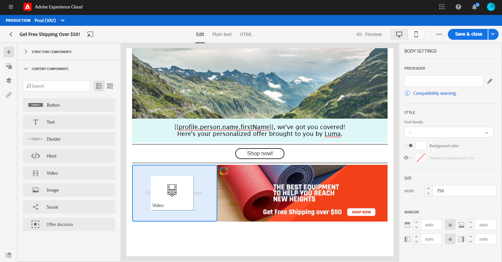

# Uso de los componentes de contenido del Diseñador de correo electrónico {#content-components}

>[!CONTEXTUALHELP]
>id="ac_content_components"
>title="Acerca de los componentes de contenido"
>abstract="Los componentes de contenido son marcadores de posición de contenido vacíos que se pueden utilizar para crear el diseño de un correo electrónico."

Al crear el contenido del correo electrónico desde cero, **[!UICONTROL Content components]** le permite personalizar aún más su correo electrónico con componentes sin procesar y vacíos que puede utilizar una vez colocados en un correo electrónico.
Puede agregar tantos **[!UICONTROL Content components]** como necesita dentro de un **[!UICONTROL Structure component]** que define el diseño del correo electrónico.

## Botón {#buttons}

Utilice la variable **[!UICONTROL Button]** para insertar varios botones en el correo electrónico y redirigir la audiencia de correo electrónico a otra página.

1. De **[!UICONTROL Content components]**, arrastrar y soltar **[!UICONTROL Button]** en un **[!UICONTROL Structure component]**.

   

1. Haga clic en el botón recién agregado para personalizar el texto y tener acceso al **[!UICONTROL Components Settings]** en el panel derecho del diseñador de correo electrónico.

   

1. En el **[!UICONTROL Link]** del campo **[!UICONTROL Components Settings]**, añada la dirección URL a la que quiere que se redirija a su audiencia al hacer clic en el botón .

1. Elija cómo se redirigirá a su audiencia con la variable **[!UICONTROL Target]** lista desplegable:

   * **[!UICONTROL None]**: abre el vínculo en el mismo marco en el que se hizo clic (predeterminado).
   * **[!UICONTROL Blank]**: abre el vínculo en una nueva ventana o pestaña.
   * **[!UICONTROL Self]**: abre el vínculo en el mismo marco en el que se hizo clic.
   * **[!UICONTROL Parent]**: abre el vínculo en el marco principal.
   * **[!UICONTROL Top]**: abre el vínculo en todo el cuerpo de la ventana.

   

1. Ahora puede personalizar aún más el botón cambiando el **[!UICONTROL Style]**, **[!UICONTROL Margin]** y **[!UICONTROL Border]** por ejemplo.

## Texto {#text}

Utilice la variable **[!UICONTROL Text]** para insertar texto en el correo electrónico. Puede ajustar el color, el estilo y el tamaño del texto en **[!UICONTROL Component Settings]**.

1. En **[!UICONTROL Content Components]**, arrastrar y soltar **[!UICONTROL Text]** en un **[!UICONTROL Structure component]**.

   

1. Haga clic en el componente recién agregado para personalizar el texto y tener acceso al **[!UICONTROL Components Settings]** en el panel derecho del diseñador de correo electrónico.

1. Cambie el texto con las siguientes opciones disponibles en la barra de herramientas:

   

   * **[!UICONTROL Change text style]**: aplique negrita, cursiva, subrayado o tachado al texto.
   * **Cambiar alineación**: elija entre alineación izquierda, derecha, centro o justificada para el texto.
   * **[!UICONTROL Create list]**: añada viñetas o listas numéricas al texto.
   * **[!UICONTROL Set heading]**: añada hasta seis niveles de encabezado al texto.
   * **Tamaño de fuente**: seleccione el tamaño de fuente del texto en píxeles.
   * **[!UICONTROL Edit image]**: añada una imagen o un recurso al componente de texto. [Obtenga más información sobre la administración de recursos](assets-essentials.md).
   * **[!UICONTROL Show the source code]**: muestre el código fuente del texto. No se puede modificar.
   * **[!UICONTROL Duplicate]**: añada una copia del componente de texto.
   * **[!UICONTROL Delete]**: elimine el componente de texto seleccionado del correo electrónico.
   * **[!UICONTROL Add personalization]**: añada campos personalizados para personalizar el contenido de los datos de perfiles. [Descubra más información sobre la personalización del contenido](personalization/personalize.md).

1. Para mejorar la experiencia del usuario, puede añadir campos de personalización para dirigirse al público. Para obtener más información, consulte [esta sección](personalization/personalize.md).

1. Ajuste la variable **[!UICONTROL Text color]**, **[!UICONTROL Font family]** y **[!UICONTROL Size]** en el **[!UICONTROL Components Settings]**.

   

## Divisor {#divider}

Utilice la variable **[!UICONTROL Divider]** para insertar una línea divisoria y organizar el diseño y el contenido del correo electrónico.
Puede seleccionar el color, el estilo y el tamaño de la línea de salto en **[!UICONTROL Component Settings]**.

## HTML {#HTML}

Utilice la variable **[!UICONTROL HTML]** para copiar y pegar las diferentes partes del HTML existente. Esto le permite crear componentes de HTML modulares gratuitos.

Para hacer que un contenido externo sea compatible con el Diseñador de correo electrónico, Adobe recomienda crear un mensaje desde cero y copiar el contenido del correo electrónico existente en los componentes.

1. En **[!UICONTROL Content Components]**, arrastrar y soltar **[!UICONTROL HTML]** en un **[!UICONTROL Structure component]**.

   

1. Haga clic en el componente recién agregado y luego en **[!UICONTROL Show the source code]** para agregar su HTML.

   

1. Copie y pegue el código del HTML que desee añadir al correo electrónico y haga clic en **[!UICONTROL Save]**.

1. Ahora puede personalizar aún más el HTML cambiando el **[!UICONTROL Style]**, **[!UICONTROL Margin]** y **[!UICONTROL Border]** por ejemplo, o agregar un vínculo para redirigir la audiencia a otro contenido.

## Imagen {#image}

Utilice la variable **[!UICONTROL Image]** para insertar un archivo de imagen desde el equipo en el correo electrónico.

1. En **[!UICONTROL Content Components]**, arrastrar y soltar **[!UICONTROL Image]** en un **[!UICONTROL Structure component]**.

   

1. Haga clic en **[!UICONTROL Browse]** para elegir un archivo de imagen de los recursos.

   Para obtener más información sobre [!DNL Assets Essentials], consulte [Documentación de Adobe Experience Manager Assets Essentials](https://experienceleague.adobe.com/docs/experience-manager-assets-essentials/help/introduction.html){target=&quot;_blank&quot;}.

1. Haga clic en el componente recién agregado para configurar su **[!UICONTROL Content Components]** y para tener acceso al **[!UICONTROL Components Settings]** en el panel derecho del diseñador de correo electrónico.

1. Configure las propiedades de la imagen:

   * **[!UICONTROL Image Title]** permite definir un título para la imagen.
   * **[!UICONTROL Alt text]** permite definir el rótulo vinculado a la imagen. Esto corresponde al atributo del HTML alternativo.

   

1. Ahora puede personalizar aún más la imagen cambiando el **[!UICONTROL Style]**, **[!UICONTROL Margin]** y **[!UICONTROL Border]** por ejemplo, o agregar un vínculo para redirigir la audiencia a otro contenido.

## Vídeo {#Video}

>[!CONTEXTUALHELP]
>id="ac_edition_video"
>title="Configuración de vídeo"
>abstract="Utilice este componente para insertar un vídeo en el correo electrónico. Tenga en cuenta que los vídeos no funcionan en todos los clientes de correo electrónico. Se recomienda configurar una imagen de reserva."
>additional-url="https://www.emailonacid.com/blog/article/email-development/a_how_to_guide_to_embedding_html5_video_in_email/" text="Información adicional"

Utilice la variable **[!UICONTROL Video]** para insertar un vídeo en el correo electrónico a través de un vínculo URL.

1. En **[!UICONTROL Content Components]**, arrastrar y soltar **[!UICONTROL Video]** en un **[!UICONTROL Structure component]**.

   

1. Haga clic en el componente recién agregado para configurar su **[!UICONTROL Content Components]** y para tener acceso al **[!UICONTROL Components Settings]** en el panel derecho del diseñador de correo electrónico.

1. En el **[!UICONTROL Video link]** del campo **[!UICONTROL Components Settings]**, añada la URL del vídeo.

   

1. Puede añadir un **[!UICONTROL Poster image]** al vídeo para especificar una imagen que se mostrará hasta que la audiencia haga clic en el botón de reproducción.

1. Ahora puede personalizar aún más la imagen cambiando el **[!UICONTROL Style]**, **[!UICONTROL Margin]** y **[!UICONTROL Border]** por ejemplo.

## Social {#social}

Utilice la variable **[!UICONTROL Social]** para insertar vínculos a páginas de medios sociales en el correo electrónico.

1. En **[!UICONTROL Content Components]**, arrastrar y soltar **[!UICONTROL Social]** en un **[!UICONTROL Structure component]**.

   

1. Haga clic en el componente recién agregado para configurar su **[!UICONTROL Content Components]** y para tener acceso al **[!UICONTROL Components Settings]** en el panel derecho del diseñador de correo electrónico.

1. En el **[!UICONTROL Social]** del campo **[!UICONTROL Components Settings]**, elija qué medios sociales desea agregar o eliminar.

   

1. Elija el tamaño de los iconos en la **[!UICONTROL Size of images]** campo .

1. Haga clic en cada uno de los iconos de los medios sociales para configurar la variable **[!UICONTROL URL]** al que se redirigirá la audiencia.

   

1. También puede cambiar los iconos de cada uno de los medios sociales si es necesario en la sección **[!UICONTROL Image]** campo .

1. Ahora puede personalizar aún más los iconos de los medios sociales cambiando la variable **[!UICONTROL Style]**, **[!UICONTROL Margin]** y **[!UICONTROL Border]**.

## Decisión de oferta {#offer-decision}

Utilice la variable **[!UICONTROL Offer decision]** para insertar decisiones (anteriormente conocidas como actividades de oferta) en los mensajes. Las decisiones aprovecharán la Administración de decisiones para elegir la mejor oferta que se ofrezca a sus clientes.

Temas relacionados:

* [Introducción a Administración de decisiones](offers/get-started/starting-offer-decisioning.md).
* [Añadir ofertas personalizadas en mensajes](deliver-personalized-offers.md).
