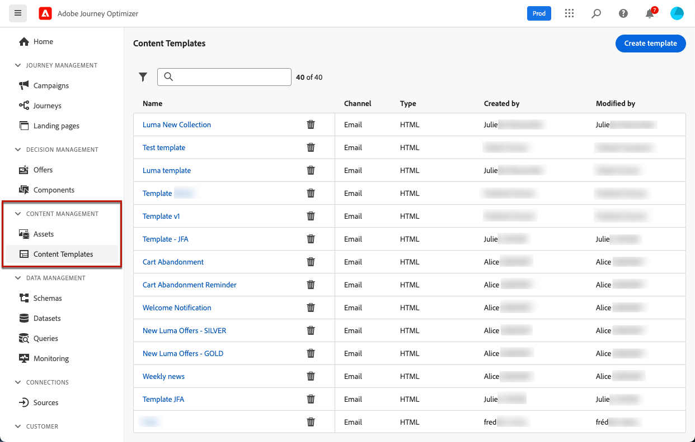
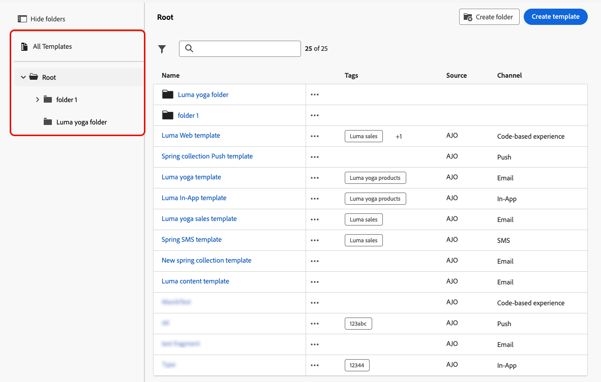

# Acceso y administración de plantillas de contenido {#access-manage-templates}

## Plantillas de contenido de acceso {#access}

Para acceder a la lista de plantillas de contenido, seleccione **[!UICONTROL Administración de contenido]** > **[!UICONTROL Plantillas de contenido]** en el menú de la izquierda.

Se muestran todas las plantillas creadas en la zona protegida actual, ya sea desde un recorrido o una campaña con la opción **[!UICONTROL Guardar como plantilla]**, o desde el menú **[!UICONTROL Plantillas de contenido]**. [Aprenda a crear plantillas](#create-content-templates)

El panel de la izquierda le permite organizar las plantillas de contenido en carpetas. De forma predeterminada, se muestran todas las plantillas. Al seleccionar una carpeta, solo se muestran las plantillas y carpetas incluidas en la carpeta seleccionada. [Más información](#folders)

Para encontrar un elemento específico, empiece a escribir un nombre en el campo de búsqueda. Cuando se selecciona una [carpeta](#folders), la búsqueda se aplica a todas las plantillas de contenido o carpetas del primer nivel de jerarquía de esa carpeta<!--(not nested items)-->.

Puede ordenar las plantillas de contenido por:

* Tipo
* Canal
* Fecha de creación o modificación
* Etiquetas: [Más información acerca de las etiquetas](../start/search-filter-categorize.md#tags)

También puede elegir mostrar únicamente los elementos creados o modificados por usted.

>[!NOTE]
>
>A partir de marzo de 2025, las plantillas de contenido de tipo HTML quedarán obsoletas. Puede seguir teniendo acceso a las plantillas de contenido de HTML existentes creadas anteriormente en [!DNL Journey Optimizer].

## Uso de carpetas para administrar plantillas de contenido {#folders}

Para desplazarse fácilmente por las plantillas de contenido, utilice carpetas para organizarlas de forma más eficaz en una jerarquía estructurada. Esto le permite clasificar y administrar los elementos según las necesidades de su organización.

1. Haga clic en el botón **[!UICONTROL Todas las plantillas de contenido]** para mostrar todos los elementos creados previamente sin la agrupación de carpetas.

1. Haga clic en la carpeta **[!UICONTROL Root]** para mostrar todas las carpetas creadas.

   >[!NOTE]
   >
   >Si aún no ha creado carpetas, se muestran todas las plantillas de contenido.

1. Haga clic en cualquier carpeta dentro de la carpeta **[!UICONTROL Root]** para mostrar su contenido.

1. Al hacer clic en la carpeta **[!UICONTROL Root]** o en cualquier otra carpeta, se muestra el botón **[!DNL Create folder]**. Selecciónelo.

   

1. Escriba un nombre para la nueva carpeta y haga clic en **[!UICONTROL Guardar]**. La nueva carpeta se muestra en la parte superior de la lista de plantillas de contenido dentro de la carpeta **[!UICONTROL Root]** o dentro de la carpeta seleccionada actualmente.

1. Puede hacer clic en el botón **[!UICONTROL Más acciones]** para cambiar el nombre de la carpeta o eliminarla.

   

1. Con el botón **[!UICONTROL Más acciones]**, también puede mover la plantilla de contenido a otra carpeta existente.

   

1. Vaya a la carpeta que acaba de crear. Cada nueva plantilla de contenido que [cree](create-content-templates.md) desde aquí se guardará en la carpeta actual.

   

## Editar y eliminar plantillas de contenido {#edit}

* Para editar el contenido de una plantilla, haga clic en el elemento deseado de la lista y realice los cambios necesarios. También puede editar las propiedades de la plantilla de contenido haciendo clic en el botón Editar junto al nombre de la plantilla.

  

* Para eliminar una plantilla, selecciona el botón **[!UICONTROL Más acciones]** junto a la plantilla deseada y selecciona **[!UICONTROL Eliminar]**.

  

>[!NOTE]
>
>Cuando se edita o elimina una plantilla, las campañas o los recorridos, incluido el contenido creado con esta plantilla, no se ven afectados.

## [!BADGE Disponibilidad limitada]{type=Informative} Muestra las plantillas como miniaturas {#template-thumbnails}

Seleccione el modo **[!UICONTROL Grid view]** para mostrar cada plantilla como una miniatura.

>[!AVAILABILITY]
>
>Esta capacidad se lanza con disponibilidad limitada (LA) para un pequeño conjunto de clientes.

>[!NOTE]
>
>Solo se pueden generar miniaturas adecuadas para las plantillas de contenido de correo electrónico de tipo HTML.

Cuando actualice el contenido, espere unos segundos a que los cambios se reflejen en la miniatura.

## Exportar plantillas de contenido a otra zona protegida {#export}

Journey Optimizer permite copiar una plantilla de contenido de una zona protegida a otra. Por ejemplo, puede copiar una plantilla del entorno de zona protegida de ensayo en la zona protegida de producción.

El proceso de copia se lleva a cabo mediante una **exportación e importación de paquetes** entre las zonas protegidas de origen y destino. Encontrará información detallada sobre cómo exportar objetos e importarlos en una zona protegida de destino en esta sección: [Copiar objetos en otra zona protegida](../configuration/copy-objects-to-sandbox.md)

