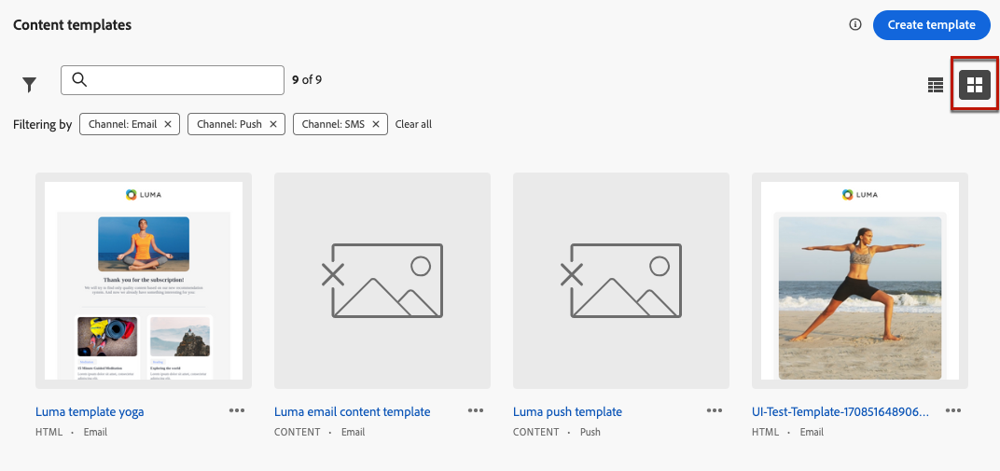

# Acceso y administración de plantillas de contenido {#access-manage-templates}

## Plantillas de contenido de acceso {#access}

Para acceder a la lista de plantillas de contenido, seleccione **[!UICONTROL Gestión de contenido]** > **[!UICONTROL Plantillas de contenido]** en el menú de la izquierda.

Todas las plantillas que se crearon en la zona protegida actual, ya sea desde un recorrido o desde una campaña utilizando **[!UICONTROL Guardar como plantilla]** , ya sea desde la opción **[!UICONTROL Plantillas de contenido]** menú: se muestran. [Aprenda a crear plantillas](#create-content-templates)

Puede ordenar las plantillas de contenido por:
* Tipo
* Canal
* Fecha de creación o modificación
* Etiquetas - [Más información sobre las etiquetas](../start/search-filter-categorize.md#tags)

También puede elegir mostrar únicamente los elementos que ha creado o modificado.

## Editar y eliminar plantillas de contenido {#edit}

* Para editar el contenido de una plantilla, haga clic en el elemento deseado de la lista y realice los cambios necesarios. También puede editar las propiedades de la plantilla de contenido haciendo clic en el botón Editar junto al nombre de la plantilla.

  

* Para eliminar una plantilla, seleccione la **[!UICONTROL Más acciones]** junto a la plantilla deseada y seleccione **[!UICONTROL Eliminar]**.

  

>[!NOTE]
>
>Cuando se edita o elimina una plantilla, las campañas o los recorridos, incluido el contenido creado con esta plantilla, no se ven afectados.

## Mostrar plantillas como miniaturas {#template-thumbnails}

Seleccione el **[!UICONTROL Vista de cuadrícula]** para mostrar cada plantilla como una miniatura.

>[!AVAILABILITY]
>
>Esta capacidad se lanza con disponibilidad limitada (LA) para un pequeño conjunto de clientes.

>[!NOTE]
>
>Actualmente, solo se pueden generar las miniaturas adecuadas para plantillas de contenido de correo electrónico de tipo HTML.

Al actualizar un contenido, es posible que tenga que esperar unos segundos antes de que los cambios se reflejen en la miniatura.
