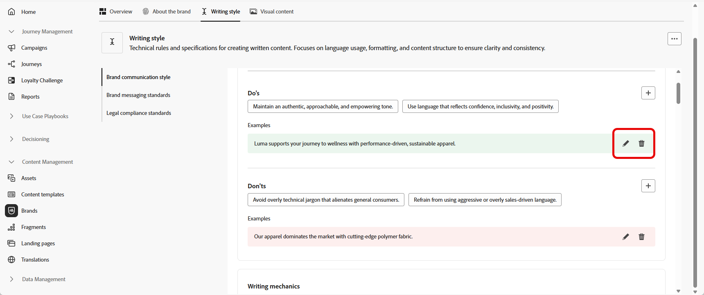

# Personalice su marca {#brands-personalize}

## Acerca de la marca {#about-brand}

Use la ficha **[!UICONTROL Acerca de la marca]** para establecer la identidad central de su marca, y delinear su propósito, personalidad, eslogan y otros atributos que la definen.

1. Comience por rellenar la información fundamental de su marca en la categoría **[!UICONTROL Detalles clave]**:

   * **[!UICONTROL Nombre del kit de marca]**: Escriba el nombre del kit de marca.

   * **[!UICONTROL Cuándo se debe usar]**: especifique los escenarios o contextos a los que se debe aplicar este kit de marca.

   * **[!UICONTROL Nombre de marca]**: escriba el nombre oficial de la marca.

   * **[!UICONTROL Descripción de la marca]**: proporcione una descripción general de lo que representa esta marca.

   * **[!UICONTROL Línea de etiquetas predeterminada]**: Agregue el lema principal asociado con la marca.

     

1. En la categoría **[!UICONTROL Principios rectores]**, aclare la dirección y filosofía básicas de su marca:

   * **[!UICONTROL Misión]**: detalla el propósito de tu marca.

   * **[!UICONTROL Visión]**: describe tu objetivo a largo plazo o el estado futuro deseado.

   * **[!UICONTROL Posicionamiento en el mercado]**: explica cómo se posiciona tu marca en el mercado.

     

1. En la categoría **[!UICONTROL Valores principales de marca]**, haga clic en  para agregar los valores principales de la marca y rellenar los detalles:

   * **[!UICONTROL Valor]**: Asigne un nombre al valor de marca principal.

   * **[!UICONTROL Descripción]**: explica qué significa este valor para tu marca.

   * **[!UICONTROL Comportamientos]**: describe las acciones o actitudes que reflejan este valor en la práctica.

   * **[!UICONTROL Manifestaciones]**: dé ejemplos de cómo se expresa este valor en la promoción de marca en el mundo real.

     

1. Si es necesario, haz clic en el icono para actualizar o eliminar uno de los valores principales de tu marca.

   

Ahora puedes personalizar aún más tu marca o [publicar tu marca](brands.md#create-brand-kit).

## Estilo de escritura {#writing-style}

>[!CONTEXTUALHELP]
>id="ajo_brand_writing_style"
>title="Puntuación del estilo de escritura"
>abstract="La sección Estilo de escritura define los estándares de lenguaje, formato y estructura para garantizar un contenido claro y coherente. La puntuación de alineación, clasificada de alta a baja, muestra en qué medida el contenido sigue estas directrices y resalta las áreas de mejora."

La sección **[!UICONTROL Estilo de escritura]** describe los estándares para escribir contenido, y detalla cómo se debe usar el idioma, el formato y la estructura para mantener la claridad, la coherencia y la consistencia en todos los materiales.

+++ Categorías y ejemplos disponibles

<table>
  <thead>
    <tr>
      <th>Categoría</th>
      <th>Subcategoría</th>
      <th>Ejemplo de directrices</th>
      <th>Ejemplo de exclusiones</th>
    </tr>
  </thead>
  <tbody>
    <tr>
      <td rowspan="4">Estándares de creación de contenido</td>
      <td>Estándares de mensajería de marca</td>
      <td>Resalte la innovación y la mensajería basada en el cliente.</td>
      <td>No prometa excesivamente las capacidades del producto.</td>
    </tr>
    <tr>
      <td>Uso de lema</td>
      <td>Coloque el lema debajo del logotipo en todos los recursos de marketing digital.</td>
      <td>No modifique ni traduzca el lema.</td>
    </tr>
    <tr>
      <td>Mensajería principal</td>
      <td>Enfatice la declaración de beneficios clave, como la mejora de la productividad.</td>
      <td>No utilice propuestas de valores no relacionadas.</td>
    </tr>
    <tr>
      <td>Estándares de nomenclatura</td>
      <td>Utilice nombres descriptivos sencillos como "ProScheduler".</td>
      <td>No utilice términos complejos ni caracteres especiales.</td>
    </tr>
    <tr>
      <td rowspan="5">Estilo de comunicación de marca</td>
      <td>Características de personalidad de marca</td>
      <td>Amable y accesible.</td>
      <td>No seas derrotista.</td>
    </tr>
    <tr>
      <td>Mecánica de escritura</td>
      <td>Utilice frases cortas e impactantes.</td>
      <td>No use jerga excesiva.</td>
    </tr>
    <tr>
      <td>Tono situacional</td>
      <td>Mantener un tono profesional en las comunicaciones de crisis.</td>
      <td>No sea desdeñoso en las comunicaciones de soporte.</td>
    </tr>
    <tr>
      <td>Directrices de opción de Word</td>
      <td>Utilice palabras como "innovador" e "inteligente".</td>
      <td>Evite palabras como "barato" o "hackear".</td>
    </tr>
    <tr>
      <td>Estándares de idioma</td>
      <td>Sigue las convenciones del inglés americano.</td>
      <td>No mezcle ortografía británica y estadounidense.</td>
    </tr>
    <tr>
      <td rowspan="3">Normas de cumplimiento legal</td>
      <td>Normas de marcas</td>
      <td>Utilice siempre el símbolo ™ o ®.</td>
      <td>No omita los símbolos legales cuando sea necesario.</td>
    </tr>
    <tr>
      <td>Estándares de copyright</td>
      <td>Incluir avisos de copyright en los materiales de marketing.</td>
      <td>No utilice contenido de terceros sin permiso.</td>
    </tr>
    <tr>
      <td>Normas de exención de responsabilidad</td>
      <td>Muestre de forma legible las exenciones de responsabilidad en los recursos digitales.</td>
      <td>No oculte las exenciones de responsabilidad en áreas no visibles.</td>
    </tr>
</table>

+++

 

Para personalizar tu **[!UICONTROL estilo de escritura]**:

1. En la ficha **[!UICONTROL Estilo de escritura]**, haga clic en  para agregar una directriz, excepción o exclusión.

1. Introduzca la directriz, la excepción o la exclusión. También puede incluir **[!UICONTROL Ejemplos]** para ilustrar mejor cómo se debe aplicar.

   

1. Especifique el **contexto de uso** para la directriz, excepción o exclusión:

   * **[!UICONTROL Tipo de canal]**: elija dónde se debe aplicar esta directriz, excepción o exclusión. Por ejemplo, es posible que desee que un estilo de escritura específico aparezca solo en correos electrónicos, móviles, impresiones u otros canales de comunicación.

   * **[!UICONTROL Tipo de elemento]**: especifique a qué elemento de contenido se aplica la regla. Esto puede incluir elementos como encabezados, botones, vínculos u otros componentes dentro del contenido.

     

1. Una vez configurada la guía, excepción o exclusión, haga clic en **[!UICONTROL Agregar]**.

1. Si es necesario, seleccione una de las directrices o exclusión para actualizar o eliminar.

1. Haga clic en el  para editar el ejemplo o en el icono para eliminarlo.

   

Ahora puedes personalizar aún más tu marca o [publicar tu marca](#create-brand-kit).

## Contenido visual {#visual-content}

>[!CONTEXTUALHELP]
>id="ajo_brand_imagery"
>title="Puntuación de alineación del contenido visual"
>abstract="La puntuación de alineación de contenido visual indica la adecuación del contenido a las directrices de marca configuradas. Puntuado de alto a bajo, le ayuda a evaluar la alineación de un vistazo. Explore las diferentes categorías para identificar las áreas de mejora y localizar elementos que puedan estar fuera de la marca."

La sección **[!UICONTROL Contenido visual]** define los estándares para imágenes y diseño, detallando las especificaciones necesarias para mantener un aspecto de marca unificado y coherente.

+++ Categorías y ejemplos disponibles

<table>
  <thead>
    <tr>
      <th>Categoría</th>
      <th>Ejemplo de directrices</th>
      <th>Ejemplo de exclusiones</th>
    </tr>
  </thead>
  <tbody>
    <tr>
      <td>Normas de fotografía</td>
      <td>Utilice la iluminación natural para las tomas al aire libre.</td>
      <td>Evite las imágenes sobreeditadas o pixeladas.</td>
    </tr>
    <tr>
      <td>Estándares de ilustración</td>
      <td>Utilice estilos limpios y minimalistas.</td>
      <td>Evite los problemas excesivamente complejos.</td>
    </tr>
    <tr>
      <td>Estándares de icono</td>
      <td>Utilice un sistema de cuadrícula coherente de 24 píxeles.</td>
      <td>No mezcle dimensiones de icono, utilice grosores de trazo incoherentes ni se desvíe de las reglas de cuadrícula.</td>
    </tr>
    <tr>
      <td>Directrices de uso</td>
      <td>Elija imágenes de estilo de vida que reflejen el uso que hacen los clientes reales del producto en entornos profesionales.</td>
      <td>No utilice imágenes que contradigan el tono de la marca o que aparezcan fuera de contexto.</td>
    </tr>
</table>

+++

 

Para personalizar tu **[!UICONTROL contenido visual]**:

1. En la ficha **[!UICONTROL Contenido visual]**, haga clic en  para agregar una directriz, una exclusión o un ejemplo.

1. Introduzca la directriz, la exclusión o el ejemplo.

   

1. Especifique **contexto de uso** para la directriz o exclusión:

   * **[!UICONTROL Tipo de canal]**: elija dónde se debe aplicar esta directriz, excepción o exclusión. Por ejemplo, es posible que desee que un estilo de escritura específico aparezca solo en correos electrónicos, móviles, impresiones u otros canales de comunicación.

   * **[!UICONTROL Tipo de elemento]**: especifique a qué elemento de contenido se aplica la regla. Esto puede incluir elementos como encabezados, botones, vínculos u otros componentes dentro del contenido.

     

1. Una vez configurada la guía, excepción o exclusión, haga clic en **[!UICONTROL Agregar]**.

1. Para agregar una imagen que muestre el uso correcto, seleccione **[!UICONTROL Ejemplo]** y haga clic en **[!UICONTROL Seleccionar imagen]**. También puede añadir una imagen que muestre un uso incorrecto como ejemplo de exclusión.

   

1. Si es necesario, seleccione una de las directrices o exclusión para actualizar o eliminar.

1. Seleccione un ejemplo para actualizarlo, reemplace la imagen o haga clic en el icono para eliminarla.

   

Ahora puedes personalizar aún más tu marca o [publicar tu marca](brands.md#create-brand-kit).

<!--
## Colors {#colors}

The **[!UICONTROL Colors]** section the standards for your brand's color system, outlining how colors are selected, organized, and applied across experiences. It ensures consistent use of primary, secondary, accent, and neutral colors to maintain a cohesive, accessible, and recognizable brand identity.

+++ Available categories and examples

<table>
  <thead>
    <tr>
      <th>Category</th>
      <th>Guidelines Example</th>
      <th>Exclusions Example</th>
    </tr>
  </thead>
  <tbody>
    <tr>
      <td>Primary colors</td>
      <td>Use primary brand colors for logos, headers, and main call-to-action elements.</td>
      <td>Do not substitute or modify primary brand colors.</td>
    </tr>
    <tr>
      <td>Secondary colors</td>
      <td>Use secondary colors to support layouts, illustrations, and UI components.</td>
      <td>Do not let secondary colors overpower primary brand colors.</td>
    </tr>
    <tr>
      <td>Accent colors</td>
      <td>Use accent colors sparingly for buttons, links, and alerts.</td>
      <td>Do not use accent colors for large background areas.</td>
    </tr>
    <tr>
      <td>Neutral colors</td>
      <td>Use neutral colors for text, dividers, borders, and subtle UI elements.</td>
      <td>Avoid using neutrals with poor contrast or heavy color casts.</td>
    </tr>
    <tr>
      <td>Background colors</td>
      <td>Use light or neutral backgrounds to ensure readability and visual clarity.</td>
      <td>Do not place text or logos on low-contrast backgrounds.</td>
    </tr>
    <tr>
      <td>Additional colors</td>
      <td>Use additional colors only for data visualization or approved campaigns.</td>
      <td>Do not introduce unapproved or off-brand colors.</td>
    </tr>
    <tr>
      <td>Color scales</td>
      <td>Use approved tints and shades for UI states such as hover, active, and disabled.</td>
      <td>Do not create unofficial shades or gradients.</td>
    </tr>
    <tr>
      <td>Usage guidelines</td>
      <td>Maintain consistent color usage and accessible contrast across all assets.</td>
      <td>Do not mix conflicting palettes or apply colors inconsistently.</td>
    </tr>
</table>

+++

 

To personalize your **[!UICONTROL Colors]**:

1. From the **[!UICONTROL Colors]** tab, click  to add a color, guideline or exclusion. 

1. Enter your color information to define it accurately:

    * **Color name**: Provide a clear, descriptive name to identify the color within your brand system.

    * **Color value**: Choose your color using the hue picker or enter precise values using RGB, HEX, or Pantone name/code to ensure consistency across digital and print assets.

    

1. Review your selection to confirm accuracy and visual consistency and click **[!UICONTROL Add]** to save your color.

1. Then, enter your guideline or exclusion.

1. Specify the Usage context for your guideline or exclusion:

    * **[!UICONTROL Channel type]**: Choose where this guideline, exception, or exclusion should apply. For example, you may want a specific writing style to appear only in Email, Mobile, Prints, or other communication channels.

    * **[!UICONTROL Element type]**: Specify which content element the rule applies to. This could include elements such as Headings, Buttons, Links, or other components within your content.

      
  
1. Once your guideline, exception, or exclusion is set up, click **[!UICONTROL Add]**. 

1. If needed, select one of your guideline or exclusion to update or delete.

1. Select one your guideline or exclusion to update it. Click the icon to delete it. 

    

1. Click **[!UICONTROL Add group]** to define additional colors for your brand or to add a color scale group.

You can now further personalize your brand or [publish your brand](brands.md#create-brand-kit).

-->