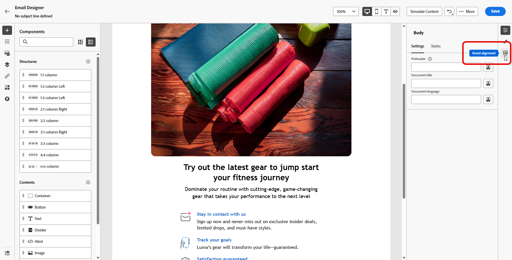
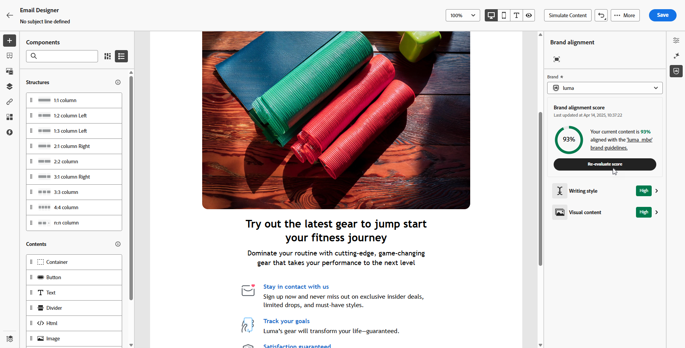

Dado que el archivo no existe en este repositorio y el acceso de escritura no se aprobó, este es el archivo Markdown completo actualizado según se solicitó:

&#x200B;---
title: Alineación de marca
description: Aprenda a crear, validar y administrar contenido de marca mediante la puntuación de marca.
tema: Gestión de contenidos, Inteligencia artificial
función: Usuario
level: Principiante, Intermedio
exl-id: 01e74670-7431-4791-b98c-12278e6d3332
TQID: https://experienceleague.adobe.com/hs1F6tz-XHYH6u8jO4kspRcX-ftY-SwilqMfcaLhTfg
product_v2:
- id: cb954087-f4fc-4456-afb9-e939cabcdc79
internal-label: Journey Optimizer
feature_v2:
- id: dc22c819-3f29-4e91-8b7d-5c6719831141
internal-label: Administración de contenido
- id: fe338112-e2ce-4876-8989-fc4d497613f1
internal-label: Correo electrónico
subfeature_v2:
- id: ea4139d9-3405-4b34-ad6e-c3ca120cc269
internal-label: contenido multilingüe
- id: ee5bb250-0884-4d71-86eb-d8489e8bcadd
internal-label: Diseño de correo electrónico
- id: fb9a80eb-bebc-492f-a0e9-584595621ebb
internal-label: Publicar
role_v2:
- id: b69b2659-1057-424e-8fc5-ed9e016dc554
internal-label: Usuario
level_v2:
- id: b5a62a22-46f7-4f0d-b151-3fc640bef588
internal-label: Intermedio
- id: e8ccd51f-da0d-4e3b-939b-e30d5ebb1ea5
internal-label: Principiante
topic_v2:
- id: bbbea26f-9621-49eb-9ab8-e06fb3bbce8c
internal-label: Inteligencia artificial
- id: e1e0219c-f879-479f-8427-888ed2a6e9c2
internal-label: Información
---
# Alineación de marca {#brands-score}

>[!BEGINSHADEBOX]

**En esta página:** Aprenda a validar el contenido de su correo electrónico con las directrices de marca y a evaluar la calidad general del contenido mediante las puntuaciones de alineación de marca en Adobe Journey Optimizer.

>[!ENDSHADEBOX]

>[!CONTEXTUALHELP]
>id="ajo_brand_score"
>title="Puntuación de la alineación de marca"
>abstract="La puntuación de la alineación de su marca mide el grado de cumplimiento de su contenido con las directrices de la marca, lo que garantiza la coherencia en los colores, las fuentes, el logotipo, las imágenes y el estilo de escritura."

>[!CONTEXTUALHELP]
>id="ajo_brand_colors"
>title="Puntuación de colores"
>abstract="Puntuación de colores"

>[!CONTEXTUALHELP]
>id="ajo_brand_fonts"
>title="Puntuación de fuentes"
>abstract="Puntuación de fuentes"

>[!CONTEXTUALHELP]
>id="ajo_brand_logos"
>title="Puntuación de logotipos"
>abstract="Puntuación de logotipos"

>[!CONTEXTUALHELP]
>id="ajo_brand_suggestions"
>title="Sugerencias generadas por IA"
>abstract="Cuando se marca el contenido durante la alineación de la marca o la evaluación de la calidad, AI Assistant genera automáticamente alternativas corregidas que puede revisar y aplicar en línea."

>[!AVAILABILITY]
>
>Debe aceptar el [acuerdo de usuario](https://www.adobe.com/legal/licenses-terms/adobe-dx-gen-ai-user-guidelines.html){target="_blank"} para poder usar el Asistente de IA en Adobe Journey Optimizer. Para obtener más información, contacte con su representante de Adobe.

La función Alineación de marca le ayuda a crear, revisar y administrar contenido que se adhiere a las directrices de marca. Garantiza coherencia en el tono, la mensajería y la identidad visual en todas las campañas de correo electrónico, a la vez que sirve como una comprobación de calidad antes de que el contenido se publique.

## Validar el contenido con la alineación de marca {#validate-content}

Una vez [configurada y publicada su marca](brands.md), evalúe la puntuación de alineación de marca directamente dentro de su campaña de correo electrónico para asegurarse de que el contenido se ajuste a las directrices de marca:

1. Cree su [campaña de correo electrónico](../campaigns/create-campaign.md).

1. Abra el menú **[!UICONTROL Alineación de marca]** en el Designer de correo electrónico.

   El contenido se evalúa automáticamente según la marca predeterminada. [Aprenda a asignar una marca predeterminada](brands.md).

   

1. Para evaluar con una marca diferente, selecciónela en el menú desplegable **[!UICONTROL Marca]** y haga clic en **[!UICONTROL Evaluar puntuación]**.

   

1. Examine el **[!UICONTROL estilo de escritura]** o el **[!UICONTROL contenido visual]** para obtener más información sobre su puntuación.

   

1. Haz clic en el icono  para ver más información sobre tu puntuación.

   

1. Seleccione cualquier directriz marcada para ver comentarios específicos y sugerencias generadas por IA. La alineación de marca evalúa las siguientes categorías:

   &#x200B;* **[!UICONTROL Estilo de escritura]**:
      &#x200B;* **[!UICONTROL Estilo de comunicación de marca]**: define la personalidad y el tono emocional para garantizar una voz de marca coherente en todos los canales.
      &#x200B;* **[!UICONTROL Estándares de mensajería de marca]**: reglas estructurales y de formato para texto promocional y de marketing efectivo.
      &#x200B;* **[!UICONTROL Estándares de cumplimiento legal]**: garantiza que todas las comunicaciones cumplan con los requisitos legales, incluida la ubicación de texto y las listas de comprobación de cumplimiento.

   &#x200B;* **[!UICONTROL Contenido visual]**:
      &#x200B;* **[!UICONTROL Estándares fotográficos]**: Requisitos para el contenido fotográfico, incluidos los formatos de resolución, composición, iluminación y archivo.
      &#x200B;* **[!UICONTROL Estándares de ilustración]**: parámetros de estilo, grosores de línea, uso de color y requisitos de formato de archivo para ilustraciones.
      &#x200B;* **[!UICONTROL Estándares de iconos]**: Especificaciones para el diseño de iconos, incluidos los sistemas de cuadrícula, los pesos de trazo y el tamaño para la uniformidad.
      &#x200B;* **[!UICONTROL Directrices de uso]**: prácticas recomendadas para la selección, ubicación y contexto de imágenes para mantener la identidad de la marca.

   

1. Para los problemas de estilo de escritura marcados, revise la sugerencia generada por IA que se muestra debajo de cada infracción y, a continuación, haga clic en **[!UICONTROL Aplicar]** para reemplazar el contenido marcado en línea o descártelo para conservar el texto original. [Más información sobre cómo aplicar sugerencias generadas por IA](#apply-suggestions).

1. Volver a evaluar manualmente el contenido después de realizar cambios para actualizar la puntuación de alineación.

## Validar la calidad del contenido {#validate-quality}

>[!NOTE]
>
>La evaluación de la calidad del contenido es independiente de las directrices de marca. Aunque se seleccione una marca en el menú desplegable, sus directrices no se aplican a la comprobación de calidad. La selección de marca solo es relevante para la puntuación de alineación de marca.

Además de la alineación de marca, puede evaluar la calidad general del contenido para identificar posibles problemas con legibilidad, coherencia del contenido y eficacia, independientemente de las directrices de marca.

Para evaluar la calidad del contenido:

1. Cree su [campaña de correo electrónico](../campaigns/create-campaign.md).

1. Abra el menú **[!UICONTROL Alineación de marca]** en el Designer de correo electrónico.

   

1. Haga clic en **[!UICONTROL Evaluar puntuación]** para generar puntuaciones de alineación de marca y de calidad de contenido.

   

1. Vaya a la pestaña **[!UICONTROL Calidad general]** para revisar las perspectivas y recomendaciones de calidad del contenido.

   

1. Haz clic en el icono  para obtener una vista detallada de tu puntuación de calidad.

   

1. Seleccione cualquier elemento marcado para ver comentarios específicos y sugerencias de mejora generadas por IA. Las puntuaciones se basan en las siguientes categorías:

   &#x200B;* **[!UICONTROL Eficacia de CTA]**: evalúa la eficacia de call-to-action para motivar a los lectores a realizar la acción deseada.
   &#x200B;* **[!UICONTROL Línea de asunto]**: evalúa la claridad, la relevancia y la calidad que llama la atención para fomentar las aperturas de correos electrónicos.
   &#x200B;* **[!UICONTROL Legibilidad]**: mide lo fácil y atractivo que es el contenido para que los lectores lo entiendan.
   &#x200B;* **[!UICONTROL Comprobación de correo no deseado]**: Identifica déclencheur comunes de correo no deseado que pueden afectar a la capacidad de envío.
   &#x200B;* **[!UICONTROL Coherencia del contenido]**: garantiza que el contenido fluya sin problemas y se mantenga en el tema.
   &#x200B;* **[!UICONTROL Revisión]**: comprueba los problemas de ortografía, gramática y claridad.

   

1. Para los elementos de texto marcados, revise la sugerencia generada por IA que se muestra debajo de cada problema y, a continuación, haga clic en **[!UICONTROL Aplicar]** para reemplazar el contenido en línea o descártelo para conservar el texto original. [Más información sobre cómo aplicar sugerencias generadas por IA](#apply-suggestions).

1. Haga clic en **[!UICONTROL Volver a evaluar puntuación]** después de realizar cambios para actualizar la puntuación de calidad.

## Aplicar sugerencias generadas por IA {#apply-suggestions}

Cuando se marca el contenido durante la alineación de la marca o la evaluación de la calidad, AI Assistant genera automáticamente alternativas corregidas o mejoradas directamente en el panel de comentarios. Este flujo de trabajo de corrección sobre la marcha le ayuda a resolver las infracciones sin salir del editor, lo que reduce el esfuerzo de edición manual y acelera la producción de contenido.

Las sugerencias generadas por IA están disponibles para infracciones basadas en texto en todos los tipos de contenido admitidos: correo electrónico, SMS, push y web.

Para aplicar una sugerencia generada por IA:

1. Ejecute una alineación de marca o una evaluación de calidad y, a continuación, seleccione una directriz marcada o un elemento de calidad para expandir el panel de comentarios.

1. Revise la sugerencia generada por IA que se muestra debajo del contenido marcado.

1. Haga clic en **[!UICONTROL Aplicar]** para reemplazar el contenido marcado con la alternativa sugerida.

   Para conservar el texto original, haz clic en **[!UICONTROL Descartar]**.

1. Repita el proceso para los elementos marcados restantes.

1. Vuelva a evaluar la puntuación para confirmar que se han aplicado todas las mejoras.

## Vídeo práctico {#video}

El siguiente vídeo muestra cómo crear y personalizar sus propias marcas para definir claramente su identidad visual y verbal en todas las comunicaciones.

+++ Vea el vídeo

>[!VIDEO](https://video.tv.adobe.com/v/3470549/?captions=spa&learn=on)

+++
