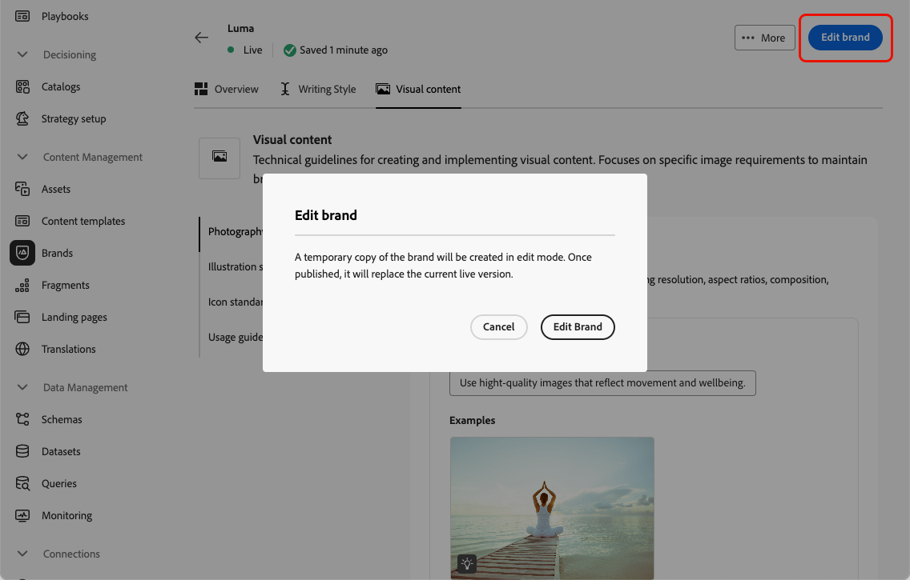

# Creación y administración de sus marcas {#brands}

>[!CONTEXTUALHELP]
>id="ajo_brand_overview"
>title="Introducción a las marcas"
>abstract="Cree y personalice sus propias marcas para definir su identidad visual y verbal única, al tiempo que facilita la generación de contenidos que coinciden con el estilo y la voz de su marca."

>[!CONTEXTUALHELP]
>id="ajo_brand_ai_menu"
>title="Seleccione su marca"
>abstract="Elija su marca para asegurarse de que todo el contenido generado por la IA se adapte a las especificaciones y directrices de su marca."

>[!CONTEXTUALHELP]
>id="ajo_brand_score_overview"
>title="Selección de la marca"
>abstract="Seleccione su marca para asegurarse de que el contenido se crea de acuerdo con sus directrices, estándares e identidad específicos, manteniendo la coherencia y la integridad de la marca."

Las directrices de marca son un conjunto detallado de reglas y estándares que establecen la identidad visual y verbal de una marca. Actúan como referencia para mantener una representación de marca coherente en todas las plataformas de marketing y comunicación.

En [!DNL Journey Optimizer], ahora tiene la opción de introducir y organizar manualmente los detalles de marca o cargar documentos de directrices de marca para la extracción automática de información.

>[!AVAILABILITY]
>
>Debe aceptar el [acuerdo de usuario](https://www.adobe.com/legal/licenses-terms/adobe-dx-gen-ai-user-guidelines.html){target="_blank"} para poder usar el Asistente de IA en Adobe Journey Optimizer. Para obtener más información, contacte con su representante de Adobe.

## Acceso a marcas {#generative-access}

Para acceder al menú de **[!UICONTROL Marcas]** en [!DNL Adobe Journey Optimizer], los usuarios deben recibir los permisos de **[!UICONTROL Administrar kit de marca]** o **[!UICONTROL Habilitar el asistente de IA]**. [Más información](../administration/permissions.md)

+++  Aprenda a asignar permisos relacionados con la marca

Para asignar permisos para marcas, siga estos pasos:

1. En el producto **Permisos**, vaya a la pestaña **Funciones** y seleccione la **Función** que desee.

1. Haga clic en **Editar** para modificar los permisos.

1. Agregue el recurso **Asistente de IA** y, a continuación, seleccione **Administrar kit de marca** o **[!UICONTROL Habilitar el asistente de IA]** en el menú desplegable.

   Tenga en cuenta que el permiso **[!UICONTROL Habilitar el asistente de IA]** solo proporciona acceso de solo lectura al menú **[!UICONTROL Marcas]**.

   {zoomable="yes"}

1. Haga clic en **Guardar** para aplicar los cambios.

   Los permisos de los usuarios que ya estén asignados a esta función se actualizarán automáticamente.

1. Para asignar esta función a nuevos usuarios, vaya a la pestaña **Usuarios** en el panel de control **Funciones** y haga clic en **Añadir usuario**.

1. Introduzca el nombre del usuario y su dirección de correo electrónico, o selecciónelo en la lista, y haga clic en **Guardar**.

1. Si el usuario no estaba ya creado, consulte [esta documentación](https://experienceleague.adobe.com/es/docs/experience-platform/access-control/abac/permissions-ui/users).

+++

## Creación y administración de la marca {#create-brand-kit}

>[!CONTEXTUALHELP]
>id="ajo_brands_create"
>title="Cree su marca"
>abstract="Introduzca el nombre de su marca y cargue el archivo de directrices de la marca. La herramienta extraerá automáticamente los detalles clave, lo que facilita el mantenimiento de la identidad de su marca."

Para crear y administrar las directrices de marca, puede introducir los detalles usted mismo o cargar el documento de directrices de marca para que la información se extraiga automáticamente:

1. En el menú **[!UICONTROL Marcas]**, haga clic en **[!UICONTROL Crear marca]**.

   

1. Escriba un **[!UICONTROL Nombre]** para su marca.

1. Arrastre y suelte o seleccione el archivo para cargar las directrices de marca y extraer automáticamente la información de marca relevante. Haga clic en **[!UICONTROL Crear marca]**.

   Ahora comienza el proceso de extracción de información. Tenga en cuenta que puede tardar varios minutos en completarse.

   

1. Los estándares de creación visual y de contenido ahora se rellenan automáticamente. Examine las diferentes pestañas para adaptar la información según sea necesario. [Más información](#personalize)

1. Desde el menú avanzado de cada sección o categoría, puede añadir referencias para extraer automáticamente información de marca relevante o volver a ejecutar la extracción para actualizar las directrices existentes.

   Para quitar el contenido existente, usa las opciones **[!UICONTROL Borrar sección]** o **[!UICONTROL Borrar categoría]**.

   

1. Haga clic en **[!UICONTROL Filtro]** para filtrar las directrices por canal o tipo de elemento.

   

1. Una vez configurada, haz clic en **[!UICONTROL Guardar]** y luego en **[!UICONTROL Publicar]** para que la guía de marca esté disponible en el Asistente de IA.

1. Para hacer modificaciones a tu marca publicada, haz clic en **[!UICONTROL Editar marca]**.

   >[!NOTE]
   >
   >Esto crea una copia temporal en el modo de edición y reemplaza la versión activa una vez publicada.

   

1. En el panel **[!UICONTROL Marcas]**, abra el menú avanzado haciendo clic en el icono  para:

   * Ver marca
   * Abrir en una pestaña nueva
   * Editar
   * Marcar como marca predeterminada
   * Duplicar
   * Publicación
   * Cancelar publicación
   * Eliminar

   

Ahora se puede acceder a las directrices de marca desde la lista desplegable **[!UICONTROL Marca]** del menú Asistente de IA, lo que le permite generar contenido y recursos alineados con las especificaciones. [Más información sobre el Asistente de IA](gs-generative.md)

### Establecer una marca predeterminada {#default-brand}

Puede designar una marca predeterminada para que se aplique automáticamente al generar contenido y calcular las puntuaciones de alineación durante la creación de la campaña.

Para establecer una marca predeterminada, ve a tu panel **[!UICONTROL Marcas]**. Abra el menú avanzado haciendo clic en el icono  y seleccione **[!UICONTROL Marcar como marca predeterminada]**.

