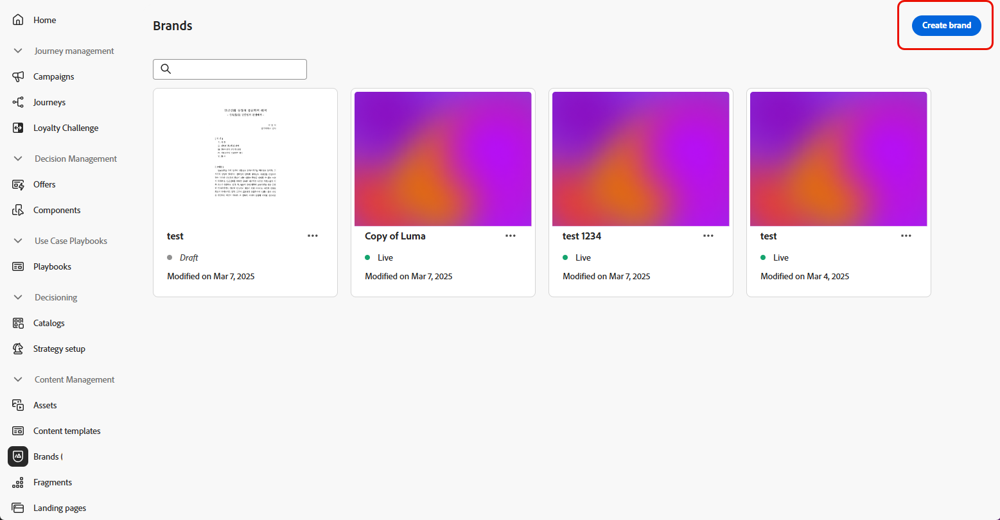

# Cree y administre sus marcas {#brands}

>[!CONTEXTUALHELP]
>id="ajo_brand_overview"
>title="Introducción a las marcas"
>abstract="Cree y personalice sus propias marcas para definir su identidad visual y verbal única, al tiempo que facilita la generación de contenidos que coinciden con el estilo y la voz de su marca."

>[!CONTEXTUALHELP]
>id="ajo_brand_ai_menu"
>title="Seleccione su marca"
>abstract="Elija su marca para asegurarse de que todo el contenido generado por la IA se adapte a las especificaciones y directrices de su marca."

>[!CONTEXTUALHELP]
>id="ajo_brand_score_overview"
>title="Selección de la marca"
>abstract="Seleccione su marca para asegurarse de que el contenido se crea de acuerdo con sus directrices, estándares e identidad específicos, manteniendo la coherencia y la integridad de la marca."

>[!CONTEXTUALHELP]
>id="ajo_brand_score"
>title="Puntuación de alineación de la marca"
>abstract="La puntuación de alineación de su marca mide el grado de cumplimiento de su contenido con las directrices de la marca, lo que garantiza la coherencia en los colores, las fuentes, el logotipo, las imágenes y el estilo de redacción."

>[!CONTEXTUALHELP]
>id="ajo_brand_colors"
>title="Puntuación de colores"
>abstract="Puntuación de colores"

>[!CONTEXTUALHELP]
>id="ajo_brand_fonts"
>title="Puntuación de fuentes"
>abstract="Puntuación de fuentes"

>[!CONTEXTUALHELP]
>id="ajo_brand_logos"
>title="Puntuación de logotipos"
>abstract="Puntuación de logotipos"

>[!CONTEXTUALHELP]
>id="ajo_brand_imagery"
>title="Puntuación de imágenes"
>abstract="Puntuación de imágenes"

>[!CONTEXTUALHELP]
>id="ajo_brand_writing_style"
>title="Puntuación del estilo de escritura"
>abstract="Puntuación del estilo de escritura"

>[!AVAILABILITY]
>
>Esta capacidad se presenta como una versión beta privada. Estará disponible de forma progresiva para todos los clientes en futuras versiones.

Las directrices de marca son un conjunto detallado de reglas y estándares que establecen la identidad visual y verbal de una marca. Actúan como referencia para mantener una representación de marca coherente en todas las plataformas de marketing y comunicación.

En [!DNL Journey Optimizer], ahora tiene la opción de introducir y organizar manualmente los detalles de marca o cargar documentos de directrices de marca para la extracción automática de información.

## Acceso a marcas {#generative-access}

Para tener acceso al menú **[!UICONTROL Marcas]** en [!DNL Adobe Journey Optimizer], los usuarios necesitan que se les conceda el **[!UICONTROL kit de marca administrado]** o los permisos de **[!UICONTROL Habilitar el asistente de IA]**. [Más información](../administration/permissions.md)

+++  Aprenda a asignar permisos relacionados con la marca

1. En el producto **Permisos**, vaya a la pestaña **Funciones** y seleccione la **Función** que desee.

1. Haga clic en **Editar** para modificar los permisos.

1. Agregue el recurso **Asistente de IA** y, a continuación, seleccione **Kit de marca administrado** o **[!UICONTROL Habilitar el asistente de IA]** en el menú desplegable.

   Tenga en cuenta que el permiso **[!UICONTROL Habilitar el asistente de IA]** solo proporciona acceso de solo lectura al menú **[!UICONTROL Marcas]**.

   {zoomable="yes"}

1. Haga clic en **Guardar** para aplicar los cambios.

   Los permisos de los usuarios que ya estén asignados a esta función se actualizarán automáticamente.

1. Para asignar esta función a nuevos usuarios, vaya a la pestaña **Usuarios** en el panel de control **Funciones** y haga clic en **Añadir usuario**.

1. Introduzca el nombre del usuario y su dirección de correo electrónico, o selecciónelo en la lista, y haga clic en **Guardar**.

1. Si el usuario no estaba ya creado, consulte [esta documentación](https://experienceleague.adobe.com/es/docs/experience-platform/access-control/abac/permissions-ui/users).

+++

## Cree su marca {#create-brand-kit}

>[!CONTEXTUALHELP]
>id="ajo_brands_create"
>title="Cree su marca"
>abstract="Introduzca el nombre de su marca y cargue el archivo de directrices de la marca. La herramienta extraerá automáticamente los detalles clave, lo que facilita el mantenimiento de la identidad de su marca."

Para crear y administrar las directrices de marca, puede introducir los detalles usted mismo o cargar el documento de directrices de marca para que la información se extraiga automáticamente:

1. En el menú **[!UICONTROL Marcas]**, haga clic en **[!UICONTROL Crear marca]**.

   

1. Escriba un **[!UICONTROL Nombre]** para su marca.

1. Arrastre y suelte o seleccione el archivo para cargar las directrices de marca y extraer automáticamente la información de marca relevante. Haga clic en **[!UICONTROL Crear marca]**.

   Ahora comienza el proceso de extracción de información. Tenga en cuenta que puede tardar varios minutos en completarse.

   

1. Los estándares de creación visual y de contenido ahora se rellenan automáticamente. Examine las diferentes pestañas para adaptar la información según sea necesario.

1. En la ficha **[!UICONTROL Estilo de escritura]**, haga clic en  para agregar una directriz o exclusión, incluidos ejemplos.

   

1. En la ficha **[!UICONTROL Contenido visual]**, haga clic en  para agregar otra directriz o exclusión.

1. Para agregar una imagen que muestre el uso correcto, seleccione **[!UICONTROL Ejemplo]** y haga clic en **[!UICONTROL Seleccionar imagen]**. También puede añadir una imagen que muestre un uso incorrecto como ejemplo de exclusión.

   

1. Una vez configurada, haz clic en **[!UICONTROL Guardar]** y luego en **[!UICONTROL Publicar]** para que la guía de marca esté disponible en el asistente de IA.

1. Para hacer modificaciones a tu marca publicada, haz clic en **[!UICONTROL Editar marca]**.

   >[!NOTE]
   >
   >Esto crea una copia temporal en el modo de edición y reemplaza la versión activa una vez publicada.

   

1. En el panel **[!UICONTROL Marcas]**, abra el menú avanzado haciendo clic en el icono  para:

   * Ver marca
   * Editar
   * Duplicar
   * Publicación
   * Cancelar publicación
   * Eliminar

   

Ahora se puede acceder a las directrices de marca desde la lista desplegable **[!UICONTROL Marca]** del menú del asistente de IA, lo que le permite generar contenido y recursos alineados con las especificaciones. [Más información sobre el asistente de IA](gs-generative.md)

