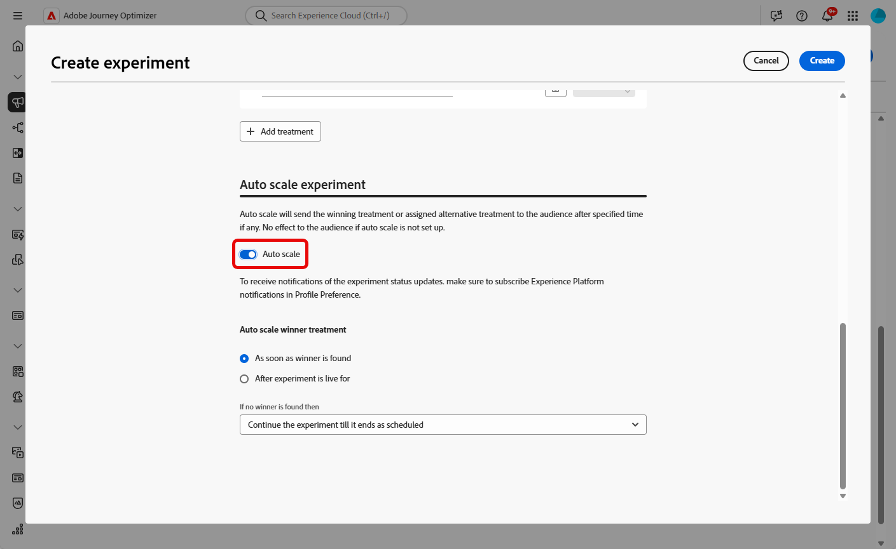

# Creación de un experimento de contenido {#content-experiment}

>[!CONTEXTUALHELP]
>id="ajo_campaigns_content_experiment"
>title="Experimento del contenido"
>abstract="Puede elegir entre modificar el contenido del mensaje o el asunto para definir varios tratamientos y determinar la mejor combinación para sus públicos."

>[!NOTE]
>
>Antes de empezar con Experimento de contenido, asegúrese de que la configuración de la creación de informes está establecida para sus conjuntos de datos personalizados. Obtenga más información en [esta sección](../reports/reporting-configuration.md).

El Experimento de contenido de Journey Optimizer le permite definir varios tratamientos de entrega para medir cuál ofrece el mejor rendimiento para la audiencia de destino. Puede elegir entre variar el contenido o el asunto de la entrega. La audiencia de interés se asigna aleatoriamente a cada tratamiento para determinar cuál funciona mejor en términos de la métrica especificada.

En el siguiente ejemplo, el destinatario del envío se ha dividido en dos grupos, cada uno de los cuales representa el 45 % de la población objetivo, y un grupo de exclusión del 10 %, que no reciben el envío.

Cada persona de la audiencia de destino recibe una versión de un correo electrónico, con una línea de asunto que es una de las dos siguientes:

* uno que promociona directamente una oferta del 10% en la nueva colección y una imagen.
* el otro solo anuncia una oferta especial sin especificar el 10% de descuento sin ninguna imagen.

El objetivo aquí es ver si los destinatarios interactuarán con el correo electrónico según el experimento recibido. Por lo tanto, elegiremos **[!UICONTROL Aperturas de correo electrónico]** como métrica de objetivo principal en este experimento de contenido.

➡️ Aprenda a utilizar experimentos de contenido para comparar decisiones con el canal de experiencia basado en código en [este caso de uso](../experience-decisioning/experience-decisioning-uc.md).

## Cree su contenido {#campaign-experiment}

1. Comience creando y configurando su [campaña](../campaigns/create-campaign.md) o [recorrido](../building-journeys/journeys-message.md) según sus necesidades.

1. Desde la ventana **[!UICONTROL Editar contenido]**, empiece a personalizar el tratamiento A.

   Para este tratamiento, especificaremos la oferta especial directamente en la línea de asunto y añadiremos la personalización.

   

1. Cree o importe el contenido original y personalícelo según sea necesario.

## Configuración del experimento de contenido {#configure-experiment}

>[!CONTEXTUALHELP]
>id="ajo_campaigns_content_experiment_dimension"
>title="Dimensión"
>abstract="Elija la dimensión específica que desea rastrear para el experimento, como clics específicos o vistas de páginas específicas."

>[!CONTEXTUALHELP]
>id="ajo_campaigns_content_experiment_success_metric"
>title="Métrica de éxito"
>abstract="La métrica de éxito se utiliza para rastrear y evaluar el tratamiento con mejor rendimiento de un experimento. Asegúrese de configurar su conjunto de datos para determinadas métricas antes de utilizarlo."

>[!AVAILABILITY]
>
>El correo postal admite la funcionalidad de Holdout, pero actualmente no admite Tratamientos.

Para el experimento de contenido, puede elegir entre tres tipos de experimento:

* **[!UICONTROL Experimento A/B]**: defina la división de tráfico entre tratamientos al comienzo de la prueba. El rendimiento se evalúa en función de la métrica principal que haya elegido, la Experimentation Accelerator, a continuación, informa del alza observada entre los tratamientos.

* **[!UICONTROL Bandido multibrazo]**: la división del tráfico entre tratamientos se gestiona automáticamente. Cada 7 días, se revisa el rendimiento de la métrica principal y los pesos se ajustan en consecuencia. Los informes de Experimentation Accelerator siguen mostrando el alza como pruebas A/B.

* **[!UICONTROL Trae tu propio Multi-armed bandit]**: la división del tráfico entre los tratamientos se gestiona automáticamente. Tiene la flexibilidad para determinar cuándo y cómo debe cambiar mediante las API de Experimento para ajustar las asignaciones en tiempo real.

➡️ [Más información sobre la diferencia entre los experimentos de bandidos A/B y multibrazo](mab-vs-ab.md)

>[!BEGINTABS]

>[!TAB Experimento A/B]

1. Cuando el mensaje esté personalizado, en la ficha **[!UICONTROL Acciones]**, haga clic en **[!UICONTROL Crear experimento]** para comenzar a configurar el experimento de contenido.

   

1. Seleccione la **[!UICONTROL métrica de éxito]** que desee establecer para su experimento.

   Para este ejemplo, seleccione **[!UICONTROL Correo electrónico abierto]** para comprobar si los perfiles abren sus mensajes de correo electrónico si el código de la promoción está en la línea de asunto.

   

1. Al configurar un experimento utilizando el canal en la aplicación o web y elegir los **[!UICONTROL clics entrantes]**, los **[!UICONTROL clics entrantes únicos]**, las **[!UICONTROL vistas de página]** o las **[!UICONTROL métricas de vistas de página únicas]**, el campo **[!UICONTROL Dimensiones]** le permite rastrear y supervisar con precisión los clics y las vistas en páginas específicas.

   

1. Si creó una campaña activada por API, seleccione **[!UICONTROL Experimento A/B]** de la lista desplegable **[!UICONTROL Tipo de experimento]**.

1. Haga clic en **[!UICONTROL Agregar tratamiento]** para crear tantos tratamientos nuevos como sea necesario.

   

   >[!CAUTION]
   >
   >Al crear un experimento basado en código, tenga en cuenta las siguientes limitaciones:
   >* **Recuento de tratamientos**: la creación de más de 3 a 5 tratamientos puede causar problemas de rendimiento e interfaz. Si encuentra errores al añadir tratamientos, intente reducir el número de tratamientos o agréguelos gradualmente hasta que se resuelva el problema.
   >* **Palabras clave reservadas**: evite utilizar palabras clave reservadas como &quot;holdout&quot; en los nombres de tratamiento, ya que esto puede provocar errores de asignación de nodos de decisión e impedir que el experimento funcione correctamente.

1. Cambie **[!UICONTROL Title]** del tratamiento para diferenciarlo mejor.

1. Elija agregar un grupo **[!UICONTROL Holdout]** a su entrega. Este grupo no recibirá ningún contenido de esta campaña.

   Al activar la barra de alternancia, se tomará automáticamente el 10% de su población, puede ajustar este porcentaje si es necesario.

   >[!IMPORTANT]
   >
   >Cuando se utiliza un grupo de exclusión en una acción para la experimentación de contenido, la asignación de exclusión solo se aplica a esa acción específica. Una vez finalizada la acción, los perfiles del grupo de exclusión seguirán por la ruta del recorrido y podrán recibir mensajes de otras acciones. Por lo tanto, asegúrese de que los mensajes posteriores no dependan de la recepción de un mensaje por un perfil que pueda estar en un grupo de exclusión. Si es así, es posible que tenga que eliminar la asignación de exclusión.

   

1. Puede elegir asignar un porcentaje preciso a cada **[!UICONTROL Tratamiento]** o simplemente cambiar en la barra de alternancia **[!UICONTROL Distribuir uniformemente]**.

   

1. Habilite el experimento de escalado automático para desplegar automáticamente la variación ganadora del experimento. [Más información sobre cómo escalar al ganador](#scale-winner)

   

1. Haga clic en **[!UICONTROL Crear]** cuando se establezca la configuración.

>[!TAB Bandido multibrazo]

Tenga en cuenta que el experimento Multi-armed bandit solo está disponible con lo siguiente:

* Canales entrantes
* Recorridos unitarios
* Campañas activadas por API (tanto transaccionales como operativas)
* Canales salientes si la programación se repite

1. Cuando el mensaje esté personalizado, en la ficha **[!UICONTROL Acciones]**, haga clic en **[!UICONTROL Crear experimento]** para comenzar a configurar el experimento de contenido.

   

1. Seleccione la **[!UICONTROL métrica de éxito]** que desee establecer para su experimento.

   Para este ejemplo, seleccione **[!UICONTROL Correo electrónico abierto]** para comprobar si los perfiles abren sus mensajes de correo electrónico si el código de la promoción está en la línea de asunto.

   

1. Si creó una campaña activada por API, seleccione **[!UICONTROL Multi-armed bandit]** en la lista desplegable **[!UICONTROL Tipo de experimento]**.

   

1. Haga clic en **[!UICONTROL Agregar tratamiento]** para crear tantos tratamientos nuevos como sea necesario.

   

1. Cambie **[!UICONTROL Title]** del tratamiento para diferenciarlo mejor.

1. Elija agregar un grupo **[!UICONTROL Holdout]** a su entrega. Este grupo no recibirá ningún contenido de esta campaña.

   Al activar la barra de alternancia, se tomará automáticamente el 10% de su población, puede ajustar este porcentaje si es necesario.

   >[!IMPORTANT]
   >
   >Cuando se utiliza un grupo de exclusión en una acción para la experimentación de contenido, la asignación de exclusión solo se aplica a esa acción específica. Una vez finalizada la acción, los perfiles del grupo de exclusión seguirán por la ruta del recorrido y podrán recibir mensajes de otras acciones. Por lo tanto, asegúrese de que los mensajes posteriores no dependan de la recepción de un mensaje por un perfil que pueda estar en un grupo de exclusión. Si es así, es posible que tenga que eliminar la asignación de exclusión.

   

>[!TAB Trae tu propio bandido multibrazo]

Tenga en cuenta que Traer su propio experimento Multi-armed bandit solo está disponible con lo siguiente:

* Canales entrantes
* Recorridos unitarios
* Campañas activadas por API (tanto transaccionales como operativas)
* Canales salientes si la programación se repite

1. Cuando el mensaje esté personalizado, en la ficha **[!UICONTROL Acciones]**, haga clic en **[!UICONTROL Crear experimento]** para comenzar a configurar el experimento de contenido.

   

1. Seleccione la **[!UICONTROL métrica de éxito]** que desee establecer para su experimento.

   Para este ejemplo, seleccione **[!UICONTROL Correo electrónico abierto]** para comprobar si los perfiles abren sus mensajes de correo electrónico si el código de la promoción está en la línea de asunto.

   

1. Si creó una campaña activada por API, seleccione **[!UICONTROL Traer su propio bandido multibrazo]** en la lista desplegable **[!UICONTROL Tipo de experimento]**.

   

1. Haga clic en **[!UICONTROL Agregar tratamiento]** para crear tantos tratamientos nuevos como sea necesario.

   

1. Cambie **[!UICONTROL Title]** del tratamiento para diferenciarlo mejor.

1. Elija agregar un grupo **[!UICONTROL Holdout]** a su entrega. Este grupo no recibirá ningún contenido de esta campaña.

   Al activar la barra de alternancia, se tomará automáticamente el 10% de su población, puede ajustar este porcentaje si es necesario.

   >[!IMPORTANT]
   >
   >Cuando se utiliza un grupo de exclusión en una acción para la experimentación de contenido, la asignación de exclusión solo se aplica a esa acción específica. Una vez finalizada la acción, los perfiles del grupo de exclusión seguirán por la ruta del recorrido y podrán recibir mensajes de otras acciones. Por lo tanto, asegúrese de que los mensajes posteriores no dependan de la recepción de un mensaje por un perfil que pueda estar en un grupo de exclusión. Si es así, es posible que tenga que eliminar la asignación de exclusión.

   

>[!ENDTABS]

## Diseña tus tratamientos {#treatment-experiment}

1. En la ventana **[!UICONTROL Editar contenido]**, seleccione el tratamiento B para cambiar el contenido.

   Aquí, elegimos no especificar la oferta en la **[!UICONTROL línea de asunto]**.

   

1. Haga clic en **[!UICONTROL Editar cuerpo del correo electrónico]** para personalizar aún más el tratamiento B.

   

1. Después de diseñar los tratamientos, haga clic en **[!UICONTROL Más acciones]** para obtener acceso a las opciones relacionadas con los tratamientos: **[!UICONTROL Cambiar nombre]**, **[!UICONTROL Duplicar]** y **[!UICONTROL Eliminar]**.

   

1. Si es necesario, accede al menú **[!UICONTROL Configuración de experimentos]** para cambiar la configuración de los tratamientos.

   

1. Una vez definido el contenido del mensaje, haga clic en el botón **[!UICONTROL Simular contenido]** para controlar la renderización del envío y comprobar la configuración de personalización con perfiles de prueba. [Más información](../content-management/preview-test.md)

Después de configurar la experimentación, puede realizar un seguimiento del éxito de su envío con el informe. [Más información](../reports/campaign-global-report-cja-experimentation.md)

## Escalar el ganador {#scale-winner}

>[!AVAILABILITY]
>
>La función Escalar el ganador (Scale the Winner) es compatible actualmente con los siguientes canales:
>
>* Canales entrantes (por ejemplo, web, mensaje en la aplicación o experiencia basada en código) en cualquier recorrido o campaña.
>* Canales salientes (por ejemplo, correo electrónico, notificaciones push, SMS) en campañas transaccionales activadas por API.

Escalar el ganador permite desplegar automática o manualmente la variación ganadora de un experimento para todo el público. Esta función garantiza que, una vez que se determina un ganador, puede amplificar su alcance y efectividad sin monitorizar constantemente el experimento.

Puede elegir entre dos modos:

* **Escalado automático**: configure las opciones de escalado automático al crear su experimento eligiendo el momento y las condiciones para escalar el tratamiento ganador o una opción de reserva si no aparece ningún ganador.

* **Escalado manual**: revise manualmente los resultados del experimento e inicie el despliegue del tratamiento ganador, manteniendo un control total sobre el tiempo y las decisiones.

### Escalado automático {#autoscaling}

El escalado automático permite establecer reglas predefinidas sobre cuándo implementar el tratamiento ganador o una alternativa, en función de los resultados del experimento.

Tenga en cuenta que una vez que se ha producido el escalado automático, el escalado manual ya no está disponible.

Para habilitar el escalado automático en los experimentos:

1. Configure la campaña o el recorrido y configure el experimento según sea necesario. [Más información](#configure-experiment)

1. Active la opción de escalado automático al configurar el experimento.

   

1. Seleccione cuándo se debe escalar el ganador:

   * En cuanto se encuentre el ganador.
   * Después de que el experimento esté activo durante el tiempo seleccionado.

   La hora de escalado automático debe programarse antes de la fecha de finalización del experimento. Si se establece para una hora después de la fecha de finalización, aparece una advertencia de validación y la campaña o el recorrido no se publican.

   

1. Elija el comportamiento de reserva si no se encuentra ningún ganador por tiempo de escala:

   * Continuar el experimento hasta que termine según lo programado.
   * Escalar el tratamiento alternativo después de un tiempo especificado.

Una vez cumplidos todos los parámetros, el tratamiento ganador o alternativo se envía a su audiencia.

### Escalado manual {#manual-scaling}

La escala manual le permite revisar los resultados de los experimentos y decidir cuándo implementar el tratamiento ganador según su propia programación.

Tenga en cuenta que si escala manualmente al ganador antes de la hora programada de escalado automático, se cancela la escala automática.

Para escalar manualmente el ganador de los experimentos:

1. Configure la campaña o el recorrido y configure el experimento según sea necesario. [Más información](#configure-experiment)

1. Deje que el experimento se ejecute hasta que se identifique un ganador o se alcance la relevancia estadística.

1. Abra el panel de campañas o seleccione la actividad de canal en el recorrido.

   Revise los resultados en el menú **[!UICONTROL Experimento de contenido]** para identificar el tratamiento de mayor rendimiento.

   

1. Haga clic en **[!UICONTROL Escalar tratamiento]** para insertar el tratamiento ganador al resto de la audiencia.

   

1. Seleccione el tratamiento que desee escalar en el menú desplegable y haga clic en **[!UICONTROL Escalar]**.

   

Tenga en cuenta que escalar el tratamiento puede tomar hasta una hora. Recibirá una notificación una vez que finalice el proceso de escalado manual.

