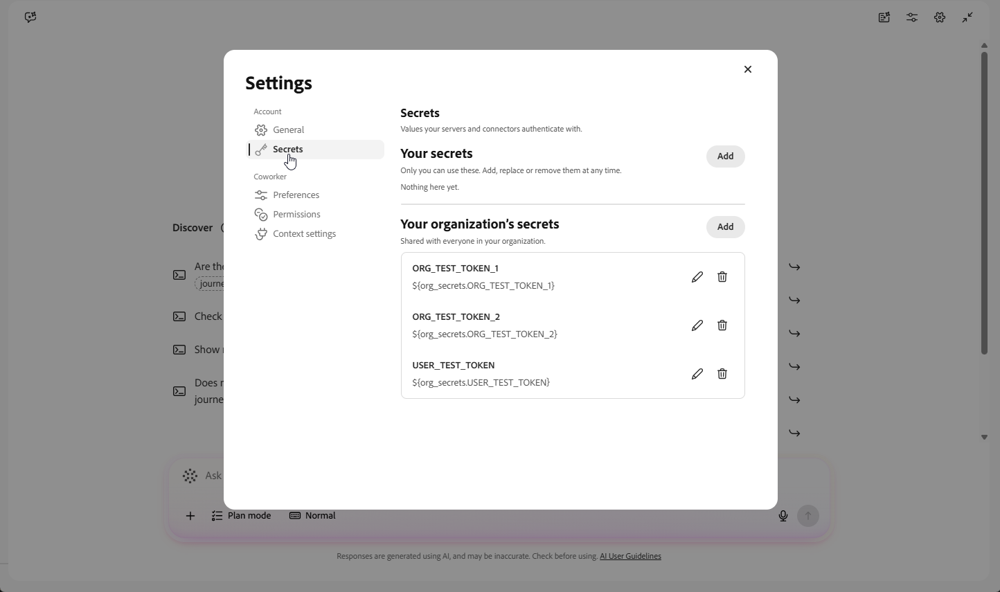

# Compañero de trabajo para la administración de contenido {#content-management-coworker-skills}

>[!BEGINSHADEBOX]

**En esta página:** Descubra las herramientas de administración de contenido de CX Coworker disponibles en Adobe Journey Optimizer para examinar, crear, actualizar, clonar y publicar plantillas de contenido, fragmentos, páginas de aterrizaje y contenido en línea de recorrido/campaña; para planificar la estrategia de campaña y generar copias e imágenes de marca en canales, configuraciones regionales, audiencias y variantes; y para crear, revisar y entregar HTML de correo electrónico accesible, con instrucciones detalladas, mensajes de ejemplo y prácticas recomendadas.

Más información:

* [Aptitudes de colaborador para Journey Optimizer](../start/ai-features.md#cx-coworker-skills): información general sobre las aptitudes de colaborador en todos los Recorridos, la lealtad y la administración de contenido en Journey Optimizer.
* [Documentación de los compañeros](https://experienceleague.adobe.co/es/docs/cx-enterprise-ai/experience-cloud-ai/coworker/overview){target="_blank"}: información general sobre las capacidades de Campañas, Conversaciones y Proyectos de los compañeros.
* [Guía de la interfaz de usuario de Coworker Chat](https://experienceleague.adobe.com/es/docs/cx-enterprise-ai/experience-cloud-ai/coworker/chat/ui-guide){target="_blank"}: cómo acceder y navegar por Coworker Chat.

>[!ENDSHADEBOX]

## Herramientas de administración de contenido {#content-management}

>[!AVAILABILITY]
>
>La administración de contenido está disponible para todos los clientes que tienen acceso a Coworker.

Los usuarios de Journey Optimizer pueden detectar y administrar recursos de contenido (plantillas de contenido, fragmentos, páginas de aterrizaje y contenido de mensajes en línea de recorrido/campaña) directamente desde Coworker con indicaciones en lenguaje natural. Permite pasar de &quot;hablarme sobre mi contenido&quot; a &quot;compilarlo, actualizarlo y publicarlo&quot;, sin abandonar la conversación. Esta capacidad está equipada con 15 herramientas de MCP con capacidad de lectura y escritura para el contenido de Journey Optimizer.

### Casos de uso clave

1. **Examinar e inspeccionar contenido**

   * Enumere las plantillas de contenido, los fragmentos o las páginas de aterrizaje disponibles y recupere su estructura, metadatos y estado.
   * Recupere el contenido del mensaje en línea configurado en un nodo de recorrido o de acción de campaña.

   Ejemplos de mensajes:
   * &quot;Enumerar mis plantillas de contenido de correo electrónico&quot;.
   * &quot;Mostrarme los fragmentos disponibles para mi campaña de verano&quot;.
   * &quot;Obtenga los detalles de la página de aterrizaje página-123&quot;.
   * &quot;¿Qué contenido está configurado para la variante de correo electrónico del nodo de acción en campaign camp-789?&quot;

1. **Crear plantillas de contenido**

   * Cree una nueva plantilla de contenido para cualquier canal.

   Ejemplos de mensajes:
   * &quot;Cree una plantilla de correo electrónico denominada Rebajas de verano con este contenido de HTML&quot;.
   * &quot;Cree una nueva plantilla de SMS llamada Alerta Flash&quot;.

1. **Actualizar plantillas de contenido**

   * Reemplazar completamente el contenido de una plantilla existente.

   Ejemplos de mensajes:
   * &quot;Actualice la plantilla abc-123 con este nuevo cuerpo de HTML&quot;.

1. **Crear, actualizar, clonar y publicar fragmentos**

   * Cree un nuevo HTML o fragmento de expresión.
   * Actualizar el contenido o los metadatos de un fragmento existente.
   * Clonar un fragmento existente con un nombre nuevo.
   * Envíe un fragmento de borrador para su publicación.

   Ejemplos de mensajes:
   * &quot;Cree un fragmento de HTML llamado Banner de promoción con este marcado&quot;.
   * &quot;Actualice el fragmento frag-456 para cambiar su nombre a Banner promocional V2.&quot;
   * &quot;Clonar el fragmento abc-123 como titular de la promoción - Verano (Variante B).&quot;
   * &quot;Publicar fragmento frag-456&quot;.

1. **Actualizar contenido de mensaje en línea**

   * Reemplace una variante de canal en el mensaje en línea de un nodo de acción de recorrido o campaña.
   * Enumerar las variantes de canal definidas en un nodo de recorrido o de acción de campaña.

   Ejemplos de mensajes:
   * &quot;Actualice la variante de correo electrónico del nodo de acción en campaign camp-789 con este nuevo contenido&quot;.
   * &quot;¿Qué variantes de canal se definen en este nodo de acción?&quot;

### En ámbito

La administración de contenido admite las siguientes funciones:

* **Enumerar y obtener plantillas de contenido**: Examine las plantillas de contenido y recupere su estructura y metadatos.
* **Enumerar y obtener fragmentos**: Examine fragmentos de contenido y expresión y recupere sus detalles.
* **Enumerar y obtener páginas de aterrizaje**: Examine páginas de aterrizaje y recupere sus metadatos y contenido de página.
* **Obtener contenido en línea de campaña/recorrido**: recupere el contenido del mensaje en línea configurado en un nodo de acción de campaña o recorrido, incluidas las variantes multilingües.
* **Crear plantillas de contenido**: cree una nueva plantilla para cualquier canal.
* **Actualizar plantillas de contenido**: reemplace completamente el contenido de una plantilla existente.
* **Crear, actualizar, clonar y publicar fragmentos**: cree nuevos fragmentos, actualice los existentes, clone un fragmento con un nuevo nombre y envíe un borrador de fragmento para su publicación.
* **Actualizar contenido de mensajes en línea**: reemplace una variante de canal en el mensaje en línea de un nodo de acción de campaña/recorrido, incluidas las variantes multilingües, y enumere las variantes de canal definidas en un nodo de acción.

### Fuera de ámbito

Actualmente no se admiten las siguientes funcionalidades:

* **Búsqueda de texto completo en plantillas o fragmentos**
* **Validación de plantilla o fragmento** (referencias huérfanas, vínculos rotos, componentes obsoletos)
* **Creando o publicando páginas de aterrizaje**
* **Eliminando plantillas de contenido, fragmentos o páginas de aterrizaje**

### Impulso de las prácticas recomendadas

1. **ID de referencia conocidos**: proporcione la plantilla, el fragmento, la página de aterrizaje o el ID de campaña/recorrido cuando solicite obtener, actualizar, clonar o publicar un recurso específico.
1. **Sea explícito sobre el canal**: Al crear una plantilla o un fragmento, especifique el canal o el tipo de contenido (correo electrónico, fragmento de HTML, fragmento de expresión).
1. **Confirmar antes de publicar**: revise el contenido de un fragmento después de crearlo o actualizarlo antes de pedir a su compañero que lo publique.
1. **Proporcionar contenido de reemplazo completo**: las operaciones de actualización reemplazan el contenido por completo, de modo que incluya el cuerpo completo de HTML o el contenido de variante en el mensaje.

## Contenido de canal {#ce-channel-content}

>[!AVAILABILITY]
>
>El contenido del canal está disponible para todos los clientes que tienen acceso a CX Coworker. La generación de imágenes con un modelo personalizado entrenado por la marca requiere acceso de producción a Firefly Services.

El contenido del canal toma un informe, un recorrido, una campaña o una solicitud y lo convierte en copia e imágenes planificadas y según la marca en canales, configuraciones regionales, audiencias y variantes, incluido el correo electrónico final, accesible y ensamblado de HTML. El contenido se puede explorar, diseñar, evaluar, revisar y guardar en la solución activa (Adobe Journey Optimizer u otra solución de activación compatible).

### Aptitudes disponibles

Las siguientes habilidades están disponibles en el complemento **Contenido del canal**:

* **Crear contenido de orquestación** (`orchestrate-content-authoring`)

  Ejecuta el ciclo de vida completo de la creación desde un informe, un recorrido, una campaña o un mensaje, ideando, generando, revisando y guardando contenido, incluidas las copias, las imágenes y las comprobaciones de conformidad, accesibilidad y fidelidad en todos los canales admitidos.

  >[!BEGINSHADEBOX &quot;Ejemplos de mensajes&quot;]

  &quot;Ejecute la creación de contenido completo para nuestra campaña de correo electrónico de venta de otoño desde esta información y, a continuación, revise y guarde el HTML final&quot;.

  >[!ENDSHADEBOX]

* **Explorar estrategia de contenido** (`explore-content-strategy`)

  Determina qué debe decir una campaña o un mensaje antes de escribir una copia, comparando los mapas de mensajes y la secuenciación de puntos de contacto en el nivel de campaña y decidiendo el orden de sección, el énfasis y el CTA en el nivel de mensaje.

  >[!BEGINSHADEBOX &quot;Ejemplos de mensajes&quot;]

  * &quot;Compare un solo correo electrónico de recuperación con un programa de correo electrónico y SMS de tres contactos&quot;.
  * &quot;Dame tres direcciones de campaña para este lanzamiento antes de elegir una&quot;.
  * &quot;Ayuda a decidir qué debe decir este correo electrónico y en qué orden antes de escribir la copia&quot;.

  >[!ENDSHADEBOX]

* **Resumen de contenido** (`content-brief`)

  Convierte una dirección de campaña aprobada en requisitos de escritura concretos, incluidos tono, mensajes clave, oferta, puntos esenciales, canal, configuración regional y variantes, además de un plan para producir el contenido.

  >[!BEGINSHADEBOX]

  * &quot;Convierta este informe en requisitos de escritura para un correo electrónico de devolución de saldo a los suscriptores de EE. UU. que hayan caducado: 20 % de descuento hasta el domingo, con CTR como KPI&quot;.
  * &quot;Queremos promocionar nuestra venta de primavera por correo electrónico y SMS para nuevos suscriptores y miembros fieles. Estructurar los requisitos y crear un informe completo independiente para cada canal y audiencia&quot;.
  * &quot;Capture este informe de correo electrónico de bienvenida para audiencias en inglés y español, incluidos los requisitos localizados de pie de página legal, y prepárelo para la redacción de textos, no para el diseño de HTML&quot;.

  >[!ENDSHADEBOX]

* **Generar contenido** (`generate-content`)

  Borra un solo mensaje de marketing neto nuevo o una variante de copia para un canal, en función de una audiencia, oferta, tono, CTA y duración establecidos. Solo creación del primer borrador.

  >[!BEGINSHADEBOX]

  * &quot;Escriba tres opciones de línea de asunto y previsualice el texto de nuestro correo electrónico de promoción de primavera&quot;.
  * &quot;Genere una copia de SMS cálida y concisa para los clientes caducados con una oferta del 20 %&quot;.
  * &quot;Cree una copia de lanzamiento de marca para correo electrónico, push y SMS desde la dirección de campaña aprobada&quot;.

  >[!ENDSHADEBOX]

* **Comprobar la preparación del contenido** (`check-content-readiness`)

  Evalúa el contenido existente, incluido un correo electrónico ensamblado, para la voz de la marca, la calidad editorial, la accesibilidad y el cumplimiento, y luego muestra bloqueadores explicables y pasos siguientes.

  >[!BEGINSHADEBOX]

  * &quot;¿Está lista esta copia de correo electrónico para enviarla? Compruebe la voz, la claridad, la accesibilidad y el cumplimiento de la marca&quot;.
  * &quot;Revise este SMS para ver la calidad editorial, la participación y los bloqueadores antes de la aprobación&quot;.
  * &quot;Compruebe si hay problemas legales, de accesibilidad y de preparación para el envío en el correo electrónico ensamblado&quot;.

  >[!ENDSHADEBOX]

* **Revisar y regenerar contenido** (`revise-regenerate-content`)

  Aplica un cambio específico y confirmado al contenido existente, como la corrección de un resultado de revisión, el ajuste del tono, la traducción o el intercambio de una línea de asunto o CTA, mientras se conserva el artefacto.

  >[!BEGINSHADEBOX]

  * &quot;Aplique las correcciones de mayor gravedad de este informe de evaluación al SMS&quot;.
  * &quot;Aumente el tono preservando al mismo tiempo la oferta aprobada y el CTA&quot;.
  * &quot;Cambie el titular del héroe a &#39;Horas finales para ahorrar&#39; y muéstreme el contenido revisado&quot;.

  >[!ENDSHADEBOX]

* **Generar imagen** (`generate-image`)

  Produce y manipula elementos visuales para una ubicación aprobada, incluidas imágenes a pantalla completa, recortes, superposiciones, variaciones o recursos firmados, lo que confirma el plan antes de aplicarlo.

  >[!BEGINSHADEBOX]

  * &quot;Genere una imagen principal para este correo electrónico de venta de primavera utilizando la dirección de marca aprobada&quot;.
  * &quot;Cree un recorte compatible con el móvil de esta imagen de producto para el héroe de correo electrónico&quot;.
  * &quot;Haga dos variaciones visuales de esta imagen de campaña&quot;.
  * &quot;Generar una imagen similar a la imagen dada&quot;.

  >[!ENDSHADEBOX]

* **Evaluar diseño de contenido** (`assess-content-design`)

  Evalúa cómo se procesa realmente el contenido, incluida la jerarquía, el espaciado, las imágenes, la ubicación de CTA y la capacidad de respuesta, y recomienda cambios de copia o imagen para cerrar los huecos.

  >[!BEGINSHADEBOX]

  * &quot;¿Cómo se ve visualmente este correo electrónico? Compruebe la jerarquía, el espaciado, la densidad, las imágenes y CTA&quot;.
  * &quot;¿Ocupa el héroe demasiado espacio en esta HTML de página de aterrizaje?&quot;
  * &quot;Compare este correo electrónico creado con la composición de diseño aprobada y señale los mayores desajustes visuales&quot;.

  >[!ENDSHADEBOX]

* **Guardar contenido del canal** (`save-channel-content`)

  Guarda el contenido de la campaña aprobada como recurso de borrador o lo rellena en su plantilla de origen en Adobe Journey Optimizer u otra solución compatible.

  >[!BEGINSHADEBOX]

  * &quot;Guarde esta copia de correo electrónico aprobada como borrador de la solución&quot;.
  * &quot;Rellene el contenido aprobado en la plantilla de origen y prepárelo para su revisión&quot;.
  * &quot;El correo electrónico está aprobado; guarde el contenido del canal y prepare el envío para su entrega&quot;.

  >[!ENDSHADEBOX]

* **Generar correo electrónico desde Figma** (`build-email-from-figma`)

  Crea el HTML de correo electrónico final directamente desde un fotograma de Figma activo cuando su copia, diseño e imágenes son los que deberían enviarse sin cambios, sin necesidad de un plan de diseño independiente.

  >[!BEGINSHADEBOX]

  * &quot;Cree el correo electrónico final HTML a partir de este marco Figma; la copia del diseño es lo que debería enviarse&quot;.
  * &quot;Convierta este diseño Figma móvil y de escritorio aprobado en un correo electrónico adaptable&quot;.
  * &quot;Cree este correo electrónico desde el marco Figma y conserve los recortes de imagen, el CTA y el texto del diseño exactamente&quot;.

  >[!ENDSHADEBOX]

  +++Cómo utilizar esta aptitud

  1. Inicia sesión con tu compañero y ve a **[!UICONTROL Configuración]** > **[!UICONTROL Secretos]**.

     

  1. En **[!UICONTROL Sus secretos]**, haga clic en **[!UICONTROL Agregar]**.

  1. En **[!UICONTROL Nombre]**, escriba `FIGMA_ACCESS_TOKEN`.

  1. Genere un token de acceso personal (PAT) de Figma con al menos **contenido de archivo: ámbito de solo lectura**. [Aprenda a generar un token de acceso personal Figma](https://help.figma.com/hc/en-us/articles/8085703771159-Manage-personal-access-tokens#h_01JHJXYMB9CREBR8PB5VJ1Q5ME).

  1. Pegue la ruta de acceso en **[!UICONTROL Value]** y, a continuación, haga clic en **[!UICONTROL Guardar]**.

  +++

* **Búsqueda de marca** (`brand-lookup`)

  Busca, resuelve y aplica directrices de marca aprobadas, incluidas voz, imágenes y asistencia legal, antes de cualquier flujo de trabajo que genere o evalúe contenido de marca propia.

  >[!BEGINSHADEBOX]

  * &quot;¿Qué kits de marca publicados están disponibles para esta campaña?&quot;
  * &quot;Siga las directrices visuales y de escritura de nuestra marca Acme&quot;.

  >[!ENDSHADEBOX]

### Impulso de las prácticas recomendadas

1. **Comience con lo breve**: Proporcione el objetivo, la audiencia y los canales de la campaña por adelantado para que el plan de contenido refleje el ámbito deseado.
1. **Especifique las dimensiones del plan**: llame a los canales, puntos de contacto, configuraciones regionales, audiencias y variantes que desee que se representen en el plan de contenido.
1. **Incluir contexto de marca**: Haga referencia al kit de marca o a las directrices de voz para que las copias e imágenes generadas permanezcan en la marca.
1. **Límites de caracteres de estado**: proporcione límites de caracteres de canal explícitamente y revise la copia generada para confirmar que se ajusta antes de publicar.
1. **Solicite todas las revisiones relevantes**: Pida una revisión de marca, cumplimiento, diseño y accesibilidad antes de tratar el contenido como listo para enviar.
1. **Revise antes de guardar**: Evalúe y edite el contenido generado antes de pedir al compañero que lo guarde de nuevo en Adobe Journey Optimizer u otra solución de activación compatible.

{{$include /help/_includes/do-not-localize/start/ai-augmented-content-management-coworker-skills.md}}
