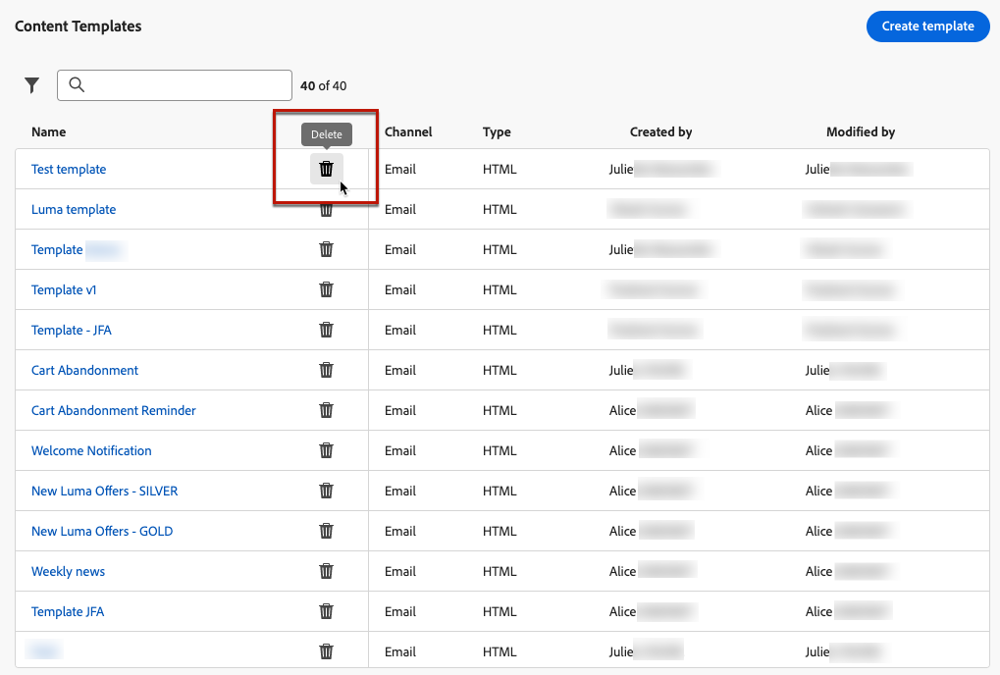

# Trabajo con plantillas de contenido {#content-templates}

Para un proceso de diseño acelerado y mejorado, puede crear plantillas independientes para reutilizar fácilmente el contenido personalizado en [!DNL Journey Optimizer] campañas y recorridos.

Esta funcionalidad permite a los usuarios orientados a contenido trabajar en plantillas fuera de campañas o recorridos. Los usuarios de marketing pueden reutilizar y adaptar estas plantillas de contenido independientes dentro de sus propios recorridos o campañas.

>[!NOTE]
>
>Actualmente solo el **email** se admiten las plantillas de contenido.

Por ejemplo: un usuario de su compañía solo está a cargo del contenido y, por lo tanto, no tiene acceso a campañas ni recorridos. Sin embargo, este usuario puede crear una plantilla de correo electrónico que los especialistas en marketing de su organización podrán seleccionar para utilizarla en todos los correos electrónicos como punto de partida.

También puede crear y administrar plantillas de contenido mediante API. Para obtener más información, consulte [Documentación de API de Journey Optimizer](https://developer.adobe.com/journey-optimizer-apis/references/content/){target="_blank"}.

➡️ [Aprenda a crear y utilizar plantillas en este vídeo](#video-templates)

>[!CAUTION]
>
>Para crear, editar y eliminar plantillas de contenido, debe tener **[!DNL Manage Library Items]** permiso incluido en el **[!DNL Content Library Manager]** perfil del producto. [Más información](../administration/ootb-product-profiles.md#content-library-manager)

## Acceso y administración de plantillas {#access-manage-templates}

Para acceder a la lista de plantillas de contenido, seleccione **[!UICONTROL Gestión de contenido]** > **[!UICONTROL Plantillas de contenido]** en el menú de la izquierda.

Todas las plantillas que se crearon en la zona protegida actual, ya sea desde un recorrido o desde una campaña utilizando [Guardar como plantilla](#save-as-template) , ya sea desde la opción **[!UICONTROL Plantillas de contenido]** menú: se muestran.

Puede ordenar las plantillas de contenido por fecha de creación o modificación. También puede elegir mostrar únicamente los elementos que ha creado o modificado.

Para editar el contenido de una plantilla, haga clic en el elemento deseado de la lista y seleccione **[!UICONTROL Editar contenido]**.

Para eliminar una plantilla, seleccione el icono de papelera junto a la plantilla deseada.

>[!NOTE]
>
>Cuando se edita o elimina una plantilla, las campañas o los recorridos, incluidos los correos electrónicos creados con esta plantilla, no se ven afectados.

## Creación de plantillas de contenido {#create-content-templates}

>[!CONTEXTUALHELP]
>id="ajo_create_template"
>title="Definir su propia plantilla de contenido"
>abstract="Cree una plantilla personalizada independiente desde cero para que el contenido se pueda reutilizar en varios recorridos y campañas."

Existen dos formas de crear plantillas de contenido:

* Cree una plantilla de contenido desde cero mediante el carril izquierdo **[!UICONTROL Plantillas de contenido]** menú. [Descubra cómo](#create-template-from-scratch)

* Al diseñar un correo electrónico dentro de una campaña o un recorrido, guarde el contenido del correo electrónico como plantilla. [Descubra cómo](#save-as-template)

Una vez guardada, la plantilla de contenido está disponible para usarla en una campaña o un recorrido. Tanto si se crea desde cero como desde un correo electrónico anterior, ahora puede utilizar esta plantilla al crear cualquier [email](../email/get-started-email-design.md) dentro [!DNL Journey Optimizer]. [Descubra cómo](../email/use-email-templates.md)

>[!NOTE]
>
>* Los cambios realizados en las plantillas de contenido no se propagan a las campañas ni a los recorridos, ya estén activos o en borrador.
>
>* Del mismo modo, cuando las plantillas se utilizan en una campaña o un recorrido, las ediciones que realice en el contenido de la campaña y del recorrido no afectan a la plantilla de contenido utilizada anteriormente.

### Crear plantilla desde cero {#create-template-from-scratch}

Para crear una plantilla de contenido desde cero, siga los pasos a continuación.

1. Acceda a la lista de plantillas de contenido a través de **[!UICONTROL Gestión de contenido]** > **[!UICONTROL Plantillas de contenido]** menú izquierdo.

1. Seleccionar **[!UICONTROL Crear plantilla]**.

1. Rellene los detalles de la plantilla.

   

   >[!NOTE]
   >
   >Actualmente solo el **Correo electrónico** canal y **HTML** se admiten los tipos de.

1. Para asignar etiquetas de uso de datos personalizadas o principales a la plantilla, seleccione **[!UICONTROL Administrar acceso]**. [Obtenga más información sobre el Control de acceso de nivel de objeto (OLAC)](../administration/object-based-access.md).

1. Seleccione o cree etiquetas de Adobe Experience Platform en **[!UICONTROL Etiquetas]** para categorizar la plantilla y mejorar la búsqueda. [Más información](../start/search-filter-categorize.md#tags)

1. Clic **[!UICONTROL Crear]** y elija cómo desea diseñar la plantilla entre las distintas opciones:

   * [Diseñe su correo electrónico desde cero](../email/content-from-scratch.md) mediante la interfaz del Diseñador de correo electrónico.

   * [Codifique o copie y pegue el HTML sin procesar](../email/code-content.md) directamente en el Diseñador de correo electrónico.

   * [Importe contenido de HTML existente](../email/existing-content.md) desde un archivo o una carpeta .zip.

   * Utilice contenido existente de una lista de plantillas integradas o personalizadas. Los pasos para utilizar una plantilla de contenido en un correo electrónico se describen en [esta sección](../email/use-email-templates.md).

   

1. El [Diseñador de correo electrónico](../email/get-started-email-design.md) muestra. Edite el contenido según sea necesario, del mismo modo que lo haría para cualquier correo electrónico dentro de un recorrido o una campaña, según la opción seleccionada.

   Puede probar el contenido si es necesario. [Descubra cómo](#test-template)

1. Una vez preparada la plantilla, haga clic en **[!UICONTROL Guardar]**.

1. Si es necesario, haga clic en la flecha situada junto al nombre de la plantilla para volver al **[!UICONTROL Detalles]** y editar la plantilla.

   

Esta plantilla ya está lista para utilizarse al crear cualquier correo electrónico en [!DNL Journey Optimizer]. [Descubra cómo](../email/use-email-templates.md)

### Guardar como plantilla {#save-as-template}

>[!CONTEXTUALHELP]
>id="ajo_messages_depecrated_inventory"
>title="Aprenda a migrar sus mensajes"
>abstract="El 25 de julio de 2022, desapareció el menú Mensajes y ahora los mensajes se crean directamente desde un recorrido. Si desea reutilizar los mensajes heredados en recorridos, debe guardarlos como plantillas."

Al diseñar un [email](../email/get-started-email-design.md) en una campaña o un recorrido, puede guardar el contenido del correo electrónico para reutilizarlo en el futuro. Para realizar esto, siga los pasos a continuación.

1. En el Diseñador de correo electrónico, haga clic en los puntos suspensivos en la parte superior derecha de la pantalla.

1. Seleccionar **[!UICONTROL Guardar como plantilla de contenido]** en el menú desplegable.

   

1. Añada un nombre y una descripción para esta plantilla.

   

1. Para asignar etiquetas de uso de datos personalizadas o principales a la plantilla, seleccione **[!UICONTROL Administrar acceso]**. [Más información](../administration/object-based-access.md).

1. Seleccione o cree una etiqueta de Adobe Experience Platform en la **Etiquetas** para categorizar la plantilla. [Más información](../start/search-filter-categorize.md#tags)

1. Haga clic en **[!UICONTROL Guardar]**.

1. La plantilla se guarda en el **[!UICONTROL Plantillas de contenido]** , accesible desde el [!DNL Journey Optimizer] menú específico. Se convierte en una plantilla de contenido independiente a la que se puede acceder, editar y eliminar como cualquier otro elemento de la lista. [Más información](#access-manage-templates)

Ahora puede utilizar esta plantilla al crear cualquier [email](../email/get-started-email-design.md) dentro [!DNL Journey Optimizer]. [Descubra cómo](../email/use-email-templates.md)

>[!NOTE]
>
>Los cambios realizados en esa nueva plantilla no se propagan al correo electrónico del que procede. Del mismo modo, cuando el contenido original se edita dentro de ese correo electrónico, la nueva plantilla no se modifica.

## Prueba de la plantilla de contenido {#test-template}

Puede probar la renderización de cualquier plantilla de contenido de correo electrónico, ya se cree desde cero o desde un correo electrónico. Para ello, siga los pasos que aparecen a continuación.

1. Acceda a la lista de plantillas de contenido a través de **[!UICONTROL Gestión de contenido]** > **[!UICONTROL Plantillas de contenido]** y seleccione cualquier plantilla.

1. Clic **[!UICONTROL Editar contenido]** desde el **[!UICONTROL Propiedades de plantilla]**.

1. Clic **[!UICONTROL Simular contenido]** y seleccione un perfil de prueba para comprobar el procesamiento de correo electrónico. Puede elegir la vista de escritorio o la vista móvil. [Más información](../content-management/preview-test.md)

   

1. Puede enviar una prueba para probar el contenido y que sea aprobado por algunos usuarios internos antes de utilizarlo en un recorrido o una campaña.

   * Para ello, haga clic en el **[!UICONTROL Enviar prueba]** y siga los pasos descritos en [esta sección](../content-management/proofs.md).

   * Antes de enviar la prueba, debe seleccionar [superficie de correo electrónico](../configuration/channel-surfaces.md) que se utilizará para probar el contenido.

     

>[!CAUTION]
>
>Actualmente, el seguimiento no es compatible con las plantillas de contenido de prueba de correo electrónico, lo que significa que el seguimiento de eventos, parámetros de UTM y vínculos de página de aterrizaje no serán efectivos en las pruebas que se envían desde una plantilla. Para probar el seguimiento, [usar la plantilla de contenido](../email/use-email-templates.md) en un correo electrónico y [enviar una prueba](../content-management/preview-test.md#send-proofs).

## Vídeo explicativo {#video-templates}

Aprenda a crear, editar y utilizar plantillas de contenido en [!DNL Journey Optimizer].

>[!VIDEO](https://video.tv.adobe.com/v/3413743/?quality=12)
