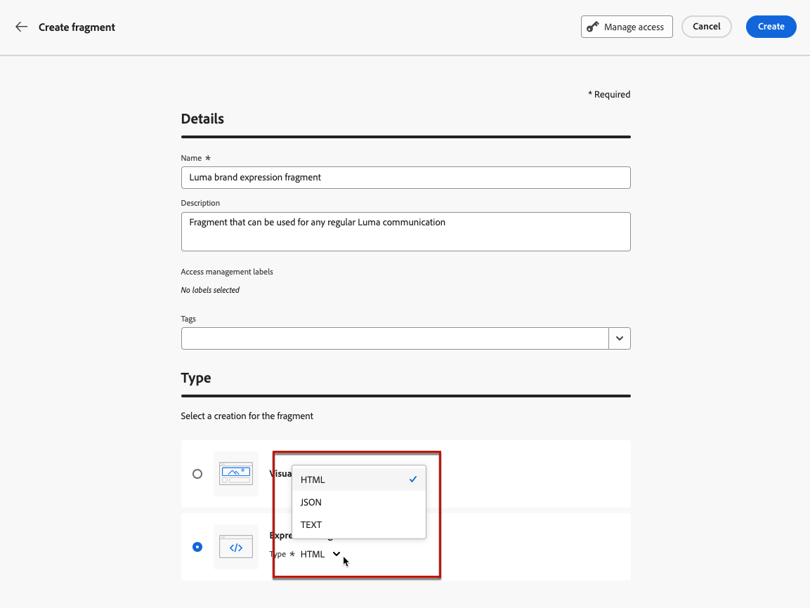

# Crear un fragmento {#create-fragments}

>[!CONTEXTUALHELP]
>id="ajo_create_visual_fragment"
>title="Selección del tipo visual"
>abstract="Cree un fragmento visual independiente para que el contenido se pueda reutilizar en un correo electrónico dentro de un recorrido, una campaña o una plantilla de contenido."
>additional-url="https://experienceleague.adobe.com/es/docs/journey-optimizer/using/channels/email/design-email/add-content/use-visual-fragments" text="Añadir fragmentos visuales a los correos electrónicos"

>[!CONTEXTUALHELP]
>id="ajo_create_expression_fragment"
>title="Selección del tipo de expresión"
>abstract="Cree un fragmento de expresión independiente para que el contenido se pueda reutilizar en varios recorridos y campañas. Al utilizar el editor de personalización, puede aprovechar todos los fragmentos de expresiones que se han creado en la zona protegida actual."
>additional-url="https://experienceleague.adobe.com/es/docs/journey-optimizer/using/content-management/personalization/personalization-build-expressions" text="Uso del editor de personalización "

Los fragmentos se pueden crear desde cero desde el menú de la izquierda **[!UICONTROL Fragmentos]**. Además, también puede guardar una parte del contenido existente como fragmento al diseñar contenido. [Descubra cómo](save-fragments.md#)

Una vez guardado, el fragmento está disponible para utilizarlo en un recorrido, una campaña o una plantilla. Puede utilizar este fragmento al crear contenido dentro de recorridos y campañas. Ver [Agregar fragmentos visuales](../email/use-visual-fragments.md) y [Aprovechar fragmentos de expresiones](../personalization/use-expression-fragments.md).

Para crear un fragmento, siga los pasos a continuación.

## Definir las propiedades del fragmento {#properties}

1. Acceda a la lista de fragmentos a través del menú de la izquierda **[!UICONTROL Administración de contenido]** > **[!UICONTROL Fragmentos]**.

1. Seleccione **[!UICONTROL Crear fragmento]** y rellene el nombre y la descripción del fragmento (si es necesario).

   

1. Seleccione o cree etiquetas Adobe Experience Platform en el campo **[!UICONTROL Etiquetas]** para categorizar el fragmento y mejorar la búsqueda. [Aprenda a trabajar con etiquetas unificadas](../start/search-filter-categorize.md#tags)

1. Seleccione el tipo de fragmento: **fragmento visual** o **fragmento de expresión**. [Más información](../content-management/fragments.md#visual-expression)

   >[!NOTE]
   >
   >Actualmente, los fragmentos visuales solo están disponibles para el canal **Email**.

1. Si está creando un fragmento de expresión, seleccione el tipo de código que desea utilizar: **[!UICONTROL HTML]**, **[!UICONTROL JSON]** o **[!UICONTROL Text]**.

   

1. Para asignar etiquetas de uso de datos principales o personalizadas al fragmento, haga clic en el botón **[!UICONTROL Administrar acceso]** en la sección superior de la pantalla. [Obtenga más información acerca del Control de acceso de nivel de objeto (OLAC)](../administration/object-based-access.md).

1. Haga clic en **[!UICONTROL Crear]** para diseñar el contenido del fragmento.

## Diseño del contenido del fragmento {#content}

Después de configurar las propiedades del fragmento, se abre Email Designer o el editor de personalización, según el tipo de fragmento que esté creando.

>[!NOTE]
>
>No se admiten [atributos contextuales](../personalization/personalization-build-expressions.md) en los fragmentos.
>
>Cuando el seguimiento está habilitado en un recorrido o una campaña, si agrega vínculos a un fragmento y este se utiliza en un mensaje, se realiza el seguimiento de estos vínculos, al igual que todos los demás incluidos en el mensaje. [Más información sobre vínculos y seguimiento](../email/message-tracking.md)

* Para los fragmentos visuales, edite el contenido según sea necesario, del mismo modo que lo haría para cualquier correo electrónico dentro de un recorrido o una campaña. [Más información](../email/get-started-email-design.md)

  

  Para aplicar rápidamente un estilo específico que se ajuste a tu marca y diseño, puedes aplicar un [tema](../email/apply-email-themes.md) a tu fragmento.

  

  >[!CAUTION]
  >
  >Los fragmentos no son compatibles entre los modos Usar temáticas y Estilo manual. Cuando utilice un fragmento en el contenido del correo electrónico, asegúrese de aplicar una temática que haya definido para este fragmento. [Más información](../email/apply-email-themes.md#leverage-themes-fragment)

* Para los fragmentos de expresiones, aproveche el editor de personalización [!DNL Journey Optimizer] con todas sus capacidades de personalización y creación para generar el contenido del fragmento. [Más información](../personalization/personalization-build-expressions.md)

  

  >[!NOTE]
  >
  >Los fragmentos de expresiones de tipo JSON se validan sintácticamente al guardarlos, y todos los errores se muestran como alertas de advertencia.

Cuando el contenido esté listo, haz clic en el botón **[!UICONTROL Guardar]**.

>[!NOTE]
>
>Los fragmentos visuales no pueden superar los 100 KB. Los fragmentos de expresión no pueden superar los 200 KB.

El fragmento se creará y se agregará a la lista de fragmentos con el estado **[!UICONTROL Borrador]**. Puede previsualizarlo y publicarlo para que esté disponible en recorridos y campañas.

## Previsualización y publicación del fragmento {#publish}

>[!NOTE]
>
>Para publicar un fragmento, debe tener el permiso de usuario [Publicar fragmento](../administration/ootb-product-profiles.md#content-library-manager).

Si el fragmento está listo para su publicación, puede previsualizarlo y publicarlo para que esté disponible en sus recorridos y campañas. Para ello, siga los pasos que aparecen a continuación.

1. Vuelva a la pantalla de creación de fragmentos después de diseñar su contenido o ábralo desde la lista de fragmentos.

1. Hay una vista previa del fragmento disponible en el campo **[!UICONTROL Etiquetas]**, lo que permite comprobar su renderización. Si necesita hacer algún cambio, haga clic en el botón **[!UICONTROL Editar]** en la sección superior de la pantalla para abrir el Designer de correo electrónico o el editor de personalización, según el tipo de fragmento. [Más información](manage-fragments.md#edit-fragments)

   

1. Haga clic en el botón **[!UICONTROL Publicar]** en la esquina superior derecha para publicar el fragmento.

1. Si el fragmento se está utilizando en un recorrido activo o en una campaña, se abre un mensaje para informarle. Haga clic en el vínculo **[!UICONTROL Ver más]** para obtener acceso a la lista de recorridos o campañas a los que se hace referencia. [Aprenda a explorar referencias de un fragmento](../content-management/manage-fragments.md#explore-references)

   {width="70%" align="center"}

   Haga clic en **[!UICONTROL Confirmar]** para publicar el fragmento y actualizarlo en las campañas o recorridos activos que lo estén utilizando.

El fragmento ahora está **[!UICONTROL activo]** y está disponible al crear contenido en el Designer de correo electrónico o editor de personalización [!DNL Journey Optimizer].

* [Aprenda a utilizar fragmentos visuales](../email/use-visual-fragments.md)
* [Aprenda a utilizar fragmentos de expresiones](../personalization/use-expression-fragments.md)

>[!CAUTION]
>
>Una vez publicado, no puede añadir nuevos atributos personalizados a un fragmento activo. Si desea agregar atributos de personalización, debe duplicar el fragmento. [Más información](manage-fragments.md#adding-new-attributes)