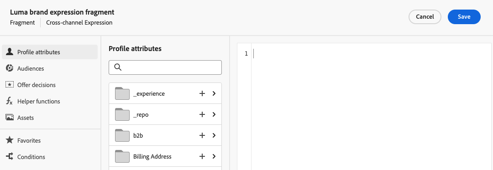

# Crear un fragmento desde cero {#create-fragments}

>[!CONTEXTUALHELP]
>id="ajo_create_visual_fragment"
>title="Seleccionar el tipo visual"
>abstract="Cree un fragmento visual independiente para que el contenido se pueda reutilizar en un correo electrónico dentro de un recorrido, una campaña o una plantilla de contenido."
>additional-url="https://experienceleague.adobe.com/docs/journey-optimizer/using/email/design-email/add-content/use-visual-fragments.html" text="Añadir fragmentos visuales a los correos electrónicos"

>[!CONTEXTUALHELP]
>id="ajo_create_expression_fragment"
>title="Seleccione el tipo de expresión"
>abstract="Cree un fragmento de expresión independiente para que el contenido se pueda reutilizar en varios recorridos y campañas. Al utilizar el editor de personalización, puede aprovechar todos los fragmentos de expresiones que se han creado en la zona protegida actual."
>additional-url="https://experienceleague.adobe.com/docs/journey-optimizer/using/content-management/personalization/expression-editor/use-expression-fragments.html" text="Aprovechamiento de fragmentos de expresiones"

Los fragmentos se crean a partir de **[!UICONTROL Fragmentos]** menú izquierdo. Además, también puede guardar una parte del contenido existente como fragmento al diseñar contenido. [Descubra cómo](#save-as-fragment)

Una vez guardado, el fragmento está disponible para utilizarlo en un recorrido, una campaña o una plantilla. Ahora puede utilizar este fragmento al crear contenido dentro de [!DNL Journey Optimizer]. Consulte [Añadir fragmentos visuales](../email/use-visual-fragments.md) y [Aprovechamiento de fragmentos de expresiones](../personalization/use-expression-fragments.md)

Para crear un fragmento desde cero, siga los pasos a continuación.

1. [Acceso a la lista de fragmentos](#access-manage-fragments) a través de **[!UICONTROL Gestión de contenido]** > **[!UICONTROL Fragmentos]** menú izquierdo.

1. Seleccionar **[!UICONTROL Crear fragmento]**.

1. Complete los detalles del fragmento, es decir, el nombre y la descripción (si es necesario).

   

1. Seleccione o cree etiquetas de Adobe Experience Platform en **[!UICONTROL Etiquetas]** para categorizar el fragmento y mejorar la búsqueda. [Más información](../start/search-filter-categorize.md#tags)

1. Seleccione el tipo de fragmento: [Fragmento visual](#create-visual-fragment) o [Fragmento de expresión](#create-expression-fragment).

   >[!NOTE]
   >
   >Actualmente solo para fragmentos visuales la variable **Correo electrónico** El canal es compatible.

1. Si está creando un fragmento de expresión, seleccione el tipo de código que desea utilizar: **[!UICONTROL HTML]**, **[!UICONTROL JSON]** o **[!UICONTROL Texto]**.

   

1. Para asignar etiquetas de uso de datos personalizadas o principales al fragmento, seleccione **[!UICONTROL Administrar acceso]**. [Obtenga más información sobre el Control de acceso de nivel de objeto (OLAC)](../administration/object-based-access.md).

1. Haga clic en **[!UICONTROL Crear]**.

1. El [Diseñador de correo electrónico](../email/get-started-email-design.md) o se abrirá el editor de personalización, en función del tipo de fragmento que esté creando.

   * Para los fragmentos visuales, edite el contenido según sea necesario, del mismo modo que lo haría para cualquier correo electrónico dentro de un recorrido o una campaña.

     >[!NOTE]
     >
     >Puede añadir campos de personalización y contenido dinámico, pero los atributos contextuales no son compatibles con los fragmentos.

     

   * Para fragmentos de expresiones, aproveche la variable [!DNL Journey Optimizer] editor de personalización con todas sus funcionalidades de personalización y creación para crear el contenido del fragmento. [Más información](../personalization/personalization-build-expressions.md)

     

1. Cuando el fragmento esté listo, haga clic en **[!UICONTROL Guardar]**.

El fragmento se añade a [lista de fragmentos](#access-manage-fragments). Ahora está listo para utilizarse al crear cualquier contenido dentro de [!DNL Journey Optimizer] Diseñador de correo electrónico o editor de personalización.

* [Aprenda a utilizar fragmentos visuales](../email/use-visual-fragments.md)
* [Aprenda a utilizar fragmentos de expresiones](../personalization/use-expression-fragments.md)
