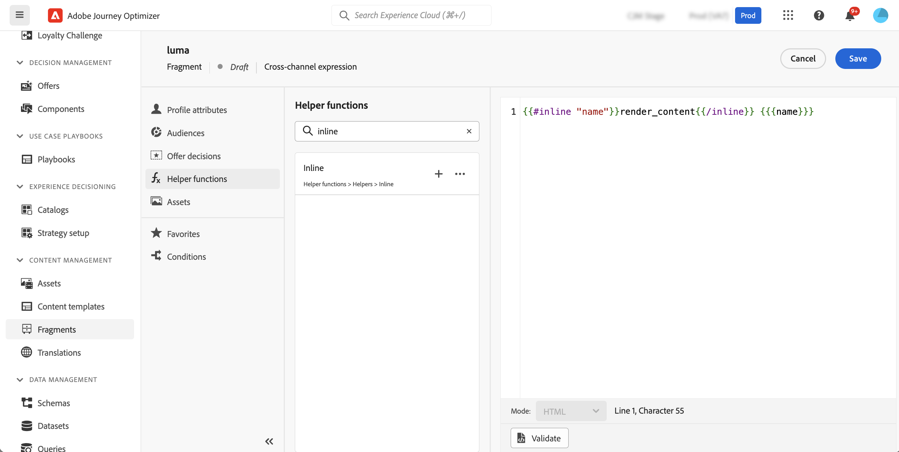
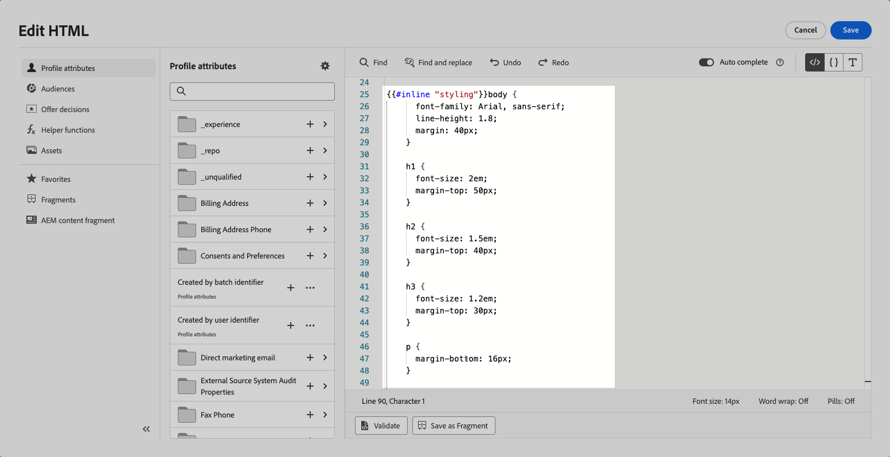
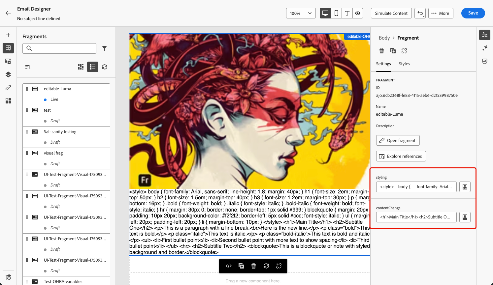

# Fragmentos personalizables {#customizable-fragments}

Cuando se utilizan fragmentos en una campaña o acción de recorrido, están bloqueados de forma predeterminada debido a la herencia. Esto significa que los cambios realizados en un fragmento se propagan automáticamente a todas las campañas y recorridos donde se utilice el fragmento.

Con **fragmentos personalizables**, los campos específicos de un fragmento se pueden definir como editables cuando se agrega el fragmento a una acción de campaña o recorrido. Por ejemplo, supongamos que tiene un fragmento con un titular, texto y un botón. Puede designar ciertos campos, como la dirección URL de destino de la imagen o el botón, como editables. Esto permite a los usuarios modificar estos elementos cuando incorporan el fragmento en su campaña o recorrido, lo que proporciona una experiencia adaptada sin afectar al fragmento original.

Los fragmentos personalizables eliminan la necesidad de interrumpir la herencia de fragmentos, que anteriormente impedía que los cambios centralizados en el nivel de fragmento se propagaran a las campañas y recorridos. Este método permite ajustar las partes de contenido en el momento de su uso, lo que ofrece la flexibilidad de anular los valores predeterminados con detalles específicos del contexto.

Al aprovechar los fragmentos personalizables, puede administrar y personalizar el contenido de forma eficaz sin crear bloques de contenido completamente nuevos ni interrumpir la herencia del fragmento original. Esto garantiza que los cambios realizados en el nivel de fragmento se sigan propagando, al tiempo que permite la personalización necesaria en el nivel de campaña o recorrido.

Los fragmentos visuales y de expresión se pueden marcar como personalizables. Para obtener instrucciones detalladas sobre cómo proceder con cada tipo de fragmento, consulte las secciones siguientes.

## Agregar campos editables a fragmentos visuales {#visual}

Para poder editar partes de un fragmento visual, siga estos pasos:

>[!NOTE]
>
>Los campos editables se pueden agregar a los componentes **image**, **text** y **button**. Para los componentes de **HTML**, se agregan campos editables mediante el editor de personalización, de forma similar a los fragmentos de expresiones. [Aprenda a agregar campos editables en componentes de HTML y fragmentos de expresiones](#expression)

1. Abra la pantalla de edición de contenido del fragmento.

1. Seleccione el componente del fragmento en el que desea configurar los campos editables.

1. El panel de propiedades del componente se abre en el lado derecho. Seleccione la ficha **Campos editables** y, a continuación, active la opción **Habilitar edición**.

1. Todos los campos que se pueden editar para el componente seleccionado se muestran en el panel. Los campos disponibles para editar dependen del tipo de componente seleccionado.

   En el ejemplo siguiente, permitimos la edición de la URL del botón &quot;Haga clic aquí&quot;.

   

1. Haga clic en **Información general** para comprobar todos los campos editables y sus valores predeterminados.

   En este ejemplo, el campo URL del botón se muestra con el valor predeterminado definido en el componente. Los usuarios podrán personalizar este valor una vez que hayan agregado el fragmento a su contenido.

   

1. Cuando esté listo, guarde los cambios para actualizar el fragmento.

1. Después de agregar el fragmento a un correo electrónico, los usuarios podrán personalizar todos los campos editables configurados en el fragmento. [Aprenda a personalizar campos editables en un fragmento visual](../email/use-visual-fragments.md#customize-fields)

>[!CAUTION]
>
>Cuando la **etiqueta** y la **URL** de un componente de botón se hacen editables en un fragmento, los informes de seguimiento muestran la URL en lugar de la etiqueta de botón. [Más información sobre el seguimiento](../email/message-tracking.md)

## Agregar campos editables a componentes de HTML y fragmentos de expresiones {#expression}

Para poder editar partes de un componente de HTML o de un fragmento de expresión, debe utilizar una sintaxis específica en el editor de expresiones. Esto implica declarar una **variable** con un valor predeterminado que los usuarios pueden anular después de agregar el fragmento a su contenido.

Por ejemplo, supongamos que desea crear un fragmento para agregarlo a los correos electrónicos y permitir a los usuarios personalizar un color específico utilizado en diferentes ubicaciones, como marcos o colores de fondo de botones. Al crear el fragmento, debe declarar una variable con un **ID único**, por ejemplo, &quot;color&quot;, y llamarla a las ubicaciones deseadas en el contenido del fragmento donde desee aplicar este color. Al añadir el fragmento a su contenido, los usuarios pueden personalizar el color utilizado siempre que se haga referencia a la variable.

Para los componentes de HTML, solo los elementos específicos pueden convertirse en campos editables. Expanda la sección siguiente para obtener más información.

+++Elementos editables en componentes de HTML:

Los elementos siguientes pueden convertirse en campos editables en un componente de HTML:

* Una parte del texto
* Una dirección URL completa para un vínculo o una imagen (no funciona con una parte de una dirección URL)
* Propiedad CSS completa (no funciona con la propiedad parcial)

Por ejemplo, en el siguiente código, cada elemento resaltado en rojo puede convertirse en una propiedad:

{width="70%"}

+++

Para declarar una variable y utilizarla en el fragmento, siga estos pasos:

1. Abra el fragmento de expresión y, a continuación, edite su contenido en el editor de personalización.

   

   Para los componentes de HTML, seleccione el componente en el fragmento y haga clic en el botón **Mostrar código fuente**.

1. Declare la variable que desea que los usuarios editen. Vaya al menú **Funciones de ayuda** en el panel de navegación izquierdo y agregue la función de ayuda **inline**. La sintaxis para declarar y llamar a la variable se agrega automáticamente al contenido.

   

1. Reemplace `"name"` con un identificador único para identificar el campo editable.

   >[!NOTE]
   >
   >El ID de campo debe ser único y no debe tener espacios. Este ID debe utilizarse en cualquier lugar del contenido donde desee mostrar el valor de la variable.

1. Adapte la sintaxis para adaptarla a sus necesidades añadiendo parámetros detallados en la siguiente tabla:

   | Acción | Parámetro | Ejemplo |
   | ------- | ------- | ------- |
   | Declarar un campo editable con un **valor predeterminado**. Al añadir el fragmento al contenido, se utilizará este valor predeterminado si no lo personaliza. | Agregue el valor predeterminado entre las etiquetas en línea. | `{{#inline "editableFieldID"}}default_value{{/inline}}` |
   | Defina una **etiqueta** para el campo editable. Esta etiqueta se muestra en el Designer de correo electrónico al editar los campos del fragmento. | `name="title"` | `{{#inline "editableFieldID" name="title"}}default_value{{/inline}}` |
   | Declare un campo editable que contenga un **origen de imagen** que deba publicarse. | `assetType="image"` | `{{#inline "editableFieldID" assetType="image"}}default_value{{/inline}}` |
   | Declare un campo editable que contenga una **URL** de la que deba realizarse un seguimiento. Tenga en cuenta que los bloques predefinidos &quot;URL de página espejo&quot; y &quot;Vínculo de cancelación de suscripción&quot; predeterminados no pueden convertirse en campos editables. | `assetType="url"` | `{{#inline "editableFieldID" assetType="url"}}default_value{{/inline}}` |

1. Utilice la sintaxis `{{{name}}}` en su código en cada lugar donde desee mostrar el valor del campo editable. Reemplazar `name` por el ID único del campo definido anteriormente.

   

1. Guarde y publique el fragmento.

Al añadir el fragmento al contenido de su correo electrónico, los usuarios ahora pueden anular los valores predeterminados de las variables con los valores que hayan elegido:

* Para los fragmentos de expresiones, se utiliza una sintaxis específica para anular los valores de las variables. [Aprenda a personalizar campos editables en un fragmento de expresión](../personalization/use-expression-fragments.md#customize-fields)

* Para los componentes de HTML, la variable se muestra en la lista de campos editables del Designer de correo electrónico. [Aprenda a personalizar campos editables en un fragmento visual](../email/use-visual-fragments.md#customize-fields)

### Ejemplo de fragmento de expresión editable {#example}

En el ejemplo siguiente, se crea un fragmento de expresión que presenta nuevas colecciones deportivas. De manera predeterminada, el fragmento muestra este contenido: *¿Busca más? ¡No se pierda nuestra última colección de deportes!*

Queremos permitir que los usuarios reemplacen &quot;deportes&quot; en este contenido por el deporte de su elección. Por ejemplo: *¿Busca más? ¡No se pierda nuestra última colección de yoga!*

Para ello:

1. Declare una variable &quot;sport&quot; con el ID &quot;sport&quot;.

   De manera predeterminada, si los usuarios no cambian el valor de la variable después de agregar el fragmento en su contenido, se mostrará el valor definido entre las etiquetas `{{#inline}}` y `{{/inline}}`, por ejemplo, &quot;deportes&quot;.

1. Agregue la sintaxis ``{{{sport}}}`` al contenido del fragmento donde desee mostrar el valor de la variable, es decir, &quot;deportes&quot; de forma predeterminada o el valor elegido por los usuarios.

   

1. Al agregar el fragmento de expresión a su contenido, los usuarios pueden cambiar el valor de la variable con su elección directamente desde el editor de expresiones. [Aprenda a personalizar campos editables en un fragmento de expresión](../personalization/use-expression-fragments.md#customize-fields)

   

## Añadir texto enriquecido a un fragmento personalizable {#rich-text}

El texto enriquecido, como saltos de línea, negrita, cursiva, etc., se puede agregar a un fragmento editable mediante componentes de HTML. Para ello, siga los pasos que aparecen a continuación.
<!--
➡️ [Learn how to add and use rich text to an editable fragment in this video](#video)-->

### Crear un fragmento que incluya texto enriquecido {#add-rich-text}

1. Cree un [fragmento](create-fragments.md) visual y empiece a agregar componentes.

1. Agregue un [componente HTML](../email/content-components.md#HTML) y abra el editor de HTML.

1. Vaya al menú **[!UICONTROL Funciones de ayuda]** en el panel de navegación izquierdo y agregue la función de ayuda **inline**.

1. Reemplace `"name"` con el ID que desee usar para el contenido editable, por ejemplo &quot;EditableContent&quot;.

1. Reemplace `render_content` por el código HTML correspondiente al contenido enriquecido predeterminado que desee. Puede añadir negrita, cursiva, saltos de línea, listas con viñetas, etc.

   

1. Dentro del mismo componente de HTML, agregue otra función de ayuda **inline** para los elementos de estilo.

1. Reemplace `"name"` y `render_content` por el ID y el código de HTML correspondientes al estilo predeterminado que desee.

   

1. Guarde el contenido. Los campos editables seleccionados se muestran en el lado derecho.

   

1. Guardar y [publicar](create-fragments.md#publish) el fragmento.

### Usar fragmentos editables de texto enriquecido {#use-rich-text}

Al añadir el fragmento a su contenido de correo electrónico, los usuarios ahora pueden editar el contenido de texto enriquecido y el estilo que ha creado. Para utilizar fragmentos editables de texto enriquecido como experto en marketing, siga los pasos a continuación.

1. [Crea un correo electrónico](../email/create-email.md) en una campaña o un recorrido y, a continuación, agrega el fragmento con texto enriquecido que se [creó](#add-rich-text).

   Puede ver los dos campos editables que se crearon en el lado derecho.

   

1. Puede hacer clic en **[!UICONTROL Simular contenido]** para ver cómo se representan el contenido editable y el estilo. [Más información sobre la vista previa del contenido](preview-test.md)

1. Seleccione el icono **[!UICONTROL Agregar personalización]** junto a uno de los campos editables.

1. En el editor de personalización que se abre, actualice el estilo o el contenido <!--CSS-->según sus preferencias agregando o eliminando elementos del campo editable.

   

<!--
## How-to video {#video}

This video shows how to make HTML components within a fragment editable, allowing for dynamic updates to both content and styling.

>[!VIDEO](https://video.tv.adobe.com/v/3464363/?learn=on&#x26;enablevpops)
-->