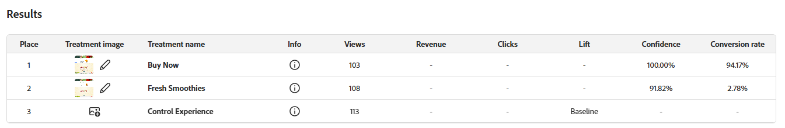

# Seguimiento de experimentos {#monitor}

La pestaña **[!UICONTROL Experimentos]** centraliza el seguimiento y el análisis de las pruebas de Adobe Journey Optimizer y Adobe Target. Puede ver todos los experimentos, revisar los KPI y filtrar o buscar pruebas específicas.

## Panel de control {#dashboard}

Al acceder a la pestaña Experimentos, todos los experimentos disponibles de Journey Optimizer y Adobe Target se muestran en una vista consolidada. Esto le permite revisar y comparar rápidamente experimentos en ambas plataformas en un solo lugar.
La lista Experimentos incluye:

* Experimentos de Journey Optimizer creados en Campaign o en Recorrido.

* Experimentos de Adobe Target disponibles en la zona protegida predeterminada de producción de Journey Optimizer y vinculados a la misma organización de IMS.

La sección KPI proporciona métricas clave, como el número total de experimentos creados y el número en curso, y ofrece una instantánea de la actividad de experimentación general

Obtenga acceso a los filtros haciendo clic en , que ofrece opciones específicas del contexto, como filtrar por **[!UICONTROL Tipo]**, **[!UICONTROL Estelar]**, **[!UICONTROL Estado]** o **[!UICONTROL Source]**. Por ejemplo, puede filtrar para mostrar solo los experimentos activos de Journey Optimizer.

También puede encontrar rápidamente su experimento escribiendo su nombre en la barra de búsqueda.

## Monitorización de experimentos {#monitor-page}

Para acceder y monitorizar tus experimentos, selecciona tu experimento configurado previamente de tu lista de experimentos de la pestaña **[!UICONTROL Experimentos]**, o usa el menú avanzado para **[!UICONTROL Ver detalles]** o **[!UICONTROL Abrir en código fuente]**.

La página de detalles del experimento se divide en la siguiente sección:

* [Resultado del experimento](#experiment-outcome)
* [Hipótesis](#hypothesis)
* [Detalles](#details)
* [Oportunidades](#opportunities)
* [Resultados](#results)
* [Perspectivas de experimentación](#insights)

### Resultado del experimento {#experiment-outcome}

El **[!UICONTROL resultado del experimento]** le ofrece una vista rápida de la variación ganadora de su experimento.

### Configuración {#set-up}

La **[!UICONTROL Hipótesis]** captura los cambios planificados que se van a probar y documenta el impacto esperado en la métrica principal. Definir una **[!UICONTROL Hipótesis]** clara garantiza que cada experimento tenga un objetivo mensurable, lo que facilita la evaluación de resultados y la determinación de si los cambios conducen a mejoras significativas.

Tenga en cuenta que para que se generen [datos del experimento](#insights), debe confirmar los detalles de la hipótesis y el tratamiento y la relevancia estadística.

1. Haga clic en **[!UICONTROL Agregar]** para crear una **[!UICONTROL Hipótesis]** para su experimento.

   

1. Escriba su **[!UICONTROL Hipótesis]** detallando los cambios realizados y cómo afectarán a la métrica principal.

   Haga clic en **[!UICONTROL Guardar]**.

1. Haga clic en **[!UICONTROL Revisar]** para agregar o reemplazar la imagen para cada Tratamiento.

   

1. Las imágenes de tratamiento se generan automáticamente, pero si es necesario, puede seleccionar **[!UICONTROL Agregar imagen]** o **[!UICONTROL Reemplazar imagen]** para cargar una captura de pantalla preferida de sus archivos locales para sus **[!UICONTROL Tratamientos]**.

   Tenga en cuenta que la captura de pantalla debe capturar toda la página.

1. Haga clic en el icono  para actualizar la **[!UICONTROL hipótesis]** si es necesario.

Una vez que haya terminado de configurar su **[!UICONTROL Hipótesis]**, necesitará obtener valiosos [Datos](#insights) y [Oportunidades](#opportunities).

### Detalles {#details}

El widget **[!UICONTROL Efecto de experimento]** proporciona una vista detallada de cómo el experimento influyó en los segmentos de audiencia objetivo. Presenta indicadores de rendimiento clave que le ayudan a evaluar la participación y el comportamiento, incluidos los siguientes:

* **[!UICONTROL Métrica de éxito]** de Journey Optimizer o la **[!UICONTROL métrica principal]** de Adobe Target, según lo que se haya configurado durante la creación del experimento.

* **[!UICONTROL Visitantes]**: El número total de visitantes únicos expuestos al experimento.

También puede ver una instantánea en tiempo real del rendimiento del tratamiento inicial mediante las siguientes métricas:

* **[!UICONTROL Responsable actual]**: identifica el tratamiento que actualmente ofrece el mejor rendimiento.

* **[!UICONTROL Alza sobre la línea de base]**: mide la mejora porcentual del tratamiento inicial en comparación con el control o la línea de base.

* **[!UICONTROL Métrica de éxito]** de Journey Optimizer o la **[!UICONTROL métrica principal]** de Adobe Target, según lo que se haya configurado durante la creación del experimento.

En la parte inferior del widget, puede encontrar un resumen conciso de la configuración del experimento, que incluye:

* **[!UICONTROL Métrica de éxito]** de Journey Optimizer o la **[!UICONTROL métrica principal]** de Adobe Target, según lo que se haya configurado durante la creación del experimento.

* **[!UICONTROL Número de tratamientos]**: El número total de variaciones probadas.

* **[!UICONTROL Audiencia]**: Los segmentos de usuario definidos se segmentaron durante el experimento.

### Oportunidades {#opportunities}

>[!AVAILABILITY]
>
>La función de oportunidades se limita a experimentos con cambios basados en texto.

El panel **[!UICONTROL Oportunidades]** muestra recomendaciones generadas por IA diseñadas para mejorar el rendimiento de las pruebas y alinearse con objetivos empresariales y KPI más amplios.

Tenga en cuenta que para que se generen oportunidades de experimento, primero debe [confirmar los detalles de la hipótesis y el tratamiento](#set-up).

1. Examine la oportunidad sugerida y haga clic en **[!UICONTROL Ver oportunidad]**.

   

1. Al seleccionar una oportunidad, se abre la ventana **Detalles de la oportunidad**, que describe un tratamiento específico o una variación sugerida por Journey Optimizer Experimentation Accelerator. Esta vista incluye:

   * **[!UICONTROL Hipótesis]**: Una hipótesis generada por IA que explica el resultado esperado del tratamiento sugerido.

   * **[!UICONTROL Motivo]**: Una explicación de por qué Journey Optimizer Experimentation Accelerator sugirió esta oportunidad.

   * **[!UICONTROL Evaluación de oportunidad]**: Una evaluación dual de la recomendación basada en:

      * **[!UICONTROL Potencial de aprendizaje]**: Una estimación de cuánto insight nuevo podría proporcionar la oportunidad, en función de su diferencia con respecto a lo que se ha probado anteriormente.

      * **[!UICONTROL Potencial de conversión]**: una estimación de la probabilidad de que la oportunidad supere a los tratamientos actuales, basada en similitudes con estrategias que históricamente han funcionado bien.
   <!--
   * **[!UICONTROL New text treatment example]**: Words or phrases that demonstrate the style the AI recommends using.
   -->

   

1. Luego puede agregarlo directamente al experimento seleccionando **[!UICONTROL Abrir experimento]**.

1. Si el experimento original se creó y administró en Adobe Journey Optimizer, esta acción abrirá el **[!UICONTROL Panel de experimentación de contenido]** dentro de esa campaña.

   Para los experimentos que se originen desde **[!DNL Adobe Target]**, los cambios sugeridos se cargarán en el flujo de trabajo de experimentación de **[!DNL Adobe Target]**.

   ➡️ [Obtenga más información en la documentación de Adobe Target](https://experienceleague.adobe.com/en/docs/target/using/activities/abtest/test-ab)

1. En la vista de experimento, se puede acceder a las mismas **[!UICONTROL oportunidades de experimentación]** de IA que aparecen en Journey Optimizer Experimentation Accelerator.

   Seleccione **[!UICONTROL Ver]** para abrir los detalles de la oportunidad.

1. Para aplicar los cambios sugeridos, al seleccionar **[!UICONTROL Modificar experimento]** se habilita la edición directa del experimento existente.

### Resultados {#results}

La tabla **[!UICONTROL Results]** proporciona un desglose detallado del rendimiento de cada tratamiento dentro de un experimento. Estos indicadores ayudan a evaluar la eficacia, la participación del usuario y el impacto general en los resultados clave del negocio:

* **[!UICONTROL Lugar]**: Posición de clasificación del tratamiento basada en el rendimiento que indica cómo se compara con otros tratamientos.

* **[!UICONTROL Métrica de éxito]** de Journey Optimizer o la **[!UICONTROL métrica principal]** de Adobe Target, según lo que se haya configurado durante la creación del experimento.

* **[!UICONTROL Personas]**: Número de perfiles de usuario que se califican como perfiles de destino para sus mensajes.

* **[!UICONTROL Alza]**: medición de la mejora porcentual en la tasa de conversión de un tratamiento determinado respecto al valor de referencia.

* **[!UICONTROL Confianza]**: Evidencia de que un tratamiento dado es el mismo que el tratamiento basal. [Más información](../content-management/experiment-calculations.md#understand-confidence)

* **[!UICONTROL Tasa de conversión]**: porcentaje de perfiles que completaron la acción deseada (por ejemplo, compra, registro) después de ver el tratamiento.

### Datos del experimento {#insights}

>[!AVAILABILITY]
>
>La función Perspectivas de experimentación se limita a los experimentos con cambios basados en texto.

**[!UICONTROL Perspectivas de experimento]** son aprendizajes generados por IA derivados de este experimento. Estas perspectivas están disponibles una vez que el experimento alcanza la relevancia estadística y proporcionan una comprensión contextual de lo que contribuyó a su éxito. Destacan los atributos clave presentes en el tratamiento ganador, distintos del control, que probablemente influyeron en el resultado.

Tenga en cuenta que para que se generen perspectivas de experimento, primero debe [confirmar los detalles de la hipótesis y el tratamiento](#set-up) y alcanzar la relevancia estadística.

Haga clic en **[!UICONTROL Ver detalles]** para obtener más información sobre cada información.

 

