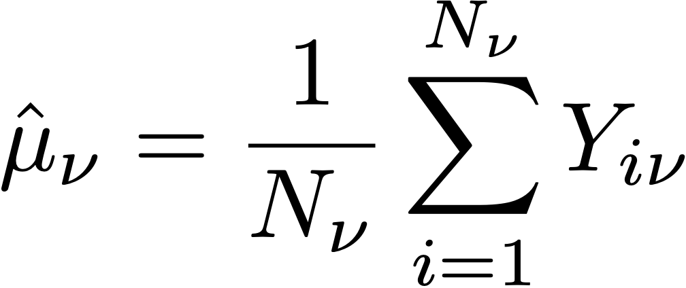
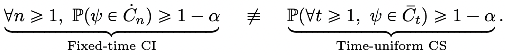

# Explicación de los cálculos estadísticos en el informe de experimentación {#experiment-report-calculations}

Esta página documenta los cálculos estadísticos detallados utilizados en el Informe de experimentación para campañas en Adobe Journey Optimizer.

Tenga en cuenta que esta página está destinada a usuarios técnicos.

## Tasa de conversión

La tasa de conversión de **media**, para cada tratamiento `ν` de un experimento se define como una relación entre la suma de la métrica y el número de perfiles asignados a esa métrica, N:

{width="125" align="center"}

En este caso, Yi es el valor de la métrica del objetivo para cada perfil `i`, que se ha asignado a una variante determinada **. Cuando la métrica del objetivo es una métrica &quot;única&quot;, es decir, es un recuento del número de perfiles que realizan una acción concreta, se muestra como una tasa de conversión y se le aplica un formato de porcentaje. Cuando la métrica es una métrica de &quot;recuento&quot; o &quot;valor total&quot; (por ejemplo, aperturas de correo electrónico, ingresos respectivamente), la estimación media de la métrica se muestra como &quot;Recuento por perfil&quot; o &quot;Valor por perfil&quot;.

Siempre que sea necesario, la desviación estándar de la muestra se utiliza con la expresión:

{width="225" align="center"}

## Alza {#lift}

El alza entre una variante ** y la variante de control *0* es el &quot;delta&quot; relativo en las tasas de conversión, definido como el cálculo siguiente, donde las tasas de conversión individuales son como se definen arriba. Esto se muestra como un porcentaje.

{width="125" align="center"}

 

## Intervalos de confianza válidos en cualquier momento para tratamientos individuales

El panel Experimentación con Recorridos muestra intervalos de confianza &quot;válidos en cualquier momento&quot; (secuencias de confianza) para tratamientos individuales en un experimento.

La secuencia de confianza para una variante individual `ν` es fundamental para la metodología estadística utilizada por Adobe. Puede encontrar su definición en [esta página](https://doi.org/10.48550/arXiv.2103.06476) (reproducida de [Waudby-Smith y otros]).

Si le interesa estimar un parámetro de destino `ψ`, como la tasa de conversión de una variante en un experimento, la dicotomía entre una secuencia de intervalos de confianza (CI) de tiempo fijo y una secuencia de confianza uniforme en el tiempo (CS) se puede resumir de la siguiente manera:

{width="500" align="center"}

Para un intervalo de confianza normal, la garantía probabilística de que el parámetro de destino se encuentra dentro del intervalo de valores de n es válido solamente en un único valor fijo de `n` (donde `n` es el número de muestras). Por el contrario, para una secuencia de confianza, se garantiza que en todo momento/ todos los valores del tamaño de muestra `t`, el valor &quot;true&quot; del parámetro de interés se encuentre dentro de los límites.

Esto tiene algunas implicaciones profundas que son muy importantes para las pruebas en línea:

* El CSS se puede actualizar de forma opcional cada vez que haya nuevos datos disponibles.
* Los experimentos pueden monitorizarse continuamente, detenerse de forma adaptativa o continuar.
* El error de tipo I se controla en todos los momentos de detención, incluidos los tiempos que dependen de los datos.

Adobe utiliza secuencias de confianza asintóticas, que para una variante individual con estimación media `μ` tienen la forma:

{width="300" align="center"}

Donde:

* `N` es el número de unidades de esa variante.
* `σ` es una estimación de muestra de la desviación estándar (definida anteriormente).
* `α` es el nivel deseado de error de tipo I (o probabilidad de cobertura incorrecta). Siempre se establece en 0,05.
* La constante 2 es una constante que ajusta el tamaño de muestra con el que el CS es más ajustado. Adobe ha elegido un valor universal de los valores siguientes: 2 = 10-2.8, que es apropiado para los tipos de tasas de conversión que se ven en los experimentos en línea.

## Confianza {#confidence}

La confianza utilizada por Adobe es una confianza &quot;válida en cualquier momento&quot;, que se obtiene invirtiendo la secuencia de confianza del efecto medio del tratamiento.

Para ser precisos, en una prueba de dos muestras *t* para la diferencia de medias entre dos variantes, hay una asignación de 1:1 entre el valor de *p* para esta prueba y el intervalo de confianza para la diferencia de medias. Por analogía, se puede obtener un valor *p* válido en cualquier momento invirtiendo la secuencia de confianza (válida en cualquier momento) para el estimador de efecto de tratamiento promedio:

{width="200" align="center"}

En este caso, *E* es una expectativa. El estimador utilizado es un estimador de tendencia inversa ponderada (PPI). Consideremos N = N0 +N1 unidades, las asignaciones de variante para cada unidad `i` etiquetada por Ai=0,1 si la unidad está asignada a la variante `ν`=0,1. Si a los usuarios se les asigna una probabilidad fija (propensión)0, (1-0) y su métrica de resultado es Yi, el estimador de IPW para el efecto de tratamiento promedio es:

{width="400" align="center"}

Observando que *f* es la función de influencia, Waudby-Smith y otros. mostró que la Secuencia de confianza para este estimador es:

{width="500" align="center"}

Sustituyendo la probabilidad de asignación por sus estimaciones empíricas:0 = N0/N, el término de varianza puede expresarse en términos de estimaciones medias individuales de la muestra:0,1 y estimaciones de la desviación estándar,0,1 como:

{width="500" align="center"}

A continuación, recuerde que para una prueba de hipótesis regular con la estadística de prueba z = (A-0/p) hay una correspondencia entre los valores de `p` y los intervalos de confianza:

{width="500" align="center"}

donde `Φ` es la distribución acumulativa de la normalidad estándar. Para cualquier momento válido `p`-valores, dada la secuencia de confianza para el efecto de tratamiento promedio definido anteriormente, podemos invertir esta relación:

{width="600" align="center"}

Finalmente, la confianza válida en cualquier momento **anytime** es:

{width="200" align="center"}

## Declarar un experimento como concluyente

Para un experimento con dos ramas, el panel Experimentación con Journey Optimizer muestra un mensaje que indica que un experimento es **concluyente** cuando la confianza válida en cualquier momento supera el 95 % (es decir, el valor válido en cualquier momento `p` está por debajo del 5 %).

Cuando hay más de dos variantes, se aplica la corrección de Bonferroni para controlar la tasa de error en el sentido familiar. Para un experimento con `K` tratamientos y un único tratamiento de línea de base (control), hay `K-1` pruebas de hipótesis independientes. La corrección de Bonferroni significa que rechazamos la hipótesis nula de que el control y una variante determinada tienen medios iguales, si el valor de `p` válido en cualquier momento (definido anteriormente) está por debajo de un umbral de `α/(K-1)`.

## Brazo con mejor rendimiento

Cuando se declara que un experimento es concluyente, se muestra el brazo con mejor rendimiento. Este es el brazo con el mejor rendimiento (media o tasa de conversión más alta), entre el conjunto que incluye el control y todos los brazos que tienen un valor de `p` por debajo del umbral de Bonferroni.
