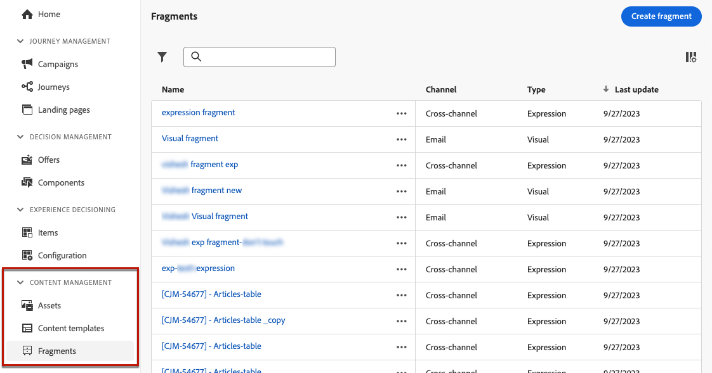

# Introducción a los fragmentos {#fragments}

>[!CONTEXTUALHELP]
>id="ajo_create_fragment"
>title="Defina sus propios fragmentos"
>abstract="Cree y administre fragmentos independientes para que el contenido se pueda reutilizar en varios recorridos y campañas."
>additional-url="https://experienceleague.adobe.com/es/docs/journey-optimizer/using/content-management/fragments/create-fragments" text="Creación de fragmentos"

Un fragmento es un componente reutilizable al que se puede hacer referencia en uno o más correos electrónicos de [!DNL Journey Optimizer] campañas y recorridos. Esta funcionalidad le permite generar varios bloques de contenido personalizados que los usuarios de marketing pueden utilizar para combinar rápidamente el contenido del correo electrónico en un proceso de diseño mejorado.

➡️ [Aprenda a administrar, crear y usar fragmentos en estos vídeos](#video-fragments)

Para aprovechar al máximo los fragmentos:

* **Crear sus propios fragmentos**: cree fragmentos visuales o de expresión, ya sea desde cero o guardando el contenido como fragmento. [Aprenda a crear un fragmento](create-fragments.md). Además, puede aprovechar Journey Optimizer **API de REST de contenido** para administrar fragmentos de contenido. Para obtener más información, consulte la [documentación de las API de Journey Optimizer](https://developer.adobe.com/journey-optimizer-apis/references/content/){target="_blank"}.
* **Reutilice sus fragmentos:** Úselos tantas veces como sea necesario en su contenido. Ver [Agregar fragmentos visuales](../email/use-visual-fragments.md) y [Aprovechar fragmentos de expresiones](../personalization/use-expression-fragments.md)

## Antes de empezar {#fragment-prerequisites}

Para crear, editar, archivar y publicar fragmentos, necesita los permisos **[!DNL Manage library items]** y **[Publicar fragmento]** incluidos en el perfil de producto **[!DNL Content Library Manager]**. [Más información](../administration/ootb-product-profiles.md#content-library-manager)

En esta versión, se aplican las siguientes limitaciones:

* **Los fragmentos visuales** solo están disponibles para el canal de correo electrónico.
* **Los fragmentos de expresiones** no están disponibles para el canal en la aplicación.

Hay más protecciones aplicables a los fragmentos disponibles en [esta sección](../start/guardrails.md#fragments-guardrails).

## Fragmentos visuales y de expresión {#visual-expression}

Hay dos tipos de fragmentos disponibles:

* **Los fragmentos visuales** son bloques visuales predefinidos que se pueden reutilizar en varios envíos de correo electrónico con [Email Designer](../email/get-started-email-design.md) o en [plantillas de contenido](../email/use-email-templates.md).
* **Los fragmentos de expresión** son expresiones predefinidas disponibles en una entrada dedicada en el [editor de personalización](../personalization/personalization-build-expressions.md).

Se puede acceder a todos los fragmentos creados desde el menú de la izquierda **[!UICONTROL Administración de contenido]** > **[!UICONTROL Fragmentos]**. [Aprenda a administrar fragmentos](../content-management/manage-fragments.md)

## Vídeo práctico {#video-fragments}

Aprenda a administrar, crear y usar **fragmentos visuales** en [!DNL Journey Optimizer].

>[!VIDEO](https://video.tv.adobe.com/v/3451185/?captions=spa&quality=12)

Obtenga información sobre cómo administrar, crear y usar **fragmentos de expresiones** en [!DNL Journey Optimizer].

>[!VIDEO](https://video.tv.adobe.com/v/3438920/?quality=12&captions=spa)
